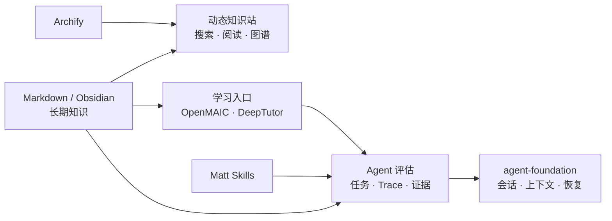

# 项目地图

这个仓库把四类东西放在同一项目中，但职责不同：知识库负责长期理解，网站负责阅读和导航，Agent 评估负责把任务判断转成可验证证据，上游项目负责提供可以运行和研究的实现。

## 内容来源与去向

| 内容 | 归位 | 处理方式 |
| --- | --- | --- |
| 能解释机制、边界和决策的原笔记 | `vault/工程知识` | 作为主知识页，持续合并和更新 |
| 论文、项目、官方文档和实践证据 | `vault/知识库管理/来源` | 保留回链和核验记录，不替代主题页 |
| 尚未核验的外部变化 | `vault/知识库管理/更新候选` | 完成核验、归并或删除 |
| 原始剪藏 | `vault/Clippings` | 由 Mac 端 Obsidian Web Clipper 持续写入（经 GitHub 自动同步），站点自动归类，独立入口 |
| Agent 评估原型 | `apps/agent-evaluation` | 当前是设计原型；后续接入真实任务、Trace、执行隔离和证据投影 |
| 上游实现 | `projects/*` | 完整源码快照、许可证、测试和原项目文档 |

## 当前内容判断

`vault/` 当前有 160 篇 Markdown，其中 `工程知识` 130 篇，是本项目的主资产，覆盖模型基础、RAG、Agent、推理服务、数据系统、后端分布式、性能和软件质量；`知识库管理` 负责来源、更新和质量规则，`Clippings` 按要求完整保留。原 `technical-knowledge` 的静态页面和基础包已作为评估应用/共享包保留；不再把它的旧单页目录当成新的知识分类。

快速变化的模型、框架、协议、版本、价格和安全信息只在动态雷达与来源注册表中作当前快照。任何“最新”判断都必须带来源、核对日期和适用范围。

## 剪藏（Clippings）数据契约

`vault/Clippings` 由 Mac 端的 Obsidian Web Clipper 持续写入，经仓库同步到站点，不需要在 dev 上手工维护。站点对每篇剪藏自动处理：

- 分类固定为 `Clippings`，`topic` 取 frontmatter 的 `tags` 里除通用标签 `clippings` 之外的第一个标签；没打标签就归入「剪藏」。
- `author`、`published`、`source`、`description` 从 frontmatter 读出，进 `/api/notes` 与 `/api/note` 的 `clip` 字段，用于阅读页的元信息行、来源区与目录条目。
- 正文里的 B 站 `iframe` 由 Markdown 渲染器白名单放行，包成响应式播放器；摘要跳过 `iframe` 行，正文没有可读文字时退回 `description`。
- 剪藏不参与工程知识图谱与关系推断（`exclude_from_graph`），因为它记录的是别人的内容，不是本库产出的工程知识。

因此在 Mac 端新增剪藏时，只需保证 frontmatter 的 `tags` 里写出主题标签（例如 `AI 编程工具`），站点即自动归位；不写标签则统一落在「剪藏」主题下。

## 如何新增内容

先判断它是否回答一个会重复出现的技术问题。若是稳定机制，合并到已有主题；若是近期变化，更新对应动态页；若只有来源价值，进入来源区；若无法核验，停留在更新候选。不要按课程名、工作项目名、日期或工具名新建长期顶层分类。
