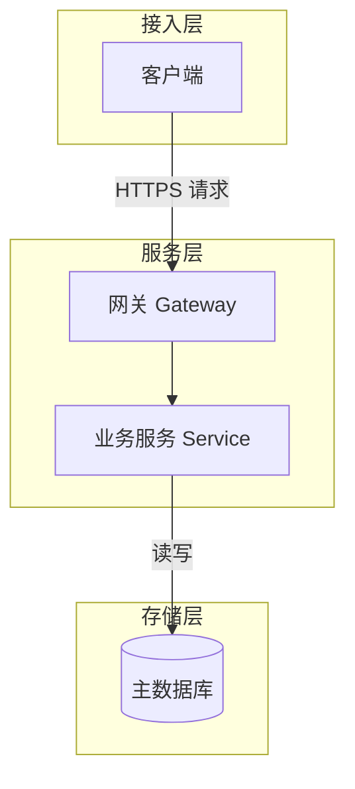
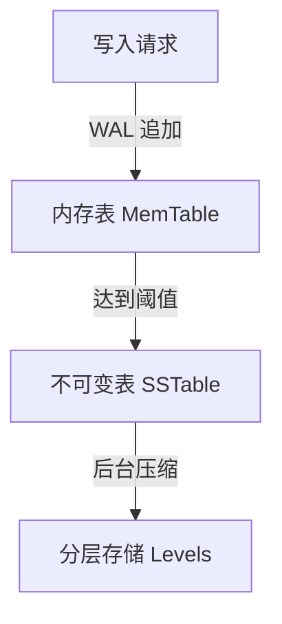
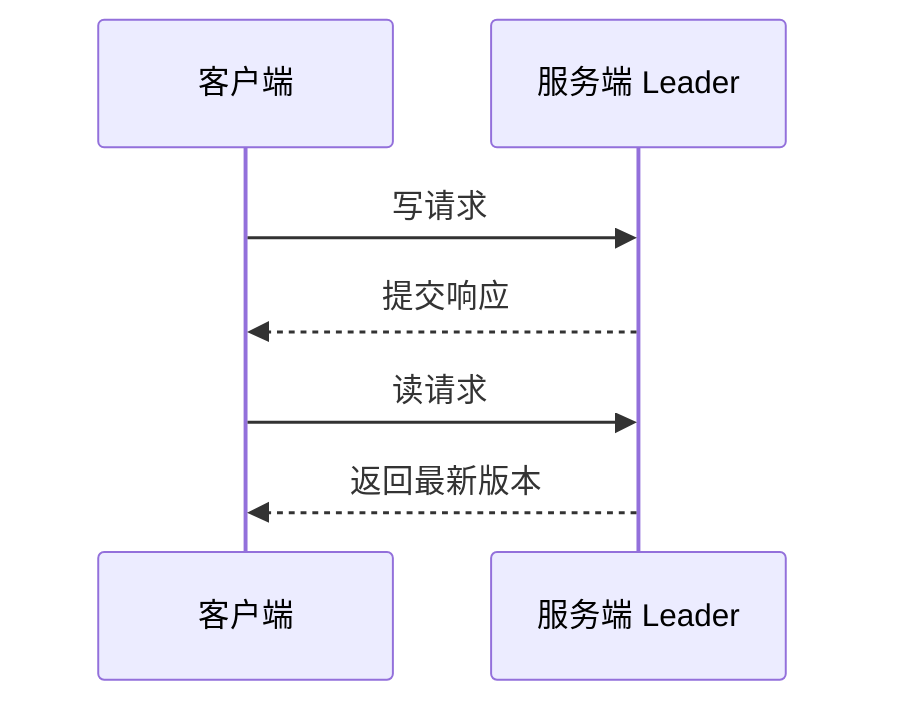
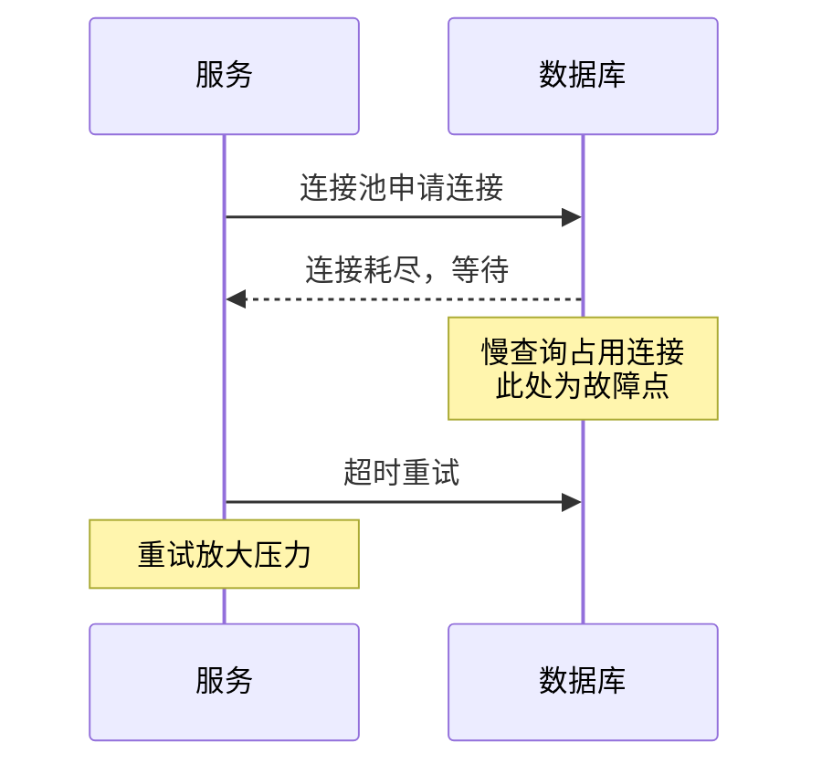
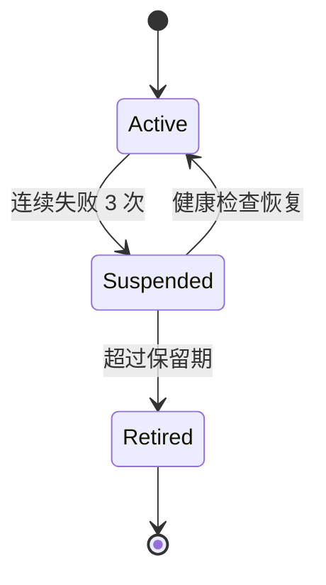
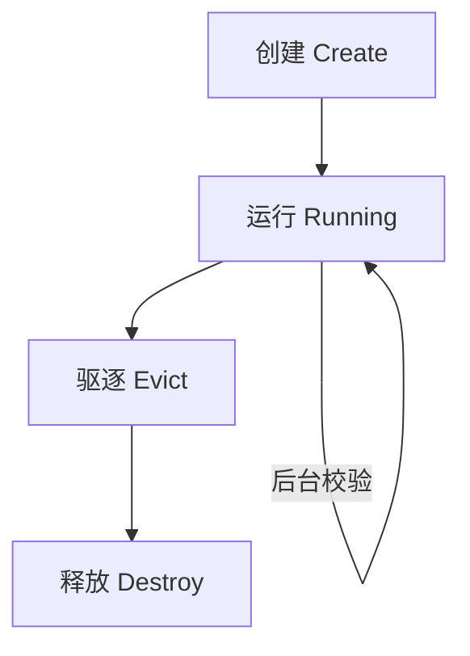
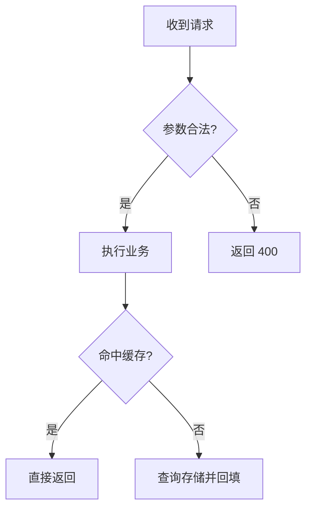
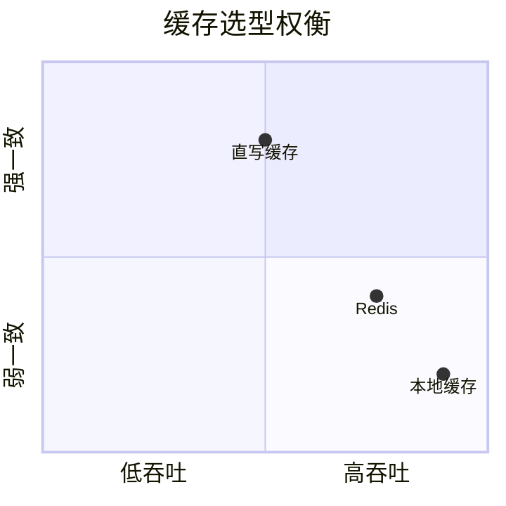
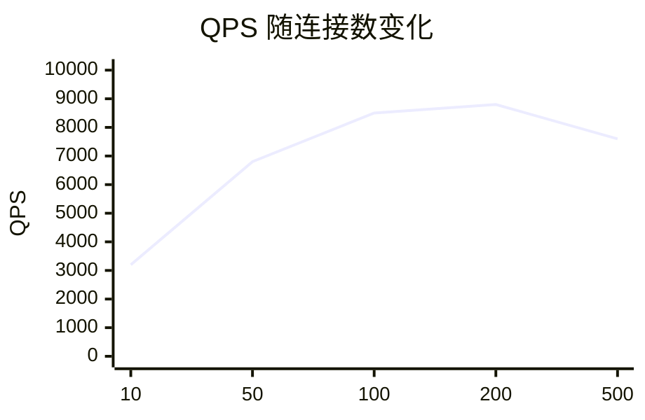

# 自绘图手册

九类图型与模板。宽度数据来自 2026 年 9 月在真实站点上的渲染测量，测量环境：360px 视口，正文栏 330px，图区 296px，节点基准字号 16px。

## 一、图宽可以直接算出来

先记一条结论：mermaid 图的宽度由最宽的那个节点的标签长度决定，与节点总数无关。同一条链路，4 个节点和 16 个节点，图宽都是 140px。

### 计算公式

中文标签按字数记为 n。

```
节点宽度                    宽度 = 76 + 16 × n        上限 276px
竖排链路、状态图             取最宽的那个节点，与节点数无关
横向链路（n 个节点）         n × (节点宽 + 34) − 34
分叉（一个节点连出 k 条）     k × (节点宽 + 34) − 34
单个分组内的一条链           199 × 组内节点数 + 16 + 64 × 带标签的连线数
时序图（p 个参与者）         200 × p + 50
象限图                     500px，可用 init 指令改小
数据图                     700px，可用 init 指令改小
```

其中 n 是标签的汉字数。西文与数字按每字符 10px 另算，例如 `WAL 日志` 是 3 个汉字加 3 个西文，节点宽 = 76 + 48 + 30 = 154px。

中文标签超过 13 个字时自动换行，宽度停在 276px 不再增加。

验证过的算例：

| 形态 | 公式 | 实测 |
| --- | --- | --- |
| 单节点 4 字 | 76+64 = 140 | 140px |
| 单节点 12 字 | 76+192 = 268 | 268px |
| 单节点 20 字 | 上限 276 | 276px |
| 链路 16 节点，最长 4 字 | 76+64 = 140 | 140px |
| 分叉 2 支，标签 3 字 | 158×2−34 = 282 | 282px |
| 分叉 3 支，标签 3 字 | 158×3−34 = 440 | 440px |
| 分叉 4 支，标签 3 字 | 158×4−34 = 598 | 598px |
| 分叉 5 支，标签 6 字 | 206×5−34 = 996 | 996px |
| 时序图 3 参与者 | 200×3+50 = 650 | 650px |
| 时序图 4 参与者 | 200×4+50 = 850 | 850px |

### 落在每道关的条件

手机上的字号等于 16 乘 296 再除以图宽。合格线是 10px，对应图宽不超过 473px。

| 图宽 | 手机字号 | 判定 |
| --- | --- | --- |
| ≤ 473px | ≥ 10px | 合格 |
| 473 到 592px | 8 到 10px | 勉强 |
| > 592px | < 8px | 不合格 |

把公式代入这道关，得到落笔时的三条硬规则：

1. 竖排链路、分组、状态图永远合格。中文标签上限 276px，折算手机字号 17px。
2. 分叉图的分支数与标签长度要一起控制。标签 4 字时最多 2 支（314px）；标签 6 字时最多 2 支（378px），3 支已经 584px 不合格。
3. 时序图只能 2 个参与者（450px）。3 个参与者 650px 不合格。

### subgraph 会把内部的链横过来

单个 subgraph 包住一条链，且这条链没有连向分组之外时，mermaid 把链按横向排布，宽度随组内节点数线性增长。

| 组内节点数 | 宽度（不带连线标签） | 宽度（连线带 4 字标签） |
| --- | --- | --- |
| 2 | 414px | 478px |
| 3 | 613px | 741px |
| 4 | 812px | 1004px |
| 5 | 1011px | |
| 6 | 1210px | |

同一份三节点内容，包在 subgraph 内是 741px（不合格），去掉 subgraph 是 140px（优秀）。差 5 倍。

宽度公式：`199 × 组内节点数 + 16 + 64 × 带标签的连线数`。

正确写法有两条，任选其一：

一是不用分组。链本身已经表达了顺序，分组框不增加信息，直接写成竖排链路。

二是让分组之间有跨组连线。两个分组垂直串联（每组两节点、组间一条连线）实测 210px；两个分组之间没有连线时，各占一列横排，宽度涨到 830px，三个分组 1262px。

写完后用脚本量，脚本在公式预测与实测差异过大时会提示。

### 英文标签

英文按字符宽度计算，小写字母每字符 11 到 21px，随长度递减，取 12px 估算；大写与数字更宽。`compaction` 10 个字符实测 170px，`Block-Based Table` 17 个字符实测 220px。

写法上优先用中文短标签加英文原名，例如 `内存表 MemTable`，避开长英文单词。

## 二、各形态的实测宽度

| 形态 | 自然宽度 | 手机字号 | 判定 |
| --- | --- | --- | --- |
| 状态图 3 条迁移 | 121px | 16px | 优 |
| 两个分组，每组 2 到 5 节点，有跨组连线 | 210px | 16px | 优 |
| 两个分组垂直串联，组间一条连线 | 210px | 16px | 优 |
| 竖排单层 2 个分支，标签 2 字 | 250px | 16px | 优 |
| 分叉 2 支，标签 4 字 | 314px | 15.1px | 优 |
| 竖排单层 2 个分支，标签 6 字 | 378px | 12.5px | 优 |
| 两源汇聚，长标签带换行 | 418px | 11.3px | 优 |
| 时序图 2 个参与者 | 450px | 10.5px | 优 |
| 分叉 2 支，标签 10 字 | 474px | 10.0px | 勉强 |
| 象限图（默认宽度） | 500px | 9.5px | 勉强 |
| 象限图（加 init 压到 360px） | 360px | 13.2px | 优 |
| 分叉 3 支，标签 3 字 | 440px | 10.8px | 优 |
| 分叉 3 支，标签 4 字 | 488px | 9.7px | 勉强 |
| 数据图（加 init 压到 460px） | 460px | 10.3px | 优 |
| 分叉 3 支，标签 6 字 | 584px | 8.1px | 勉强 |
| 时序图 3 个参与者 | 650px | 7.3px | 不合格 |
| 分叉 4 支，标签 4 字 | 662px | 7.2px | 不合格 |
| 数据图（默认宽度） | 700px | 6.8px | 不合格 |
| 分叉 4 支，标签 6 字 | 790px | 6.0px | 不合格 |
| 横排链路 4 节点 | 816px | 5.8px | 不合格 |
| 时序图 4 个参与者 | 850px | 5.6px | 不合格 |
| 分叉 5 支，标签 6 字 | 996px | 4.8px | 不合格 |
| 横排链路 8 节点 | 1673px | 2.8px | 不合格 |
| 分组无跨组连线（2 组） | 830px | 5.7px | 不合格 |
| 分组无跨组连线（3 组） | 1262px | 3.8px | 不合格 |
| 单个 subgraph 包住 3 节点链（带连线标签） | 741px | 6.4px | 不合格 |

三条要注意的：

横排链路不能用。4 个节点 816px，斜率随节点数增长。

分组必须有顺着流向的跨组连线。有跨组连线时垂直串联 210px；没有连线时两个分组各占一条竖列，830px，三个分组 1262px。

单个 subgraph 包住一条链时，mermaid 把链横过来排。同一份三节点内容，包在分组内 741px，去掉分组 140px。

时序图画成 3 个参与者就不合格。参与方多于 2 个时改画竖排流程图，用节点表达各方。

一条感觉规则：分叉宽度由分支数与节点标签长度共同决定，连线标签同样占宽。标签 4 字时 2 支合格 3 支勉强，标签 8 字以上连 2 支都会超线，超线时先缩短节点标签再砍分支。

## 三、图高

图高超过 1200px 时手机需要滚动一屏以上才能看完整张图。

| 形态 | 高度 |
| --- | --- |
| 分组每组 2 节点 | 690px |
| 分组每组 3 节点 | 898px |
| 分组每组 4 节点 | 1106px |
| 分组每组 5 节点 | 1314px |
| 竖排链路 8 节点 | 798px |
| 竖排链路 12 节点 | 1198px |

纵向链路的每个节点约 100px，分组内每组节点不超过 4 个，纵向链路不超过 10 个节点。

## 四、通用风格

- 节点标签用中文短句，术语保留英文原名，代码标识符不翻译
- 节点标签控制在 12 个字以内，超出会自动换行，换行后的标签在手机上显得拥挤
- 连线带语义标签，只有两个节点之间的单一关系才允许裸连线
- 节点标签自解释，读者跳过正文直接看图也能明白每个节点是什么
- 不用 emoji，不自定配色，保持站点默认渲染样式
- 图前一句话引出图要回答的问题，谈图的内容，比如「整个闭环按下图从来源走到更新」；「下图展示」这类把图当主角的说法不出现
- 引出句问问题，图注给结论，两者分工不重复；删图时把图前引出句一并删掉

## 五、图型与模板

### 1. 架构图

适用：讲原理与机制时的静态结构。回答「系统由哪些部分组成、层次如何划分」。



要点：每个分组内部并列的节点不超过 2 个；分组之间必须有连线穿过，缺连线的分组会各占一条竖列，两个分组即 830px。分组内部不要放长链，mermaid 会把组内没有对外连线的链横过来排，三个节点就 741px。链式流程不要用分组，直接写成竖排链路。

### 2. 数据流图

适用：数据从产生到存放的完整路径。回答「数据经过哪些变换」。



要点：变换动作写在连线标签上，每一步变换一个节点。这类图天然是竖排链路，宽度只看最长的那个标签。

### 3. 时序图

适用：两个参与者之间的消息往返。回答「谁在什么时候向谁发了什么」。



要点：参与者只能是 2 个。宽度按 200 乘参与者数加 50 增长，3 个即 650px 不可读。消息条数不限，实测 3 条与 6 条宽度相同；消息文本要短，文本过长时宽度同样增大。参与方多于 2 个时改画流程图，用节点表达各方、用连线标签表达消息。

### 4. 事故还原图

适用：故障案例分析。回答「故障过程中每一步发生了什么、哪一步出的问题」。



要点：参与者只能是 2 个；故障点用 Note 标出；重试、放大这类次生效应必须画出。参与方多于 2 个时改画竖排流程图，把故障点写成节点。

### 5. 状态图

适用：有明确状态集合与迁移条件的对象。回答「对象有哪些状态、什么条件触发迁移」。



要点：迁移条件写在冒号后；必须有初始态或终止态；每条迁移都要有条件。宽度随最长状态名增长，实测 3 条 121px、6 条 208px，可以放心使用。

### 6. 生命周期图

适用：对象从创建到释放的完整阶段。回答「生命周期分几段、每段做什么」。



要点：自循环用自指向箭头表达；阶段名称用名词短语；与状态图的区别是这里强调阶段职责。

### 7. 流程图

适用：带分支判断的处理流程。回答「什么条件走哪条路径」。



要点：判断节点用菱形；每个分支都要有去向；分支标签写判断结果。宽度按分叉公式算，标签 4 字时最多 2 支。同一层的分支数受这条限制，分支多时拆成多张按条件分开的图，或改成竖向依次判断的链式写法。

### 8. 象限图

适用：选型与权衡。回答「候选方案在两个维度上的位置」。



要点：默认宽度 500px，手机端 9.5px，属于勉强可读。第一行加 `%%{init: {"quadrantChart": {"chartWidth": 360, "chartHeight": 360}}}%%` 后宽度变成 360px，手机端 13.2px，合格。宽高两个数值要成对写。

### 9. 数据图

适用：少量数值的走势对比。



要点：默认宽度 700px，手机端 6.8px，不合格。第一行必须加 init 指令把宽度压到 460px 以下，手机端 10.3px，合格。`width` 与 `height` 必须同时写，只写 `width` 时 mermaid 会报无法识别图型。数值超过 5 组时改用表格。

## 六、文字裁切

节点文字被容器截断属于严重问题。常见成因是标签里写了长英文术语或长路径，mermaid 不会在英文单词中间断行。修复方式是加入 `<br/>` 手动换行。

`scripts/audit_mermaid.py` 会量出被截断的节点，判定为 FAIL。

## 七、好看与难看

两版都达标时，按下面这些可指认的现象取舍，避免凭整体感觉判断。

好看的特征：

1. 一屏之内能看完主干，桌面栏宽 706px 内不需要横向滚动
2. 主干方向统一，视线不需要反复折返
3. 同层节点顶端齐平、大小相近
4. 同一张图里节点文字长度接近
5. 有明确的起点或核心节点
6. 分组框圈住语义相关的节点，分组之间有顺着流向的过渡连线
7. 连线交叉不超过两条
8. 节点之间、分组之间留有间距

难看的特征：

1. 4 个以上节点横向排开
2. 连线大量交叉，看不出哪条连到哪条
3. 只有节点编号没有含义，或标签与正文完全重复
4. 分组框内只有一个节点
5. 同一层并列 3 个以上节点
6. 节点标签显示不全
7. 加了与信息无关的图标、配色、阴影

## 八、各图型的专属判据

| 图型 | 判据 |
| --- | --- |
| 时序图 | 参与者恰好 2 个；必须有返回或异步消息；参与方超过 2 个改画流程图 |
| 状态图 | 必须带初始态或终止态标记；每条迁移都要有条件标注 |
| 象限图 | 必须带两个轴的语义；候选 2 到 6 个；必须加 init 指令把宽度压到 473px 以内 |
| 数据图 | 必须加 init 指令写 width 与 height，宽度压到 473px 以内；数值超过 5 组用表格 |
| 流程图 | 节点标签不能只剩字母编号；连线达到 4 条时语义标签覆盖不低于一半；同一层并列不超过 2 个分支 |
| 分组图 | 必须有顺着流向的跨组连线；每组节点不超过 4 个；分组内不放长链，链式流程不用分组 |