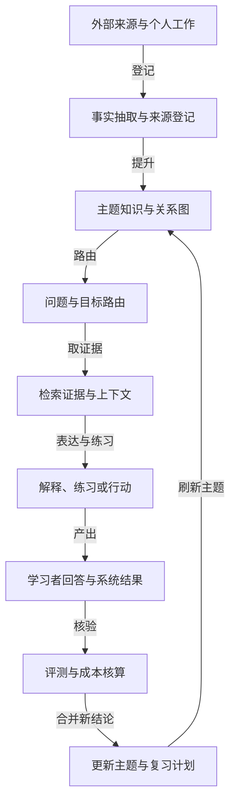
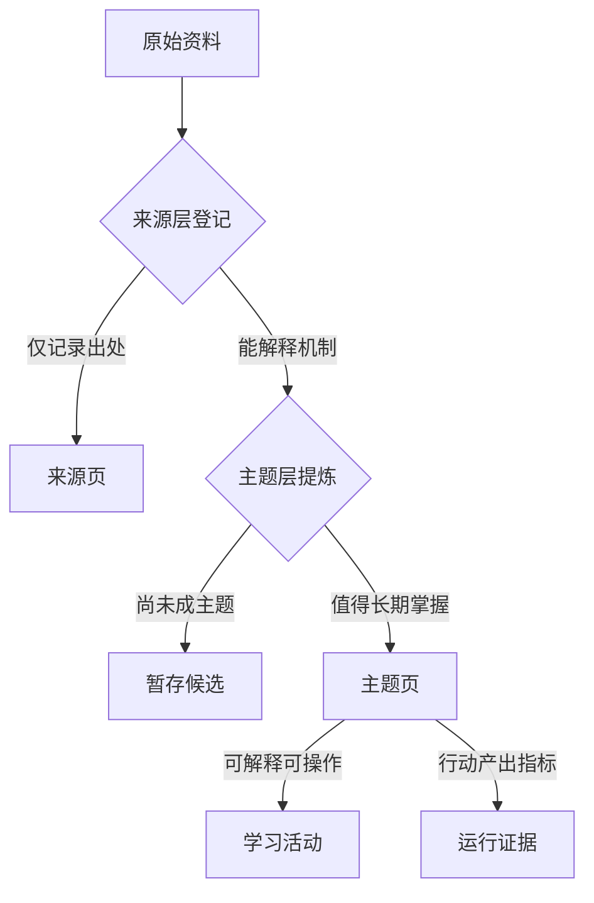
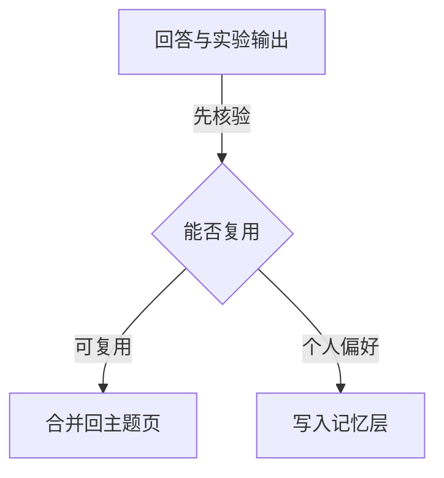
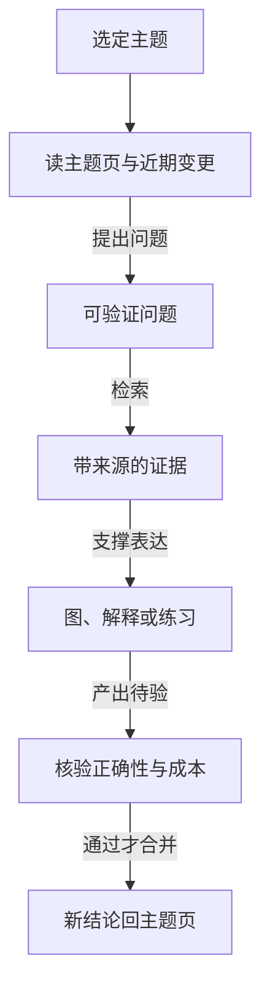

# 知识库的学习闭环：从来源到迁移

一个知识库的价值，不是把资料存得更多，而是让人或 Agent 能从一个真实问题出发，找到有证据的解释，完成可观察的练习，并把结果迁移到新的问题。图、检索、课程和记忆都只是这个闭环中的不同表达与执行方式。

## 合并后的抽象

整个闭环按下图从来源走到更新，再回到主题知识，图回答各环节的先后与合并位置：

关键在两条回边：更新只把通过评测的新结论合并回主题知识，旁支的三类表达方式放到下文单独展开。

## 四个必须分开的对象

| 对象 | 解决的问题 | 典型产物 | 不能替代 |
| --- | --- | --- | --- |
| 来源 | 这条信息从哪里来、何时变化 | URL、仓库 commit、论文、工作证据 | 主题理解 |
| 主题知识 | 哪个机制值得长期掌握 | 原理、边界、反例、验证方法 | 学习活动 |
| 学习活动 | 学习者能否解释、操作和迁移 | 图、练习、问题、项目、反馈 | 事实核验 |
| 运行证据 | 这次检索、生成或行动是否真的有效 | 引用、轨迹、指标、产物、回归 | 语义理解 |

混乱通常来自把这四类内容塞进同一页：来源变成流水账，知识变成产品清单，学习活动变成模型长文，运行证据则被“看起来合理”的回答覆盖。

四类对象进入知识库前各自要过的关，用下图回答「什么内容走到哪一层为止」：

来源页只存出处，主题页存机制，学习活动与运行证据都从主题页派生。

## 对本知识库的实施规则

### 来源进入候选，不直接进入主干

GitHub 项目、论文、版本发布、工作复盘和剪藏先登记到来源层。只把能够解释机制、支持决策或可复现实验的内容提升为主题页；项目名称留在来源页和引用里，不成为领域分类。

### 主题页以问题和机制组织

每个主题回答：解决什么问题、核心机制、适用边界、常见失败、如何验证、与什么相连。模型、框架或产品只能出现在“当前实现”段落，避免把快速变化名称误当作知识主轴。

### 学习活动由目标驱动

- 要理解结构：先画关系图，再用点击、追踪和反例检查因果。
- 要掌握机制：要求先预测或解释，再给反馈和最小修复。
- 要形成工程能力：把概念绑定到一个可运行任务、指标和失败复盘。
- 要跟上前沿：先做 claim-to-source 核验，再比较新方法相对基线改善了什么。

### 结果必须回写证据

学习者的回答、实验输出、引用覆盖、检索轨迹和错误类型都可以成为下一次复习的依据，但不能未经筛选直接写入长期记忆。可复用结论要回到主题页，个人偏好和待办才进入记忆层。

学习产物的回写分流用下图回答「什么结果进主题页、什么进记忆层」：

两条路都要过筛选这一关，未通过核验的结果不进入任何长期存储。

## 最小可行闭环

一轮闭环按下图走完七步：

没有“回答后评测”和“评测后合并”两个步骤，就只是聊天记录；没有来源和版本绑定，就只是不可复核的总结；没有练习或行动，就无法判断是否真的学会。

## 表达与执行方式

### 把课堂角色映射为页面结构

参考互动课堂的教师、助教和学生分工，知识页不再只给并列的定义：教师段落解释“为什么”，助教段落暴露成本、边界和验证方式，学生段落要求先预测并在新约束下迁移。这样同一主题既能被快速查阅，也能直接进入一轮可观察的学习活动。

| 需要 | 使用方式 | 产物位置 |
| --- | --- | --- |
| 关系、架构、流通和状态图 | 类型化图描述 + 确定性校验 | 网站图谱、Markdown Mermaid、可点击节点 |
| 概念课程、交互演示、练习和编辑 | 目标驱动的教学活动 | 解释、预测、练习、反馈和迁移任务 |
| 多引擎 RAG、研究、记忆和笔记 | 按问题形状选择检索与记忆 | 来源候选、引用回答、复习记录和可复用材料 |

三者的组合边界是：工具可以帮助发现、表达和练习；知识库仍以 Markdown 主题页和来源页作为长期事实，网站只是动态投影。

无论走哪条表达路径，产物都要能回到来源页核验，这是三类方式共享的收束点。

## 如何吸收外部方法

外部工具只作为方法证据，不进入知识库主分类。可复用的抽象有三条：图谱先用结构化中间表示再渲染并校验；教学先定义目标和已有水平，再安排交互、反馈和迁移；检索按问题选择词法、向量、页面或图关系，并让索引版本、记忆生命周期和引用一起可追踪。对应的仓库证据保留在 Archify可验证技术图谱（来源层档案，已脱敏）、OpenMAIC互动课堂与多智能体学习（来源层档案，已脱敏）和 DeepTutor多智能体学习伴侣（来源层档案，已脱敏）。

## 质量门槛

- 事实：关键断言有来源或可复现实验。
- 结构：每个新页面能连接至少一个已有主题，并说明连接原因。
- 学习：至少有一个解释、预测、练习或迁移任务，而不是只读摘要。
- 可视化：图节点可点击，图边有语义，图中的结论能回到来源或主题页。
- 更新：页面的 `review_after` 与变化速率匹配；项目版本变化只更新来源页和当前实现段落。
- 安全：API key、个人数据、内部地址和未授权材料不进入来源页、图谱或模型上下文。

## 关联

- Archify可验证技术图谱（来源层档案，已脱敏）
- OpenMAIC互动课堂与多智能体学习（来源层档案，已脱敏）
- DeepTutor多智能体学习伴侣（来源层档案，已脱敏）
- [[工程知识/AI 系统工程：从模型能力到生产能力/Agent与工作流/构建可靠Agent应用]]
- [[工程知识/AI 系统工程：从模型能力到生产能力/知识与检索/检索从一次查询演进为有状态的证据获取]]
- [[工程知识/AI 系统工程：从模型能力到生产能力/质量与运营/Agent评测必须覆盖轨迹而不只看最终答案]]

验证的锚点：学习循环要与既定门槛对账——预写这份资料该连到哪个已有主题、该产出什么练习，产出与预期对不上就是循环没有闭合。

## 验证

1. 质量门槛逐项核对：关键断言有来源、新页面至少连接一个已有主题并写明原因、至少含一个练习或迁移任务、图节点可点击且结论可回到来源。
2. 安全核对：来源页、图谱与模型上下文中不含 API key、个人数据与内部地址。
3. 更新核对：页面的 review_after 与变化速率匹配，项目版本变化只更新来源页与当前实现段落。

## 效果与代价

把来源、主题知识、学习活动与运行证据分开存放，换来的是资料进入知识库之后仍能被追溯到具体来源，学习活动的效果由可观察的练习结果判断而不是由阅读量判断。代价是来源登记、主题维护与评测反馈各需要持续投入，把项目与产品名留在来源层也意味着知识主轴需要人工判断。

## 要解决的问题

资料被收集、被索引、被存进知识库之后，能回答的问题数量并没有随之增加，检索到的内容也无法判断是否被真正掌握。本篇回答：一个从真实问题出发的学习循环包含哪几个环节、图与检索与课程与记忆各自承担什么、练习结果怎样算通过，以及学到的内容怎样迁移到新问题上。

