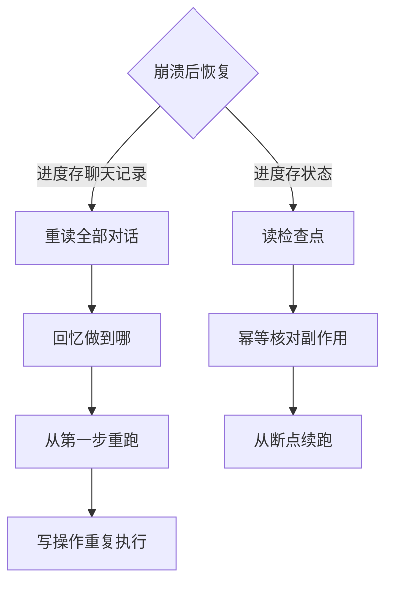

# Agent状态机与任务恢复：进度是状态不是聊天记录

Agent 执行到第七步崩溃了，重启后从第一步重跑，前面已执行的三个写操作全部重复执行——这是把"聊天记录"当成任务进度存进上下文、而运行时没有独立状态机时的典型事故。要解决的问题：把 Agent 任务建模为显式状态机，进度、副作用与检查点分开管理，崩溃后能恢复到确定的边界而不是重放一切。

本质是执行语义与对话语义的分离。对话上下文是给人看的、可压缩、可丢弃的；任务状态是给运行时用的、结构化、必须持久。两者混在一起，恢复时就分不清"哪些步骤已执行、哪些副作用已发生、哪些结论已验证"。

## 机制：状态、事件与检查点

状态机要素：任务有显式状态（pending、running、waiting_approval、cancelled、completed、failed），转移由事件触发（tool_result、timeout、user_input），副作用在状态转移时通过幂等键登记。崩溃恢复读的是最近检查点加上其后的事件日志，重放只重放"决策"不重放"副作用"。

| 要素 | 建模方式 | 恢复时的角色 |
| --- | --- | --- |
| 任务状态 | 枚举 + 版本号 | 恢复起点：从检查点状态继续 |
| 事件日志 | append-only，含 tool_call 与结果 | 重放决策、核对已执行副作用 |
| 幂等键 | 每个副作用操作唯一 key | 判断该操作是否已生效，避免重复 |
| 检查点 | 定期快照状态 + 已完成步骤 | 缩短重放距离 |
| 补偿动作 | 失败或取消时登记的反操作 | 部分完成后回滚到一致边界 |

## 失败形态

| 失败 | 场景 | 对策 |
| --- | --- | --- |
| 重复副作用 | 恢复后重跑已执行的外部写操作 | 幂等键 + 执行前查重 |
| 双重计费/双重发送 | 长任务中段崩溃，重启后从头调用付费 API | 检查点记录已完成调用清单 |
| 部分成功不可见 | 三步完成两步后取消，用户不知道发生了什么 | 状态机要求部分完成也是显式状态 |
| 旧版本恢复 | 检查点由旧代码版本写入，新版本读不懂 | 检查点带 schema 版本，不兼容时降级为人工 |
| 僵尸等待 | waiting_approval 后用户永远不回来 | 超时自动取消 + 到期提醒 |

## 边界

- 不是所有任务都需要完整状态机：单轮问答、只读任务、可整体重跑的幂等任务用简单重试即可，状态机的复杂度要用在有不可逆副作用的长任务上。
- 状态机不能消除与外部系统的竞态：外部操作"发出请求但未确认"的窗口依然存在，幂等键依赖外部系统支持幂等语义，不支持时要退化为补偿。
- 检查点频率是延迟与恢复成本的权衡：每步写入磁盘最安全但拖慢执行，间隔太长则重放距离大。默认建议每个不可逆副作用前写一次。

## 可运行示例：崩溃后从检查点续跑

一个多步任务（检索→生成→写入→通知），在第 3 步崩溃，状态与聊天记录的差别当场可见：

```python
# 状态存档（持久化存储，每步完成后写）：
state = {
    "task": "weekly-report",
    "steps": {
        "search":  {"status": "done",   "output_hash": "a1b2"},
        "draft":   {"status": "done",   "output_hash": "c3d4"},
        "write":   {"status": "running"},        # ← 崩在这里
        "notify":  {"status": "pending"},
    },
    "ctx": {"draft_id": "d-77"},          # 只存句柄，不存全文
}

# 恢复逻辑：从状态机读，不是从聊天记录猜
next_step = next(s for s, v in state["steps"].items() if v["status"] != "done")
# → "write"：草稿已有（d-77），重跑写入库 + 幂等键防重复写入 → notify
# 聊天记录方案：LLM 要重新读完全部对话"回忆"做到哪了，且可能回忆错
```

同一次崩溃，两条恢复路径的分岔如下图：



跑一遍的收获：恢复的正确性来自两件事——每步的输出有 hash 锚点（done 的判断是校验，不是信任），外部动作有幂等键（重跑不产生第二次副作用）。聊天记录作为恢复源的两个缺陷（上下文窗口装不下、回忆不可靠）都由状态机绕开。

## 量化锚点：检查点频率的账

检查点每步一存 vs 每 N 步一存，是恢复成本与存储成本的交换：每步一存，崩溃重做 0 步（恢复秒级），代价是每步一次持久化写（对 LLM 任务，单步耗时秒到分钟级，写入开销占比 <1%）；每 10 步一存，存储省 90%，崩溃平均重做 5 步（每步含一次模型调用，重做成本 = 5 次调用的钱与时间）。LLM 任务单步贵，检查点频率的答案几乎总是"每步一存"——这个账在传统批处理里答案相反。

## 验证

验证的锚点：恢复结果要与写操作计数对账——预写重启后写操作总数恰好为三、状态为 completed，对不上就回到状态机查幂等键与补偿记录。

最小验证：跑一个含三个写操作的任务，在第二步后 kill 进程，重启恢复，断言三个条件：写操作总数恰好为三（幂等键生效）、任务最终状态为 completed、事件日志无重复 tool_call。再测取消路径：在 waiting_approval 状态触发取消，断言已执行的两个写操作有补偿记录或明确的部分完成标记。

关系：[[工程知识/AI 系统工程：从模型能力到生产能力/Agent与工作流/模型负责判断，运行时负责执行语义]] · [[工程知识/AI 系统工程：从模型能力到生产能力/Agent与工作流/先用工作流，只有路径无法预先枚举时才使用Agent]] · [[工程知识/AI 系统工程：从模型能力到生产能力/模型与上下文/跨会话状态的一致性先于记忆的长度]]
