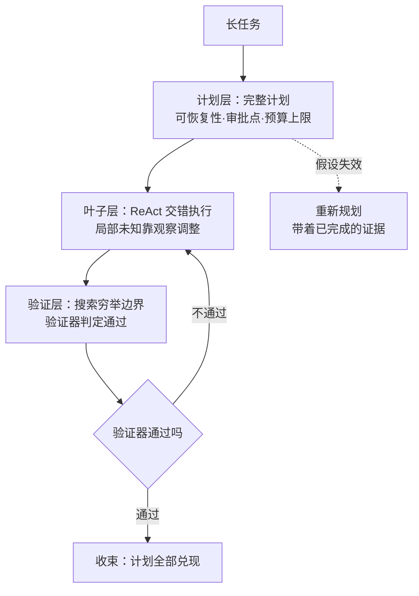
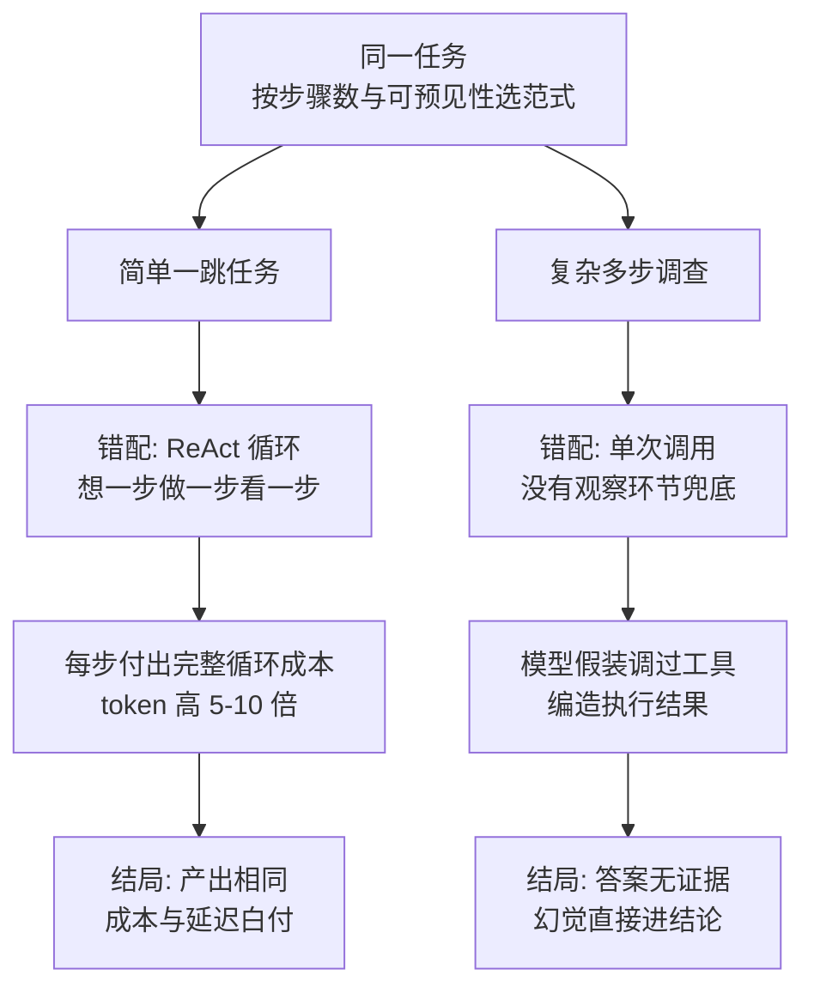

# ReAct计划执行搜索：三种行动范式的适用边界

同一个任务，直接边想边做的 Agent 三步就失去方向；先写完整计划的 Agent 计划本身建立在过时假设上；只会搜索的 Agent 找到了答案却不会用它——推理与行动怎么编排，决定了 Agent 的成本结构、可恢复性和证据质量。要解决的问题：理解 ReAct、计划-执行、搜索三种范式的机制差异与适用条件，按任务的可逆性、分支密度和反馈延迟选范式，并把不可重放与私有推理泄露纳入验证。

本质是探索与承诺的先后顺序。ReAct 把推理与行动交错（想一步做一步看一步），探索性强但循环成本高；计划-执行先承诺路径再执行（先画图再走），可审计可恢复但计划可能基于过时假设；搜索范式以状态空间探索为主（试错 + 回溯），适合有可验证目标的封闭任务，但依赖状态可枚举与评估函数可靠。三种范式不互斥：长任务常见"计划骨架 + ReAct 执行 + 局部搜索"的混合结构。

## 机制：三范式对比

| 范式 | 机制 | 适用条件 | 固有代价 |
| --- | --- | --- | --- |
| ReAct | 思考→行动→观察循环，每步可根据观察调整 | 环境反馈快、步骤不可逆性低 | 循环成本、不可重放、私有推理进日志 |
| 计划-执行 | 先生成完整计划，再逐项执行，可挂起恢复 | 步骤多、依赖复杂、需人工审批 | 计划基于旧信息、重规划成本、计划过拟合 |
| 搜索 | 状态空间探索，评估函数剪枝回溯 | 状态可枚举、目标可验证（代码/数学） | 评估函数质量决定一切、指数爆炸 |

选范式的判据：反馈延迟短、单步代价低、试错空间大 → ReAct；步骤间有硬依赖、需要审批或断点续跑 → 计划-执行；有客观验证器（测试通过/证明成立）→ 搜索。多数真实任务采用混合形态：顶层计划保证可恢复性，叶子步骤用 ReAct 处理局部未知，验证环节用搜索穷举边界。



计划层与叶子层各按判据选范式：可恢复与审批挂在计划层，交错循环只花在局部未知上，验证环节交给有客观验证器的搜索——三层各取所长，重规划发生在计划层而不污染叶子轨迹。

论文 Figure 1 把这条判据的前半段画成了对照实验：同一个问题，只回答的 Standard 和只行动的 Act-Only 都失败，思考-行动-观察交错的 ReAct 成功：


上图取自 [ReAct 论文的 HTML 版](https://arxiv.org/abs/2210.03629)（ICLR 2023, Yao et al.）：左上 Standard 只给答案、左下 CoT 只推理不给行动，幻觉链条一路错下去；Act-Only 有搜索动作却没有观察整理，搜到 Front Row 也停不下来；ReAct 每步 Thought 定位差距、Act 补信息、Obs 修正方向，第四步收束到正确答案。环境反馈快、单步代价低时这种交错的成本才划算，与上表 ReAct 行的适用条件对应。

## 失效形态

| 失效 | 机制 | 信号 |
| --- | --- | --- |
| ReAct 循环空转 | 反馈信息量不足，思考-行动对重复 | 同一观察触发同一动作，步数超预算 |
| ReAct 不可重放 | 中间思考未持久化，执行轨迹无法审计 | 事后无法回答"当时为什么这么做" |
| 计划过时执行 | 执行中发现假设失效，但计划仍继续走 | 后续步骤引用已失效的前置状态 |
| 讨好式计划 | 计划阶段就预测用户想听什么 | 计划包含"用户会满意"这类非任务目标 |
| 搜索评估失真 | 评估函数与真实目标错位，剪掉正确分支 | 候选分数与最终结果不相关 |

## 可运行示例与案例回流：范式选择的实录

```python
# 同一任务："找出最近三个版本里错误率上升的接口"

# 范式 1 ReAct（思考-行动-观察循环）：
#   思考：错误率在监控里 → 调监控接口 → 观察：返回 50 个接口
#   思考：要对比三个版本 → 调版本接口 → 观察：v2.1/v2.2/v2.3
#   思考：逐个对比 → 循环 ...
#   适用：路径未知、每步取决于上步观察的调查类任务

# 范式 2 Plan-and-Execute（先全规划再执行）：
#   规划：[拉监控、拉版本、合并对比、输出报告] 一次性给出
#   执行：逐步跑，失败回炉重新规划
#   适用：步骤可预见、要人审计划的审批类场景（成本低、可控强）

# 范式 3 单次搜索/工具调用：
#   一次 LLM 调用带工具描述，模型直接给出调用与答案
#   适用：明确的一跳任务（"查 X 的当前值"）
```

案例回流：范式错配的实录——简单一跳任务用 ReAct，每步都过一遍"思考-行动-观察"的完整循环，一次模型调用就能完成的任务付出三倍以上的调用与 token，延迟同步放大，产出与单次调用相同；复杂多步调查用单次调用，模型幻觉出"假装调过工具"的答案（没有观察环节兜住，模型编造执行结果）。范式的成本差与 [[工程知识/AI 系统工程：从模型能力到生产能力/Agent与工作流/先用工作流，只有路径无法预先枚举时才使用Agent.md]] 的选型判据同构：确定性路径用流程固化，探索性路径才用循环，循环的每一轮都要有观察证据撑住（见 [[工程知识/AI 系统工程：从模型能力到生产能力/Agent与工作流/反思要有外部锚点.md]]）。

两种错配从同一任务出发各走一条链，结局对照：



上图两条链对应上面的实录：错配发生在范式选择那一步，代价在执行层累积，结局在产出层显形——成本白付与幻觉进结论是两种不同的失败面。

## 边界

- 范式不修复模型能力：推理质量弱时 ReAct 的每步思考照样出错，搜索的评估函数照样失真；范式决定的是"已有能力怎么组织"，这与采样参数不能修能力是同一条边界（见 [[工程知识/AI 系统工程：从模型能力到生产能力/模型基础与训练/解码与采样参数：概率分布到生成文本的控制面]]）。
- 私有推理泄露是 ReAct 的固有风险：交错范式的思考链会进运行日志，含内部数据或客户信息时，日志本身就是泄露面；要么思考不写入磁盘，要么思考链写入磁盘前脱敏。
- 不可重放与审计要求冲突：审计要求完整轨迹，重放性要求确定性行为；实际系统把"思考"与"行动+观察"分层保存，行动可重放、思考可审计但不可重放。
- 混合结构中计划层是治理点：预算上限、审批点、挂起条件都挂在计划层，叶子层保持简单；反过来（叶子层自带重逻辑）会导致治理点分散难审计。

## 验证

验证的锚点：三种范式的取舍要与指标对照对账——预写各范式的完成率与成本排序，实测排序与预期对不上就说明任务的复杂度没有选对。

最小验证：同一个中等复杂度任务（如"修复一个依赖描述模糊的构建失败"），分别用三种范式各跑 10 次，对比四组指标——完成率、总 token 成本、失败时的可恢复点数量、轨迹可审计性（能否回答"第 N 步为什么做动作 M"）。断言：ReAct 完成率高但成本方差大；计划-执行在假设失效注入下（中途改一个依赖）的重规划成本可测；搜索范式只对有验证器的子任务开跑。另做一次隐私抽检：ReAct 日志里 grep 内部标识符，应当为零。

关系：[[工程知识/AI 系统工程：从模型能力到生产能力/Agent与工作流/反思要有外部锚点]] · [[工程知识/AI 系统工程：从模型能力到生产能力/Agent与工作流/任务分解的质量决定Agent的上限]] · [[工程知识/AI 系统工程：从模型能力到生产能力/Agent与工作流/多智能体只在能并行或需要独立上下文时才值得]]
