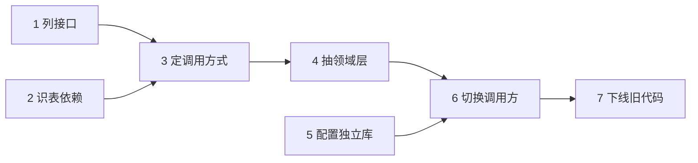

# 任务分解的质量决定 Agent 的上限

任务分解解决的是一个目标同时包含太多未知步骤时，模型会边猜边执行、直到很晚才发现方向错误的问题。做法是把目标划分成有产物、依赖和验收条件的步骤，再在新证据出现时允许重排；效果是任务可检查、可恢复、可并行，代价是规划本身消耗预算，探索阶段不能被一份过早的计划锁定。最小验证是中断一次执行后，检查系统能否从已验收步骤继续。

## 背景：那个"一步都做不对"的大任务

给 Agent 一个任务："把用户模块从单体里独立出来，做成独立服务。"

它的输出：直接开始改代码，改了 12 个文件，然后报告"完成"。实际上：

- 没考虑数据库表怎么划分
- 没处理跨模块的事务
- 没设计服务间调用方式
- 测试没跑通就报告完成

**不是模型不够强，是任务太大了。** 一个需要 20 步、每步都有分支的任务，让模型"一次想清楚"，等于让它同时持有 20 个未决决策——它只能草率地全部猜掉。

## 方案：先分解，再逐步执行

### 分解的三个层次

**层次一：分解成有明确产出的子任务**

坏分解（按时间/阶段）：

```
1. 分析代码
2. 设计方案
3. 实施
4. 测试
```

好分解（按产出）：

| 步骤 | 动作 | 产出 |
| --- | --- | --- |
| 1 | 列出 user 模块对外暴露的所有接口和调用方 | 接口清单 |
| 2 | 识别跨模块的数据库表和外键 | 表依赖图 |
| 3 | 确定服务间调用方式（同步/消息/共享库） | 方案 + 理由 |
| 4 | 抽出领域层代码，保持接口兼容 | 可编译的代码 |
| 5 | 配置独立数据库，写数据迁移脚本 | 迁移脚本 |
| 6 | 切换调用方到新服务（灰度） | 灰度开关 |
| 7 | 下线单体里的旧代码 | 删除的提交 |

**判断标准：每个子任务能明确说出"做完的标志是什么"。** 说不出就是分解得不够。

**层次二：标出依赖关系**



可以并行的：`1` 和 `2`（都是调研）。必须串行的：`3` 在 `1`、`2` 之后。

**层次三：给每步定验收标准**

```
4. 抽出领域层代码
   验收：go build ./... 通过 && 现有测试全绿 && 无新增外部依赖
```

**没有验收标准的任务，Agent 会自己判断"做完了"** —— 而它倾向于乐观。

### 三种分解模式

| 模式 | 做法 | 适用 |
| --- | --- | --- |
| 一次性规划 | 先生成完整计划，再逐步执行 | 任务结构清晰，Agent 能看到全貌 |
| 增量规划 | 每步完成后重新规划剩余 | 探索性强，信息逐步获得 |
| 分层规划 | 先粗粒度，进入子任务时再细化 | **推荐**：大任务 |

**分层规划最实用**：先 7 步粗计划，执行到第 4 步时再把它分解成 5 个子步骤。避免一开始就在细节上猜错。

### 计划要能被修改

执行中发现计划错了是**正常情况**，机制要支持：

- 执行第 4 步时发现：user 模块和 order 模块共享一张表
- 回到计划层，插入新步骤："划分共享表"
- 重新排序后续步骤
- 继续执行

**关键：允许回退到计划层，不勉强继续往下做。**

## 效果与代价

**收益**

- **每步可验证**：每步有产出和验收，错误在早期暴露而不是积累到最后
- **可恢复**：知道完成了哪些步骤，中断后能从断点继续
  - **可并行**：依赖关系明确后，独立子任务可以并行（见 [[工程知识/AI 系统工程：从模型能力到生产能力/Agent与工作流/多智能体只在能并行或需要独立上下文时才值得]]）
- **人类可读**：计划本身就是给协作者看的进度说明

**代价**

- **规划本身消耗 token**：一次完整规划可能花掉总预算的 5-10%
- **计划可能一开始就错**：基于错误理解做的分解，执行再好也是错方向。**所以要在执行前让人工或自动检查计划**
- **过于刻板的计划会限制探索**：有些任务需要先探索才能规划。**探索阶段和规划阶段要分开**

## 从什么地方做

**第一步：先让 Agent 输出计划，不要直接执行**

最简单的改进：**加一个 `plan_only` 模式**，先生成计划，确认后再执行。

**第二步：要求每个子任务写明"完成标志"**

在提示词里明确：

```
每个步骤必须包含：
- 这一步要产出什么（具体的文件/数据/结论）
- 怎么判断这一步做完了（可执行的检查）
```

**第三步：让计划显式标注依赖**

```json
{
  "steps": [
    {"id": 1, "desc": "...", "depends_on": []},
    {"id": 2, "desc": "...", "depends_on": []},
    {"id": 3, "desc": "...", "depends_on": [1, 2]}
  ]
}
```

**第四步：执行中允许回退**

实现"回到计划层"的能力：Agent 可以发出 `replan` 信号，重新生成剩余计划。

**第五步：把计划存进工作记忆**

见 [[工程知识/AI 系统工程：从模型能力到生产能力/模型与上下文/记忆是受治理的状态，不是更长的聊天记录]]。计划不是对话历史的一部分，是**结构化状态**。

## 常见错误

**错误 1：让 Agent 边想边做**

没有计划直接执行，导致它在第 15 步才发现第 3 步的方向就错了。**先规划，即使计划会变。**

**错误 2：分解粒度不对**

太粗略："实施服务独立"（等于没有分解）。太琐碎："打开文件"、"写一行"——**步骤多到上下文装不下**。

合理粒度：**每步 3-15 分钟能完成，产出可验证。**

**错误 3：计划生成后不检查**

完全信任 Agent 的计划。**计划生成后应该有一次校验**：步骤完整吗？依赖对吗？验收标准可执行吗？

**错误 4：不允许修改计划**

计划一旦生成就强制执行，遇到障碍也照旧推进。**必须支持 replan。**

**错误 5：把"探索"和"执行"混在一个计划里**

"调研代码库并重构"——调研的结果会改变重构方案，不该预先规划到不可调整。**先探索，再基于探索结果规划执行。**

相关：[[工程知识/AI 系统工程：从模型能力到生产能力/Agent与工作流/模型负责判断，运行时负责执行语义]] · [[工程知识/AI 系统工程：从模型能力到生产能力/质量与运营/Agent评测必须覆盖轨迹而不只看最终答案]]

验证的锚点：分解产物要先写预期——每个子任务的完成判据、输入输出的形状，跑完后拿结果与预期对账，对不上的子任务回炉，把误差挡在组装阶段之前。

## 验证

最小验证：给 Agent 一个需要七步以上、中途会出现新信息的任务（例如把某个模块从单体中独立出来），先让它输出完整计划，断言每个步骤都写明了产出物与完成标志；执行到第三步时注入一条与已有计划冲突的事实（例如发现两个模块共用一张表），断言系统回到计划层插入新步骤并重排后续，已验收的步骤不被重跑。

对照验证：同一任务跑两组，一组允许中途重新规划，一组锁定初始计划，记录完成率与方向性错误首次出现的步数。

关系：[[工程知识/AI 系统工程：从模型能力到生产能力/Agent与工作流/多智能体只在能并行或需要独立上下文时才值得]] · [[工程知识/AI 系统工程：从模型能力到生产能力/Agent与工作流/模型负责判断，运行时负责执行语义]]

## 边界

- 分解只在步骤可以事先列举时有效：目标本身带有探索性质（设计一个还没想清楚的协议），提前分解会把探索范围锁定在错误假设上。这类目标适合先做限时探索，再基于探索结果规划。
- 分解的粒度受限于对问题的理解：理解出现偏差时，分解越详细，错误越整齐。计划生成之后的校验比分解本身更关键。
- 分解不提高单步的推理水平：某一步所需的推理超出模型能力时，分成三个步骤仍是同样的失败。
- 并行空间取决于真实的依赖关系：多数工程任务的依赖呈链式，能同时开工的步骤比图上看到的少。

## 要解决的问题

一个目标包含的未知步骤超出单次推理能容纳的数量时，模型会一边猜测一边执行，直到很晚才发现方向错了。本篇回答：什么样的目标必须显式分解、每个子任务做到什么粒度、依赖与验收条件怎么写进计划，以及计划在什么条件下允许推翻重排。

