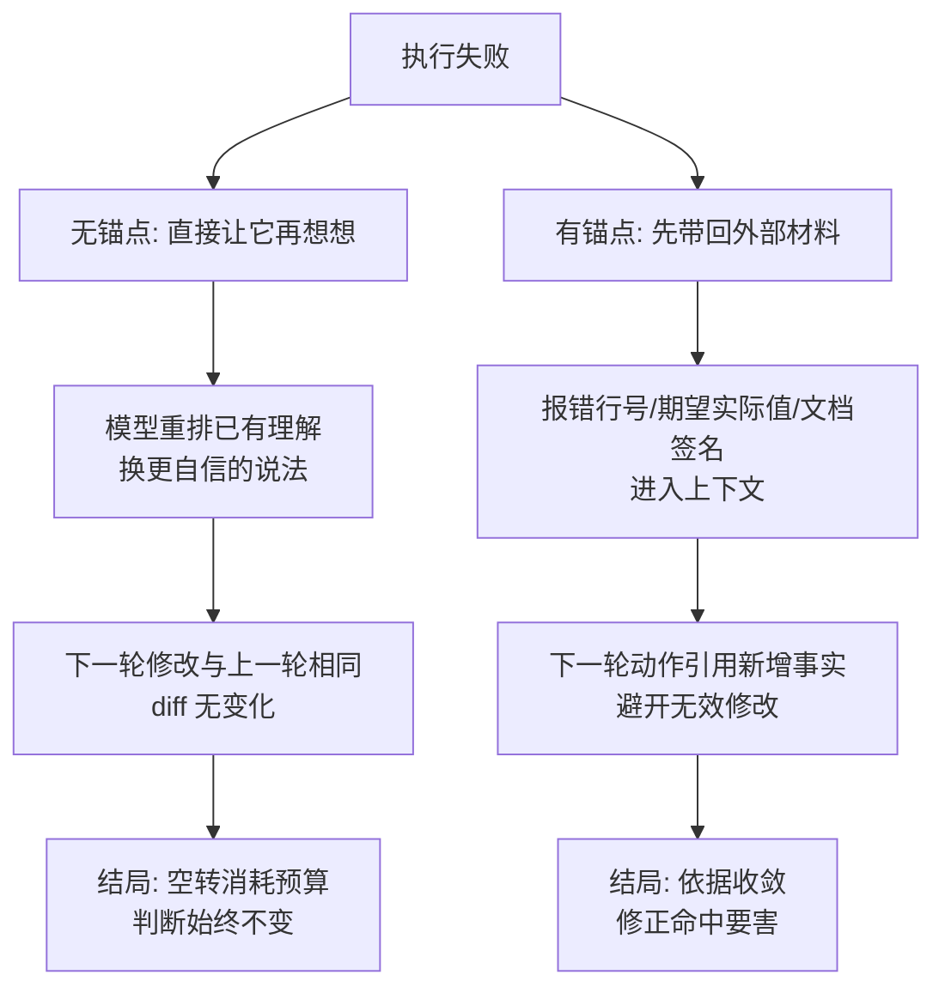

# 反思要有外部锚点，否则只是自我说服

反思解决的是执行失败后该如何改变下一步，而不是让模型把原有猜测换一种说法再讲一遍。有效做法是把测试报错、工具结果、权威文档或独立评审的原始证据带回决策，并限制无新证据的重复尝试；它能减少空转和成本，但前提是反馈完整且可追溯，不能把模型的自评当作验证。最小验证是让同一任务连续两次失败后，检查下一次动作是否引用了新增事实并避开了相同的无效修改。

## 背景：它越反思越确信自己是错的

一个 Agent 写了个函数，测试失败。让它"反思一下哪里错了"，它输出：

```
我认为问题在于边界条件处理不当。让我重新审视：
1. 首先，函数需要处理空输入
2. 其次，循环变量可能有 off-by-one
3. 综合来看，我认为应该修改第 15 行的判断条件

修改后再次运行测试... 仍然失败

反思：这说明我的修改方向不对。可能是第 8 行的初始化有问题...
```

循环 5 次，每次都有**条理清晰的反思**，每次都错。

**问题在于：它的反思没有外部信息输入。** 它只是在重新排列自己已有的（错误的）理解，然后用更自信的语气说出来。

**没有新信息的反思 = 自我说服。**

## 方案：让反思基于外部反馈

### 有效的反思长什么样

| 无效的反思 | 有效的反思 |
| --- | --- |
| "我觉得可能是边界问题" | "测试报错：`expected 5, got 3`，发生在 `test_empty_input` 第 22 行" |
| "让我重新思考" | "上次改了 A 没用，说明原因不在 A；这次检查 B" |
| "我认为应该这样做" | "文档说这个 API 返回 `[]byte`，我按 `string` 处理了" |

**区别：后者引入了新的外部信息**（报错、测试结果、文档）。

Reflexion 论文的 Figure 1 把有效反思的完整循环画成了三个领域的对照，其中 Evaluation 一行直接标注了 internal 与 external 的分野：


上图取自 [Reflexion 论文的 HTML 版](https://arxiv.org/abs/2303.11366)（NeurIPS 2023, Shinn et al.）。看 (c) 行：中间列编程任务用自生成的单元测试失败作评估，右列推理任务用环境奖励，这些是外部锚点；左列决策任务只用规则或语言模型启发式评估，判出"幻觉"却没有事实支撑，内部评判兜不住。看 (d) 行：有效的反思逐条引用具体失败原因——"错在只检查了括号总数是否相等"，不是"我觉得方向不对"。看 (e) 行：下一条轨迹据此修正，测试通过、答案收窄到正确职业。

### 三种有效的外部锚点

**1. 执行结果（最强）**

```
运行测试 → 得到具体的失败信息 → 基于失败信息修正
```

这是最可靠的锚点，因为它是**事实**，不是推断。

**关键：要把完整的错误信息给模型**，包括：

- 失败在哪一行
- 期望值 vs 实际值
- 调用栈

**2. 工具/文档的权威信息**

```
不确定 API 签名 → 查文档/类型定义 → 基于实际的签名修正
```

模型对 API 的记忆可能过时或错误。**查一下比猜好。**

**3. 外部评判者**

```
让另一个模型/人评估这个方案
```

**但要注意**：评判者也需要锚点。让另一个模型"看看这段分析对不对"，它同样会自我说服。**评判者必须能看到原始材料**（代码、报错、需求），而不只是被评判者的结论。

### 实现：把失败信息完整回传

```python
result = run_tests()
if result.failed:
    # 完整信息，不只是"失败了"
    feedback = f"""
测试失败：{result.failed_count}/{result.total_count}

失败用例：
{format_failures(result.failures)}   # 包含期望值、实际值、行号、调用栈

你之前的修改：{last_change}
当前状态：{current_state}
    """
    return feedback
```

### 抑制"反思但不改"

现象：模型反复说"我明白了，问题是 X"，然后做**同样的修改**。

**检测方法**：记录每次修改的 diff，如果连续两次 diff 相同（或语义相同），就是空转。

```python
if diff_hash(current_change) == diff_hash(last_change):
    return "你刚才已经做过完全相同的修改，但没有解决问题。请换一个方向。"
```

**这条提示很有效**——它把"自己在空转"这个事实明确告诉模型。

### 限制反思轮次

```
最多反思 3 轮，之后必须：
- 换策略（比如从头重写，而不是继续修补）
- 或者停止并报告
```

**超过 3 轮还在反思，说明方向错了，再想也没用。**

## 效果与代价

**收益**

- **修正方向更准**：基于事实而不是猜测
- **减少空转**：检测重复修改能打破循环
- **成本可控**：限制轮次避免无限反思

**代价**

- **需要工具提供足够信息**：测试报错不完整时，反思也无从下手
- **增加 token 消耗**：每轮反思都要带上完整上下文
- **可能过度依赖外部反馈**：有些问题需要推理而非试错，**空转检测会误伤"合理的多次尝试"**

## 从什么地方做

**第一步：检查工具返回的错误信息够不够**

模型收到的错误信息里有：行号？期望值？调用栈？**没有就先改进工具。**

**第二步：在提示词里要求"基于证据"**

```
反思时必须引用具体的报错信息或测试结果。
不要写"我认为"、"可能是"这类没有依据的推测。
```

**第三步：实现重复修改检测**

记录 diff 哈希，检测到相同时明确告诉模型。

**第四步：限制反思轮次**

3 轮为上限，超了就换策略或停止。

**第五步：区分"试错"和"空转"**

同一个方向的不同参数是试错（合理）；完全相同的修改重复是空转（要阻止）。

## 常见错误

**错误 1：让模型在没有新信息的情况下反思**

"再想想哪里错了" —— 它只能重新排列已有理解。**先跑测试、先看报错。**

**错误 2：错误信息被截断或简化**

只告诉模型"测试失败"，没有具体信息 → 反思只能靠猜。**完整传递失败详情。**

**错误 3：用另一个模型做评判却不给原始材料**

评判者只看到结论，没有看到代码和报错 → 它也是自我说服。**评判者必须能访问原始信息。**

**错误 4：无限反思**

反思 10 轮，成本暴涨，问题没解决。**设上限。**

**错误 5：把反思当成验证**

"我反思过了，应该没问题" —— 反思不是验证。**验证要跑测试、看结果。**

**错误 6：忽略反思中暴露的信息缺失**

模型反复说"我不确定这个 API 的行为" → 说明它缺查询文档的工具。**加工具，而不是让它继续猜。**

相关：[[工程知识/AI 系统工程：从模型能力到生产能力/Agent与工作流/模型负责判断，运行时负责执行语义]] · [[工程知识/AI 系统工程：从模型能力到生产能力/质量与运营/Agent评测必须覆盖轨迹而不只看最终答案]]

相关（约定层）：[[工程知识/AI 系统工程：从模型能力到生产能力/质量与运营/Agent评估系统的设计约定]] —— 反思结论要追溯到可复核的证据链

验证的锚点：反思结论要与外部证据对账——预写引入测试报错或文档查询后结论应随之改变，只变表述不变结论与预期对不上，按未引入新证据处理。

## 验证

1. 无新证据对照：同一任务分别跑一次不引入外部材料的反思与一次引入测试报错或文档查询的反思，确认后者才改变结论，前者只是表述更完整。
2. 停止判据：为反思设定最大轮数与无新信息判定，确认轮次超出预算或连续两轮没有新增依据时停止。
3. 锚点追踪：每次反思的结论都追溯到可复核的证据上，确认结论能追回报错、工具输出或权威文档。

## 机制与本质

反思的机制层：模型只能依据上下文中的内容重新组织回答，没有新增外部材料时，反思是在已有理解上重新排列，表述更完整而判断不变。引入测试报错、工具结果或权威文档之后，下一轮决策才有新的依据；重复的无新证据尝试只是消耗预算，不改变结论。

两条链从同一次失败出发，有无外部锚点走向不同结局：



上图与机制层文字一一对应：判断变不变的分岔点在「上下文里有没有新增外部材料」，不在模型反思的语气是否诚恳。空转一侧的出口是轮次上限与重复修改检测，收敛一侧的前提是反馈完整。

## 要解决的问题

执行失败之后，模型把原方案换一种说法再试一次，连续几轮都没有引入新的信息，成本与时间持续增加。本篇回答：反思要引用哪些外部材料才算有效、重复尝试的上限怎样确定，以及模型自评为什么不能当作验证结果。

