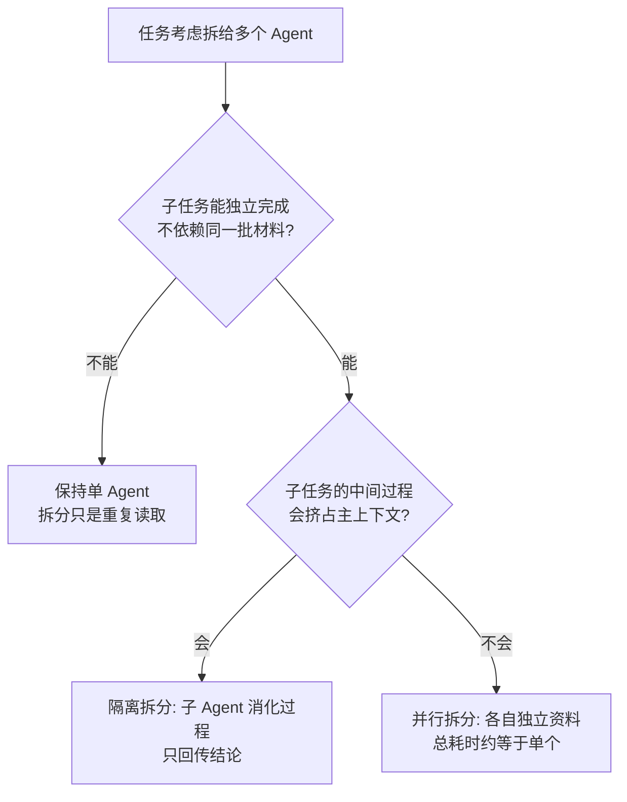

# 多智能体只在能并行或需要独立上下文时才值得

多智能体的适用问题有两个：独立子任务可以同时完成，或者单个子任务的中间过程会挤占主任务上下文。它不提升推理质量。子任务资料和状态能隔离、结果可结构化合并，这两条同时成立才分开。收益是降低等待时间或保护主上下文，代价是重复输入、汇总丢失和跨 Agent 调试复杂度。最小验证是以同一任务对照单 Agent 与分开方案的完成率、总 token、端到端耗时和关键证据保留率。

## 背景：三个 Agent 比一个还慢

一个团队把代码审查 Agent 分成了三个：一个看安全、一个看性能、一个看可读性，然后一个"汇总 Agent"负责合并结论。

实测结果：

- **耗时从 45 秒涨到 2 分 10 秒**（三次模型调用串行 + 一次汇总）
- **成本上升**：模型调用次数从 1 次变 4 次，每个 Agent 还要各自读一遍代码
- **质量没提升**——三个 Agent 各自发现的都是单个 Agent 也能发现的问题
- 汇总 Agent 还经常**丢失细节**："安全 Agent 提到 SQL 注入风险"变成"存在安全风险"

多智能体引入通信开销、上下文重复、结论汇总损失三项固定成本。它换来的收益超过这三项时才值得。

## 方案：只在两种情况下分开

拆分与否收拢成两个判定问题，先问子任务能否独立完成，再问中间过程是否会挤占主上下文：



两个问题都过不了关就停在单 Agent；能并行对应情况 1，需要隔离对应情况 2。

### 情况 1：任务真的可以并行，且各自需要不同的资料

**值得分开**：

```
任务：调研 5 个 SaaS 产品的定价和功能

✅ 分成 5 个 Agent，每个负责一个产品
   - 各自只读自己产品的文档（上下文不重叠）
   - 完全并行，总耗时 ≈ 单个产品的耗时
   - 各自主导自己的结论，无需汇总损失
```

**不值得分开**：

```
任务：审查一个 PR

❌ 分成安全/性能/可读性三个 Agent
   - 三个都要读同一份 diff（上下文重复 3 倍）
   - 串行执行，总耗时 = 3 倍
   - 汇总结论时信息有损
```

**判断标准：分出来的子任务，是否能独立完成？** 如果都要读同一批材料，分开只是重复劳动。

### 情况 2：子任务需要互相隔离的上下文

**值得分开**：

```
主 Agent 需要调用一个"研究"子任务，会产生 20 万 token 的中间过程。
如果放在主 Agent 上下文里，会挤掉其他信息。

✅ 分成子 Agent：它自己处理 20 万 token，只返回 2 千 token 的结论。
```

这叫上下文隔离，是多智能体最有价值的用途之一。**主 Agent 的上下文是稀缺资源，子 Agent 是它的"压缩器"。**

### 三种可行的拓扑

| 拓扑 | 结构 | 适用 |
| --- | --- | --- |
| 编排者-工作者 | 主 Agent 分解任务，分给工作者，汇总结果 | 可并行 + 需要隔离 |
| 流水线 | A 的输出给 B，B 给 C | 阶段明确，每步需要完整上下文 |
| 对等协作 | 多个 Agent 共享状态，互相通信 | **很少值得**：通信开销大，容易互相锁定 |

**对等协作基本不要用**，除非你在做研究。生产系统里前两种就够了。

编排者-工作者是前两种情况的合体形态，Anthropic 的 Building effective agents 给出了官方结构：


上图取自 [Anthropic 的 Building effective agents](https://www.anthropic.com/research/building-effective-agents)。编排者负责分解与分派，三个 LLM 调用各自独立运行，末端 Synthesizer 合并结论——文中说的「汇总是固定损失」就发生在这一步，子结论从这里变成最终答案。

## 效果与代价

**收益**

- **并行场景下总耗时下降**：5 个独立产品的调研，串行要等 5 份耗时相加，并行只要等最慢的一份
- **上下文隔离**：子 Agent 吃掉大量 token，主 Agent 上下文保持干净
- **职责清晰**：每个 Agent 的失败可以独立诊断

**代价**

- **成本通常上升**：即使并行，模型调用次数也增加了。时间比钱重要时才划算
- **汇总有损**：把 N 个结论合并成 1 个，必然丢信息。**结构化输出能缓解，但不能消除**
- **调试复杂度陡增**：一次失败要跨 N 个 Agent 的轨迹排查
- **错误会放大**：一个 Agent 的错误结论被汇总 Agent 当成事实，会污染最终结果

## 从什么地方做

**第一步：先用单 Agent 跑通，观察瓶颈**

不要一开始就设计多 Agent。先用 ReAct 循环跑，记录：耗时分布、上下文占用、失败模式。

**第二步：问两个问题**

1. 子任务能并行吗？（不能 → 别分开）
2. 子任务会产生大量中间上下文吗？（不会 → 别分开）

**两个都是"否"，就不要分开。**

**第三步：分开的时候，让子 Agent 返回结构化结果**

```json
{
  "summary": "一句话结论",
  "findings": [{"claim": "...", "evidence": "...", "confidence": "high"}],
  "artifacts": ["artifact://research/1"]
}
```

**不要返回自由文本**——汇总 Agent 解析结构化结果更可靠，也更不容易丢信息。

**第四步：保留子 Agent 的完整轨迹**

汇总层只看结论，但**排查问题时要能下钻到子 Agent 的轨迹**。把 `trace_id` 串起来。

**第五步：给汇总层加验证**

汇总 Agent 不应该无条件信任子 Agent 的结论。对关键结论要求**引用原始证据**，无法引用的标记为待验证。

## 常见错误

**错误 1：为了"看起来更专业"而分开**

三个 Agent 听起来比一个 Agent 高级，但实际更慢、更贵、更难调试。**架构复杂度必须换来明确收益。**

**错误 2：子 Agent 之间需要频繁通信**

如果 A 要问 B、B 要问 C、C 又要问 A，说明任务划分错了。**这种情况应该重新划分，加通信机制解决不了。**

**错误 3：汇总层自己产生幻觉**

"安全 Agent 说没问题" → 汇总写"已通过安全审查"。**汇总层必须引用，不能推断。**

**错误 4：忽略共享状态的并发问题**

多个 Agent 同时写同一份状态 → 互相覆盖。**共享状态要么只读，要么加锁/版本控制。**

**错误 5：每个子 Agent 都读全部上下文**

分开之后每个 Agent 还是拿到完整历史——那隔离的目的就没达到，成本还翻倍。**子 Agent 只该拿到它需要的那部分。**

相关：[[工程知识/AI 系统工程：从模型能力到生产能力/Agent与工作流/构建可靠Agent应用]] · [[工程知识/AI 系统工程：从模型能力到生产能力/模型与上下文/上下文工程是在有限预算内构造决策现场]]

验证的锚点：多智能体的分工要先写预期——每个成员的职责边界、产出格式、与他人的接口，合不出来就是对账信号，说明分工边界划错，应把边界收拢，加协调层解决不了。

## 边界

- 并行只在子任务之间没有依赖时成立：多数任务的下一步依赖上一步的结论，这类任务分开之后仍然是串行，只是多付出几次上下文重复的代价。
- 上下文隔离的收益有上限：子 Agent 交回的结论若本身携带大量细节才可判断，隔离掉的那部分信息在汇总环节仍需重建，压缩比接近于 1 时分开没有意义。
- 分开不提高单个 Agent 的水平：某个子任务所需的推理超出模型能力时，单独的 Agent 同样做不出来，分得更细只会把同一处错误复制多份。
- 汇总是固定损失：结论从多个来源合成一份必然丢信息，任何结构化输出只能减少损失。
- 共享状态写入需要额外交互手段：多个 Agent 同时改写同一份状态时，缺少版本或加锁机制会出现互相覆盖。

## 要解决的问题

一个任务被分成多个 Agent 之后，耗时上升、成本成倍上涨而质量没有变化，这类结果在团队里反复出现。本篇回答：什么样的子任务值得独立分工、什么条件下分开只会增加重复读取与汇总损失，以及分开之后汇总层怎样避免把子结论当成已验证事实。