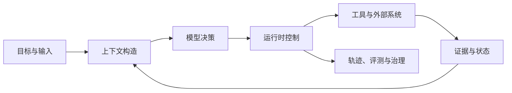

# 构建可靠 Agent 应用：从模型调用到可运营系统

Agent 应用的核心问题是：如何让概率性的模型在真实数据、权限和副作用中持续完成可验证任务。模型负责提出候选理解和动作，运行时负责状态、工具、隔离和证据；例如“自动修复测试”只有在命令、退出码、diff、测试报告和原问题复现都存在时才算完成。
Agent 应用工程不是“会调用大模型 API”，也不是“熟悉几个 Agent 框架”。它研究的是：**如何让一个会犯错、会受上下文影响、输出具有概率性的模型，在真实权限、真实数据和真实副作用中持续完成任务。**

模型提供理解、生成和决策能力；应用工程负责把这些能力放进一个可约束、可恢复、可验证的系统。两者之间的差距，就是 Agent 应用工程的主体。

## 先建立完整对象

一个 Agent 应用至少包含六类对象：

| 对象 | 它真正负责什么 | 最危险的误解 |
| --- | --- | --- |
| 模型 | 根据当前上下文提出文本、结构化结果或下一步动作 | 模型理解了目标，所以它的结论就是事实 |
| 上下文 | 为本次决策选择指令、状态、证据和可用工具 | 上下文越长，模型知道得越多 |
| 控制流 | 决定步骤、分支、循环、停止和人工接管 | 多 Agent 天然比单 Agent 更强 |
| 运行时 | 保存状态，执行工具，处理并发、超时、重试和恢复 | Agent 框架已经替应用解决可靠性 |
| 外部能力 | 提供数据、检索和有副作用的动作 | 接入 MCP 就自动获得权限与安全 |
| 评测与运营 | 判断任务是否完成、证据是否支持、系统是否值得运行 | 最终回答看起来不错就代表系统成功 |

这六类对象必须分别设计。换更强模型主要改变“候选决策质量”，不会自动改变权限、数据新鲜度、任务恢复和结果证明。

## 四条主线

### 模型与上下文：模型看见什么，决定了它能判断什么

先读 [[工程知识/AI 系统工程：从模型能力到生产能力/模型与上下文/模型提出候选，系统定义正确性]]，再读 [[工程知识/AI 系统工程：从模型能力到生产能力/模型与上下文/上下文工程是在有限预算内构造决策现场]]。前者建立模型能力的正确边界，后者解释如何把任务需要的信息组织成一次可执行决策。

### 控制与执行：让概率决策进入确定性系统

先用 [[工程知识/AI 系统工程：从模型能力到生产能力/Agent与工作流/先用工作流，只有路径无法预先枚举时才使用Agent]] 决定是否真的需要 Agent。需要动态决策时，再用 [[工程知识/AI 系统工程：从模型能力到生产能力/Agent与工作流/模型负责判断，运行时负责执行语义]] 和 [[工程知识/AI 系统工程：从模型能力到生产能力/Agent与工作流/工具是受约束的能力，不是提示词里的函数名]] 设计状态、工具与副作用边界。

### 知识与记忆：让模型获得当前任务真正需要的事实

[[工程知识/AI 系统工程：从模型能力到生产能力/知识与检索/RAG的核心是选择可引用证据]] 处理外部知识，[[工程知识/AI 系统工程：从模型能力到生产能力/模型与上下文/记忆是受治理的状态，不是更长的聊天记录]] 处理跨步骤和跨会话状态。两者都不是“把更多文本塞进上下文”。

### 可靠性与运营：证明系统做过什么、为什么可信

[[工程知识/AI 系统工程：从模型能力到生产能力/安全与治理/AI可以做语义决策，系统必须守住事实边界]] 定义 AI 与确定性框架的职责；[[工程知识/AI 系统工程：从模型能力到生产能力/质量与运营/Agent评测必须覆盖轨迹而不只看最终答案]] 定义质量；[[工程知识/AI 系统工程：从模型能力到生产能力/质量与运营/可观测性必须能重建一次决策]] 让失败可以定位、回放和修复。

## 一个最小但完整的交付顺序

不要从“选哪个框架”开始。按风险逐层增加系统能力：

1. **定义任务**：输入、输出、成功标准、不可接受结果和人工责任分别是什么？
2. **建立基线**：先用普通代码或一次模型调用完成最窄路径，收集真实失败样本。
3. **结构化边界**：为模型输出、工具参数和工具结果定义 schema；区分语法合法、业务合法和事实成立。
4. **引入外部能力**：只暴露任务需要的最小工具；读操作与写操作采用不同权限和审批策略。
5. **显式化状态**：定义运行状态、检查点、超时、取消、重试、幂等和停止条件。
6. **建立评测集**：同时覆盖正常任务、边界任务、攻击输入、依赖失败和恢复场景。
7. **再决定自治程度**：只有固定流程无法覆盖的决策才交给模型；每增加一次自主循环，都增加预算和观测。

这个顺序的意义是让复杂度由证据驱动。没有失败样本时增加规划器、多 Agent 或长期记忆，只是在扩大未知空间。

## 判断一个 Agent 是否可以上线

上线问题不是“它聪不聪明”，而是下面这些问题能否得到明确答案：

- 同一个目标如何被转换成可检查的完成条件？
- 模型每次决策看到了哪些指令、状态、证据和工具？
- 工具参数由谁验证，权限由谁决定，副作用如何去重？
- 进程中断、工具超时或模型输出无效时，从哪里恢复？
- 哪些结论来自真实工具结果，哪些只是模型推断？
- 失败是任务失败、模型失败、检索失败、工具失败还是环境阻断？
- 新模型、新提示词或新框架上线前，哪组回归样本必须通过？
- 一次运行的质量、延迟、token、工具成本和人工成本如何共同衡量？

任一关键问题只能用“模型一般会处理”回答，说明系统仍停留在演示阶段。

## 推荐阅读路径

| 目标 | 阅读顺序 |
| --- | --- |
| 第一次系统学习 | 本页 → 工作流与 Agent → 模型与正确性 → 上下文工程 → 运行时 → 工具 → 评测 |
| 正在做企业知识助手 | RAG → 记忆 → 证据支持评测 → 权限与提示注入 |
| 正在做代码 Agent | 运行时 → 工具 → 沙箱与副作用 → 代码结构 → 轨迹评测 |
| 正在做跨系统自动化 | 工具契约 → MCP 与 A2A → 幂等与补偿 → 人工审批 → 审计 |
| 正在选技术栈 | [[工程知识/AI 系统工程：从模型能力到生产能力/生态与选型/Agent技术栈选型不是框架排名]] → [[工程知识/AI 系统工程：从模型能力到生产能力/生态与选型/AI技术动态]] |

## 本知识库的边界

这里保存的是能跨模型和框架复用的工程判断，以及支撑这些判断的一手来源。某个产品的价格、模型别名、预览功能和版本状态会快速变化，只进入技术雷达；通用数据库、网络、并发和性能知识进入 `工程基础`，并从 Agent 主题按问题链接过去。课程目录、新闻流水和工具清单不作为知识结构。
