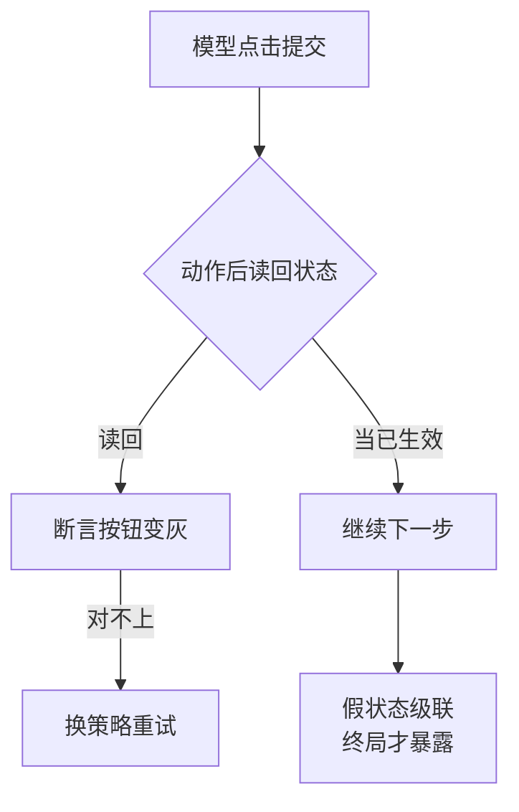

# 浏览器与Computer Use Agent：高噪声观察下的受控操作

让 Agent 操作浏览器完成表单、下单、迁移后台数据，听上去只是"多接一个工具"，实际引入了三类新问题：观察是截图或无障碍树，高噪声且不稳定；动作空间是像素坐标或 DOM 选择器，脆弱且可被页面改版打断；页面内容本身不可信，提示注入可借页面文字劫持 Agent。要解决的问题：在承认观察与动作都不可靠的前提下，构造能验证、可回滚、有权限边界的浏览器操作运行时。

本质是把浏览器从"工具"重新定义为"不可信环境"。普通工具的输入输出是结构化的、约定明确的；浏览器环境的输入是渲染后的页面，其内容可含对抗性指令，其结构随加载时序漂移。运行时的职责因此从"转发调用"升级为"过滤观察、约束动作、验证结果"。

## 机制：观察、动作与验证三层

| 层 | 机制 | 工程要点 |
| --- | --- | --- |
| 观察层 | 截图 + 无障碍树/DOM 快照组合 | 截图给视觉模型、结构树给精确选择器；两者互校降低误读 |
| 动作层 | 白名单动作（导航、点击、输入、等待） | 禁自由 JS 执行；每个动作带前置断言（目标元素存在） |
| 验证层 | 动作后状态断言 + 关键操作截图存证 | 提交类动作前后双截图；失败即停而非重试蒙对 |

观察过滤针对提示注入：页面文本进入上下文前，标记来源为不可信内容（与系统提示、用户指令区分），对"忽略之前指令""点击此处"类页面内指令一律不执行，除非用户已显式授权该域名的此类操作。

动作约束的硬度分级：只读操作（浏览、查询）失败可自动重试；可逆写操作（保存草稿）重试前检查目标状态；不可逆操作（支付、删除、发送）必须人工确认或预授权范围内执行。

## 失败形态

| 失败 | 场景 | 对策 |
| --- | --- | --- |
| 选择器漂移 | 页面改版，选择器失效点击到错误元素 | 前置断言 + 动作前截图确认目标 |
| 加载时序竞态 | 元素可见但未可交互，过早点击 | 显式等待可交互状态而非固定 sleep |
| 提示注入劫持 | 页面文字含指令，Agent 执行了页面说的而非用户要的 | 观察内容标记不可信 + 域名动作白名单 |
| 多标签状态丢失 | 操作中途开新标签，Agent 跟丢上下文 | 标签页句柄显式管理，动作绑定标签 ID |
| 静默错误 | 点击成功但后端拒绝，页面只是刷新 | 动作后必须断言结果状态而非仅断言动作完成 |

## 边界

- 截图视觉模型读到的"按钮"可能是广告或伪造元素：视觉确认要结合 DOM 结构与位置一致性，纯视觉判断在高风险操作上不够。
- 不可逆操作的人工确认粒度是产品权衡：每次确认打断自动化收益，批量预授权积累风险；默认建议单次任务内单次确认、跨任务不预授权支付类动作。
- Computer Use（操作系统级）比浏览器级风险高一档：文件系统与进程的破坏半径大于网页，白名单与沙箱要求更严，能不用就不用。
- 录制回放不是 Agent：固定脚本处理不了页面变化，Agent 的价值恰在处理漂移，但漂移处理本身要靠断言而非模型"觉得对"。

## 可运行示例：一次点击动作的三层护栏

Computer Use 的单个动作（"点击提交按钮"）从观察到生效，每层各有一道闸：

```python
# 观察层：坐标只信一个源
obs = capture(screenshot=True, dom=True)
element = locate(obs.dom, selector="button#submit")
#   截图缩放 2 倍 → 像素坐标失真 → 点错位置
#   纪律：坐标只从 DOM 取，截图供多模态模型读语义与人工审计

# 动作层：结构化引用优先，坐标兜底
if element:
    act(Click(ref=element.ref))      # 按元素引用点，布局微动不失效
else:
    act(Click(pixel=element.xy))     # 纯坐标是最后手段

# 验证层：动作后必须读回状态，而非假设成功
after = capture(dom=True)
assert after.dom.find("button#submit").disabled     # 提交后按钮变灰
assert "订单已创建" in after.dom.text               # 确认文案出现
#   界面没变化 → 判定失败 → 重试换策略（滚动、换选择器），不是原样再点
```

跑一遍的收获：高噪声观察下可靠性的来源是"结构化锚点 + 动作后验证"——模型负责从截图读出"该点什么"，运行时负责把"点"对应到可验证的 DOM 引用上；职责分开后，噪声只是降低效率，不直接变成错误动作。

三层护栏里真正分出成败的是最后一道。同一个点击，动作之后读不读回状态，走出两条路：



读回状态让错误在发生的那一步被拦下；当已生效则把假状态带进下一步，发现时已经远离出错点。

## 量化锚点与案例回流

噪声的账：现代页面单屏可交互元素几十到上百个，原始截图的 token 开销以千计——观察是 Agent 域最贵的输入之一，DOM 过滤（只留可交互元素与锚点）能把观察体积压一个数量级。成功率的账：结构化引用的点击成功率显著高于纯坐标（动态布局下坐标失效率以两位数百分比计），动作后验证把"静默失败"变成"显式重试"，端到端任务完成率的提升主要来自这一项。案例回流：不读回执就当成功的实录见 [[工程知识/缺陷分析：从个案到体系/稳定性/案例八：承诺没有兑现——Pulsar 里六个永不返回的请求.md]]——发出请求即认定生效、不验证回执，Agent 的"点了就当生效"是同一形态；重试策略的外部锚点见 [[工程知识/AI 系统工程：从模型能力到生产能力/Agent与工作流/反思要有外部锚点.md]]——动作后的状态读回就是反思的锚点本身。

## 验证

验证的锚点：动作断言要与前置条件对账——预写每个动作前目标元素存在、提交前后双截图存证，断言失败与预期对不上时立即停止，不再重试蒙对。

最小验证：在测试站点跑一个含表单提交的任务，人为注入三类扰动——改一处选择器、延迟一处加载、页面内植入一句注入指令；断言：选择器漂移被前置断言拦下、时序竞态被显式等待化解、注入指令未被采纳且被日志标记。再跑不可逆操作路径，断言人工确认门触发且确认前后双截图入证据链。

关系：[[工程知识/AI 系统工程：从模型能力到生产能力/Agent与工作流/工具是受约束的能力，不是提示词里的函数名]] · [[工程知识/AI 系统工程：从模型能力到生产能力/安全与治理/提示注入和工具越权是不同威胁]] · [[工程知识/AI 系统工程：从模型能力到生产能力/安全与治理/沙箱限制能力，策略限制行为]]
