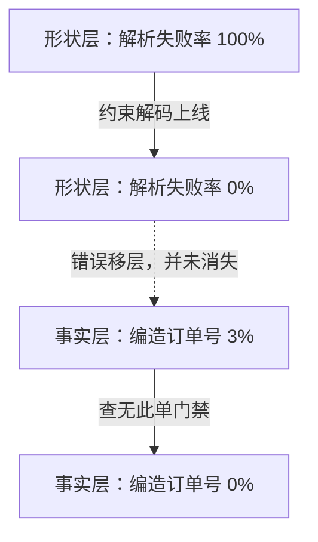

# 结构化输出与约束解码：schema约束形状，事实另需验证

让模型输出 JSON，第一次拿到 `{` 后面接了作文、第二次数组少逗号、第三次字段名对了但日期是编的——把"格式对了"当成"输出对了"，是结构化输出投入生产时最贵的错觉。要解决的问题：用约束解码保证输出符合 schema 的形状，用独立验证层保证语义与业务事实，两层职责分开，都不可省略。

本质是形状约束与事实保证的分离。约束解码（constrained decoding）把 JSON Schema 或 CFG 编译成状态机，在每步解码时屏蔽不合法 token，保证输出语法上必然合法；但 schema 只知道"date 字段必须是字符串"，不知道"这个日期是否真实、这个价格是否符合业务规则"。语法合法性是解码层的事，事实正确性是验证层的事。

状态机屏蔽在每一步长什么样，引导生成论文的机制图最直观：


正则 `([0-9]*)?\.?[0-9]*` 编译成四状态自动机；当前状态允许的 token 在 logits 里保留，其余涂黑屏蔽。采样 `.2` 与采样 `1` 各自推进到不同状态，下一步的合法集合随之变化。图取自 [Efficient Guided Generation for Large Language Models（arXiv:2307.09702）](https://arxiv.org/abs/2307.09702) 论文 Figure 1。

## 机制：三层约束

| 层 | 保证什么 | 怎么实现 | 失效时表现 |
| --- | --- | --- | --- |
| 约束解码 | 语法合法（可解析、类型对） | schema → 自动机，逐 token 屏蔽 | 实现层 bug 时输出非法 JSON |
| 语义验证 | 值在业务上有效 | 独立验证器：范围、引用、枚举、跨字段规则 | 解析通过但值荒谬 |
| 修复重试 | 一次失败不终止 | 验证失败带错误信息重新生成 | 重试成本与无限循环风险 |

约束解码的实现强度分档：正则截断（弱，只兜底）、logit 屏蔽（强，逐 token 保证）、预编译自动机（最强，复杂 schema 有性能成本）。弱实现对嵌套 schema、oneOf、递归结构的覆盖有限，选实现前拿你的 schema 复杂度实测。

语义验证层要独立于模型实现：日期真实性、ID 存在性、数值范围、跨字段一致性（endDate > startDate）都在应用代码里做，模型只负责填值。验证失败的重试要把错误信息注入重新生成，而不是盲目重跑——盲目重跑等于赌运气，注入错误让模型知道错在哪。

## 失效形态

| 失效 | 机制 | 信号 |
| --- | --- | --- |
| 形状对事实错 | 约束解码只管语法，字段值是幻觉 | 日期不存在、ID 编造、金额违反业务规则 |
| schema 漂移 | 消费方 schema 升级，旧输出解析失败 | 版本切换后错误率跳变 |
| 约束性能税 | 复杂自动机每 token 都做状态转移，吞吐下降 | p99 延迟上升，吞吐与自由生成差距大 |
| 强制字段幻觉 | schema 要求的字段模型没有证据支撑 | 可选字段被填上编造值 |
| 重试风暴 | 验证失败 → 重试 → 又失败循环 | token 成本翻倍，延迟不可控 |

## 可运行示例与案例回流：约束解码的实录

```python
# 同一抽取任务，两种输出控制的差别（通用示例）

# 无约束：自由文本生成
answer = llm("提取订单号和金额: " + text)
#   "订单号是 A-123，金额 88 元（含税）" → 解析靠正则碰运气
#   "金额（单位：元）88" 单位歧义 → 下游把 88 当成分，错 100 倍

# 约束解码：每 token 只允许符合 schema 的候选
schema = {"order_id": "string", "amount_cents": "integer"}
answer = llm(prompt, response_format=schema, constrained=True)
#   解码器维护语法状态机：该出字段名时只允许出字段名的 token，
#   该出数字时屏蔽字母 → 100% 可解析，形状永远合法
#   但"形状合法 ≠ 内容真实"：order_id 可能被编造（schema 管不了事实）
#   → 事实层校验：order_id 反查订单系统，查无此单 → 判定幻觉，走人工
```

案例回流：只验形状不验事实的实录——抽取管道上线后解析失败率清零，业务校验发现 3% 的订单号是编造的（模型在信息缺失时"配平"了 schema 要求的必填字段），加"查无此单即拒绝"的业务门禁后错误才真正归零；这正是 [[工程知识/AI 系统工程：从模型能力到生产能力/模型与上下文/模型提出候选，系统定义正确性.md]] 的分工实录——模型出候选，判据定对错，形状门禁只是第一道。约束的代价实录：强约束在开放域会逼出低质量填充（必填但信息不足时模型硬编），比解析失败更难发现——必填字段要配"信息不足时允许显式输出 unknown"的逃生门。

第一道门禁清零时，错误只是换了一层存在：



形状层指标归零的时刻，正是事实层指标开始暴露问题的时刻；两层指标必须一起看，单层达标会制造已经修好的错觉。

## 边界

- schema 不是越严越好：把所有字段设 required 会强迫模型在不确定时编造；可选字段 + 空值语义（显式 null 与缺失字段分开定义）让模型能表达"不知道"。
- 约束解码与采样参数有交互：约束屏蔽后的分布与原始分布不同，temperature 在受约束 token 集上的行为要单独验证。
- 函数调用（function calling）是结构化输出的特化形态：参数 schema 即约束，但工具执行结果回填后的整体语义仍需应用层验证，协议层不保证。
- 严格 schema 下模型可能"被逼说谎"：要求枚举值但真实答案不在枚举里时，模型会选最接近的错值而非承认无法回答；枚举设计要留出口（unknown/other + 自由文本）。

## 验证

验证的锚点：schema 结论要与三层验证对账——预写约束解码层全部语法合法、语义层非法值全部被拦，任一层与预期对不上就回到该层补约束。

最小验证：构造 20 个含边界情况的 schema 实例（嵌套、oneOf、可选字段、空值），分别测三层：约束解码层断言 100% 语法合法；语义层故意注入 5 个业务非法值，断言验证器全部拦下；重试层测一次注入错误的失败-修复循环成本（token 数与延迟），对比盲重试。最后跑 schema 版本兼容：旧输出喂给新验证器，断言有明确的版本错误而非静默错误。

关系：[[工程知识/AI 系统工程：从模型能力到生产能力/模型基础与训练/解码与采样参数：概率分布到生成文本的控制面]] · [[工程知识/AI 系统工程：从模型能力到生产能力/Agent与工作流/工具是受约束的能力，不是提示词里的函数名]] · [[工程知识/AI 系统工程：从模型能力到生产能力/质量与运营/评测集的构建与维护决定所有评测的地基]]

## 效果与代价

把语法约束与事实校验分成两层，换来的是输出的形状由解码过程保证，字段值的真实性由应用侧独立验证，两者之一的失效不会相互掩盖。代价是复杂 schema 的自动机带来每 token 的状态转移开销，验证失败的重试需要注入具体错误信息，字段过多且全部必填时模型会在缺少依据的字段上编造值。

