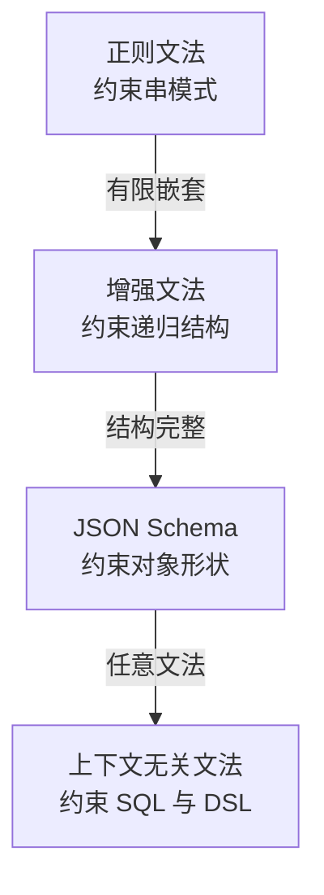

# 结构化输出的约束解码：让模型输出可解析

## 要解决的问题

Agent 系统里模型的输出要被程序消费（调工具、写状态机、填表单），自由文本不能直接解析。传统解法是 prompt 里写“请输出 JSON”+ 输出后解析失败重试，两层都软：模型未必听（格式漂移、多余 preamble、markdown 围栏），解析后未必对（字段缺、类型错、枚举越界）。结构化输出要解决的问题是**把输出格式从“提示期望”变成“生成约束”**，让非法 token 在采样阶段就不可能被选中。这是 Agent 工程的可靠性底座之一，与词汇即接口（见 [[工程知识/软件构建：让变化可以理解、验证与交付/开发工具/词汇即接口：Linux与容器命令的词源与设计.md]]）的“接口约定”思想同源：接口的形状固定，输出才能被机器消费。

## 机制

**三层机制**。
- Prompt 约束（软约束）：提示词描述格式 + few-shot 示例。零开销零保证，模型的格式遵循率随模型能力与提示质量波动。
- 约束解码（强）：在采样前按语法/Schema 构造合法 token 前缀树，每步把非法分支的 logit 置负无穷。GUIDANCE、Outlines、llama.cpp 的 GBNF、OpenAI 的 structured outputs 都是这层。数学上保证输出合法（合法 token 集合内采样）。
- 校验与修复（后）：JSON Schema 校验（ajv 类）+ 失败重试（带错误信息重生成）或修复（局部修补）。兜底层，处理约束解码覆盖不了的字段间约束（数值范围、跨字段关系）。

**状态机是核心抽象**。JSON 的语法可以编译成状态机：开头必是 `{` 或 `[`，进入对象后期待 key（字符串）或 `}`，value 的类型由 schema 决定分支。约束解码每步查询状态机当前允许的 token 集合，mask 掉非法项。Schema 越复杂状态机越大，但状态数有限（schema 结构决定），每步 mask 的开销可接受。这个抽象把“格式正确性”从概率问题变成确定性问题。

**正则与 CFG 的谱系**。正则（无嵌套）→ 增强（有限嵌套/递归）→ JSON Schema（结构完整）→ 上下文无关文法（SQL、DSL）。约束力与表达力同涨：正则约束下模型只能输出匹配模式串，CFG 下能输出合法 SQL。表达力上限处是约束编译的开销与模型能力的冲突：约束太强（复杂 schema）会把模型“挤”到低质量输出（合法但语义差，模型被迫选它本不想选的 token）。

**与工具调用的关系**。函数调用（function calling）是结构化输出在工具场景的产品化：schema 即函数签名。工具调用的可靠性依赖约束解码层的实现质量：无约束解码的 function calling（靠 prompt + 解析重试）在复杂 schema（多参数、嵌套对象）下失败率显著上升，有约束的（OpenAI structured outputs、vLLM guided decoding）接近 100% 合法。Agent 的轨迹可靠性（见 [[工程知识/AI 系统工程：从模型能力到生产能力/质量与运营/Agent评测必须覆盖轨迹而不只看最终答案.md]]）把工具调用格式失败算作轨迹失败，约束解码是消掉这类失败的手段。

## 背景与代价

思想背景：约束解码与形式语言理论的编译器实践同源（1970s 的 LR 解析、自动机理论），GUIDANCE（2023）与 Outlines（2023）把 schema 编译成状态机再 mask logits 做成工程库。Willard 与 Louf（2023）的论文《Efficient Guided Generation》给出状态机 mask 的高效实现。OpenAI 2024 年的结构化输出功能（100% schema 合法承诺）把这个技术推向主流 API。

最精巧的一笔是**“语法编译成状态机，采样在状态机内”**。把 JSON Schema 编译成有限状态机，每步解码查询当前状态允许的 token（转移边上的 token 集合），把非法分支的概率清零。格式正确性从“模型学出来的概率倾向”变成“数学上不可能违反”。这一笔把概率模型与确定性约束组合：概率部分管内容（选什么值），约束部分管形式（值的形状必须合法）。代价要摆明：约束解码不是免费的——每步 mask 有开销（状态机查询），复杂 schema 的编译与缓存管理要工程化；更深的代价是“合法性挤压质量”：模型被强制选合法 token 时，可能被迫偏离它的自然分布（合法但差的输出），复杂 schema（长枚举、深嵌套）下输出质量可测下降。三层的组合策略：简单格式用 prompt 约束（零成本），关键接口用约束解码（强保证），字段语义用校验层（数值范围、业务规则）。全链路强约束只在必要时上，见 Agent 轨迹可靠性（上文链接）的成本段。

## 边界

- **约束解码保证语法，不保证语义**。Schema 校验字段类型与结构，不校验内容正确性（数值合理性、枚举选择符合业务）。语义层靠校验层断言 + 评测集覆盖，见评测集构建（见 [[工程知识/AI 系统工程：从模型能力到生产能力/质量与运营/评测集的构建与维护：从场景采样到难度分层.md]]）。
- **复杂 schema 的质量挤压要实测**。深嵌套 + 长枚举的 schema 在约束解码下的输出质量（人工或自动评测）可能低于自由输出后解析。若实测质量下降显著，改 schema 设计（扁平化、分成多次调用）比强约束更划算。
- **流式场景的约束部分失效**。流式输出（SSE 逐 token）下，约束解码在每个 chunk 边界仍有效（每个 token 都 mask），但消费方拿到的部分 JSON 无法校验（schema 校验要完整文档）。流式 + 结构化的组合要求消费方做增量解析器（部分 JSON parser）或牺牲流式。Gemini 的 partial JSON mode 是折中方案。
- **约束解码与采样温度的交互**。温度 0（贪心）下约束解码质量最稳（无采样噪声），温度 > 0 时约束 mask 改变分布形状（被 mask 的概率质量重新归一化到合法集），输出的多样性下降。创意生成任务慎用强约束。

## 验证

- **格式失败率对照**：同一任务（如按 schema 生成配置）在 prompt-only、prompt+重试、约束解码三种模式下跑 1000 次，统计非法率。预期：prompt-only 5-30%（随模型与 schema 复杂度），+重试可压到 1-5%，约束解码 0%（数学保证）。失败率曲线随 schema 复杂度的增长是三层约束的证据。
- **质量挤压实验**：同一模型同一任务，自由输出（后解析成功的样本）vs 约束解码输出，人工或 LLM 评审打分。预期：简单 schema 无显著差异，复杂 schema 约束输出质量分下降。挤压效应的量化是 schema 设计决策的依据。
- **开销实测**：约束解码开与关的同负载吞吐对比。预期：简单 schema 开销 <5%，复杂 schema（深嵌套）可测上升（状态机查询与缓存 miss）。开销曲线是容量规划输入。

## 相关

- [[工程知识/软件构建：让变化可以理解、验证与交付/开发工具/词汇即接口：Linux与容器命令的词源与设计.md]] —— 接口形状固定才能被机器消费
- [[工程知识/AI 系统工程：从模型能力到生产能力/质量与运营/Agent评测必须覆盖轨迹而不只看最终答案.md]] —— 工具调用格式失败的轨迹代价
- [[工程知识/AI 系统工程：从模型能力到生产能力/质量与运营/评测集的构建与维护：从场景采样到难度分层.md]] —— 语义层校验的评测依据
