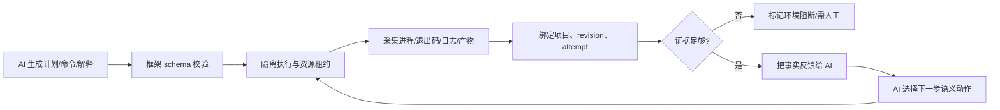

# 执行证据必须独立于 AI 结论

## 先看一个真实失败

一个 Agent 改了 `pom.xml` 里的依赖版本，然后报告"测试通过，可以提交"。

人工复核时发现：它跑的其实是 `./mvnw validate`——一个只检查 POM 格式的目标，**根本没有编译，也没有跑测试**。构建日志里躺着真实的 `exit_code: 1`，但 Agent 的解释是"测试未执行，因为依赖下载失败"。

两句话都挺合理。区别是：第一句是**观察**，第二句是**推测**。而系统当时只有一个 `status: success` 字段，装不下这个区别。

这类失败不是模型不够聪明。**是职责边界放错了：让会写解释的人，同时拥有"什么算成功"的判定权。**

验证的锚点：证据链要与结论对账——AI 结论引用的证据要能独立复核（重新跑命令、重新查日志得到同一份原始记录），复核对不上的结论按未验证处理，不进决策链。

## 边界应该划在哪

不是"AI 和框架各判断一半"，而是：

> **AI 负责所有需要理解上下文的语义决策；框架负责隔离、执行、证据和一致性，只判断 AI 的结论是否有真实证据。**

这条线同时做了两件事：给模型最大的适配空间，又不让"模型说成功"直接变成"系统认定成功"。

关键不是限制模型，是**把规则放在最不能被语言模型替代的地方**。

## 两类决策必须分开

| 决策类型 | 典型问题 | 负责者 | 原因 |
| --- | --- | --- | --- |
| 语义决策 | 项目是什么语言和构建系统？应该找哪类测试？API 是否需要改写？失败更像代码、网络还是权限？下一步尝试什么？ | AI | 需要理解开放世界上下文，固定规则很快覆盖不足 |
| 事实约束 | 命令是否真的执行？退出码是多少？产物在哪？哪个 commit/revision 产生结果？资源是否仍被使用？之前成功事实是否被覆盖？ | 框架/操作系统/存储 | 必须可证明、可回放、不可由自然语言自证 |

判断边界放对了没有，问两个问题：

1. 这个决定是否依赖开放语义、未知环境或复杂权衡？是 → 交给 AI。
2. 这个结论是否应该只有一个可审计的真实答案？是 → 必须由系统记录。

"哪个测试最能覆盖这次改动"是第一个问题；"该测试是否在目标 revision 上以退出码 0 完成"是第二个。

AI 可以提出"应该执行什么"和"结果可能意味着什么"，但不能凭一句话改变事实投影。框架可以拒绝一条没有进程记录、退出码或产物支撑的声明，却不应替 AI 判断某个测试在业务上是否适用。

## AI 负责的语义工作

提示词应提供项目、分支、环境、目标、限制、已有证据和可用工具。AI 在此基础上动态生成并迭代：

- 项目画像：语言、构建系统、模块边界、版本和依赖关系；
- 环境策略：本地工具、缓存、仓库、镜像、代理和可用版本；
- 任务入口：上游测试、构建目标、最小复现、运行参数和数据准备；
- 适配计划：API 改写、测试迁移、fixture、编译开关和回退方案；
- 证据解释：是否真正经过目标代码，失败属于编译、依赖下载、网络、权限、运行时还是产品逻辑；
- 下一步行动：重试、切换工具/版本/仓库、缩小输入、请求人工确认或结束为环境阻断。

这些工作不应为某个语言、数据库、框架或项目写一套僵化分支。框架只提供能力目录、可执行接口和事实回传，让 AI 根据实际证据选择路径。

## 框架负责的不可委托约束

### 隔离与资源生命周期

- 每个任务使用独立 worktree、运行目录、临时端口、容器/沙箱和凭据范围。
- 任务结束时只清理自己持有且已确认无人使用的资源。
- 为资源设置 owner、generation、lease/引用计数；旧任务不能删除新任务正在使用的 Git 元数据或缓存。
- 子进程、孙进程、容器和后台任务纳入同一生命周期树，超时后可追踪、终止和收尸。

### 执行事实

- AI 声称执行过的每条命令必须对应真实的 `command_id`、启动时间、工作目录和进程记录。
- 保存退出码、stdout、stderr、信号、超时原因和产物清单；日志不可只保留模型摘要。
- “validate 成功”只能证明 validate 这个目标成功，不能投影为完整编译、测试或产品行为成功。
- 对工具返回值进行 schema 校验；无结构文本只作为诊断证据，不作为状态机输入。

### 结果一致性

- 结果绑定 `project_id + commit/revision + task_id + generation + environment fingerprint`。
- 状态更新使用单调版本或事件溯源；较晚到达的失败不能覆盖已确认的成功事实。
- 报告只能读取由事实事件投影出的状态，不读取 AI 自己写的总结字段作为唯一依据。
- 任务重试生成新的 attempt，但继承可复用的证据；不得静默覆盖历史。

### 安全与预算

- AI 可以在独立沙箱中获得较高项目权限，但不能访问系统关键目录、其他任务进程或未经授权的凭据。
- 框架限制命令范围、网络出口、磁盘/CPU/内存、并发、重试次数、总时长和费用。
- 高风险写操作先 dry-run 或预览，再基于参数摘要请求人工确认；确认必须绑定版本和有效期。
- 所有工具调用和文件变更写入审计事件，敏感参数只保存哈希或脱敏摘要。

## 推荐的事实模型

```yaml
run:
  run_id: run_123
  task_id: task_123
  project_id: project_abc
  revision: commit_sha
  generation: 4
  environment_fingerprint: sha256:...
  status: waiting_for_evidence
actions:
  - command_id: cmd_001
    argv: ["./mvnw", "test", "-Dtest=ExampleTest"]
    cwd: /sandbox/worktree
    started_at: 2026-08-31T10:00:00Z
    ended_at: 2026-08-31T10:00:12Z
    exit_code: 1
    stdout_artifact: artifact://stdout/cmd_001
    stderr_artifact: artifact://stderr/cmd_001
    products: [artifact://surefire/report.xml]
claims:
  - claim_id: claim_001
    text: "测试未执行，因为依赖下载失败"
    evidence: [cmd_001, artifact://stderr/cmd_001]
    confidence: supported
```

`claims` 是 AI 的解释，`actions` 和 `products` 是框架采集的事实。只有当 claim 引用的证据存在、归属于同一任务代际且满足规则时，才允许进入最终报告。

## 五种假成功，和它们背后的真相

这些都是实际发生过的。左边是 Agent 当时说的话，右边是事后查出来的事实。

| 表面结论 | 可能的真实原因 | 必须检查的事实 |
| --- | --- | --- |
| "命令没有执行" | 解析器漏记 CLI 事件，实际进程已完成 | 进程、command_id、退出码和 stdout |
| "测试不适用" | 依赖下载失败、权限不足或版本不兼容 | 构建日志、网络响应、凭据和版本解析 |
| "编译成功" | 只执行了 validate，未执行 compile/test | 实际目标、产物和测试报告 |
| "任务卡住" | 主进程已被 OOM/SIGKILL，内部心跳自然停止 | 外部 observer、进程树、宿主机事件 |
| "重试失败所以之前失败" | 后一次 attempt 覆盖了前一次已确认事实 | attempt/generation 和单调状态投影 |

最后一行最隐蔽：**一次重试失败，把之前已经确认的成功也抹掉了**。这不是模型撒谎，是状态模型不够——它只有一个可被覆盖的字段，没有"哪个 attempt 产生了哪个事实"的概念。

AI 很擅长为错误结论提供合理解释。所以要做的是让它读到完整、结构化、不可篡改的证据，而不是让它自己生成证据。

## 事实门禁流程



框架不需要知道“这个测试是否有业务价值”，但必须知道“报告中这句话是否有真实执行证据”。这是一条比为每个项目硬编码测试规则更小、也更通用的边界。

## 最小接口

```text
Planner (AI)
  -> Plan(commands, probes, hypotheses, expected_evidence)

Executor (framework)
  -> ExecutionFacts(command_id, exit_code, logs, artifacts, process_tree)

EvidenceStore
  -> append_immutable(event)
  -> query(run_id, attempt, revision)

Projector
  -> derive_status(facts, policy)

Reporter
  -> render(only=projected_facts_and_supported_claims)
```

Planner 可以动态生成构建画像、测试入口、依赖准备和回退方案；Executor 不必预先理解 Spark、Pulsar 或某种语言，只需执行受限命令并如实记录。若执行器缺少某类采集能力，应明确标记“无法证明”，而不是默认成功或失败。

## 与 Agent 工程的关系

- Agent 设计模式：[[工程知识/AI 系统工程：从模型能力到生产能力/Agent与工作流/先用工作流，只有路径无法预先枚举时才使用Agent]] 负责选择工作流、工具循环、人工接管和回退。
- AI 辅助研发：[[工程知识/AI 系统工程：从模型能力到生产能力/Agent与工作流/AI辅助研发必须形成证据闭环]] 负责把本原则贯穿到排障、修复和验证闭环。
- 测试工程：[[工程知识/软件构建：让变化可以理解、验证与交付/测试与交付/测试策略从风险选择证据]] 负责把事实投影转成风险门禁和回归样本。
- 分布式可靠性：[[工程知识/后端系统：在并发、失败与变化中维持服务/分布式可靠性/部分失败决定分布式系统的设计]] 负责生命周期、重试、幂等、租约和一致性。
- 进程与协调：[[工程知识/后端系统：在并发、失败与变化中维持服务/任务与并发/任务生命周期必须覆盖进程、日志、超时与清理]]、[[工程知识/后端系统：在并发、失败与变化中维持服务/分布式可靠性/租约必须配合FencingToken阻止过期持有者]] 负责可执行的资源语义。
- MCP：[[工程知识/AI 系统工程：从模型能力到生产能力/生态与选型/MCP接入必须验证协议、身份与工具约定]] 只解决能力连接，不替代事实门禁和业务授权。

## 采用检查表

- [ ] AI 的每个语义结论都能指向一组事实证据或明确标记为假设。
- [ ] 框架不内置项目/语言业务判断，只执行能力、策略和资源边界。
- [ ] 真实命令、退出码、日志、产物和进程树可按 run/attempt/revision 回放。
- [ ] 外部 observer 能发现主进程终止、孤儿状态和超时，不依赖主进程自报。
- [ ] 成功事实不可被无关的后续失败覆盖；报告从不可变事件投影生成。
- [ ] AI 可以重试和切换方案，但每次尝试都有预算、权限和审计边界。

## 来源与证据边界

本页的职责划分来自本库工作项目中的真实失败复盘，并抽象成跨项目原则；具体数值、进程管理实现和供应商 API 不能直接从原则推导。协议和可观测性标准仍需以对应版本的官方规范为准，例如 [MCP 历史基线（2025-06-18）](https://modelcontextprotocol.io/specification/2025-06-18/basic)、[MCP 2026-07-28 changelog](https://github.com/modelcontextprotocol/modelcontextprotocol/blob/main/docs/specification/2026-07-28/changelog.mdx) 和 [OpenTelemetry observability primer](https://opentelemetry.io/docs/concepts/observability-primer/)。

### 直接案例到通用原则的映射

| 原始案例事实 | 提炼后的长期原则 | 当前承载页 |
| --- | --- | --- |
| AI 实际运行命令但事件解析器未识别 | 声明必须绑定真实 command/process 事件；解析器失败标记 unknown，不反推“未执行” | 本页“执行事实” |
| worktree 尚在使用却被其他任务清理 | 资源使用 owner + generation + lease；清理要验证活跃引用 | [[工程知识/后端系统：在并发、失败与变化中维持服务/分布式可靠性/租约必须配合FencingToken阻止过期持有者]] |
| Maven validate 通过但 compile/test 未通过 | 事实只投影到真实执行的目标，禁止扩大成功范围 | [[工程知识/软件构建：让变化可以理解、验证与交付/测试与交付/测试策略从风险选择证据]] |
| “测试不适用”掩盖依赖下载失败 | 语义结论必须引用构建/网络/权限证据，环境阻断与产品失败分开 | [[工程知识/AI 系统工程：从模型能力到生产能力/Agent与工作流/AI辅助研发必须形成证据闭环]] |
| 后一次失败覆盖此前复现成功 | attempt 事件不可变，汇总状态单调且保留多维事实 | 本页“结果一致性” |
| 主进程终止后状态永远 running | 超时和孤儿检测必须有进程外 observer/lease | [[工程知识/后端系统：在并发、失败与变化中维持服务/任务与并发/任务生命周期必须覆盖进程、日志、超时与清理]] |

案例细节经去重和脱敏后保存在 实践证据档案（已脱敏），主导航只暴露提炼后的机制与验证方法。

相关：[[工程知识/软件构建：让变化可以理解、验证与交付/测试与交付/AI 做前端与设计：可验证的打磨回路]]

## 验证

最小验证：让 Agent 完成一次依赖版本改动的任务，断言提交记录里存在命令、退出码、diff 与测试报告，且这些记录由执行侧生成而非模型输出；人为修改模型给出的结论，断言门禁拒绝放行。

独立性验证：把模型的自然语言结论清空后重跑核对流程，断言核对仍能依据退出码与产物给出同样的判定。

## 要解决的问题

Agent 报告"测试通过，可以提交"时，无法从这份结论里看出测试是否真的运行过、运行在哪个环境、退出码是多少。本篇回答：哪些记录必须由执行侧产生、模型输出在验证链条里处在什么位置、结论与记录不一致时按什么处理，以及缺少记录的提交怎样被拦下。

