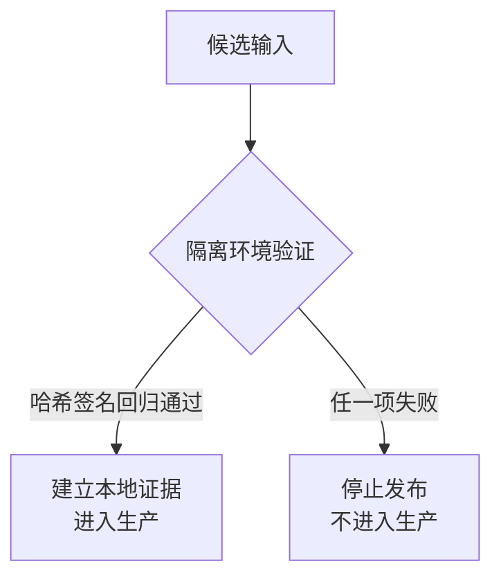

# 模型与数据供应链需要可验证来源

它解决的是“下载成功”被误认为“来源可信、内容未被替换、许可证可用”的问题。核心做法是把模型、tokenizer、数据、容器、驱动和插件绑定发布者、版本、hash、许可证和构建证明，再在隔离环境做行为与安全回归；最小实验是替换一个权重或加载脚本，确认哈希/签名门禁能阻止发布。
模型权重、tokenizer、adapter、embedding、数据集、容器、CUDA/驱动、插件和工具包都可能被替换、投毒或带来许可证风险。下载成功不等于来源可信，仓库热度也不等于可复现和可维护。

## 供应链身份

每个输入记录发布组织、仓库/版本、校验和、许可证、依赖、构建方式、训练数据声明、已知限制和获取时间。产物要能追溯到源码、配置和构建环境；签名/证明验证失败时停止发布，不能以“镜像内容看起来一样”替代。

## AI 特有风险

- 恶意或污染的微调数据改变拒答、工具和隐私行为。
- 量化、LoRA、合并权重和转换脚本可能引入后门或数值回归。
- 模型仓库中的自定义代码、pickle/序列化和插件可能在加载时执行。
- 训练/评测数据许可证、个人信息和版权声明不能由模型卡片自动证明。

## 门禁

门禁下载在隔离环境完成；优先安全序列化格式和只读加载；扫描依赖、镜像、权重哈希和许可证；运行静态、行为、安全、泄露和越权回归。供应商或社区发布只提供候选输入，进入生产前必须建立本地可验证证据。格式层的下钻——为什么 pickle 基格式的风险无法靠扫描修复、safetensors 如何按设计消除攻击面——见 [[工程知识/AI 系统工程：从模型能力到生产能力/安全与治理/模型权重文件是可执行输入：从 pickle 信任模型到格式即边界]]。



## 一个字节的差距

"看起来一样"与"确实一样"之间的差别可以小到一个比特。下面这段对 11000 字节的权重文件翻转第 7 个字节，文件长度完全不变：

```python
import hashlib, json

LOCK = {"weights.bin": "<发布时登记的 sha256>"}

def gate(path):
    actual = hashlib.sha256(open(path, "rb").read()).hexdigest()
    return actual == LOCK["weights.bin"]
```

实测结果：

| 情形 | 文件大小 | 改动字节 | 门禁 |
| --- | --- | --- | --- |
| 原始权重 | 11000 | 0 | 放行 |
| 翻转第 7 字节 | 11000 | 1 | **拦截** |
| 回滚原始 | 11000 | 0 | 放行 |

改动量是 1/11000，文件大小、目录列表、下载耗时全部一致，只有哈希不同。这就是为什么"镜像内容看起来一样"不能作为放行依据——人眼和 `ls` 都看不见这个差别，而它足以改变模型行为。

反过来，哈希通过也不等于安全：它只证明**与登记时一致**，不证明登记的那份本身无害。哈希是完整性检查，不是善意的证明，两者必须由签名/构建证明与行为回归分别覆盖。

## 失效长什么样

[[工程知识/缺陷分析：从个案到体系/安全/案例五：安全两例——认证绕过与带漏洞依赖]] 里，带漏洞的依赖通过正常的依赖解析进入构建——它没有被"替换"，它就是被声明的那个版本。这类风险绕过了完整性检查，因为内容确实与来源一致，问题出在来源本身的选择上。

[[工程知识/缺陷分析：从个案到体系/安全/案例二十六：公告栏没查门禁——Redis 的 ACL 键名泄露与解析崩溃]] 展示了另一个断点：凭据与键名在错误信息里被完整暴露。供应链门禁管的是"进来的是什么"，而事故后处理往往卡在"已经泄露出去的怎么收回"——撤销缓存和凭据比撤回一个文件困难得多。

## 边界

这套门禁的前提是**存在可信的登记基准**。以下情况它会失效：首次引入某个来源时无基准可比对（此时只能依赖签名与发布者信誉，属于候选输入而非已验证输入）；来源方自身被入侵并发布了带后门的"官方"版本（哈希一致但内容恶意，需行为回归兜底）；以及量化、合并、转换等二次加工产物——它们的哈希必然与上游不同，必须重新登记而非沿用上游基准。

许可证与训练数据声明不能由哈希证明，也不能由模型卡片自动证明。它们属于声明性事实，需要人工审阅与法律判断。

## 验证

验证的锚点：来源可信度要与哈希门禁对账——预写替换一个权重或加载脚本后发布应被拦下，实测能发布出去，与预期对不上，说明门禁没有绑到产物本身。

- 替换一个权重或加载脚本，确认哈希/签名门禁能阻止发布（上面的单字节实验即最小版本）。
- 检查量化、LoRA、合并产物的哈希是否被重新登记，而不是沿用上游基准。
- 加载阶段验证是否禁用 pickle 反序列化、是否只读挂载。
- 事故演练：冻结版本指针后，确认 embedding、缓存、索引等下游状态能够定位并撤销。

## 事故后处理

发现来源撤回、漏洞或权重异常时，冻结版本指针，定位受影响的模型/数据/镜像/索引，撤销缓存和凭据，回滚到已验证组合，并保留审计记录。不要只替换模型文件而忽略由其生成的 embedding、缓存和下游状态。

关系：[[工程知识/AI 系统工程：从模型能力到生产能力/数据与MLOps/模型发布需要注册、灰度与回滚]] · [[工程知识/软件构建：让变化可以理解、验证与交付/测试与交付/发布门禁必须绑定真实证据]]

## 机制与本质

模型与数据供应链的机制层：权重、分词器、数据与容器的字节内容决定加载之后的行为，而下载成功只说明传输完成。哈希与签名证明内容与其登记值一致，行为回归证明登记的那一份在功能上符合预期，两者覆盖的风险各不相同；量化与合并之后哈希必然变化，需要重新登记而不能沿用上游基准。

## 要解决的问题

下载完成、校验文件存在、版本号看起来正确，这三点都不足以说明来源可信、内容未被替换、许可证允许当前用法。本篇回答：模型、分词器、数据、容器、驱动与插件的可信依据是什么、哈希与签名在哪一步生效、隔离环境要做哪些回归，以及缺证据时怎样阻止发布。
