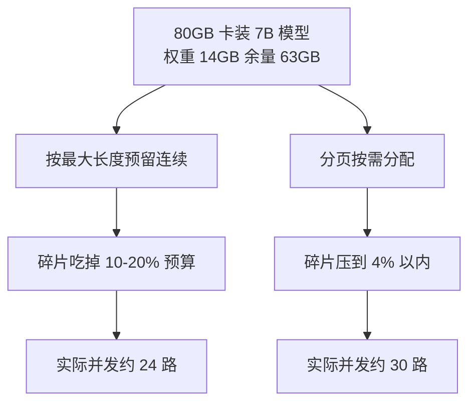

# GPU显存管理决定服务容量上限

推理服务吞吐上不去，查 CPU 没满、查网络没满——瓶颈在显存：模型权重、KV 缓存、激活值三分天下，谁的预算超了服务就 OOM 或排队。要解决的问题：GPU 服务容量由显存预算的分配决定，与 CPU 服务的容量模型完全不同（[[工程知识/AI 系统工程：从模型能力到生产能力/推理服务与平台/推理服务的核心矛盾是延迟、吞吐、显存与质量]] 讲矛盾，本文聚焦显存这一侧的机制）。

## 显存预算三分法

| 占用 | 随什么变 | 压缩手段 |
| --- | --- | --- |
| 模型权重 | 模型规模×精度 | 量化（FP16→INT8→INT4），精度损失换容量 |
| KV 缓存 | 并发序列数×序列长度×层数 | PagedAttention 分页、前缀缓存复用 |
| 激活/临时 | batch×序列长度×宽度 | 激活重算（换算力保显存） |

容量上限的推导：可用 KV 预算 = 总显存 − 权重 − 激活预留；最大并发序列数 = KV 预算 ÷ 单序列 KV 占用。这个除法决定了同一张卡 INT8 量化后能多服务多少并发——不是"快了多少"，是"装得下多少"。

## PagedAttention 与碎片

传统 KV 缓存按最大序列长度预留连续显存，内部碎片 + 外部碎片吃掉 60-80% 预算。PagedAttention（vLLM 系）把 KV 缓存分页化管理，如 OS 虚拟内存的分页：序列按逻辑页映射到物理页框，碎片压缩到页内。容量提升数倍的本质是把碎片预算还给了并发。分页机制的祖先正是 [[工程知识/性能工程：从用户等待到资源瓶颈/操作系统与运行时/虚拟内存与文件系统把地址和持久化分层]]。

同一张 80GB 卡、同一个 7B 模型，两种显存分配策略各走一条链，容量上限的差距就出在碎片这一项。



碎片的去向决定并发的上限：两条链只差碎片一项，并发差出四分之一——权重是常数、KV 是预算，工程上能收回的只有碎片。分页机制的块表怎么映射，见 [[工程知识/AI 系统工程：从模型能力到生产能力/推理服务与平台/批处理、KV缓存、量化与并行如何改变服务容量]]。

## 可运行示例：一份显存预算表现场算

给定模型与卡，显存去哪儿了一步步算清：

```text
模型：7B fp16，卡：A100 80GB，目标：最大并发

权重：7e9 × 2 字节 = 14 GB
激活（batch=1，4096 上下文）：约 2-3 GB
KV cache：2 × 层数 × 头数 × 头维度 × 上下文 × 2 字节
        = 2 × 32 × 32 × 128 × 4096 × 2 = 2.1 GB / 请求
可用余量：80 − 14 − 3 = 63 GB → 理论并发 63 / 2.1 ≈ 30 路

碎片与预留（PyTorch caching allocator 的常态损耗 10-20%）：
  实际可用 ≈ 50 GB → 实际并发 ≈ 24 路
  PagedAttention 把 KV cache 按块（16 token/块）分配，碎片压到 <4%
  → 同卡并发回到 ≈ 30 路，容量提升 25%
```

跑一遍的收获：显存预算表的三个变量（权重、KV、碎片）里，权重是常数、KV 随上下文线性涨、碎片是工程可消除项——vLLM 类系统的容量优势就是把第三项收回来。量化工作坊（吞吐随 batch 先升后平、P99 随 batch 单调升）的完整流程见 [[工程知识/AI 系统工程：从模型能力到生产能力/推理服务与平台/批处理、KV缓存、量化与并行如何改变服务容量]]。

## 量化锚点与案例回流

数字的敏感度账：上下文从 4K 涨到 32K（8 倍），单请求 KV 从 2.1GB 涨到 16.8GB——长上下文服务的并发上限几乎完全由 KV 预算决定，GQA（分组查询注意力）把 KV 压 4-8 倍、量化 KV（fp8）再压 2 倍，两者是长上下文服务化的标配而非优化项。溢出的行为形态：显存耗尽不是报错是排队（队列堆积 → P99 爆炸），监控要先看显存水位再看延迟。案例衔接：[[工程知识/缺陷分析：从个案到体系/资源与容量/案例六：容量与泄漏——连接泄漏和 SST 堆积]] 的泄漏形态学在 GPU 域同构——KV cache 只增不减（会话未释放）、碎片缓慢累积，都是"该回落的水位不回落"，诊断信号都是趋势图上的阶梯。

## 验证

验证的锚点：容量预算要与压测结果对账——预写按公式推算的最大并发与实测到达的并发偏差在百分之二十以内，偏差与预期对不上就要回去找漏项。

- 显存水位监控：权重/KV/激活分项占用（nvidia-smi + 引擎指标），水位满 80% 报警——不是总显存,是 KV 水位（最灵活的预算）。
- 容量推导验证：按公式预估最大并发，压测实测到达的最大并发，两者偏差 <20% 说明预算模型准；偏差大找漏项（CUDA context、网络缓冲）。
- 量化影响的双指标验证：容量增益（并发上限提升）与质量损失（评测集分数下降）同报，只报容量不报质量是自欺。

## 边界

- 显存容量与延迟的纠缠：batch 大摊薄单 token 算力成本但排队延迟上升，容量与延迟的 Pareto 前沿要一起看，见 [[工程知识/AI 系统工程：从模型能力到生产能力/推理服务与平台/批处理、KV缓存、量化与并行如何改变服务容量]]。
- 分布式推理的显存账本：张量并行切分权重、流水线并行切层，每卡显存预算重新分配，跨卡通信（NVLink/PCIe）成为新约束（[[工程知识/AI 系统工程：从模型能力到生产能力/推理服务与平台/Prefill与Decode决定LLM服务如何调度]]）。
- 训练与推理的显存管理是两套：梯度、优化器状态、激活检查点构成训练侧预算，本文只覆盖推理。

## 相关

- [[工程知识/AI 系统工程：从模型能力到生产能力/推理服务与平台/推理服务的核心矛盾是延迟、吞吐、显存与质量]]：矛盾全景，本文聚焦显存维度
- [[工程知识/性能工程：从用户等待到资源瓶颈/处理器与内存/GPU性能取决于计算、访存、并行与通信]]：GPU 性能的通用机制，显存是其中访存侧在推理场景的特化
- [[工程知识/后端系统：在并发、失败与变化中维持服务/基础设施/容量规划与压测要用同一个负载模型说话]]：容量规划的通用方法，显存预算是其 GPU 实例
