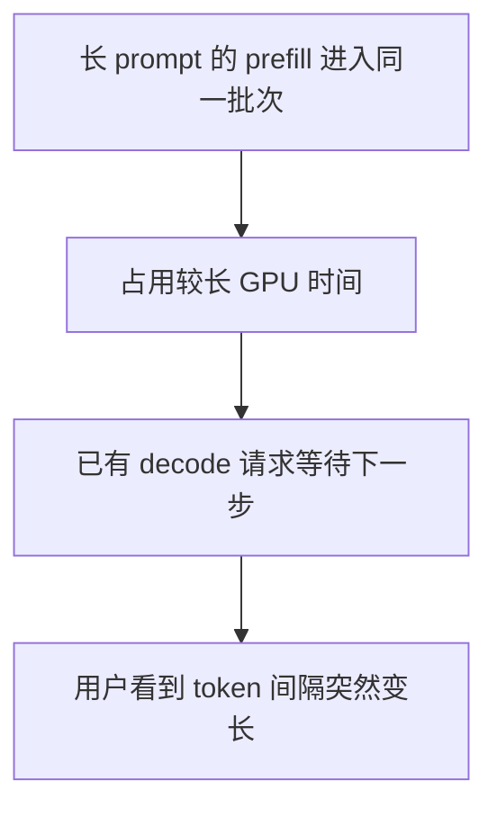

# Prefill 与 Decode 决定 LLM 服务如何调度

Prefill 处理输入上下文，计算密集且可以批量；Decode 逐 token 生成，反复读取权重和 KV cache，更容易受带宽、显存和调度影响。把两者混在一个队列会让长输入阻塞交互请求，所以调度必须用 TTFT、ITL、token 预算和 KV 占用共同决策。
生成一个响应包含两个不同阶段。Prefill 一次处理输入序列并建立 KV cache，通常具有较高并行度和计算压力；decode 每一步只生成少量 token，却要反复读取已有 KV cache，往往更受显存带宽和调度开销约束。

## 两个阶段为何互相干扰



反过来，如果调度器永远优先 decode，新的长输入可能长期拿不到 prefill 机会，TTFT 恶化。因此调度目标不是简单“填满 GPU”，而是在首 token 和连续输出之间分配有限时间、显存与批次位置。

## 连续批处理与分块 prefill

传统静态批处理等整批请求结束后再换批，短请求会被长请求拖住。连续批处理在序列完成时立即替换新序列，使批次随 decode 步动态变化。

分块 prefill 将长输入切分，在同一调度周期内与 decode token 交错。它可以降低长 prompt 对 ITL 的阻塞，但会增加调度复杂度，chunk 大小也会改变 TTFT、吞吐和 kernel 效率。合理参数必须由真实长度分布和 SLO 决定。

## 是否分离 prefill 与 decode

将两个阶段放到独立 worker 池，可以分别扩缩、选择并行策略，并隔离长 prefill 对 decode 的干扰。但 KV cache 必须从 prefill worker 高效传给 decode worker，新增网络、序列化、路由、故障和容量规划成本。

适合考虑分离的条件：

- 输入很长且长度差异大，prefill 明显破坏 ITL；
- prefill 与 decode 需要不同并行度或硬件配置；
- KV 传输足够快，收益大于跨节点开销；
- 流量规模足以让两个池都保持合理利用率。

流量小、请求短或互联慢时，共置通常更简单。分离是针对已测得干扰的架构选择，不是成熟度标签。

## 调度必须显式处理

| 问题 | 需要的策略 |
| --- | --- |
| 请求长度差异 | token 预算、分块 prefill、长度感知队列 |
| 优先级 | 配额与老化，避免低优先级永久饥饿 |
| KV cache 不足 | 拒绝/排队、抢占、换出或重算，并记录代价 |
| 多租户 | 并发、token、费用和显存预算按租户隔离 |
| 超时与取消 | deadline 传播，及时释放队列位置和 KV 块 |
| 流式输出 | 发送背压不能无限占住 decode 状态 |

验证的锚点：调度器的假设要与实测对账——prefill 与 decode 分离的收益建立在两阶段资源画像可分别描述的前提上，批处理前后各测一次两阶段延迟，对不上的配置回退联合批处理。

## 验证方法

用短输入短输出、长输入短输出、短输入长输出、长输入长输出四个象限测试；再混合成真实到达分布。分别比较 TTFT、ITL、吞吐、KV 使用、抢占/重算次数和各优先级等待时间。单一固定长度 benchmark 无法证明调度器在生产流量下有效。

相关：[[工程知识/AI 系统工程：从模型能力到生产能力/推理服务与平台/推理服务的核心矛盾是延迟、吞吐、显存与质量]] · [[工程知识/后端系统：在并发、失败与变化中维持服务/任务与并发/调度必须同时处理优先级、公平与背压]]

## 可运行示例与量化锚点：两阶段调度的账

```python
# 两阶段的资源画像（7B 模型、A100，公开量级）

# Prefill：一次性吃 N 个输入 token（并行）
#   算术强度高（大矩阵乘）→ 计算受限，GPU 利用率可达 70%+
#   延迟：1000 token 输入 ≈ 100-200ms（可并行摊薄）

# Decode：一次只出一个 token（串行）
#   每步读全部权重、只算一个 token → 算术强度极低 → 访存受限
#   延迟：每 token 20-30ms（被带宽限速，GPU 利用率常 <30%）
#   1000 token 输出 = 1000 步 × 25ms ≈ 25 秒 ← 对话延迟的主体

# 调度的账：一个长 Prefill 混在 Decode 流里
#   200ms 的 Prefill 期间，所有在 Decode 的会话停摆（算力被抢）
#   → 在线会话 TTFT（首 token 延迟）与 ITL（逐 token 间隔）双双毛刺
#   解法：分池调度（Prefill 池与 Decode 池分开，池间传 KV cache）
#   或 chunked prefill（长 Prefill 切成 128-token 块，与 Decode 交错）
```

案例回流：两阶段混部的实录——客服系统高峰期所有会话逐字变卡（ITL 从 25ms 涨到 200ms+），监控显示 GPU 利用率却很高（Prefill 抢走了算力，看起来"很忙"），分池后 ITL 回到稳定 25ms、Prefill 池按上传流量独立扩容；利用率指标在这里会撒谎，要看的是分阶段延迟。批处理对两阶段的相反效应见 [[工程知识/AI 系统工程：从模型能力到生产能力/推理服务与平台/GPU显存管理决定服务容量上限.md]] 的 KV 账与 [[工程知识/AI 系统工程：从模型能力到生产能力/推理服务与平台/批处理、KV缓存、量化与并行如何改变服务容量.md]] 的吞吐账——三本账（显存、批处理、两阶段）合起来才是完整的容量模型。

## 边界

- 两个阶段无法彻底解耦：decode 依赖 prefill 建好的 KV cache，分离部署只是把依赖换成一次网络传输，传输带宽不足时收益转为负。
- 分块 prefill 的收益与输入长度分布绑定：请求长度接近且都短时，分块引入的调度开销大于它缓解的阻塞。
- 连续批处理改变批次组成，但单次 decode 的 kernel 效率随批次碎片化下降，吞吐与延迟的取舍需要按真实长度分布实测。
- 调度策略不能弥补显存不足：KV cache 超出容量时只能抢占、换出或重算，这些动作本身产生延迟尖峰，属于容量问题。
- 优先级机制需要老化条件：只按固定优先级排序时，低优先级请求长期得不到调度。

## 要解决的问题

用户看到 token 间隔突然拉长，或新请求长时间等不到首 token，而 GPU 利用率并不低，这类现象出在调度层而非模型层。本篇回答：prefill 与 decode 各自受什么资源限制、长输入为什么阻塞正在进行中的输出、什么时候值得把两个阶段分开部署，以及调度器必须显式处理哪些请求属性。

