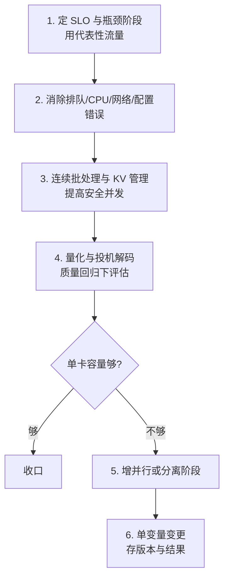

# 批处理、KV 缓存、量化与并行如何改变服务容量

推理优化的手段很多（批处理、KV cache、量化、并行、编译、投机解码），但**只记住技术名词会得到"显存下降但吞吐没变"或"吞吐提高但交互延迟失控"的结果**。

正确做法是按"它改变了哪个资源"来理解每种手段。而要知道哪个资源是瓶颈，必须先看清一个事实：**同一个模型，在"少量长上下文请求"和"大量短请求"下，瓶颈完全不同。**

- 长请求：先耗尽 **prefill 计算** 和 **KV cache 显存**
- 短请求：更容易受 **decode 带宽**、调度和排队影响

所以每次优化都必须同时测量 **TTFT**（首 token 延迟）、**ITL**（token 间隔）、吞吐、显存和任务质量——只看其中一个会得出错误结论。

## 背景（要解决的问题）：为什么 8 卡只跑出 20 QPS——容量机制

一个团队用 8 张 A100 部署 70B 模型，预期几百 QPS，实测只有 **20 QPS**，而且：

- 显存占用很高（80GB 快满了），但 **GPU 利用率只有 30%**
- 长请求（8K 上下文）时更慢，而且**并发一高就 OOM**

三个原因叠加：

| 现象 | 真因 |
| --- | --- |
| 显存满但利用率低 | **KV cache 预分配过大**（按最大长度预留，实际用不满） |
| 长请求慢 | **prefill 是计算密集**，8K token 的 prefill 要好几秒 |
| 并发上不去 | 显存被 KV cache 占满，**没有空间给新的并发请求** |

**关键认知**：瓶颈在**显存管理方式**与**缺少连续批处理**，算力本身有余。换成 vLLM（PagedAttention + 连续批处理）后，同样的 8 卡跑到了 **150 QPS**。

## 先画资源账本

| 资源 | 主要消费者 | 常见优化 |
| --- | --- | --- |
| GPU 显存容量 | 权重、KV cache、激活、工作区 | 权重量化、KV 量化、分页、并行切分 |
| GPU 计算 | 矩阵乘、attention、采样 | 批处理、融合 kernel、编译、speculative decoding |
| 显存带宽 | decode 读取权重和 KV | 量化、布局优化、更大有效 batch |
| GPU 互联 | 张量/流水线并行、KV 传输 | 拓扑感知放置、减少通信、重叠通信计算 |
| CPU | tokenization、调度、采样、序列化 | 并行 tokenizer、批量处理、定位热点 |
| 网络 | 请求、流式 token、跨节点 KV | 共置、压缩、连接复用、背压 |

## KV cache 为什么成为核心状态

自回归生成若每步重新计算全部历史，成本极高。KV cache 保存各层历史 token 的 key/value，使 decode 复用此前计算。代价是显存占用随并发、上下文长度、层数和表示精度增长。

### KV cache 到底占多少：能算出来

这个公式非常实用，**部署前一定要算一遍**：

```
每个 token 的 KV 显存 = 2 (K 和 V) × 层数 × KV头数 × 单头维度 × 字节数
```

**算例**（Llama-3-70B 级别，FP16）：

```
2 × 80 层 × 8 KV头 × 128 维 × 2 字节 = 327,680 字节 ≈ 0.32 MB / token
```

**那么**：

| 上下文长度 | 单请求 KV cache |
| --- | --- |
| 2K | 0.64 GB |
| 8K | 2.6 GB |
| 32K | 10.5 GB |
| 128K | 42 GB |

**结论**：

- 一张 80GB 的 A100，减去权重（70B × 2 字节 = 140GB，需要多卡）后，**KV cache 能支撑的并发非常有限**
- 128K 上下文的单个请求就要 42GB —— **这就是为什么长上下文服务昂贵**
- **降低 KV 精度（FP8）能直接减半**，这是 KV 量化价值巨大的原因

**实操建议**：用上面的公式算出你的模型在目标上下文长度下的 KV 占用，再乘以期望并发，就知道需要多少卡。**别拍脑袋估。**

### PagedAttention：改变的是内存管理

传统做法：为每个请求**预留**最大长度的连续显存 → 大量浪费（预留 8K 但只用了 500 token）。

PagedAttention 把 KV cache 切成**小块**（类似操作系统的分页），按需分配，块之间不必连续：

| 请求 | 占用的块 |
| --- | --- |
| 请求 A | 块 1、块 2、块 7（非连续） |
| 请求 B | 块 3 |

"块之间不必连续"靠一张块表实现：请求看到自己的逻辑块永远连续，块表把每个逻辑块翻译到 GPU 显存里任意位置的物理块，新块用满才分配下一个。


左列是请求 A 的逻辑 KV 块（token 顺序连续），中间 Block Table 记录每个逻辑块映射的物理块号与已填槽数，右列是 GPU 显存里的物理块池——逻辑块 0/1/2 分别散落在物理块 7/1/3，生成新 token 时先填未满块的空槽，填满才从池里领新块。逻辑连续、物理分散，预留浪费从此不存在。图取自 [Efficient Memory Management for Large Language Model Serving with PagedAttention（arXiv:2309.06180）](https://arxiv.org/abs/2309.06180) 论文 Figure 6。

**收益**：

- 显存浪费从 60-80% 降到 **不到 4%**（vLLM 论文实测）
- 支持的并发数提升 **2-4 倍**（同上，论文同负载对照实测）
- 支持**前缀共享**（多个请求共享相同的系统提示前缀）

**注意**：它改善的是**内存管理**，不改变 attention 对历史上下文的语义依赖。

**前缀缓存的坑**：token 序列**完全匹配**才命中，前缀差一个字符就当新请求处理。多租户场景要按租户隔离前缀缓存，A 租户的请求命中 B 租户的前缀属于数据越权。

## 量化不是一个开关

- **权重量化**降低模型权重容量与读取带宽，常见于 INT8、FP8、INT4 等表示。
- **激活量化**还会影响中间计算，需要硬件、kernel 和校准支持。
- **KV cache 量化**直接扩大可并发上下文，但可能影响长上下文输出质量。

量化收益由模型、硬件、kernel、batch 和序列长度共同决定。验收必须同时比较任务质量、TTFT、ITL、吞吐、显存和单位请求成本；“模型能加载”不是上线标准。

## 并行策略解决不同瓶颈

| 策略 | 做法 | 主要适用 | 代价 |
| --- | --- | --- | --- |
| 数据并行 | 多副本处理不同请求 | 单副本能装下，流量可分摊 | 每副本重复权重 |
| 张量并行 | 单层张量跨卡切分 | 单卡放不下或大批次 | 高频 collective 通信 |
| 流水线并行 | 不同层放不同设备 | 多节点超大模型 | pipeline bubble、调度复杂 |
| 专家并行 | MoE 专家分布到设备 | 稀疏 MoE | all-to-all、负载不均 |

优先使用能满足容量的最小并行度。跨卡越多不代表越快；互联拓扑、通信比例和小 batch 都可能让扩展效率下降。

## 编译、CUDA Graph 与算子融合

推理图相对稳定时，编译和算子融合可减少 Python、kernel launch 与中间读写开销；CUDA Graph 可重放固定形状的 GPU 工作，降低 CPU 发射开销。动态形状、频繁控制流和多种序列长度会降低复用率，因此运行时通常要做 shape 分桶或保留 eager fallback。

## 优化顺序



列表版（每步的判据）：

1. 用代表性流量确定 SLO 和瓶颈阶段。
2. 先消除明显的排队、CPU、网络和错误配置问题。
3. 用连续批处理和 KV 管理提高安全并发。
4. 在质量回归下评估量化和 speculative decoding。
5. 单卡无法满足容量时再增加并行或分离阶段。
6. 每次只改变一个主要变量，保存软硬件版本和完整结果。

## 优化边界

没有统一的“最佳配置”。量化可能改变质量，批处理可能牺牲交互延迟，并行可能被通信吞掉。有效性的判据：在目标负载、硬件和质量门槛下仍满足 SLO。

## 最小容量实验

固定模型、输入/输出 token 分布、GPU 和并发，建立单请求、静态 batch、连续 batch 三组基线。每组记录 TTFT、ITL、完成吞吐、KV cache 占用、显存、质量和单位请求成本；只切换一个变量，例如 paged KV 或 FP8。若显存下降但 p95、质量或错误率变差，结论应写成“容量换延迟/质量”，不能笼统写成优化成功。

相关：[[工程知识/性能工程：从用户等待到资源瓶颈/处理器与内存/GPU性能取决于计算、访存、并行与通信]] · [[工程知识/AI 系统工程：从模型能力到生产能力/质量与运营/Agent评测必须覆盖轨迹而不只看最终答案]] · [[工程知识/AI 系统工程：从模型能力到生产能力/推理服务与平台/GPU显存管理决定服务容量上限]]
- [[工程知识/AI 系统工程：从模型能力到生产能力/推理服务与平台/模型量化的精度经济学：位宽精度与显存的三角.md]] —— 量化与批处理的容量交互
- [[工程知识/AI 系统工程：从模型能力到生产能力/模型与上下文/KV缓存与上下文长度的显存账：为什么长上下文贵.md]] —— KV 缓存在容量模型中的位置
- [[工程知识/AI 系统工程：从模型能力到生产能力/推理服务与平台/推理批处理的两难：吞吐与延迟的调度天平.md]] —— 容量参数的交互全景

## 验证

1. 资源账本核对：对一套真实推理服务清点 KV cache 占用（按并发数 × 上下文长度 × 每 token 字节数），预期与 nvidia-smi 的显存占用对得上，差值即权重与激活。
2. 批处理档位：固定负载扫 batch size 档位，预期吞吐先升后平、延迟单调上升，记录拐点作为该服务的运行档位。
3. 断言锚点：容量结论有账本支撑、运行档位有实测拐点。

