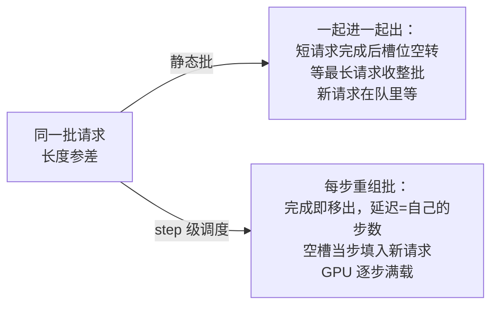

# 推理批处理的两难：吞吐与延迟的调度天平

## 要解决的问题

GPU 推理的单位成本随 batch 增大而摊薄（同一权重一次加载服务多请求），但延迟随 batch 增大而劣化：批内每请求要等其他请求的 token 一起出（批同步）。批处理的两难要解决的问题是：**在吞吐（成本）与延迟（体验）之间建立可推导的调度模型**，让“最大 batch”“最佳等待窗口”成为按 SLA 推导的参数，而不是拍脑袋的玄学。这是推理服务成本模型（见 [[工程知识/AI 系统工程：从模型能力到生产能力/推理服务与平台/推理服务的单位请求成本从token定价推出来.md]]）的调度侧支柱，排队论（见 [[工程知识/性能工程：从用户等待到资源瓶颈/观测与诊断/排队论给容量一个可推导的模型.md]]）的推理特化。

## 机制

**静态批处理与它的浪费**。请求攒齐一批一起进、一起出（batch 一起开始一起结束）：批内请求长度参差时，短请求等长请求（GPU 空转在 padding 上），批的整体时长由最长请求决定。静态批的吞吐上限受制于长度方差：方差越大浪费越大。padding 浪费的本质是“批的粒度固定”，请求间不能独立进出。

**continuous batching：让批的成员可独立进出**。vLLM/Orca 的核心改进：批是逻辑概念，物理上每步调度层重新组装——已完成请求移出、新请求填入（每步（iteration-level）重批）。批内不再一起开始一起结束，GPU 每 step 都满载。吞吐提升 2-8 倍（vLLM 论文），延迟波动收敛。代价：调度层复杂度（每步重批的开销）、内存管理压力（KV 按需分配，见 KV 缓存显存账（见 [[工程知识/AI 系统工程：从模型能力到生产能力/模型与上下文/KV缓存与上下文长度的显存账：为什么长上下文贵.md]]）的分页管理）。

**prefill 与 decode 的两段性**。长 prompt 的 prefill（并行处理全部输入 token）compute-bound、短 prompt 的 decode（逐 token 生成）memory-bound，两阶段算术强度相反。混布调度（prefill 与 decode 同 GPU）互相干扰：大 prefill 插队让正在 decode 的批全部延迟抖动。解耦（disaggregated prefill/decode，PD 分离）是趋势：两阶段分池部署，各按自己的负载画像调参。chunked prefill 是过渡方案：把大 prefill 切成块，与 decode 交错执行，平滑干扰。

**调度目标函数**。给延迟 SLA 定吞吐上限：P99 延迟约束下最大可接受 batch 与等待窗口，目标是最大化吞吐×SLA 内请求占比。参数谱：等待窗口（攒批等待，越长吞吐越高、TTFT 越差）、最大 batch（显存上限内）、优先级抢占（interactive 请求插队，batch 代价是批内其他请求的延迟）。这些参数与排队论的 M/M/c 模型（见排队论篇（上文链接））衔接：GPU 是 c 台服务器，请求到达 λ 与服务 μ 由 batch 参数决定。

## 背景与代价

思想背景：批处理与调度是 OS 与数据库的老问题，LLM 推理的特化点在**自回归的两段性**（prefill compute-bound 与 decode memory-bound）与 **KV 状态的粘性**（请求的生命周期内 KV 只增不减，见 KV 显存账（上文链接））。Orca（2022，OSDI）提出 iteration-level scheduling，vLLM（2023，PagedAttention）把它与分页 KV 结合成为事实标准。PD 分离（2024+，Mooncake/DeepSeek 类）把两阶段分成独立服务，是当下的工程前沿。

最精巧的一笔是**“批的粒度从请求级细化到 step 级”**。批大小从 32 降到 1，请求间的相互等待从“整个生成周期”降到“单个 step”。这一笔同时改变了吞吐与延迟的耦合方式：静态批的延迟 = 批内最长请求时间，continuous batching 的延迟 = 自己的 steps × step 时间 + 排队时间——后者可被调度优化（插队、优先级），前者只能认命。代价要摆明：每步重批不是免费的，调度开销随并发线性涨；P99 优化与吞吐优化在重负载下对立（预留头寸（headroom）给突发，吞吐损失 10-20% 是常态）；PD 分离引入跨机 KV 传输（新成本中心），不是所有规模都值得采用。容量规划要按负载画像（prompt 长度分布、生成长度分布、到达率）建模，见批处理与容量（见 [[工程知识/AI 系统工程：从模型能力到生产能力/推理服务与平台/批处理、KV缓存、量化与并行如何改变服务容量.md]]）。

同一批四个请求，两种调度下走两条路，天平的两端看结构最清楚。

静态批把相互等待锁在整个生成周期，continuous batching 把它压到单步——损耗从结构上消除，调度参数从此可推导。

## 边界

- **“最大 batch”没有普适值，只有负载画像下的 SLA 推导**。同参数在不同 prompt/生成长度分布下表现反转。上线路径：采集真实负载画像 → 排队模型推参数 → 灰度验证 P99 → 回归修正。文档默认值（vLLM 的 max_num_seqs 等）是起点不是终点。
- **TTFT 与 TPOT 是两个指标，优化方向可能相反**。TTFT（首 token 延迟）主要由 prefill 与排队决定，TPOT（每 token 间隔）主要由 batch 与 decode 决定。优化 TTFT（prefill 优先、小 batch）会劣化 TPOT（decode 挤压）。产品 SLA 要分别承诺，调参要分开对齐。
- **Chunked prefill 的块大小是干扰与吞吐的旋钮**。块小干扰少但 prefill 拖长（TTFT 劣化），块大反之。默认值（512/2048）来自通用负载，长 prompt 重负载要实测调优。
- **抢占与迁移的代价常被低估**。请求被抢占后 KV 要么丢弃（重算代价）要么换出（拷贝代价），两个都不是免费的。优先级调度在 KV 大（长上下文）时成本陡增，见 KV 显存账（上文链接）的换页思想。

## 验证

- **静态 vs continuous batching 对照**：长度方差的合成负载（如对数正态分布生成长度）在两种批处理下跑吞吐与 P99。预期：方差越大 continuous 优势越大（静态批的 padding 浪费与批间空隙被消除）。吞吐比随方差的曲线是机制证据。
- **TTFT/TPOT 分离观测**：真实负载下按请求长度分桶统计 TTFT 与 TPOT 分布，预期：TTFT 随 prompt 长度线性增长（prefill 主导）、TPOT 与长度弱相关（decode 每 step 同价）。两指标的不同形态是两段性的直接证据。
- **调度参数扫描**：等待窗口 0-100ms、max batch 64-512 扫描，绘制吞吐-P99 前沿曲线（Pareto frontier）。预期：前沿上无同时最优的点，SLA 约束下选切点。前沿曲线是“天平”的定量证据，也是容量承诺的依据。

## 相关

- [[工程知识/AI 系统工程：从模型能力到生产能力/推理服务与平台/推理服务的单位请求成本从token定价推出来.md]] —— 批处理在成本模型中的位置
- [[工程知识/性能工程：从用户等待到资源瓶颈/观测与诊断/排队论给容量一个可推导的模型.md]] —— 调度天平的通用理论
- [[工程知识/AI 系统工程：从模型能力到生产能力/推理服务与平台/批处理、KV缓存、量化与并行如何改变服务容量.md]] —— 容量参数的交互全景
- [[工程知识/AI 系统工程：从模型能力到生产能力/模型基础与训练/投机采样与推测解码：小模型带路大模型确认.md]] —— 吞吐侧优化的对偶
- [[工程知识/AI 系统工程：从模型能力到生产能力/模型基础与训练/MoE路由的工程问题：负载不均与显存碎片.md]] —— 批调度与专家负载的交互
