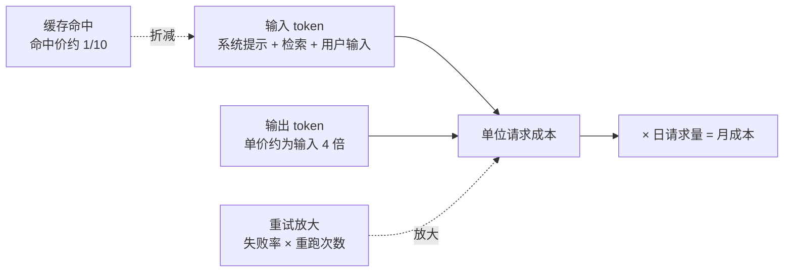
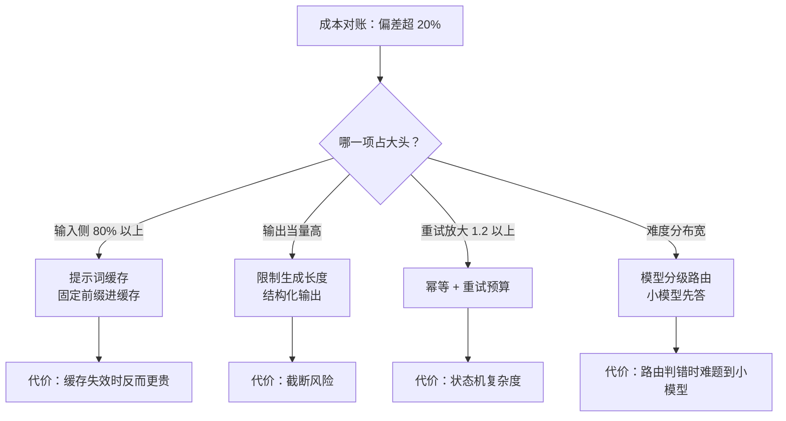

# 推理服务的单位请求成本从token定价推出来

模型 API 按 token 计价（如每百万输入 token 若干美元），但业务决策需要的是**单位请求成本**——处理一个用户请求花多少钱。两者之间隔着一组可推导的中间量：请求的 token 构成、命中缓存的比率、批处理效率、以及失败重试的放大系数。把这些量显式写出来，成本就从"看账单才知道"变成"上线前就能算"。



图中两条虚线是常被漏算的中间量：缓存命中折减输入侧，重试放大抬高总账，成本预测与账单对不上时先查这两处。

推导链是：`请求成本 = 输入 token × 单价 + 输出 token × 单价 + 请求级固定开销`，其中输入 token 又由固定部分（系统提示词）与可变部分（用户输入 + 检索上下文）构成。**系统提示词与检索上下文是成本的大头且常被忽视**：一个 2000 token 的系统提示词乘以每天百万次请求，就是 20 亿 token 的固定支出；检索带回 10 篇文档、每篇 800 token，单这一项就是 8000 token/请求。

## 成本构成表

| 构成 | 来源 | 可压手段 | 压缩代价 |
| --- | --- | --- | --- |
| 系统提示词 | 每请求固定 | 提示词缓存（prefix cache） | 缓存失效时反而更贵 |
| 检索上下文 | RAG 每请求可变 | 证据筛选、topk 调小 | 召回率下降 |
| 用户输入 | 不可控 | 上下文压缩 | 信息损失 |
| 输出 token | 任务决定 | 限制生成长度、结构化输出 | 截断风险 |
| 重试放大 | 失败重跑 | 幂等、超时治理 | 复杂度 |
| 无效调用 | 提示词错误、过度反思 | 缓存复用 | 一致性维护成本 |

批处理与并行的容量效应（见 [[工程知识/AI 系统工程：从模型能力到生产能力/推理服务与平台/批处理、KV缓存、量化与并行如何改变服务容量]]）在成本侧的体现：同一 GPU 上并发请求共享权重与 KV 缓存，利用率翻倍等于单位成本减半——所以"每 token 单价"也依赖负载形态，低并发时段的真实单价更高。

## 三个实用的推导

**盈亏估算**：给定每次请求平均输入 4000 token（提示词 2000 + 检索 1500 + 用户 500）、输出 500 token，按公开定价表算出单请求成本，乘以预估日请求量得到月成本。这一步的价值是把"用得起吗"从印象变成数字，且能看到**哪一项占大头**——通常输入侧占 80% 以上，优化精力就该投在检索筛选与提示词缓存上，而非纠结输出长度。

**重试放大系数**：失败率 5% 且全量重试，平均成本乘 1.05 看似温和，但重试常发生在长请求上（超时引发重试），实际放大可到 1.2。重试治理与成本是同一件事，治理方法见 [[工程知识/AI 系统工程：从模型能力到生产能力/质量与运营/成本控制要从上下文和重试两头下手]]。

**模型分级的成本杠杆**：任务按难度路由到不同定价的模型（简单分类用小模型、复杂推理用大模型），是最大的成本杠杆之一，通常能把总成本压到几分之一。路由判据本身会错，错的代价是难题到了小模型——所以路由要有升级机制（小模型置信度低时升级），这与"模型提出候选，系统定义正确性"的分工一致（见 [[工程知识/AI 系统工程：从模型能力到生产能力/模型与上下文/模型提出候选，系统定义正确性]]）。

三个推导合到一张图上，成本超标时的处置顺序一目了然：先看账确定大头在哪一侧，再选对应的杠杆，同时把每个杠杆的代价记在案，压成本的改动与质量监控同步上线：



## 边界

成本模型的前提是**定价与用量可测**：自托管模型没有 token 单价，要换算成"GPU 小时 × 利用率"口径（见 [[工程知识/AI 系统工程：从模型能力到生产能力/推理服务与平台/推理服务的核心矛盾是延迟、吞吐、显存与质量]] 的容量矛盾）。换算的中间量是单位卡时的吞吐：一张卡每小时成本除以该负载形态下的每秒输出 token 数，得到每百万 token 的硬件成本，再与 API 定价对比，得出的差值就是自托管的盈亏线，显存管理与大分块批处理决定这条线的高低（见 [[工程知识/AI 系统工程：从模型能力到生产能力/推理服务与平台/GPU显存管理决定服务容量上限]]）。API 侧则受定价调整影响，成本模型要标 change_rate 并定期对账账单——预测值与账单偏差超过 20% 说明某个中间量估错了（通常是重试或缓存命中率）。

成本不是唯一目标：把检索上下文压到极限伤召回（见 [[工程知识/AI 系统工程：从模型能力到生产能力/知识与检索/RAG的核心是选择可引用证据]]），把输出限制到极短伤质量。成本优化的停止条件是"下一块钱的优化要付出超过一块钱的质量代价"，这个判据与通用性能优化的调优循环同构（见 [[工程知识/性能工程：从用户等待到资源瓶颈/性能工程：从用户等待到资源瓶颈]]）。

## 验证

验证的锚点：成本公式要与账单对账——预写日志统计的真实 token 用量代入公式后的推算值，与账单核对不上的部分就是假设漏掉的地方。

对线上服务做一次成本对账：从日志统计真实平均输入/输出 token、缓存命中率、重试率，代入成本公式，与账单对比。偏差来源通常有三：日志里没记 token 用量（先补观测）、缓存命中率与假设不符、长尾请求被平均掩盖。token 用量的观测点要埋在调用层，靠推测得不出这个数。

最小验证：同一任务用两种上下文长度（全量检索 vs 筛选后 top3）各跑 100 请求，对比成本与质量指标（答案准确率或人工抽检），确认筛选在省钱的同没伤质量。

## 要解决的问题

模型按 token 定价，而业务决策需要的是处理一个用户请求花多少钱，两者之间隔着请求的 token 构成、缓存命中比率、批处理效率与重试放大系数。本篇回答：这些中间量各自怎样得到、单位请求成本怎样从 token 单价推导出来、预测值与账单出现偏差时先查哪里，以及成本优化的停止条件是什么。

## 可运行示例与案例回流：成本的账

```text
一次请求成本的推演账（通用形态，以公开 token 定价口径）：

  输入 2000 token、输出 300 token，输出单价约为输入的 4 倍：
    成本 ∝ 2000×1 + 300×4 = 3200 个"输入当量 token"
    → 输出 token 少 100 个，等价于输入砍 400 个（输出是成本大头）
  缓存命中的账：系统提示词 1500 token 可缓存，命中价约为原价 1/10
    → 高频固定前缀进缓存，单请求成本降 40%
  显存摊销的账：一张卡每小时成本固定，吞吐翻倍 = 单请求硬件成本减半
    batch 与 KV 显存管理决定吞吐 → 成本优化与容量优化是同一件事
  重试的账：失败率 5% 重试一次 → 成本乘 1.05；重试风暴时成本无上限
```

案例回流：只压输入不压输出的实录——团队花两周精简提示词省 20% 输入 token，实际成本只降 6%（输出 token 才是大头，且输出长度由温度与指令宽松度决定）；同时收紧输出上限与结构化输出后总成本降 28%。缓存漏配的实录——每次请求把用户历史拼进前缀，缓存命中率归零（前缀必须完全一致才命中）；固定前缀与动态内容分层后命中 70%。重试无预算的实录——上游超时配置过短，1% 请求放大成 4 次重试，月账单多出 18%；重试带预算与退避（与成本账联动）。token 两头的省钱纪律见 [[工程知识/AI 系统工程：从模型能力到生产能力/质量与运营/成本控制要从上下文和重试两头下手.md]]、吞吐与显存的容量账见 [[工程知识/AI 系统工程：从模型能力到生产能力/推理服务与平台/GPU显存管理决定服务容量上限.md]]、结果复用见 [[工程知识/AI 系统工程：从模型能力到生产能力/质量与运营/Agent的缓存与结果复用.md]]。

## 相关

关系：[[工程知识/AI 系统工程：从模型能力到生产能力/推理服务与平台/批处理、KV缓存、量化与并行如何改变服务容量]] · [[工程知识/AI 系统工程：从模型能力到生产能力/质量与运营/成本控制要从上下文和重试两头下手]] · [[工程知识/AI 系统工程：从模型能力到生产能力/模型与上下文/模型提出候选，系统定义正确性]]

- [[工程知识/AI 系统工程：从模型能力到生产能力/推理服务与平台/推理服务的核心矛盾是延迟、吞吐、显存与质量]] —— 自托管口径的容量矛盾
- [[工程知识/AI 系统工程：从模型能力到生产能力/质量与运营/Agent的缓存与结果复用]] —— 固定开销的另一条压缩路径
- [[工程知识/性能工程：从用户等待到资源瓶颈/性能工程：从用户等待到资源瓶颈]] —— 成本优化的停止判据（调优循环）
- [[工程知识/AI 系统工程：从模型能力到生产能力/数据与MLOps/模型发布需要注册、灰度与回滚]] —— 成本敏感的模型切换如何安全上线
- [[工程知识/AI 系统工程：从模型能力到生产能力/推理服务与平台/模型量化的精度经济学：位宽精度与显存的三角.md]] —— 量化在成本模型中的杠杆位置
- [[工程知识/AI 系统工程：从模型能力到生产能力/推理服务与平台/推理批处理的两难：吞吐与延迟的调度天平.md]] —— 调度天平在成本模型中的位置
- [[工程知识/AI 系统工程：从模型能力到生产能力/模型基础与训练/MoE路由的工程问题：负载不均与显存碎片.md]] —— MoE 在成本模型中的架构侧
- [[工程知识/AI 系统工程：从模型能力到生产能力/推理服务与平台/模型路由与级联：小模型过滤大模型兜底的省钱结构.md]] —— 路由在成本模型中的位置
