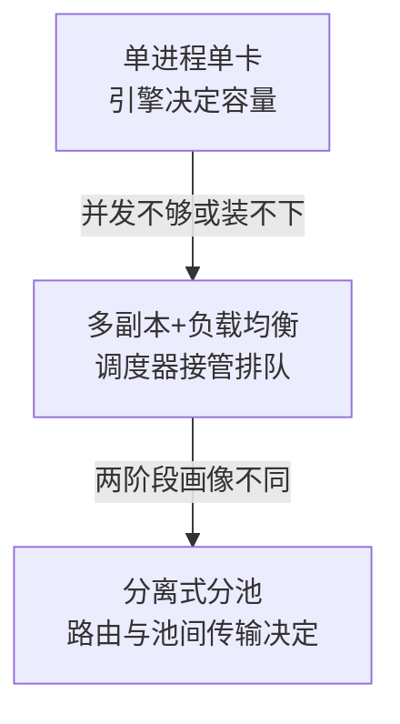

# 模型服务架构从单进程到分布式副本

扩展模型服务解决的是单卡容量、并发或故障域不足，但每增加副本、并行或节点都会增加路由、权重加载、通信和恢复状态。最小实验是固定输入/输出分布，逐层比较单进程、多副本和跨节点的 TTFT、ITL、吞吐、冷启动与故障恢复。
模型服务的扩展顺序通常是：单进程单卡、单机多卡、多个副本、跨节点路由与分离式服务。每增加一层，就增加调度、通信、版本、故障和观测边界；"能启动多个 Pod"不等于模型服务已经具备可预测容量。

三级演进的每一步都在换掉旧的约束，同时把决定容量与恢复的实际组件上移一级。



阶梯爬得越高，容量与恢复的决定者离推理引擎越远，下一节的四层职责表就是这条上移的分工结果。

## 四层职责

| 层 | 负责 | 不负责 |
| --- | --- | --- |
| 推理引擎 | batch、KV cache、kernel、解码和模型执行 | 多租户业务权限、全局流量和发布 |
| 副本/服务框架 | 放置、路由、扩缩、队列和健康 | 修复单实例显存或 kernel 瓶颈 |
| 集群调度 | GPU/CPU 资源、拓扑、重启和节点 | token 级 SLO、模型质量和业务状态 |
| AI 平台 | 注册、评测、灰度、成本、审计和回滚 | 代替底层运行时实际执行 |

## 关键架构选择

- **副本扩展**：隔离故障、容易理解，成本是模型显存的整数倍和冷启动。
- **张量/流水线并行**：让单个模型跨卡，但引入 collective 通信和拓扑约束。
- **prefill/decode 分离**：分别优化输入处理和生成，代价是 KV 传输、两个池的容量匹配和恢复复杂度。
- **多模型/LoRA 复用**：减少重复基座，代价是加载抖动、缓存淘汰和租户隔离。

## 容量与故障

路由按请求数做均衡不够，还要考虑输入/输出 token、KV cache、优先级、租户和正在生成的序列。副本扩缩必须处理预热、权重下载、缓存恢复、排空、取消、重试和重复输出。健康检查只能说明进程响应；模型是否加载、队列是否超限、质量是否退化需要独立信号。

## 量化锚点：副本与批处理的容量账

单卡吞吐的账：7B 模型 fp16 权重 14GB，A100 80GB 显存下 KV cache 决定并发上限（每 token 每 KV 0.16MB，4096 上下文每请求 0.65GB）——显存减权重后约 60GB 可放 90 路并发；批处理把并发变成吞吐（batch 32 时 GPU 利用率从单请求的 5-15% 提到 60-90%），延迟换吞吐的拐点按 P99 预算反推。副本数的账在容量篇之外还有故障维：无状态推理副本的摘除与迁移是秒级，带状态的（KV cache 复用、会话粘连）摘除要排空——[[工程知识/后端系统：在并发、失败与变化中维持服务/服务设计/服务发现与负载均衡决定请求发往哪里]] 的摘流纪律原样适用。

## 案例回流：批处理档位与调度的衔接

批处理档位的实测方法在 [[工程知识/AI 系统工程：从模型能力到生产能力/推理服务与平台/批处理、KV缓存、量化与并行如何改变服务容量]] 有完整流程（吞吐先升后平、延迟单调升，拐点即运行档位）；本篇补的是架构层：单进程到副本化后，调度器（连续批处理、请求队列）成为延迟尾部的新决定者——队头阻塞从进程内转移到调度器，监控面板要从"单进程延迟"换成"排队时间 + 执行时间"两段划分，与 [[工程知识/性能工程：从用户等待到资源瓶颈/观测与诊断/排队论给容量一个可推导的模型]] 的两段账一致。

## 可运行示例与案例回流：架构演进的账

```text
三级演进的容量账（同一模型 7B，公开量级）：

单进程（一个服务进程载一个模型副本）：
  容量：受单卡显存与单进程批处理上限约束（并发 ≈ 30 路，见显存账）
  失效：进程崩 = 服务全断；发布 = 整体重启（有中断窗口）

多副本 + 负载均衡：
  容量：N 副本线性扩并发（30 × N），副本间无状态依赖
  失效：单副本崩，流量切走（重试 + 摘除），服务不断
  发布：滚动替换（新版本先起一个副本，健康检查过了再替换旧的）

分离式架构（Prefill 与 Decode 分池）：
  收益：两阶段资源画像不同（Prefill 吃算力、Decode 吃带宽），
    分池后各自按画像扩容，吞吐再提三成以上
  代价：池间要传 KV cache（跨卡传输的延迟与带宽税）
```

案例回流：无状态纪律的实录——副本里存会话状态（KV cache 绑定在特定副本），负载均衡失效（同一会话必须回同一副本，其他副本空转），副本崩则该会话全部上下文丢失；修复是把会话状态外置或可重建（与 [[工程知识/AI 系统工程：从模型能力到生产能力/Agent与工作流/Agent状态机与任务恢复：进度是状态不是聊天记录.md]] 的状态外置同构）。滚动发布的健康判据实录：健康检查只探进程活不探模型加载完，替换后的副本接到流量全部超时（模型还在加载），判据要加"首个请求端到端成功"才算就绪（与 [[工程知识/后端系统：在并发、失败与变化中维持服务/基础设施/Kubernetes管理资源状态，不管理业务正确性.md]] 的探测设计同一条纪律）。

## 验证

验证的锚点：部署形态取舍要与分层指标对账——固定模型与硬件拓扑后预写各形态的 TTFT 与吞吐排序，实测排序与预期对不上就说明瓶颈被换到了另一层。

固定模型、精度、长度分布和硬件拓扑，逐层比较单实例、多副本、并行和分离式部署的 TTFT、ITL、吞吐、p99、显存、网络、冷启动和故障恢复。验证滚动升级期间新旧版本兼容、节点丢失、GPU 降级、KV 传输中断和重复请求。

关系：[[工程知识/AI 系统工程：从模型能力到生产能力/推理服务与平台/Prefill与Decode决定LLM服务如何调度]] · [[工程知识/后端系统：在并发、失败与变化中维持服务/基础设施/Kubernetes管理资源状态，不管理业务正确性]]

## 机制与本质

模型服务架构的机制层：单实例的容量由显存与批处理档位决定，超出之后每一步扩展都引入新的职责分离——副本分担请求、并行分担单模型的计算、路由与调度器接管排队。新增组件各自持有状态与故障域，容量上限与恢复时间的实际决定者逐步从推理引擎上移到调度器与路由层。

## 要解决的问题

单卡上跑的服务在并发升高或单卡显存放不下模型时无法继续扩展，而增加副本、增加并行度或跨节点部署都引入路由、权重加载、通信与恢复状态。本篇回答：扩展的每一步换来什么、代价由哪些新增组件承担、冷启动与故障恢复怎样被这些组件影响，以及逐层比较需要用哪几项指标。

