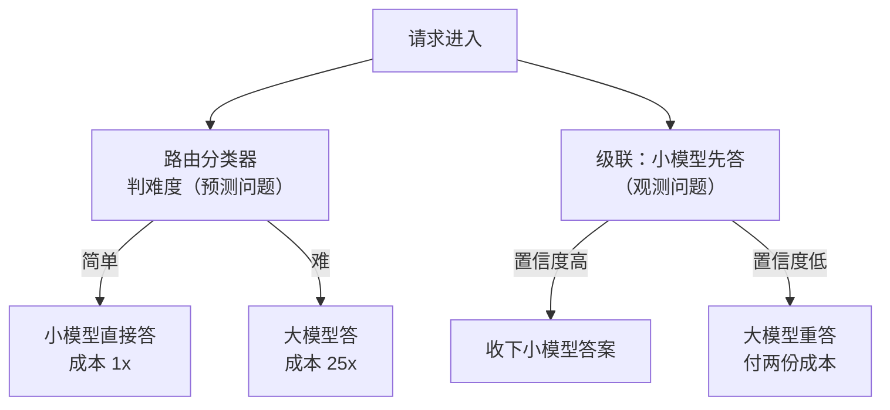

# 模型路由与级联：小模型过滤大模型兜底的省钱结构

## 要解决的问题

同一 AI 服务的请求难度分布是长尾的：多数请求简单（FAQ、模板改写、格式化），少数请求难（复杂推理、长文档综合）。全量用大模型是浪费（简单请求花大模型的钱），全量用小模型是赌博（难请求质量崩）。模型路由要解决的问题是：**按请求难度分配模型，让成本与难度匹配**。两个基本结构：路由（分类器判难度，分发到对应模型）与级联（小模型先答，置信度低再升级大模型）。这是推理服务成本模型（见 [[工程知识/AI 系统工程：从模型能力到生产能力/推理服务与平台/推理服务的单位请求成本从token定价推出来.md]]）的请求侧杠杆，与量化（压单位成本）、批处理（摊固定成本）构成降本三支柱。

## 机制

**路由：先判难度再分发**。难度分类器（轻量模型或规则）预测请求难度，简单 → 小模型，难 → 大模型。分类器是新增组件（它自己也要成本与延迟），分类错误是直接的质量损失（难请求发给小模型 = 答错）。路由的关键设计：分类特征（请求文本的什么信号预测难度：长度、领域词汇、历史同类请求的通过率）、分类器的位置（入口处一次判 vs 会话中多次判）。

**级联：小模型先答，不确定再升级**。小模型回答 + 自评置信度（或外部 verifier 评分），置信度低触发升级（大模型重答或辅助）。级联的期望成本 = P(简单)×小成本 + P(难)×大成本 + P(升级)×两份成本。升级率是关键变量：升级率高（小模型常不确定）级联退化成“总付两份钱”，升级率低省钱显著。

**路由与级联的对照**。路由是一次决策（判了就走），级联是试探决策（先试再升）。路由的错误显形快（分类错 = 直接质量事故），级联的错误显形慢（升级漏判 = 质量事故 + 用户等了两轮延迟）。混合结构是常态：路由粗分（明显简单的直发小模型），边界情况用级联（小模型试答 + 置信度门槛升级）。



**置信度估计是级联的心脏**。小模型的自评置信度（softmax 概率或 logit 能量）与真实正确率的相关性决定级联可行性。校准差的置信度（模型自信但常错）让升级机制失效。校准手段：温度缩放、verifier 模型（独立评分）、历史统计（同类请求的经验通过率）。

## 背景与代价

思想背景：级联与路由在语音识别（1990s，快速匹配 + 精确匹配的两级引擎）与计算机视觉（2010s，级联分类器如 Viola-Jones 人脸检测：简单特征快速否决）有深厚传统——**简单请求不值得贵资源**的工程直觉。LLM 时代的复兴是 2023-2024（FrugalGPT 论文 2023 是标志：GPT-4 → Curie → GPT-3.5 的级联实验省钱 98% 的案例），RouteLLM（2024）把路由器做成开源框架。产品化（各家 inference provider 的模型路由、LLM 网关的路由规则）把它变成云服务标配。

最精巧的一笔是**级联的“试探成本结构”**。路由要先付分类成本再分发，级联的失败请求付两份（小 + 大）成本。看起来级联更贵，但级联有一个路由没有的性质：**它不需要预先知道难度**。路由的分类器必须提前猜难度（猜错全赔），级联用小模型的实际回答当难度信号（回答质量本身就是最好的难度证据）。这个“用答案本身当分类信号”的设计把难度判断从预测问题变成观测问题，稳健性高一个档次。代价要摆明：升级请求的延迟翻倍（小模型答一轮 + 大模型重答一轮，用户等待两轮 TTFT）；置信度校准是持续工程（分布漂移后校准失效，简单请求被误升级，省钱结构退化）；级联的两份成本在升级率高时反超全量大模型（升级率 50% 时级联期望成本 > 直接大模型，数学上就不划算了）。上线前按真实请求分布测算升级率与省钱曲线，别拿论文数字外推。

## 边界

- **路由器的质量上限是被路由模型的质量**。路由器再准，把难请求发给弱模型还是错。路由结构的前提是小模型对简单请求的质量与大模型相当（这个前提要按任务实测，不是所有任务都有“简单请求小模型就够”的分布）。
- **用户感知的一致性代价**。同一服务不同请求被不同模型回答，输出风格漂移（用户感受到“时好时坏”）。产品层要么按会话粘模型（同会话同模型），要么接受风格差异并向用户说明原因。
- **路由决策本身要可观测**。路由分布（各模型承接占比）、升级率、路由错误率（事后按模型分层的质量监控）三个指标是结构健康的仪表。路由黑盒化（无监控）的省钱是假省钱（质量损失看不见）。
- **隐私与合规的分模型边界**。不同模型（自部署 vs API、不同厂商）的数据边界不同，路由规则要把合规约束编进分发逻辑（敏感数据只发自部署模型），这是路由器的一个硬约束维度，成本优化在它之后。

## 验证

- **难度分布画像**：真实请求日志按事后质量分层（答对的简单/难、答错的简单/难），统计难度分布。预期：长尾分布（多数简单）。分布数据是路由收益上限的估算基础（P(简单)×成本差）。
- **级联省钱曲线**：小模型 + 置信度门槛升级的模拟（历史请求重放），不同门槛值下的总成本与质量（升级请求的质量按大模型计）。预期：门槛松 → 省钱少质量高，门槛紧 → 省钱多质量降。曲线的拐点是产品决策依据。
- **置信度校准实验**：小模型自评置信度与真实正确率的可靠性曲线（分桶统计）。预期：校准良好则对角线关系，偏差大则要校准（温度缩放）或换信号。校准曲线是级联可行性的前提证据。

## 可运行示例与案例回流：级联的账

```python
# 客服工单分类 + 答复生成的级联推演（通用形态）

def cascade(query):
    conf = small_model.classify(query)        # 小模型：4 亿参数，成本 1x
    if conf.score > 0.92:                     # 置信门限
        return small_model.answer(query)      # 85% 的流量止步于此
    # 剩余 15%：低置信（多意图、领域外、歧义）→ 大模型兜底
    big = big_model.answer(query, hint=conf.candidates)   # 成本 25x
    return big

# 账本：小模型 0.001 元/次、大模型 0.025 元/次
#   全量大模型：5 万次/日 = 1250 元/日
#   级联后：4.25 万 × 0.001 + 0.75 万 × 0.025 = 230 元/日（省 82%）
# 门限的两难：调高（0.97）→ 大模型流量涨回 30%，省钱缩水
#             调低（0.85）→ 低难题被小模型硬答，质量事故进场
```

论文里的同一个结构长这样：FrugalGPT 在 HEADLINES 数据集上学到的级联，GPT-J 的回答打分过 0.96 直接收下，否则交给 J1-L，再不行才动 GPT-4——整条链只把 16.6% 的流量送到了最贵的一级。


上图三个面板拼出完整证据链：面板 (a) 是学到的级联策略（两个打分门限串起三级模型），面板 (b) 是同一道题 GPT-4 答错、级联答对的实例，面板 (c) 是总账——级联成本 6.5 美元对全量 GPT-4 的 33.1 美元，精度还高 1.5 个百分点。图取自 [FrugalGPT 论文（arxiv 2305.05176）](https://ar5iv.labs.arxiv.org/html/2305.05176)。自家推演省 82% 与论文实测省 80% 互相印证：门限与流量分布调对了，级联的账就能兑现。

案例回流：门限拍脑袋的实录——置信门限抄了别家的 0.9，小模型在自家领域（垂直术语多）置信度整体虚低，三成流量涌向大模型（省钱失效）；按业务指标重校（拿人工标注的"小模型可答"集合重定门限）后回落到一成五。无兜底画像的实录——大模型兜底后无人看"被兜底的题长什么样"，门限半年不调，新业务线的问题全部走大模型（成本悄悄翻倍）；兜底样本要回流分析，它是门限调参与小模型迭代的数据源。级联与路由的分工、模型间成本差异的结构性来源见 [[工程知识/AI 系统工程：从模型能力到生产能力/推理服务与平台/模型服务架构从单进程到分布式副本.md]]（副本层）与 [[工程知识/AI 系统工程：从模型能力到生产能力/推理服务与平台/批处理、KV缓存、量化与并行如何改变服务容量.md]]（单模型层的成本账）。

## 相关

- [[工程知识/AI 系统工程：从模型能力到生产能力/推理服务与平台/推理服务的单位请求成本从token定价推出来.md]] —— 路由在成本模型中的位置
- [[工程知识/AI 系统工程：从模型能力到生产能力/推理服务与平台/模型量化的精度经济学：位宽精度与显存的三角.md]] —— 单位成本侧的降本杠杆
- [[工程知识/AI 系统工程：从模型能力到生产能力/模型基础与训练/投机采样与推测解码：小模型带路大模型确认.md]] —— 小模型辅助大模型的亲缘结构
