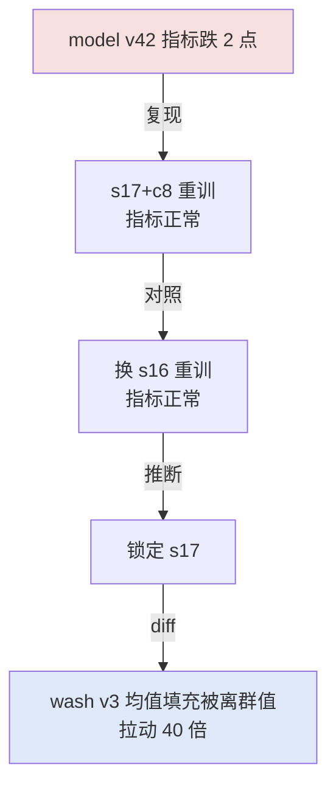

# 数据集、特征与模型版本必须可追溯

可追溯性解决的是模型变好或变坏后，无法回答“是哪批数据、哪套特征、哪个训练代码和哪个模型产物造成的”。核心机制是为数据快照、特征定义、训练配置、模型、评测和部署建立不可歧义的版本关系；最小实验是回放同一版本组合，确认能重建指标和服务输入。
## 核心要点

| 维度 | 回答 |
| --- | --- |
| 要解决的问题 | 同一个模型、服务或评测结果在输入数据、代码、配置变化后可能悄悄改变，导致无法解释回归、复现结果或安全回滚。 |
| 本质 | 把数据、表示、模型、运行和评测绑定成一个不可混淆的版本图，而不是给结果贴一个模型名称。 |
| 做法 | 为每个输入和产物记录来源、快照、哈希、代码 revision、配置、依赖、索引、工具和硬件，并以运行 ID 关联它们。 |
| 效果与代价 | 可以定位变化来源、重放请求、比较候选并整体回滚；代价是版本存储、元数据维护和脱敏治理成本上升。 |
| 边界 | 可追溯只能说明“使用了什么”，不能证明模型质量、因果关系或所有场景都正确；仍需独立评测和线上观测。 |
| 验证 | 随机抽取一个运行 ID，确认能重建输入、版本、配置、输出和评分；故意替换数据或 prompt，检查系统能否识别差异。 |

一个 AI 结果不能只标记“模型名”。同一模型在不同数据快照、embedding、特征、prompt、工具、索引、依赖和硬件下可能产生不同结果。可复现和可回滚的最小身份是：输入数据版本、代码 revision、训练/推理配置、模型产物和评测结果的完整关联。

## 版本对象

| 对象 | 至少记录 | 常见失真 |
| --- | --- | --- |
| 数据集 | 来源、时间、过滤、许可、哈希、分布 | 用“最新数据”覆盖旧快照 |
| 特征/embedding | 生成代码、模型、维度、归一化、窗口 | 新旧表示混用、离线/在线不一致 |
| 模型 | 基座、权重/adapter、tokenizer、精度、依赖 | 只记录产品别名，不记录快照 |
| 评测集 | 样本、标签、切片、污染策略、版本 | 测试集被训练或 prompt 泄漏 |
| 运行 | prompt、工具、索引、解码、硬件、trace | 无法解释线上回归 |

## 数据到服务的约定

训练、离线特征和在线推理必须约定 schema、缺失值、时间窗、迟到数据、权限和默认值。特征生成逻辑若在训练和服务两处复制，极易产生 training-serving skew；共享代码、接口约定测试和代表性回放比文档承诺更可靠。

## 变化管理

新数据/特征/模型先产生不可变版本，运行评测和数据质量检查，再注册为候选；灰度时同时比较质量、延迟、错误、资源和成本。发现回归时切回上一个完整版本，不能只回滚权重而保留不兼容 tokenizer、schema 或索引。

## 可运行示例：一个坏样本的定位全程

模型指标突然跌 2 个点，版本链把定位压到十分钟：

```text
回溯链（全部有 hash 指针）：
  model v42 = train(data_snapshot s17, feature_view fv9, config c8)
  s17 = build(ods v2026-09-15, 清洗规则 wash v3)
  fv9 = feature_table ft4@2026-09-15

定位动作：
  1. 用 s17+c8 重训 → 指标正常 → 排除训练代码与配置
  2. 用 fv9 但换 s16 → 指标正常 → 锁定 s17
  3. s17 与 s16 的 diff → 清洗规则 wash v3 在 9-15 把缺失值填充策略从"删除"改成"均值"，
一个字段的均值被离群值拉动 40 倍 → 坏变更定位到行级
```



跑一遍的收获：没有版本链时这场排查是"大家都在改什么"的会议；有版本链时是三次重训的 diff——定位时间从天级压到小时级。重训的成本（小时级 GPU）是版本链价值的直接标价。

## 量化锚点：特征跨越的训练服务偏差

线上特征与训练特征的偏差（training-serving skew）是静默杀手：训练用离线表算的"用户近 7 天点击数"，线上同一特征由流式计算实时累计，口径差 1 小时边界——离线 AUC 0.82 的模型上线后 CTR 不达预期，偏差排查的第一步就是对账同一个样本在两侧的特征值（抽样 1000 条，逐特征比对，偏差率 >1% 的特征逐个修）。特征平台的价值就是把两侧计算收敛到同一份定义。

## 验证

验证的锚点：可追溯性要与运行 ID 重建对账——预写给定一个运行 ID 能还原样本、三个版本、配置与评分，任一还原不出，与预期对不上，该结论不能当生产结论。

给定一个运行 ID，应能重建：输入样本、数据/模型/代码版本、配置、工具调用、输出和评分。随机抽取线上请求做脱敏回放；对数据分布、缺失率、标签延迟、embedding 漂移和模型输出拒答率设阈值。无法重建的结果不能作为生产结论。

关系：[[工程知识/AI 系统工程：从模型能力到生产能力/推理服务与平台/AI平台必须统一模型、数据、评测与发布版本]] · [[工程知识/软件构建：让变化可以理解、验证与交付/测试与交付/发布门禁必须绑定真实证据]]
