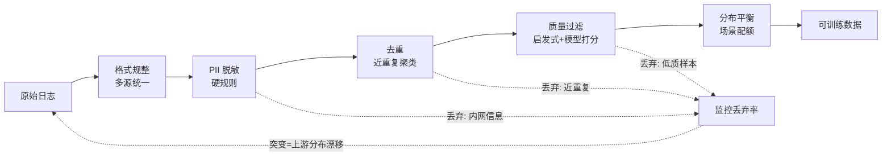
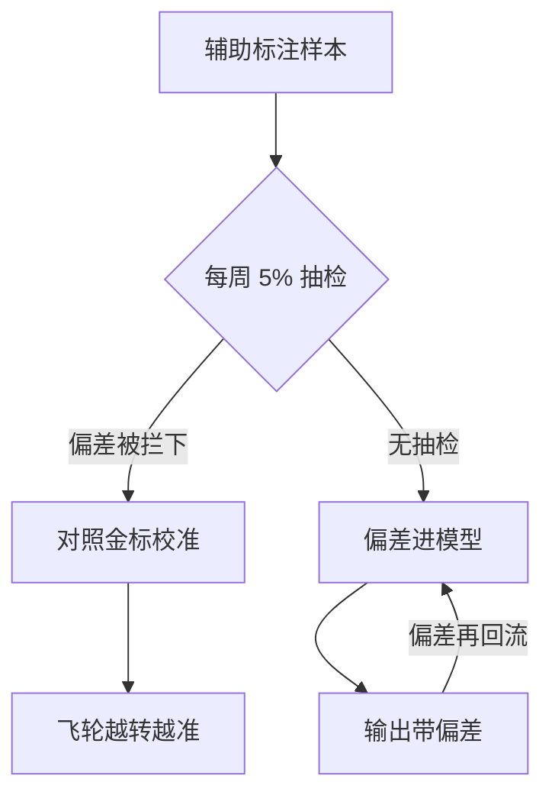

# 数据飞轮的工程闭环：日志回流清洗与标注

## 要解决的问题

AI 系统的效果上限由数据决定：上线后的真实交互日志（对话、工具调用轨迹、用户反馈）是最有价值的训练信号，但它是原始的（噪声、PII、格式混杂）。数据飞轮要解决的问题是**把“上线日志”变成“训练资产”的工程回路**：回流、清洗、标注、入库、训练、上线、再回流。回路转起来，系统随使用变好（用户的每次交互都在为下一版投票）；转不起来，系统停在上线时的水平。这是 MLOps 区别于传统 Ops 的核心：运维对象不只是服务可用性，还有数据资产的增长率。

## 机制

**回流的四条管道**。推理日志（请求与响应全量，注意采样率与脱敏）；用户显式反馈（点赞点踩、评分、采纳/拒绝——最稀疏但最准的信号）；用户隐式反馈（重试、编辑后重写、复制行为、会话时长——密度高但要推断）；外部信号（下游业务指标——客服系统的解决率，最贴近业务但归因链长）。四条管道的信号质量与密度互补，回流设计要四路全开。

**清洗的漏斗**。原始日志到可训练数据的漏斗：格式规整（多源格式统一）→ PII 脱敏（个人标识、内网信息，硬规则）→ 去重（近重复聚类，防止少数模式淹没分布）→ 质量过滤（启发式 + 模型打分，过滤低质样本）→ 分布平衡（场景配额，防止高频场景淹没长尾场景）。漏斗每层的丢弃率要监控：丢弃率突变说明上游分布漂移（新场景涌入或故障注入坏数据）。



**标注的三种模式**。人工标注（质量天花板，成本与速度的劣势）；LLM 辅助标注（强模型预标 + 人工抽检修正，成本降一个数量级，质量依赖辅助模型与任务的匹配度）；用户行为当标注（采纳/拒绝直接当正负样本，零标注成本但偏差大——用户只在极端场景反馈，沉默样本不可知）。三模式的组合按信号价值分配：高价值场景人工，长尾场景 LLM 辅助，显式反馈直接用。

**回路的度量**。飞轮健康度三指标：回流率（日志可回流的占比）、清洗存活率（原始到可训练的转化率）、标注吞吐（单位时间产出标注样本）。三指标乘积 = 数据资产增长率。瓶颈诊断：哪个环节的转化率低，就是飞轮的堵点（常见：清洗存活率低因为 PII 规则过严、标注吞吐低因为辅助标注质量差）。

## 背景与代价

思想背景：数据飞轮（data flywheel）一词来自产品圈（用户使用产生数据、数据改进产品、产品吸引用户），MLOps 工程化是 2020s 的事。标注侧的变化来自 LLM 辅助标注（2023+）：过去人工标注是数据集构建的瓶颈（贵、慢、不一致），强模型把标注成本降一个数量级后，飞轮的经济性成立——此前回流日志的成本高于价值，飞轮转不动。RLHF/数据运营是提示工程之后的竞争力主战场，各家 Agent 产品的差异化越来越体现在数据回路质量。

最精巧的一笔是**“把用户行为当标注”的信号设计**。显式反馈（点踩）稀疏且不够客观（用户只在愤怒时反馈），隐式行为（重试、编辑、复制）密度高但语义模糊。把多个隐式信号组合成“质量推断”（重试 = 失败信号、编辑后重发 = 不满信号、复制 = 有用信号），加上会话上下文，可以推断出比单信号更准的质量标签。这一笔把反馈采集从“求用户配合”变成“读用户行为”，飞轮的信号成本趋零。代价要摆明：回路每一环都有成本与风险——回流有合规成本（PII 处理不当是法律风险，脱敏规则要前置到采集层）；清洗漏斗的规则要维护（规则老化：业务变化后旧规则误杀新场景样本）；标注质量要抽检（LLM 辅助标注的系统性偏差会污染训练集，偏差样本回流进模型再产生偏差数据，飞轮变成“偏差放大器”——这是数据飞轮最危险的失败形态）。飞轮的治理比飞轮的建设难：建设是一次性工程，治理是持续运营。

最危险的失败形态「偏差放大器」怎么长出来：抽检这道闸门在不在，飞轮走向两个结局。



## 边界

- **飞轮不是所有系统都值得转**。判断式成本收益：日交互量大（信号密度够）× 效果对业务重要（改进值得投入）× 有训练能力（数据要有去处）。三者缺一，飞轮是负资产（回流存储成本 + 合规风险，无产出）。
- **清洗规则的演进要跟业务同步**。规则集的版本化（每条规则带生效时间与负责人），新场景上线前评审清洗规则是否误伤。规则误伤的发现信号：某场景样本量骤降而上游日志量正常。
- **标注质量抽检是持续成本不是一次性**。LLM 辅助标注的偏差随任务漂移（辅助模型对特定类型样本系统性偏好），定期抽检（每周 5%）+ 偏差校准（对照人工金标）是飞轮的质量保险。无抽检的标注管道是慢性毒药。
- **数据集版本化与模型版本化要绑定**。训练数据集的版本（内容 + 处理规则版本）与模型版本绑定，否则“这个模型是用哪批数据训的”无法回答，问题回溯（bad case 反查数据源）断链。工具上用数据集的 hash 指纹（HF datasets 类），流程上把数据集版本写进模型卡。

## 验证

- **漏斗转化率基线**：全管道跑一个月真实日志，统计每层丢弃率与总存活率，预期：总存活率 10-30%（原始日志到可训练），PII 层丢弃率随业务敏感度波动。基线数字是飞轮健康度的锚点。
- **标注模式对照**：同一批样本（1000 条）分别人工、LLM 辅助、人工抽检 LLM 三模式标注，统计一致率与成本。预期：LLM 辅助成本降 90%+，一致率 80-90%（任务依赖）；抽检修正后一致率接近人工。三模式的成本-质量曲线是标注策略依据。
- **飞轮效果实验**：回流数据训练迭代版（LoRA 微调或提示词迭代）与基线版在相同评测集（构建方法见 [[工程知识/AI 系统工程：从模型能力到生产能力/质量与运营/评测集的构建与维护：从场景采样到难度分层.md]]）对比。预期：真实分布的改进显著（业务场景分数上升），公开榜分数不动或下降（分布差异）。业务改进是飞轮价值的直接证据。

## 可运行示例与案例回流：飞轮的账

```python
# 一个翻译 Agent 的飞轮闭环（通用推演）

# 第 1 环 采集：线上请求-响应-用户行为全量写入日志
log = {"query": in_text, "answer": out_text,
       "feedback": user_action,      # 采纳/修改/放弃 = 隐式标签
       "trace_id": tid, "model_ver": "v2.3"}

# 第 2 环 清洗：回流的原始日志不可直接训
#   脱敏（用户内容去标识）→ 去重（同 query 高频样本限权）→
#   质量过滤（放弃类样本要区分"答案差"与"用户场景不需要"）

# 第 3 环 标注：用户行为是弱标签，强标签要人补
#   修改过的答案 = 免费的强标签（用户已给出更好版本）
#   按模型不确定性采样送人工标注（主动学习，标注预算省六成）

# 第 4 环 回训与评测：新数据进训练 → 评测集验证不回退 → 上线
#   闭环的完成标志：本月标注的样本出现在下月模型的行为改进里

# 飞轮转速的账：日请求 10 万、采纳率 70%、修改类强标签 3% →
#   日产强标签 3000 条，一个月 9 万条 → 足够支撑一次领域微调
```

案例回流：采集环缺失的实录——模型上线三个月，日志只记请求与响应，没记用户行为（采纳/修改/放弃），飞轮的第一环就断（无标签来源，人工标注从零起步，冷启动多花两个月）；修复是行为埋点先行（上线日就有数据）。清洗环跳过的实录——直接拿原始日志微调，重复样本让模型过度拟合高频表达（top 1% 的 query 占训练量四成），生成千篇一律；去重与限权后恢复多样性。评测环的衔接见 [[工程知识/AI 系统工程：从模型能力到生产能力/质量与运营/评测集的构建与维护决定所有评测的地基.md]]（回流的失败样本是评测集的活水）、标注治理见 [[工程知识/AI 系统工程：从模型能力到生产能力/数据与MLOps/训练数据治理：来源、许可与污染决定语料的长期价值.md]]。

## 相关

- [[工程知识/AI 系统工程：从模型能力到生产能力/质量与运营/评测集的构建与维护：从场景采样到难度分层.md]] —— 飞轮效果验收的评测基础
- [[工程知识/AI 系统工程：从模型能力到生产能力/质量与运营/Agent评测必须覆盖轨迹而不只看最终答案.md]] —— 轨迹数据的评测视角
- [[工程知识/数据系统：在并发与故障中保存事实/数据治理/数据质量的三重校验：完整性时效与一致性.md]] —— 清洗漏斗的质量校验同源思想
- [[工程知识/AI 系统工程：从模型能力到生产能力/生态与选型/精调与RAG的边界：什么时候微调更划算.md]] —— 精调数据集的工程来源
