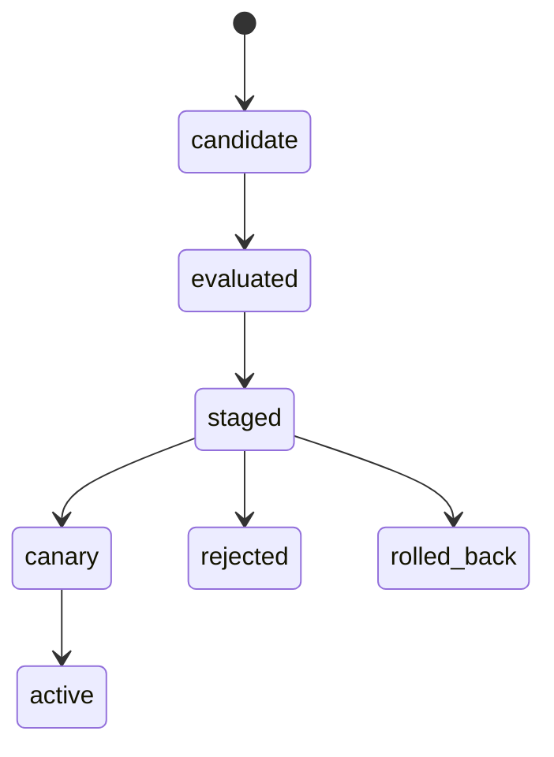

# 模型发布需要注册、灰度与回滚

模型发布解决的是新模型上线后质量、延迟、成本或安全行为变化不可控的问题。注册保存可追溯身份，灰度让新旧版本在相同流量切片中比较，回滚恢复已验证组合；代价是双份容量和观测成本，边界是回滚模型不能撤销已经发生的外部副作用。
模型发布是一次受控行为变化，不是把权重文件复制到服务器。生产系统还要同步检查 tokenizer、提示词、工具 schema、RAG 索引、量化、推理引擎、GPU 驱动、权限、观测和客户端兼容。

## 发布对象与状态



注册表中的版本必须不可变，记录来源、许可证、校验和、依赖矩阵、评测集、风险结论和回滚目标。别名（如 production）只是可变指针，不能替代具体快照。

## 灰度要比较什么

按用户、租户、任务类型或流量比例分桶，并保持稳定主体以减少样本偏差。比较成功率、事实/引用、拒答与越权、工具参数、TTFT/ITL、token、GPU 显存、错误率、成本和业务护栏。平均分提高但高风险切片恶化时，应停止扩大灰度。

## 回滚边界

回滚必须覆盖模型、tokenizer、提示词、工具、索引和配置的兼容组合；数据库/事件 schema 采用先兼容读写、再迁移、最后删除旧路径。保留旧版本所需的依赖、镜像和硬件矩阵，定期演练恢复，而不是只保存一个下载地址。

## 可运行示例：一次模型发布的完整登记表

新版推荐模型 v2.3 从训练完到全量的每一步都有对应登记：

```text
注册表（模型登记表）：
  model: rec-ranking  |  version: v2.3  |  stage: staging → production
  训练数据: d-2026-09-14 快照  |  评测报告: report-2317（AUC 0.812 vs 线上 0.805）
  血缘: 特征 schema v8、基座 v2.1、超参 run-993 的 config 快照

灰度（5% → 25% → 全量，每档一个观察周期）：
  对照指标：CTR、停留时长、服务错误率、P99 延迟
  对照方式：同流量分桶，新模型桶 vs 旧模型桶，差值过检验才算数
  守门：错误率或 P99 超阈值 → 自动回退到 v2.1

回滚（把"退回去"变成一个动作而非一次抢修）：
  回滚对象是"模型版本指针"：生产指针从 v2.3 指回 v2.1
  前提：v2.1 的制品、特征 schema、依赖服务全部仍在位（登记表保证）
  回滚后复盘：指标分歧样本 + 特征分布对比，定位 v2.3 的失效面
```

跑一遍的收获：发布流程的三个环节各管一件事——注册表管"哪个版本带什么证据在什么阶段"，灰度管"用对照而不是感觉判断好坏"，回滚管"坏了的退路是不是一条真的路"。任何一件缺失，另外两件都会跟着失效（没登记就没法回滚，没灰度就没发现在线退化）。

## 量化锚点与案例回流

灰度的账：5% 桶的目的是用最小代价攒出统计可判的样本量（转化率类指标日活百万级时 5% 桶一天够判 1% 量级的差异），档位加倍递进让暴露风险随信心同步涨。回滚的成本账：制品在位时回滚是分钟级指针操作；制品缺失（旧版本被清理、特征 schema 已升级不兼容）时回滚变成天级抢修——登记表的保存期就是回滚能力的有效期。案例回流：[[工程知识/软件构建：让变化可以理解、验证与交付/测试与交付/灰度与功能开关的边界：交付节奏与配置漂移.md]] 的对照纪律在模型域原样成立（灰度要对照，开关要清理）；回滚退路失效的实录形态见 [[工程知识/缺陷分析：从个案到体系/稳定性/案例十一：上游修好了，你这边没有——一个发行分支的移植缺口.md]]——备份与退路本身是要验证的资产，不是想当然的存在。

验证的锚点：发布就绪要与清单对账——预写版本可追溯、回归通过、trace 可区分版本、回滚已演练四项均打勾，任一项与预期对不上就退回补齐。

## 验证清单

- [ ] 版本、产物哈希和运行配置可追溯。
- [ ] 离线任务、对抗样本、权限、工具失败和长上下文回归通过。
- [ ] 线上 trace 能区分模型版本、索引版本和推理后端。
- [ ] 自动停止阈值、人工审批和回滚命令已演练。
- [ ] 回滚后不会把新版本产生的状态交给旧版本错误解析。

关系：[[工程知识/AI 系统工程：从模型能力到生产能力/数据与MLOps/数据集、特征与模型版本必须可追溯]] · [[工程知识/AI 系统工程：从模型能力到生产能力/推理服务与平台/推理服务的核心矛盾是延迟、吞吐、显存与质量]]

## 机制与本质

模型发布的机制层：一次行为变化由权重、分词器、提示词、工具结构与索引共同决定，改动其中任何一项都会改变线上表现。注册表保存不可变的身份与证据，灰度让新旧版本在同一批流量下产生可比较的结果，回滚恢复的是版本组合；已经产生的外部副作用不在回滚的作用范围内。

## 要解决的问题

新模型上线之后质量、延迟、成本或安全行为发生变化，而团队只能看到整体指标变动，无法判断当前流量由哪个版本服务，也说不清回退之后能恢复到什么状态。本篇回答：注册保存哪些身份信息、灰度怎样让新旧版本在同一批流量上比较、回滚能撤销什么与不能撤销什么，以及双版本并行期间的成本如何核算。

