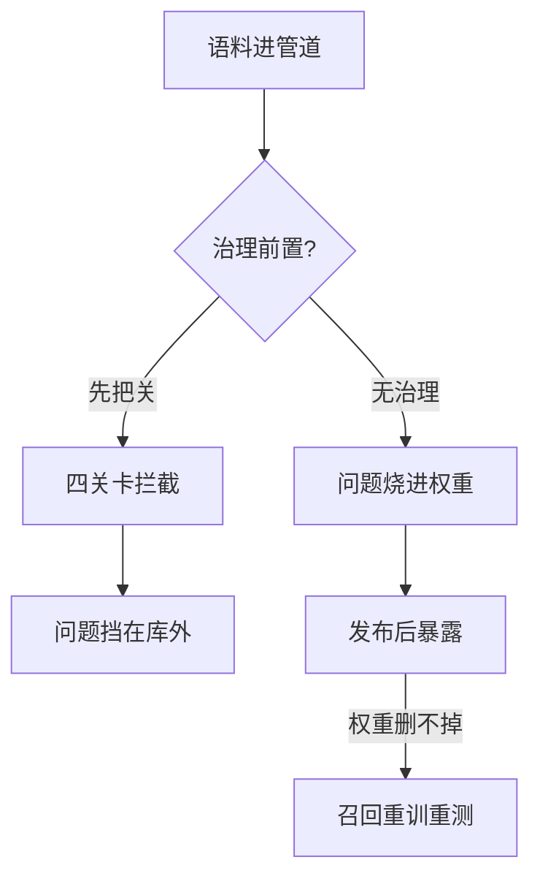

# 训练数据治理：来源、许可与污染决定语料的长期价值

模型上线三个月后被发现用未授权语料训练、评测集泄漏进训练集导致分数虚高、个人信息混入语料被监管点名——这类问题在模型发布后无法补救，只能在数据入口处拦截。要解决的问题：把来源、许可、去重与污染检查做成训练数据管线的强制关卡，让每一份进入训练的语料都可追溯、可审计、可撤回。

本质是数据资产的风险前置。训练一旦完成，语料的问题就固化进权重：许可违规无法从权重里“删除”某本书，污染无法在事后从分数里“减去”那份泄漏。治理因此必须在混料前完成，而不是出问题后排查。

治理前置与出问题后排查，两条路径的成本差在哪：



## 机制：管线四关卡

| 关卡 | 检查什么 | 拦截什么 | 证据物 |
| --- | --- | --- | --- |
| 来源登记 | 抓取 URL、时间、版本、哈希 | 无法说明出处的语料 | lineage 记录 |
| 许可判定 | 语料许可证、收集授权、合规地区 | 未授权商用内容 | 许可证清单 + 决策记录 |
| 去重与清洗 | 精确/近似去重、质量过滤、PII 命中 | 重复、低质、隐私数据 | 去重率、PII 报告 |
| 污染检查 | 与评测集 n-gram/嵌入重叠 | 评测泄漏 | 污染率报告 |

四关卡顺序不可交换：污染检查必须对最终混料配方执行，去重后再查污染才准（重复内容会放大重叠信号）；许可判定必须在混料前（混入后无法按来源分离）。

## 失效形态

| 失效 | 机制 | 信号 |
| --- | --- | --- |
| 评测污染 | 评测样本或近似变体进入训练集 | 训练 loss 在评测集异常低；独立新评测大幅掉分 |
| 许可违规 | 语料许可未判定或误判 | 发布后收到下架/诉讼；无法按源撤回 |
| PII 泄漏 | 个人信息混入语料并被模型记忆 | 模型能复述个人信息；监管问询 |
| 记忆化泄露 | 模型逐字复现训练语料 | 抽样生成与语料高重合 |
| 数据版本漂移 | 重训时语料版本已变，结果不可比 | 同配置重训结果分叉 |

## 可运行示例：一次污染检测的全过程

怀疑语料被测试集污染（模型在评测集上异常好），n-gram 重叠检测给出证据：

```python
from collections import Counter

def ngrams(text, n=13):
    toks = text.split()
    return set(tuple(toks[i:i+n]) for i in range(len(toks)-n+1))

# 评测集每个样本的 13-gram 在训练语料中查重
overlap = [len(ngrams(q) & train_grams) > 0 for q in eval_questions]
# 典型读数：污染率 4% —— 这 4% 的样本指标接近满分，剔除后整体分下降 3 个点
# 结论：报告里那 3 个点是"背下来的"，能力估计必须用去污染后的分数
```

复现要点：13-gram 是公认的经验阈值（更短误报高、更长漏检）；对中文按字 bigram+长度阈值或按句哈希。污染的来源通常不是恶意，是爬取时间晚于评测集发布——数据治理的来源字段（URL+抓取时间）让这类污染在入库前就能按时间线拦住。

## 量化锚点：许可与去重的账

许可合规的成本在入库时最低：来源清单里每条带 license 字段（宽松/署名/禁用），禁用类直接不进管道——事后清洗（从已训练模型里"忘记"数据）在技术上不可行，这是版权诉讼的真实判例逻辑。去重的收益同样可算：公开语料典型重复率 15-30%（MinHash 去重后），重复内容让模型过拟合高频表述，去重后同等算力的损失曲线更平——每剔除 10% 重复，同预算下有效数据多 11%。

## 边界

- 污染检查是概率性的：n-gram 重叠抓不到改写泄漏，嵌入相似度抓不到跨语言泄漏；检查通过是下限证据不是证明。
- 许可判定存在灰区：爬取内容的 robots 与版权、合成语料的教师许可传递、开源数据的再分发条款，都需要法务参与而非纯技术判断。
- 去重不是越狠越好：近重复样本有时承载真实的分布信息（热门话题），过度去重会削平长尾；去重阈值要对照目标任务调。
- 治理记录本身也是资产：审计、复现与合规都要回读管线记录，记录丢了等于治理白做。

## 验证

验证的锚点：语料价值要与四份证据对账——预写 lineage 覆盖率、许可判定覆盖率、去重与 PII 报告、污染率四项齐全，缺项与预期对不上就先补审计。

最小验证：对最终混料配方跑一次全管线审计，产出四份证据——lineage 覆盖率（每份语料可溯源比例）、许可判定覆盖率（含决策记录）、去重率与 PII 命中报告、污染率（对评测集 n-gram 与嵌入双查）。另做一次撤回演练：随机抽一份语料，按 lineage 记录从混料中移除并重算配比，断言全过程可执行且结果可复现。

关系：[[工程知识/AI 系统工程：从模型能力到生产能力/模型基础与训练/预训练数据决定模型能力上限]] · [[工程知识/AI 系统工程：从模型能力到生产能力/质量与运营/评测集的构建与维护决定所有评测的地基]] · [[工程知识/AI 系统工程：从模型能力到生产能力/安全与治理/模型与数据供应链需要可验证来源]]

## 效果与代价

把来源、许可、去重与污染检查放在混料之前，换来的是每一份语料可溯源、可审计、可按源撤回，语料问题的发现时点提前到入库阶段。代价是管线需要维护 lineage 与许可决策记录，去重阈值和污染检查的口径要随任务调整，灰区的许可判断还需要人工参与而非由技术规则单独决定。

