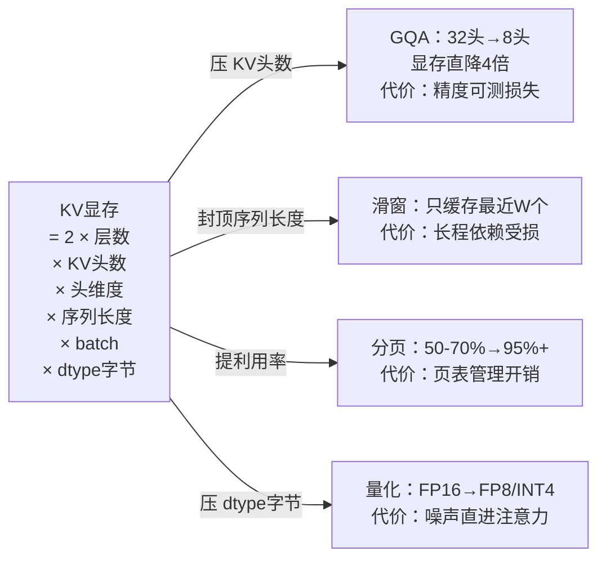

# KV缓存与上下文长度的显存账：为什么长上下文贵

## 要解决的问题

LLM 推理时把注意力矩阵的 K、V 向量缓存下来避免重算（自回归解码每步只算新 token，历史 K/V 复用），这让每 token 的成本从“重算全历史”降到“增量一步”。但缓存以显存计价：**KV 缓存大小 = 2 × 层数 × KV 头数 × 头维度 × 序列长度 × batch × dtype 字节数**，随上下文与并发线性膨胀，是长上下文服务显存账的大头。本文写这笔账的构成、优化手段的谱系与它们的代价，这是长上下文服务容量规划的骨架，也是模型量化（见 [[工程知识/AI 系统工程：从模型能力到生产能力/推理服务与平台/模型量化的精度经济学：位宽精度与显存的三角.md]]）压不动的部分。

## 机制

**账目构成**。Transformer 每层每个 KV 头为每个 token 存 K 和 V 两个向量（各 head_dim 维）。公式里最活跃的变量是序列长度与 batch：32k 上下文的 7B 模型（32 层 × 8 KV 头 × 128 维，FP16），单请求 KV 约 2×32×8×128×32768×2B ≈ 4GB——单请求就吃掉一张消费级卡的显存。长上下文与高并发相乘，KV 显存成为容量天花板。

**四条优化路线**。
- MQA/GQA（多查询/分组查询注意力）：KV 头数从“每 Q 头一个”降到“全局一个”或“每组一个”。KV 头数是公式里的乘数，从 32 头砍到 8 头，KV 显存直降 4 倍。代价：Q 与 KV 的信息交互减少，精度有可测损失（中等任务小、难任务可测）。现代模型架构默认 GQA（LLaMA-3、Qwen 系）。
- 滑动窗口注意力：只缓存最近 W 个 token 的 KV，公式里序列长度封顶 W。代价：窗口外信息不可见，长程依赖任务（全文档问答）受损；配合少量全局层（每 k 层一个全注意层）可缓解。
- PagedAttention：KV 显存按页管理（借鉴 OS 虚拟内存），消除内部碎片与外部碎片，让公式里的“有效序列长度利用率”从 50-70% 提到 95%+。vLLM 的核心。代价：页表管理开销与跨页 attention 的实现复杂度。
- KV 量化：KV 的 dtype 从 FP16 压到 FP8/INT4。KV 误差直接进注意力权重，比权重量化更伤精度，但显存收益直给。按任务实测接受度（量化篇（上文链接）的 KV 段）。

**上下文工程视角的省钱**。公式里的序列长度不只是模型能力问题，还是工程输入：系统提示占位、工具结果回填、检索片段拼接都把序列长度推大。上下文工程（见 [[工程知识/AI 系统工程：从模型能力到生产能力/模型与上下文/上下文工程是在有限预算内构造决策现场.md]]）的本质是在固定显存预算下做内容取舍——预算表发给 Agent 框架的调用方，让“多塞一个检索片段”成为有价格的操作。

**计算与访存的耦合**。decode 阶段每步要读全部历史 KV（注意力计算），KV 显存大小同时决定访存量：32k 上下文的每步访存 = 全部 KV（GB 级），decode 速度受显存带宽约束（GPU 显存层级（见 [[工程知识/AI 系统工程：从模型能力到生产能力/模型基础与训练/GPU执行模型与显存层级：SIMT与合并访存.md]]）的带宽墙）。长上下文的“贵”是双重的：显存占用（容量）与访存量（速度），两个账要一起算。

## 背景与代价

思想背景：KV 缓存随 2020s 初的开源对话模型服务化出现（vLLM 之前各框架的 KV 管理粗放，静态预分配）。PagedAttention（vLLM，2023）是分水岭：把 OS 分页思想搬进 KV 管理，fragmentation 浪费从 ~80% 降到 <5%，同期吞吐提升 2-4 倍。GQA（2023，Google）从架构侧把 KV 头数变成设计参数，此后开源模型默认 GQA。FlashAttention（2022-2023）从计算侧解决 attention 的显存访问效率（IO 感知精确注意力），与 KV 缓存管理正交但互补。

最精巧的一笔是**PagedAttention 把“碎片整理”变成显存管理单元**。静态预分配按最大序列长度留显存（8k 预算实际用 2k 浪费 75%），PagedAttention 把 KV 切成 16KB 页，按需分配页、逻辑序列到物理页的映射表维护连续性。一次借鉴（OS 虚拟内存的页表）解决两类碎片（内部与外部），同时顺手支持跨请求前缀共享（系统提示相同的请求共享页）——prefix caching 是这页管理机制的自然延伸，系统提示的 KV 只算一次。代价要摆明：所有优化都在压公式里的某个乘数，但没有免费午餐——GQA 压头数伤精度、滑窗压长度伤长程、量化压 dtype 伤数值、分页提利用率加管理开销。长上下文服务的容量规划是多元方程：任务的最小上下文需求（内容侧） × 每优化项的精度损失（模型侧） × 显存单价（硬件侧），三侧联合才能定参数，没有单变量最优。

四条路线各自压着公式里的哪个乘数、付出什么代价：

## 边界

- **“支持 128k 上下文”≠“128k 上下文便宜”**。模型架构支持的长度上限是能力问题（RoPE 外推等），服务成本随长度线性涨。产品层按 token 计费的价格表通常长上下文溢价，工程层容量按“目标上下文 × 目标并发”算 KV 预算，见推理成本模型（见 [[工程知识/AI 系统工程：从模型能力到生产能力/推理服务与平台/推理服务的单位请求成本从token定价推出来.md]]）。
- **吞吐-延迟曲线随长度劣化**。批处理的调度天平（见 [[工程知识/AI 系统工程：从模型能力到生产能力/推理服务与平台/批处理、KV缓存、量化与并行如何改变服务容量.md]]）里，长上下文请求占显存时间长（decode 步数多），batch 槽位被长请求独占，短请求排队。调度策略（按长度分池、优先级抢占）是长短混布服务的必修课。
- **prefix caching 的收益上限由业务决定**。共享前缀越长占比越高（客服机器人的固定系统提示 vs 开放对话的零共享），收益上限就是前缀长度占总 KV 的比例。评估先量前缀共享率（日志统计），再决定是否上机制。
- **KV 量化的任务敏感性要实测**。检索增强（RAG 类）任务对 KV 噪声相对鲁棒（注意力集中在检索片段），数学与代码任务敏感。任务谱实测（量化篇的验证段同源方法）后再定 KV 位宽。

## 验证

- **KV 显存公式实测**：不同（层数， KV 头数， 头维度）组合下加载模型，实测 KV 占用 vs 公式值，预期：误差 <5%（公式是账目骨架的证据）；改变序列长度与 batch，占用线性增长。公式与实测的吻合度是容量规划可靠性的前提。
- **GQA 收益实验**：同一模型家族 GQA 与 MHA 版本（或配置开关）对比 KV 显存与吞吐，预期：KV 显存按头数比例下降、吞吐上升、评测分数小幅下降。三角关系（显存、 吞吐、 精度）的实测曲线是架构选型依据。
- **PagedAttention 碎片实验**：vLLM 的 PagedAttention vs 静态预分配（旧框架或配置），同负载（序列长度分布有方差）跑吞吐，预期：分页版吞吐显著提升（碎片浪费差异直接体现）。长度分布越参差，分页收益越大。

## 相关

- [[工程知识/AI 系统工程：从模型能力到生产能力/推理服务与平台/模型量化的精度经济学：位宽精度与显存的三角.md]] —— 权重侧压缩与 KV 侧压缩的分账
- [[工程知识/AI 系统工程：从模型能力到生产能力/模型与上下文/上下文工程是在有限预算内构造决策现场.md]] —— 显存预算的内容侧决策
- [[工程知识/AI 系统工程：从模型能力到生产能力/推理服务与平台/推理服务的单位请求成本从token定价推出来.md]] —— 长上下文在成本模型中的计价
- [[工程知识/AI 系统工程：从模型能力到生产能力/推理服务与平台/推理批处理的两难：吞吐与延迟的调度天平.md]] —— KV 状态粘性对调度的约束
- [[工程知识/AI 系统工程：从模型能力到生产能力/模型与上下文/上下文工程的分层设计：系统提示工具结果与记忆.md]] —— 窗口约束的显存侧
