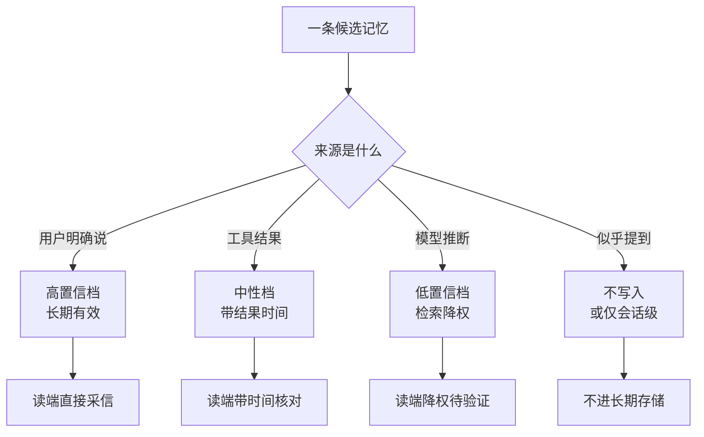

# 记忆写入治理：来源、主体与过期决定记忆的可信度

Agent 记住了一条"用户喜欢简短回复"，三个月后用户早已换了偏好，但 Agent 还在用它回复；更糟的是这条记忆没有来源——不知道是用户亲口说的、模型猜的还是某次幻觉的输出被当成事实写进去了——没有人能判断该不该删。要解决的问题：给每条记忆写入定义来源、主体、置信度、过期与纠错语义，让记忆可解释、可撤回、可审计，防止污染和过期记忆无限传播。

本质是写路径治理与读路径信任的配对。记忆系统的失效大多发生在写入端：无来源（无法审计）、无主体（无法判断适用范围）、无过期（旧事实永远覆盖新事实）、无置信度（猜测与用户确认混为一档）。读端只是放大器——被污染的记忆在每次检索时把错误注入上下文。治理投资在写入端，收益在读端。

## 机制：写入四元组与纠错

| 字段 | 回答什么问题 | 缺失后果 |
| --- | --- | --- |
| 来源 | 这条记忆从哪来（用户原话/工具结果/模型推断） | 无法审计、无法撤回污染源 |
| 主体 | 记的是谁的偏好/事实（用户/会话/全局） | 串租户、A 的偏好写到 B 头上 |
| 置信度 | 一次猜测还是用户确认 | 推断与确认同级传播 |
| 过期 | 什么时候该重新验证 | 旧事实覆盖新事实，"记住"变"诅咒" |

纠错语义：用户说"不对"时，不是往记忆里追加一条否定，而是定位原记忆做修正或作废；修正要保留时间线（谁在何时改了什么），作废要能级联（引用这条记忆的下游摘要同步作废）。

按来源分档写入策略：用户明确说的（高置信，长期）；工具结果（中性，带结果时间）；模型推断的（低置信，需标记，检索时降权）；上下文里"似乎提到"的（不写入，或仅会话级临时）。



图回答写入端怎么分流：同一个分岔点读端待遇各不相同，低置信档被降权这一步就是防止"猜测与用户确认混在一档"的具体形态。

## 失效形态

| 失效 | 机制 | 信号 |
| --- | --- | --- |
| 幻觉写入 | 模型推断被当成事实持久化 | 检索到"用户说过 X"但用户没说过 |
| 串租户 | 写入时没绑定主体标识 | 用户 A 的数据出现在 B 的回复里 |
| 无过期累积 | 记忆只增不减，旧偏好永远有效 | 回复风格与用户当前偏好背离数月 |
| 纠错变污染 | 否定信息以追加方式写入 | 同一主题正反两条记忆并存 |
| 来源缺失 | 无来源字段，审计时无从下手 | 无法回答"这条记忆从哪来" |

## 边界

- 记忆治理与状态一致性是两个问题：治理解决"写入什么、怎么撤回"（本篇），一致性解决"并发读写谁保证正确"（见 [[工程知识/AI 系统工程：从模型能力到生产能力/模型与上下文/跨会话状态的一致性先于记忆的长度]]）；两层都做才完整，只做一层会从另一层漏。
- 置信度是设计值不是模型输出值：让模型自己给记忆打置信度分没有意义，应当由写入路径按来源硬性分档（用户原话 > 工具结果 > 模型推断），模型不参与。
- 过期策略有维护成本：review_after 类字段需要有人或有进程去触发复查；无复查机制的过期字段等于没有过期。
- 与 RAG 证据的区别：记忆是"关于用户的长期事实"，RAG 证据是"关于世界的可引用材料"；两者的新鲜度与权限传播机制同构（见 [[工程知识/AI 系统工程：从模型能力到生产能力/知识与检索/RAG的新鲜度与权限传播：撤回的数据不能再被检索到]]），但对象不同，不混用同一张表。

## 可运行示例与案例回流：记忆条目的账

可运行示例：一条记忆的写入与失效判定：

```python
memory.write(
    content="用户的项目用 PostgreSQL 16，连接池上限 50",
    source="user-stated",          # 来源：用户明说 / 系统推断 / 第三方文档
    subject="user-project",        # 主体：关于谁的事实（用户 / 项目 / 会话）
    confidence=0.9,                # 来源分：明说 0.9、推断 0.6、文档 0.8
    expires_hint="check-on-use",   # 过期语义：用到时验证 / 定期重确认 / 永不过期
)

# 读回时的对账：
m = memory.read("连接池上限")
if m.confidence < 0.7 or m.stale_days > 90:
    # 低置信或过期 → 不直接用，向用户求证或标注"待验证"
    ...
# 冲突裁决：同一主体两条记忆矛盾
#   新覆盖旧（状态类事实：当前版本号），或并存标注适用条件（偏好类）
```

案例回流：记忆失效的实录形态——环境变了记忆没更新（"项目用 PostgreSQL 16"写成时的真实，半年后升级到 18，旧记忆从资产变误导，检索命中后照着旧版本回答完全错误），所以状态类事实必须带"check-on-use"语义而非永不过期；主体错位的实录（把 A 项目的事实记到 B 项目名下）在多项目工作区的检索里静默串台——主体字段是隔离边界，缺失就串。同域的写入纪律见 [[工程知识/AI 系统工程：从模型能力到生产能力/Agent与工作流/反思要有外部锚点.md]]（写入要锚证据）与 [[工程知识/AI 系统工程：从模型能力到生产能力/模型与上下文/多轮对话要管理上下文而不是累积.md]]（会话内上下文管理与跨会话记忆是同一治理问题的两个时间尺度）。

## 验证

验证的锚点：记忆可信度要与来源分档对账——预写推断条目被降权、过期条目触发复查、错误条目可追到写入事件，任一项与预期对不上就是治理规则没有生效。

最小验证：构造一个含 5 条记忆的测试集（用户原话 1 条、工具结果 1 条、推断 1 条、过期 1 条、错误 1 条），断言：检索时推断条目被降权、过期条目触发复查提示、错误条目能按来源定位到写入事件；再注入一次"用户说不对"的纠错指令，断言原记忆被修正或作废而非追加否定条目。最后做串租户测试：两个模拟租户并发写入，各自读取，断言零交叉。

关系：[[工程知识/AI 系统工程：从模型能力到生产能力/模型与上下文/记忆是受治理的状态，不是更长的聊天记录]] · [[工程知识/AI 系统工程：从模型能力到生产能力/Agent与工作流/工具是受约束的能力，不是提示词里的函数名]] · [[工程知识/AI 系统工程：从模型能力到生产能力/数据与MLOps/训练数据治理：来源、许可与污染决定语料的长期价值]]
