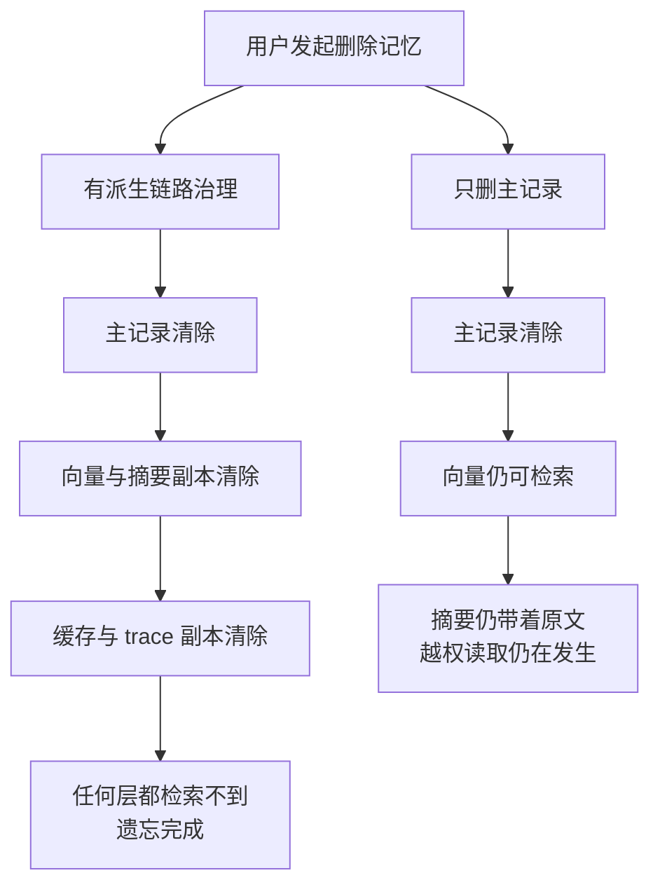

# 记忆是受治理的状态，不是更长的聊天记录

记忆解决的是跨步骤或跨会话需要保留的用户偏好、任务状态和已确认事实，但无限追加聊天记录会传播错误、过期信息和敏感数据。核心做法是把记忆视为有来源、权限、时间、置信度和删除语义的状态；最小实验是写入一条带冲突和撤回的记忆，验证读取、覆盖和遗忘结果。
## 核心要点

| 维度 | 回答 |
| --- | --- |
| 要解决的问题 | Agent 需要跨步骤或跨会话保留有用信息，但把所有历史直接塞回上下文会造成噪声、过期、隐私泄露和无法恢复。 |
| 本质 | 记忆是有所有者、生命周期、来源和删除语义的状态；对话只是其中一种临时表示。 |
| 做法 | 分离对话、任务状态、用户记忆和领域知识，规定写入条件、读取范围、冲突优先级、TTL、撤销和派生数据清理。 |
| 效果与代价 | 相关信息更容易被稳定召回，任务可恢复且隐私边界清楚；代价是分类、权限、迁移和一致性管理更复杂。 |
| 边界 | 摘要和模型推断不能升级为事实；记忆不能替代实时业务 API、版本化知识库或业务数据库事务。 |
| 验证 | 测跨会话召回、无关记忆干扰、冲突处理、删除传播和越权读取，并检查关键结论是否能回到原始事件。 |

Agent 的“记忆”常把四种不同对象混在一起：当前对话、任务执行状态、用户长期偏好和外部知识。它们的所有者、生命周期、准确性和删除要求不同，不能都保存成消息并在以后整段塞回模型。

## 四种状态

| 状态 | 例子 | 生命周期 | 正确存储 |
| --- | --- | --- | --- |
| 对话上下文 | 最近几轮问题与回答 | 当前会话 | 窗口历史 + 可追溯摘要 |
| 任务状态 | 当前步骤、工具结果、预算、审批 | 一次运行直到完成或过期 | 检查点与事件日志 |
| 用户记忆 | 偏好、明确授权保存的事实 | 跨会话，可查看和删除 | 结构化 profile 或带来源的 memory store |
| 领域知识 | 政策、文档、代码和数据 | 独立版本与权限 | RAG、数据库或业务 API |

把领域知识写入用户记忆会造成版本漂移；把工具执行状态只留在对话里会破坏恢复；把模型推断的偏好当作用户事实会产生错误个性化。

## 什么场景必须治理、什么场景先不动

判断的分界线是"记忆错了会不会造成实际伤害"。多用户产品保存偏好与授权（记忆错=错误个性化与越权）、长期运行的任务型 Agent 保存任务状态与中间结论（记忆错=重复劳动与错误决策）、合规要求可删除的场景（漏删=法律风险），这三类必须全套治理，写入策略、TTL、派生清理一个不能省。单用户本地工具、会话即用即弃的脚本助手、记忆只是当轮上下文缓冲的场景，先只做对话窗口与摘要即可，全套治理是过度设计——治理的复杂度本身会引入新的状态，为十条记忆维护派生链路得不偿失。

## 写入比读取更危险

长期记忆必须有写入策略。每条记录至少回答：谁说的、是事实还是推断、属于谁、为何需要保存、何时过期、能否被用户查看和删除。模型可以提议记忆，但系统应按类型和政策决定是否写入数据库。

```yaml
memory_id: ...
subject: user:123
kind: explicit_preference
value: "回答优先使用中文"
source_event: event:456
confidence: high
created_at: ...
expires_at: null
visibility: user_editable
```

“用户可能喜欢深色界面”这类推断应具有较短 TTL 和较低权重，不能覆盖用户明确设置。

## 摘要不是事实源

压缩长历史时，摘要可能省略否定、例外、版本和责任主体。摘要用于帮助选择信息，关键事实仍应链接到原始事件或结构化状态。更新摘要时要防止低质量新摘要覆盖已经确认的重要约束。

## 读取需要相关性、权限与冲突处理

长期记忆不是每次全部加载。Context Builder 只读取当前任务相关且当前主体有权看到的记录，并按明确事实优先于推断、新版本优先于旧版本、用户设置优先于模型观察处理冲突。被撤回或过期的记忆必须停止进入上下文和缓存。

## 遗忘是一项功能

系统需要 TTL、用户删除、权限撤销、数据保留期限和派生数据清理。删除主记录但保留向量、摘要、缓存或 trace，仍然没有真正遗忘。生产设计要维护派生链路，并测试删除传播延迟。



图只回答一个问题：删除动作走完之后，派生链路上还有哪几层活着决定遗忘是否成立——右侧链路少走一层，左侧治理的每一步就是为补那一层存在的。

## 评测记忆

至少覆盖：跨会话是否召回必要偏好、无关记忆是否干扰当前任务、冲突时是否选择正确来源、撤权和删除后是否仍泄露、摘要压缩是否丢失约束、恶意用户能否向其他主体写入记忆。质量指标不能只有“记住了多少”，还要测错误记忆率和不必要暴露率。

相关：[[工程知识/AI 系统工程：从模型能力到生产能力/模型与上下文/上下文工程是在有限预算内构造决策现场]] · [[工程知识/AI 系统工程：从模型能力到生产能力/模型与上下文/跨会话状态的一致性先于记忆的长度]] · [[工程知识/AI 系统工程：从模型能力到生产能力/知识与检索/RAG的核心是选择可引用证据]] · [[工程知识/AI 系统工程：从模型能力到生产能力/模型与上下文/记忆写入治理：来源、主体与过期决定记忆的可信度]]
- [[工程知识/AI 系统工程：从模型能力到生产能力/模型与上下文/上下文工程的分层设计：系统提示工具结果与记忆.md]] —— 记忆层的治理展开

验证的锚点：删除要与派生链路对账——预写撤权后主记录、向量、摘要、缓存与 trace 中的副本全部清除，任一层仍可检索到，与预期对不上就是传播链断了一环。

## 验证

1. 删除传播：写入一条记忆后发起删除与撤权，确认主记录、向量、摘要、缓存与 trace 里的派生副本按派生链路一并清除，并记录传播耗时。
2. 冲突取源：构造两条来源不同、内容冲突的记忆，确认系统按来源可信度与时间取用正确的一条。
3. 越权写入：以非授权主体身份尝试向其他主体的记忆写入，确认被拒且留下记录。

