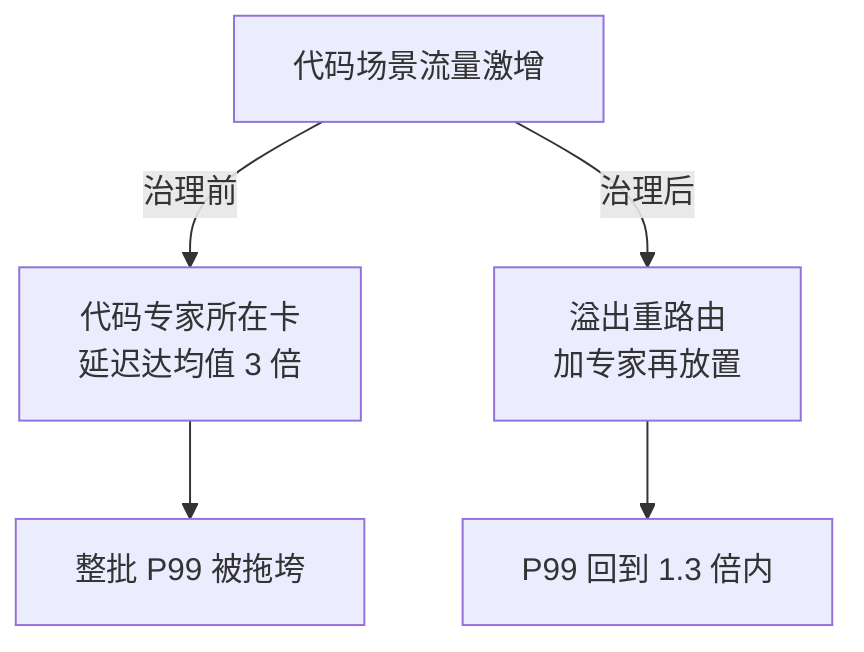

# MoE路由的工程问题：负载不均与显存碎片

## 要解决的问题

MoE（混合专家）模型把前馈层替换为多个专家（FFN），每个 token 由路由器选 top-k 个专家计算。激活参数少（推理算力便宜）但总参数多（显存占用大）——**用显存换算力**。这条路三关：训练时的负载不均（专家被偏爱，其余闲置）、推理时的显存碎片（专家参数分布在多卡）、批处理时的专家带宽瓶颈。本文写这三关的机制与解法，这是现代大模型经济学（成本模型见 [[工程知识/AI 系统工程：从模型能力到生产能力/推理服务与平台/推理服务的单位请求成本从token定价推出来.md]]）的架构侧支柱。

## 机制

**路由机制**。每层一个路由器（小线性层），对每个 token 输出专家概率分布，选 top-k（k 通常 2）专家加权求和。训练目标里路由不均衡：梯度偏爱某几个专家（自增强），其他专家没数据可学。经典解法是辅助负载均衡损失（auxiliary loss，Switch Transformer 2021：e_i × f_i 的乘积惩罚集中度）。训练侧的均衡是学出来的，推理侧的均衡靠系统（批调度与专家放置）。

**推理的显存账**。全部专家参数驻留显存（每个 token 只激活 top-k，但下个 token 可能选别的专家，专家无法按需加载）。8×7B MoE（64 专家）总参数 ~47B：单卡放不下，多卡切分后每张卡都存全部专家的 1/N。显存碎片：专家参数的放置策略（EP， expert parallelism）决定每卡显存的形状——专家均匀放置 vs 按负载加权放置，后者要求路由统计的前置知识。

**带宽瓶颈：all-to-all**。token 要发给它的专家所在卡（all-to-all 通信），计算完再收回。batch 大时 all-to-all 的消息量随 batch 线性涨，通信与计算重叠的调度是 MoE 推理的核心工程。deepseek 系（V3 类）的节点内 NVLink + 节点间 InfiniBand 分层设计把 all-to-all 的带宽分层利用。EP 与 TP（张量并行）的复合并行策略决定通信拓扑。

**批处理交互**。批内不同 token 选不同专家，每专家的输入量不均（热点专家吃 3-5 倍 token）。continuous batching（见 [[工程知识/AI 系统工程：从模型能力到生产能力/推理服务与平台/推理批处理的两难：吞吐与延迟的调度天平.md]]）的调度层如果不管专家负载，热点专家所在卡成为 straggler（长尾卡），整层等待。Expert choice routing（专家反向选 token）与容量因子（capacity factor，超容 token 丢弃或溢出）是均衡手段。

## 背景与代价

思想背景：MoE 起于 1991（Jacobs et al. 的混合专家与分而治之学习），现代形态是 GShard/Switch Transformer（2020-2021，Google）确立的 top-k 路由 + 负载均衡损失 + 容量因子框架。Mixtral 8×7B（2023）证明开源 MoE 可行，DeepSeek-V3（2024）把细粒度专家（256 选 8）+ 共享专家（每 token 必经）推成新默认。共享专家是结构性的减负：高频公共知识进共享专家，路由专家只学残差，路由分布天然更均衡。

最精巧的一笔是**容量因子把“负载不均”从训练问题变成工程参数**。capacity factor 决定每专家每批可处理的 token 上限，超过则溢出（drop 或溢出到下一层）。这个参数把路由的不均衡性变成显式的容量约束：CF=1（严格均衡假设）训练快但丢 token 伤精度，CF>1（冗余容量）保精度但训练慢。推理时 CF 更敏感：丢 token 是直接的输出错误（句子中途语义断裂），推理的 CF 通常更高或用 Expert choice 保证零溢出。代价要摆明：MoE 的“激活参数少”只在 batch 小时兑现——batch 大时多个 token 命中同一专家，专家计算串行化（热点专家的 GEMM 变大但不并行），算力优势随 batch 增长衰减；显存占用是全参数的（总参数 × 每卡份数），8×7B 显存近似 4× 单 7B 稠密模型，见 KV 显存账（见 [[工程知识/AI 系统工程：从模型能力到生产能力/模型与上下文/KV缓存与上下文长度的显存账：为什么长上下文贵.md]]）之外的另一笔显存大头。总账：MoE 便宜的前提是显存充裕 + 通信带宽充裕，两者任一吃紧，MoE 反而比稠密模型贵。

## 边界

- **训练与推理的路由不均是两个问题**。训练侧靠辅助损失学均衡（慢、不彻底），推理侧靠系统调度（快、按负载统计）。两个侧面的解法不能混用：训练侧的均衡不保证推理分布的均衡（数据分布变化后热点漂移）。
- **Expert choice 路由的因果倒置有代价**。专家选 token（而不是 token 选专家）保证负载绝对均衡，但破坏 token 级因果（同一句话的 token 被不同专家处理，语义连贯性受损）。学术基准上可用，开放域生成有质量争议。
- **细粒度专家的通信放大**。专家数从 64 到 256，每 token 的路由开销与 all-to-all 消息数翻倍（top-k 也从 2 到 8）。细粒度的均衡收益与通信代价同涨，节点内高速互连（NVLink 域）是细粒度的前提。
- **部署形态决定专家放置**。单机多卡（EP 节点内）与多机（EP 跨节点）的专家放置策略完全不同：跨节点 all-to-all 走网络（慢），专家复制（热点专家多卡副本）换通信。部署前按路由统计（哪几个专家高频）预放置，而不是均匀盲放。

## 验证

- **路由分布观测**：加载开源 MoE 模型（Mixtral/DeepSeek 类），真实负载前向统计每专家的 token 命中分布。预期：分布显著不均（少数专家吃多数 token），长尾专家稀疏命中。直方图是负载不均的直接证据。
- **容量因子实验**：不同 CF（1.0/1.25/1.5）下训练或推理的吞吐与输出质量（评测分数）对比。预期：CF 升吞吐降、质量升，权衡曲线是参数选型依据。
- **批规模与算力收益实验**：稠密模型 vs MoE（同激活参数量级）在不同 batch 下的吞吐对比。预期：小 batch MoE 优势显著（激活参数少），大 batch 优势衰减（热点串行 + 通信占比上升）。衰减曲线是“激活参数省算力”边界的量化证据。

## 可运行示例与案例回流：路由的账

```text
MoE 推理批次的负载推演账（通用形态）：

  理想账：N 个专家、每 token 选 top-2 → 每专家应分到 2/N 的 token
  现实账：路由器有偏 → 热门专家收到 5 倍于均值的 token
    热门专家所在卡算力打满，其余卡等它 → 整批延迟由最热卡决定
  均衡手段账：辅助负载均衡损失（训练期）、token 丢弃/溢出重路由（推理期）、
    专家放置再平衡（把热门专家按卡摊开）
  显存碎片账：专家权重按卡静态放置 → 请求分布漂移后冷专家占着显存，
    热专家想扩容没地方 → 显存有量但用不上
```

案例回流的第一段画成治理前后两条链，热专家怎么拖垮整批、均衡手段怎么收回来：



碎片占着茅坑的实录——扩容时报"显存不足"，实际 30% 显存被长尾冷专家占用；专家放置按流量定期再平衡后扩容恢复可用。负载均衡思想的同源对照：数据分片的热点治理用一致性哈希摊移动量（见 [[工程知识/数据系统：在并发与故障中保存事实/事务与存储/一致性哈希把再平衡的数据移动量压到平均槽位.md]]），MoE 的专家放置是同一问题在 GPU 卡上的形态。容量与显存的总账见 [[工程知识/AI 系统工程：从模型能力到生产能力/推理服务与平台/GPU显存管理决定服务容量上限.md]]、单请求成本与路由效率的联动见 [[工程知识/AI 系统工程：从模型能力到生产能力/推理服务与平台/推理服务的单位请求成本从token定价推出来.md]]。

## 相关

- [[工程知识/AI 系统工程：从模型能力到生产能力/推理服务与平台/推理服务的单位请求成本从token定价推出来.md]] —— MoE 在成本模型中的架构侧
- [[工程知识/AI 系统工程：从模型能力到生产能力/推理服务与平台/推理批处理的两难：吞吐与延迟的调度天平.md]] —— 批调度与专家负载的交互
- [[工程知识/AI 系统工程：从模型能力到生产能力/模型基础与训练/GPU执行模型与显存层级：SIMT与合并访存.md]] —— 显存与带宽的物理层级
