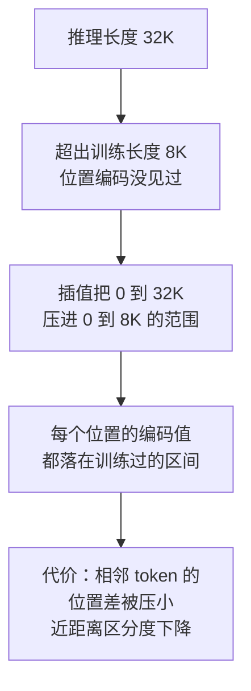

# 位置编码和长上下文限制有效利用

自注意力本身对 token 顺序不敏感：把一句话的词打乱，它看到的集合是一样的。所以必须显式注入位置信息，这就是位置编码的由来。

但更要紧的是第二个问题：**窗口变大，不等于模型能真正用上的信息变多。** 厂商宣称的"支持 128K"常常只是一种**可接受的输入长度**，并不是"在 128K 下稳定工作"。信息放在长上下文的中段时，找回率会明显下降——这是实践中踩得最多的坑。

这一页把两者分开讲清楚，并给出验证长上下文是否真的可用的标准方法。

1. **位置编码** —— 模型怎么知道 token 的顺序（自注意力本身是顺序无关的）
2. **长上下文有效性** —— 窗口变大了，但模型能真正用上的信息并没有同步变多

**第 2 点是工程上最容易踩的坑**：厂商宣称"支持 128K 上下文"，不等于你的业务在 128K 长度下能正常工作。

## 背景：128K 的窗口，第 3 页的信息就是找不到

一个合同审查应用，把整份合同（约 60K token）塞进上下文，问："第 3 页提到的违约金比例是多少？"

**模型答错了**，给了一个合同里根本不存在的数字。

但把"第 3 页"单独摘出来（约 2K token）问同样的问题 —— **答对了**。

这就是著名的 **"Lost in the Middle"（中段丢失）** 现象：

| 信息位置 | 找回率 |
| --- | --- |
| 开头 | 高 |
| 结尾 | 高 |
| 中间 | 显著下降，这是长上下文的软肋 |

**实测规律**（不同模型程度不同，但趋势一致）：

| 信息位置 | 短上下文（4K） | 长上下文（32K+） |
| --- | --- | --- |
| 开头 | 高 | 高 |
| 中间 | 高 | **明显下降** |
| 结尾 | 高 | 高 |

这个现象论文量出来是一条 U 形实测曲线：


曲线两端高、中段是深谷：第 5 到第 15 号位置全部低于红虚线（不给上下文的闭卷基线）——信息放在中间，有上下文反而不如没有。开头的 76 高于结尾回升后的 63，最便宜的优化是把关键信息放开头。图取自 [Lost in the Middle 论文（arxiv 2307.03172）](https://arxiv.org/abs/2307.03172)。

**工程含义**：**不要因为"窗口够大"就把所有内容都塞进去。** 关键信息要放在开头或结尾，或者用检索把相关信息挑出来。

## 从 0 开始：为什么需要位置编码

### 自注意力是顺序无关的

自注意力的计算是：**每个 token 对所有 token 算相似度，然后加权求和**。

```
"猫 追 狗"  和  "狗 追 猫"
```

**如果只看 token 集合，两者是一样的** —— 但语义完全相反。

**自注意力机制本身无法区分顺序**，所以必须显式注入位置信息。

### 三种方式

| 机制 | 做法 | 特点 |
| --- | --- | --- |
| **绝对位置编码** | 给每个位置一个固定的向量，加到 token embedding 上 | 简单；但**训练时没见过的位置无法处理** |
| **相对位置** | 在注意力计算里加入位置间的距离信息 | 泛化更好；实现各异 |
| **RoPE（旋转位置编码）** | 用"旋转"的方式编码位置，让 attention 自然感知相对距离 | **现代主流**（LLaMA、Qwen、DeepSeek 都用它） |

**RoPE 的直觉**：

```
把 token 的向量按位置"旋转"一个角度
位置 0 → 旋转 0°
位置 1 → 旋转 θ
位置 2 → 旋转 2θ
...

两个 token 的注意力分数 ∝ 它们旋转角的差
  → 自然表达了"相对距离"
```

**优势**：表达的是**相对**关系，所以比绝对位置编码更容易外推到更长的序列。

## 长上下文的真正限制

窗口变大不等于有效。**限制来自四个方面**：

### 1. 位置外推（训练长度之外会失真）

```
模型训练时最长 8K
  → 推理时给 32K
  → 超出 8K 部分的位置编码是"没训练过的"
  → 模型表现下降甚至胡言乱语
```

**厂商的解法**（各种长上下文技术）：

- **位置插值（PI）**：把长位置"压缩"到训练过的范围内
- **NTK 感知缩放**：对不同频率用不同的缩放
- **YaRN**：结合插值和频率调整



图回答插值类技术在做什么：把没见过的位置线性映射回训练过的区间，代价是近距离位置的区分度被压掉一部分，这正是各家方法在不同频率上做文章的原因。

**这些技术的效果差异很大**——同样宣称 128K 的模型，外推可用倍数从 2 倍到 8 倍不等（以 needle 测试找回率不低于短上下文为判据，逐模型实测）。

**工程建议**：不要采信"最大窗口"这个数字，要在你的实际长度上测。

### 2. 注意力稀释（中段丢失）

前面的案例。**信息在长上下文的中间时，注意力被稀释。**

可能的原因：

- 训练数据的分布（关键信息常出现在开头/结尾）
- 注意力分数的竞争（长序列下 softmax 被摊薄）

### 3. KV cache 与成本

见 [[工程知识/AI 系统工程：从模型能力到生产能力/推理服务与平台/批处理、KV缓存、量化与并行如何改变服务容量]]：

```
70B 模型，FP16：约 0.32 MB / token
128K 上下文 = 42 GB 的 KV cache（单个请求）
```

**长上下文的成本是超线性的**（attention 是 O(n²)，KV cache 是 O(n)）。

### 4. 排队与延迟

长请求占用 GPU 时间长 → 其他请求排队 → **整体延迟上升**。

**这是为什么长上下文服务的并发要严格限制。**

## 生产怎么用

### 原则：不要默认"全塞进去"

| 做法 | 适用 |
| --- | --- |
| **检索 + 精准注入** | 大多数场景 |
| 全文塞入 | 只在文档确实不长（< 32K）且信息分散时 |
| 分层/摘要 | 超长文档（先摘要，再按需展开） |

先用检索把相关信息挑出来。确实需要跨全文推理的任务（多文档对比、全局归纳）才用长上下文。

### 长上下文 vs RAG 的取舍

| | 长上下文 | RAG |
| --- | --- |
| 信息完整性 | 全文都在 | 依赖召回质量 |
| 成本 | 高（尤其是长文档） | 低 |
| 延迟 | 高 | 低 |
| 中段信息 | 易丢失 | 检索出来就明确 |
| 适合 | 需要跨全文推理 | 定位明确的事实 |

**实践建议**：**混合使用** —— 用 RAG 定位，把命中的片段放进上下文（而不是整个文档）。

### 信息摆放位置

如果必须用长上下文，**关键信息放开头或结尾**：

- 关键指令或关键文档：放在最前面
- 其余上下文：放在中间
- 再次强调关键要求：放在末尾

### 长上下文服务的工程配置

- **限制并发**：长请求占用资源多，要单独限流
- **前缀缓存**：相同的系统提示可以复用（注意租户隔离）
- **分级处理**：短请求和长请求用不同的队列/实例，避免长请求阻塞短请求

验证的锚点：外推的有效范围要实测画界——长度外推方法宣称的上下文窗口与实测有效窗口对不上是常态（困惑度平稳不等于检索与推理能力保持），按有效窗口设界并标注。

## 验证：怎么测长上下文是否真的可用

**"Needle in a Haystack"（针在草堆里）测试**，这是标准方法：

```
1. 构造一段长文本（比如 32K）
2. 在其中的某个位置插入一句无关的事实（"针"）
   比如："最好的冰淇淋口味是薄荷巧克力片"
3. 问模型："文档里提到的最好的冰淇淋口味是什么？"
4. 改变"针"的位置（开头/25%/50%/75%/结尾）和文本长度
5. 记录每个组合的找回率
```

**画成热力图**，横轴是文本长度，纵轴是针的位置：

| 信息位置 | 4K | 8K | 16K | 32K | 64K |
| --- | --- | --- | --- | --- | --- |
| 开头 | 可用 | 可用 | 可用 | 可用 | 可用 |
| 25% | 可用 | 可用 | 可用 | 可用 | 退化 |
| 50% | 可用 | 可用 | 可用 | 退化 | 失效 |
| 75% | 可用 | 可用 | 可用 | 可用 | 退化 |
| 结尾 | 可用 | 可用 | 可用 | 可用 | 可用 |

中段最先失效，这是长上下文最典型的退化形态。

全绿之后才能说"支持这个长度"。很多模型宣称 128K，但在 64K 的中段就已经失效了。

**还要测的**：

- 跨段引用（"第三章提到的 X 和第七章的 Y 有什么关系"）
- 多跳推理
- 冲突事实（文档里有矛盾信息时怎么处理）
- 加上噪声后的表现（真实场景总有无关内容）

## 常见错误

**错误 1：把"最大窗口"当成"可用长度"**

厂商的 128K ≠ 你的业务在 128K 下正常。**必须用自己的数据测。**

**错误 2：默认把整个文档塞进去**

中段信息会丢失，成本还高。**优先检索。**

**错误 3：关键信息放中间**

放开头或结尾。**这是最便宜的优化。**

**错误 4：忽略长请求的排队影响**

一个 128K 请求可能占用 GPU 几十秒 → 其他请求全排队。**长请求要单独限流/隔离。**

**错误 5：以为长上下文能替代检索**

成本、延迟、中段丢失都是问题。**检索仍然是最有效的手段。**

**错误 6：不做 needle 测试就上线**

"支持长上下文"写进了产品文档，实际中段信息根本找不到。**上线前必须测热力图。**

关系：[[工程知识/AI 系统工程：从模型能力到生产能力/模型基础与训练/Transformer如何把序列建模成可扩展计算]] · [[工程知识/AI 系统工程：从模型能力到生产能力/模型与上下文/上下文工程是在有限预算内构造决策现场]]

## 边界

- 窗口容量不等于有效容量：位置外推在训练长度之外失真，可用长度依赖模型与具体任务。
- 中段信息容易被忽略：关键信息位于长文本中间时找回率下降，信息摆放位置本身就是一个可调变量。
- 成本随长度增长快于线性：注意力计算随长度平方增长，KV cache 随长度线性增长，长请求的资源占用需要在容量规划里单独核算。
- 长请求会挤占其他请求：单个长请求占用 GPU 时间较长，不做队列隔离时短请求的延迟被抬高。
- 长上下文不能替代检索：定位明确的事实用检索成本更低，长上下文适合需要跨全文推理的场景。

## 要解决的问题

窗口声明支持的长度与实际能正常利用的长度之间存在落差，把整份文档交给模型之后，中间段落的信息查不到，成本与延迟却明显上升。本篇回答：位置信息怎样进入注意力计算、窗口之外为什么会失真、中段信息为什么会丢、长请求对同批其他请求造成什么影响，以及可用长度要怎样实测才能写进产品说明。

