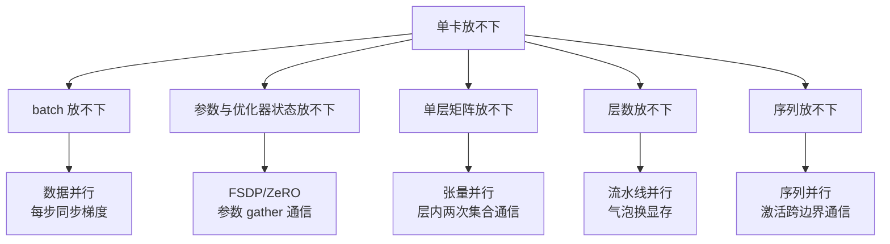

# 分布式训练与并行策略如何切分模型

单卡放不下模型或 batch 时，训练系统可以复制模型、切分参数/梯度/优化器状态、切分层或切分 token。并行策略的本质是用通信和调度复杂度换取显存容量或吞吐，不能只按“卡越多越快”判断。

## 主要策略

| 策略 | 切分对象 | 主要收益 | 主要代价 |
| --- | --- | --- | --- |
| data parallel | 每卡完整模型，不同数据 | 简单、吞吐高 | 每步同步梯度，模型仍需放入单卡 |
| FSDP/ZeRO | 参数、梯度、优化器状态 | 降低单卡显存 | 参数 gather、通信和 checkpoint 复杂 |
| tensor parallel | 同一层矩阵 | 容纳大层、低延迟 | 每层 collective，依赖高速互联 |
| pipeline parallel | 不同层 | 容纳更深模型 | pipeline bubble、调度和负载不均 |
| sequence/context parallel | 序列或上下文维度 | 长上下文容量 | 激活通信和切分边界复杂 |

混合并行需要明确 micro-batch、通信拓扑、梯度累积、混合精度和故障恢复。通信量、同步等待和 straggler 可能抵消额外 GPU；跨节点网络比单机 NVLink/PCIe 具有完全不同的边界。

流水线并行的气泡是怎么产生的，一张图看两张调度的时间轴对照：

来源：HuggingFace 官方文档「Efficient Training on Multiple GPUs」。上半部分的阶梯是气泡的原始形态（任一时刻只有一个设备活跃），下半部分把每个格子切细后四个设备同时填满——「bubble 占比 ≈ (p-1)/(m+p-1)，micro-batch 数 m 越大气泡越小」在图上就是下半部分中间那块标注 Bubble 的空白随格子细分而缩小；图上每个格子的宽度也解释了为什么流水线并行的通信只发生在层边界。

三种并行怎么拼在一起，组合形态长这样：

来源：同上文档。同一 Rank 内的横轴是层切分（F0→B3 依次流过），Rank 之间是数据副本，末尾两排对齐的 Step 框是梯度同步点——「机内张量并行、机间数据并行或流水线」的装机规律在这幅图上就是分组边界的画法：通信最频繁的切分放在同一 Rank 的同一台机器内，跨 Rank 只交换一次梯度。

图把选型收成一条路径：哪种资源不够决定切哪里，右侧一列就是随之进关键路径的通信账。

## 训练状态与恢复

checkpoint 不只是模型权重，还包括 optimizer、scheduler、随机数、数据游标、并行拓扑和版本。保存频率由重算成本、存储带宽和故障概率决定；恢复后必须验证 loss、步数、数据顺序和参数一致性，不要只检查文件存在。

## 背景与代价：并行策略是通信约束下的妥协

这套策略族定型于 2018 到 2021 年：Megatron-LM（2019）确立张量并行在 NVLink 域内的用法，ZeRO（2019）把数据并行改进成参数、梯度、优化器状态分档切分，流水线并行更早，GPipe（2019）给出 micro-batch 减气泡的形态。它们回答的是同一个问题——单卡显存增速跟不上参数量增速，且跨设备带宽远低于设备内算力。代价本质随之而来：每拿一份显存容量，都在关键路径上添一段通信或等待，数据并行拿吞吐换显存不变、FSDP 拿 gather 通信换显存、张量并行拿层内同步延迟换单层容量、流水线拿气泡换深度，没有一种切分是免费的。策略组合到最后是给机内机间分配不同并行方式的装箱问题，判据始终是那本通信账。

## 最小实验

固定全局 batch、序列长度、精度、数据和步数，测每卡吞吐、扩展效率、通信占比、显存、p99 step time 和故障恢复时间。改变并行度或节点时同时比较收敛、数值稳定、最终质量和 checkpoint 可恢复性。

关系：[[工程知识/AI 系统工程：从模型能力到生产能力/模型基础与训练/Transformer如何把序列建模成可扩展计算]] · [[工程知识/性能工程：从用户等待到资源瓶颈/处理器与内存/GPU性能取决于计算、访存、并行与通信]]

## 量化锚点：通信量的分账

三种并行的通信账不同：数据并行的梯度量 = 参数量（70B 参数 × fp16 每参数 2 字节 = 每步 140GB 梯度），用梯度压缩/分桶重叠可藏进计算；张量并行的激活通信在每个层内两次（前向一次反向一次），必须放在 NVLink 域内（跨机 PCIe 带宽差 10 倍以上，放错位置吞吐塌方）；流水线并行的通信只有层边界激活（最小），代价是气泡（bubble 占比 ≈ (p-1)/(m+p-1)，micro-batch 数 m 越大气泡越小）。混合策略的装机规律：机内张量并行（NVLink）、机间数据并行或流水线（IB/以太网），显存不够再补 ZeRO 切分。

## 案例回流：检查点与状态机的衔接

训练恢复与 [[工程知识/AI 系统工程：从模型能力到生产能力/Agent与工作流/Agent状态机与任务恢复：进度是状态不是聊天记录]] 的状态机同构：断点续训的正确性来自"优化器状态 + 数据位点 + 随机数状态"三件套的原子保存（模型参数只是一件），漏任何一件都恢复出静默偏差——Agent 恢复的正确性来自输出 hash 锚点与幂等键，同一个纪律。故障实录可参 [[工程知识/缺陷分析：从个案到体系/并发/案例三十二：取到了已经不存在的那个——估算器的读取竞态]]：并发读取与生命周期错配在训练 dataloader 的预取路径上是同款病。

验证的锚点：策略取舍要与通信占比对账——预写每种切分下的通信时间占比与显存占用，实测与预期对不上就说明瓶颈出现在另一维度。

## 要解决的问题

模型或单批数据超出单卡容量时，训练无法启动，而简单地增加设备数量并不会自动加快训练，通信与调度会成为新的限制。本篇回答：复制模型、切分参数与梯度与优化器状态、切分层、切分输入各自解决什么、通信量由哪些环节承担、哪一种切分方式对应哪一种容量不足。

