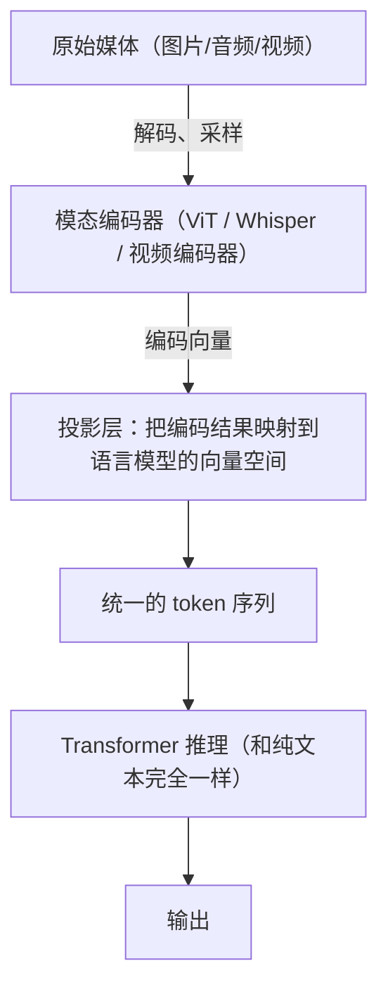
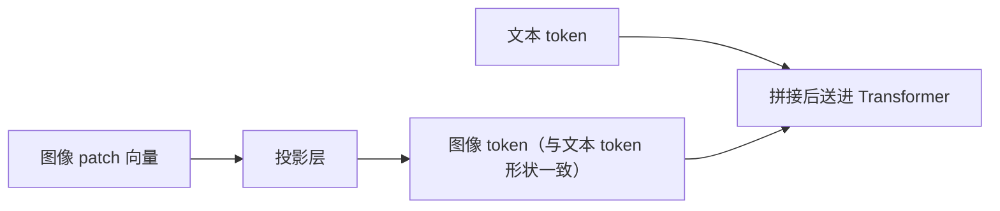

# 多模态模型把不同输入映射到共同推理接口

多模态模型解决的是：**让文本、图像、音频、视频能被同一个模型一起理解。**

做法不是"把图片塞进 prompt"。每种模态有各自的编码器，先把图片/音频/视频转成向量，再经投影层映射成语言模型能接受的 token——**在模型内部，图像 token 和文字 token 已经没有区别**，所以可以拼在同一个序列里一起推理。

理解这条链路有实际用处：**不同模态转成 token 的规则和代价差异极大**，一张 1080p 截图可能是 1000-3000 个 token，一分钟视频可以上万。不看这一层，成本和延迟的估算会差一个数量级。

## 背景：一张截图让账单翻了 10 倍

一个客服系统接入了视觉能力，让用户可以截图提问。上线后：

- **成本暴涨**：单次请求从 0.003 美元涨到 0.03 美元
- **延迟变长**：TTFT 从 300ms 涨到 2.5 秒
- **偶尔报错**：`context length exceeded`

原因：**一张 1080p 截图会转成 1000-3000 个 image token**，而团队按"一张图 ≈ 100 token"估算的。

**这就是不懂"模态如何转成 token"的直接后果。**

## 从 0 开始：多模态链路



**关键在中间两步**：

### 1. 模态编码器：把非文本变成向量

| 模态 | 典型编码器 | 输出 |
| --- | --- | --- |
| 图像 | ViT（视觉 Transformer） | 一组 patch 向量 |
| 音频 | Whisper 类 | 音频帧向量 |
| 视频 | 图像编码器 + 时间采样 | 多帧的图像向量 |

### 2. 投影层：对齐到语言模型的空间

编码器输出的向量和语言模型的 token embedding **不在同一个空间**。投影层（通常是一个小的 MLP，或者叫 adapter / connector）负责把它们**映射成语言模型能理解的"伪 token"**。



**这就是为什么多模态模型能"看图说话"**：在模型内部，图像 token 和文字 token 已经没有区别了。

## 成本：视觉 token 数是怎么算的

**这是工程上最需要知道的部分。**

### 图像 token 数

常见做法是把图片切成 **patch**（比如 28×28 像素一块）：

```
一张 1024×1024 的图
  → 切成 (1024/28) × (1024/28) ≈ 37 × 37 ≈ 1369 个 patch
  → 可能还要合并/池化 → 最终几百到几千个 token
```

**不同模型的差异很大**（这决定了成本）：

| 因素 | 影响 |
| --- | --- |
| 分辨率 | 越高 token 越多（近似平方关系） |
| 切分策略 | 有的模型支持动态分辨率（小图少 token） |
| 合并方式 | pixel shuffle / 池化能显著降低 token 数 |

**经验参考**（具体看模型文档）：

| 图片 | 大约 token 数 |
| --- | --- |
| 低分辨率小图（512×512） | ~300-600 |
| 标准图（1024×1024） | ~1000-1600 |
| 高分辨率 / 多图 | 可达数千 |

**成本含义**：一张图可能相当于几千个文字 token。**多图请求的成本会迅速累积。**

### 视频更贵

视频 = 多帧图像：

```
1 分钟视频，每秒采样 1 帧 = 60 帧
每帧 500 token = 30,000 token（仅视频部分）
```

**这就是为什么长视频理解成本高、很多产品限制视频时长。**

### 音频

音频通常按时长计费或转换：

| 方式 | 说明 |
| --- | --- |
| 先转文字（ASR） | 便宜，但丢失非语音信息（语气、环境声） |
| 直接音频编码 | 保留更多信息，成本高 |

**实践建议**：如果只需要"说了什么"，**先 ASR 再送文本**通常更划算。

## 能力与边界（常被高估）

### 视觉语言模型擅长什么

| 擅长 | 不擅长 |
| --- | --- |
| 描述图片内容 | **精确的像素级测量**（"这个按钮宽多少像素"） |
| 视觉问答 | 精确的空间关系（"A 在 B 的左边还是右边"） |
| 图表理解（趋势、结论） | **精确的数值读取**（误差可能很大） |
| OCR（印刷体、清晰图） | 手写、模糊、复杂表格的 OCR |
| 场景理解 | 计数（超过 5-10 个物体就容易错） |

**重要**：**不要让视觉模型做精确的数值提取。** 需要精确数字时，用专门的 OCR/检测模型，视觉模型做语义理解。

### 错误会沿着链路传播

```
音频转写错误 → 摘要错误 → 检索错误 → 工具调用错误
```

**应对**：

- 保留**原始片段和时间戳**，便于回溯
- 关键场景**人工复核转写结果**
- 不要把转写结果当作唯一真相

## 安全：多模态带来新的攻击面

| 风险 | 说明 |
| --- | --- |
| **图片里的文字** | 截图、海报里可以藏提示注入指令 |
| **隐藏内容** | 图片元数据（EXIF）、极低对比度的文字 |
| **音频注入** | 音频里可能有人耳听不清但模型能识别的指令 |
| **跨模态绕过** | 文本过滤挡住了，但同样内容放在图片里就过了 |

**应对**：

- **图片里的文字同样是不可信输入**（见 [[工程知识/AI 系统工程：从模型能力到生产能力/安全与治理/提示注入和工具越权是不同威胁]]）
- 内容审核要**覆盖所有模态**，不能只审文本
- 敏感操作不能仅凭模型对图片的理解来授权

## 生产怎么用

### 成本控制的四个手段

| 手段 | 做法 |
| --- | --- |
| **降分辨率** | 大多数任务不需要原图；缩到能看清即可 |
| **裁剪关键区域** | 只传相关部分，而不是整张图 |
| **动态分辨率** | 用支持动态分辨率的模型，小图自动少 token |
| **缓存** | 同一张图多次提问时复用（按图片 hash） |

**最有效的是降分辨率和裁剪** —— 很多时候 512×512 和 1024×1024 的效果差异很小，但 token 差 4 倍。

### 延迟优化

- **预处理异步化**：图片解码、缩放不占模型调用时间
- **图片压缩**：传输和处理的都变小
- **流式输出**：和文本一样，边生成边返回

验证的锚点：模态必要性要与输入形态对照对账——预写同一批样本只给文本描述能否达标，达标与预期对不上再谈必须看图，避免为不需要的模态付成本。

## 验证方法

对同一批样本，比较不同输入形态的表现：

| 输入 | 目的 |
| --- | --- |
| 原图 | 基线 |
| 低分辨率图 | 测试降配后的质量损失 |
| 裁剪图 | 测试裁剪是否丢失关键信息 |
| 纯文本描述 | 对比"必须看图"还是"文字就够" |

**记录**：结构化字段的准确率、遗漏率、token 数、端到端延迟。

**很多时候会发现：文字描述就够了，不需要传图。**

## 常见错误

**错误 1：低估图像 token 数**

按"一张图 ≈ 100 token"估算 → 成本翻十倍。**必须查模型文档实测。**

**错误 2：用原始分辨率**

1080p 截图对大多数任务没必要。**先缩放。**

**错误 3：让视觉模型做精确数值提取**

误差大。**用专门的 OCR/检测模型。**

**错误 4：只审文本不审图片**

图片里同样能藏恶意指令和违规内容。**多模态审核。**

**错误 5：把转写结果当真相**

ASR 会错，且错误会沿链路传播。**保留原始音频和时间戳。**

**错误 6：多图请求不控制数量**

一次传 10 张图 = 上万个 token。**限制图片数量，或先筛选。**

关系：[[工程知识/AI 系统工程：从模型能力到生产能力/模型与上下文/上下文工程是在有限预算内构造决策现场]] · [[工程知识/AI 系统工程：从模型能力到生产能力/安全与治理/提示注入和工具越权是不同威胁]] · [[工程知识/AI 系统工程：从模型能力到生产能力/模型基础与训练/Token、Embedding与表示学习连接数据和模型]]

## 验证

1. 跨模态配对：同一语义分别以文本与图像输入，确认两条通路得到的答案一致，差异对应到可解释的编码或采样损失上。
2. token 计量：对同一请求分别用文本与媒体形态提交，记录实际 token 数与延迟，与按分辨率、采样率估算的数量对得上。
3. 保真核对：转写或识别结果与原始音频、图像一起留存，下游断言引用原文。

## 机制与本质

多模态模型的机制层：图像、音频与视频各自经编码器得到向量，再经投影层映射进语言模型的表示空间，在模型内部与文本 token 处于同一序列，一并参与注意力计算。这条通路决定了请求的 token 数量由分辨率、采样率与切分策略共同决定，成本与延迟因此随媒体形态而不是随文字长度变化。

## 要解决的问题

文本、图像、音频、视频分散在各自的处理流程里，跨模态的信息无法在同一处被比较和推理。本篇回答：不同模态的输入怎样映射到共同的表示空间、映射过程各自损失什么、跨模态对齐在什么条件下成立，以及哪种任务适合交给统一模型、哪种适合保留各自的专用组件。

