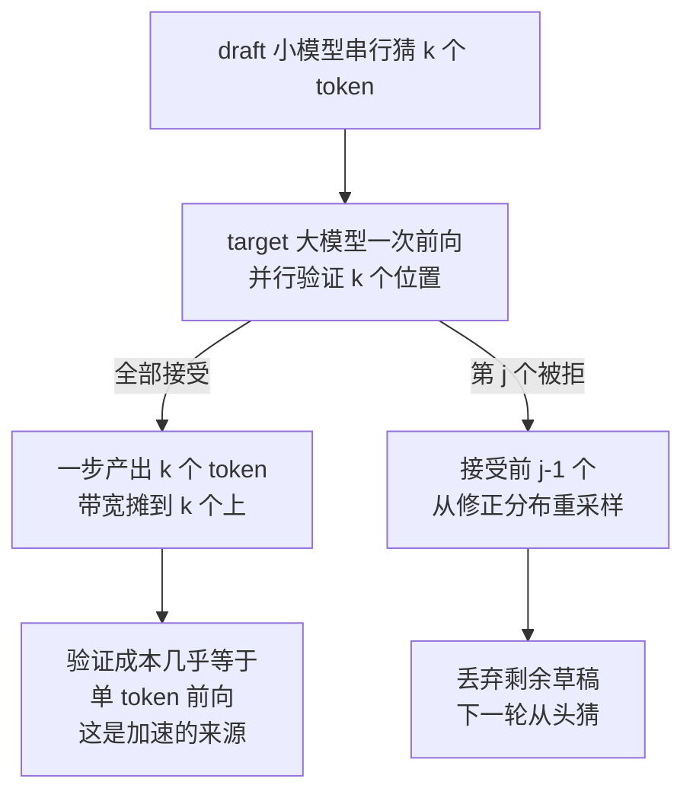
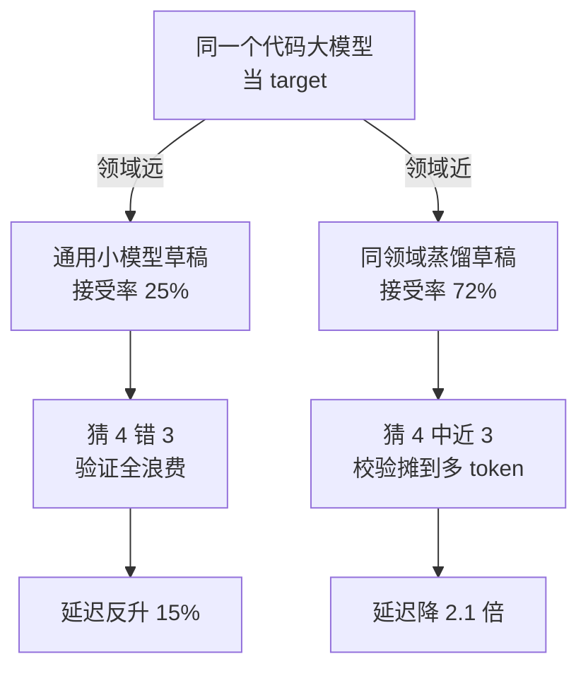

# 投机采样与推测解码：小模型带路大模型确认

## 要解决的问题

自回归解码是串行的：每 token 一次前向，GPU 在 decode 阶段是 memory-bound（权重与 KV 读取主导，算力闲置）。投机采样（speculative decoding）要解决的问题是**用一次大模型前向确认多个小模型 token**，把串行解码的“每步一 token”变成“每步多 token”，在不改变输出分布的前提下加速推理。这是 decode 阶段（算术强度低）对算力闲置的结构性利用，与批处理（吞吐侧，见 [[工程知识/AI 系统工程：从模型能力到生产能力/推理服务与平台/推理批处理的两难：吞吐与延迟的调度天平.md]]）从两个方向挤压成本。

## 机制

**基本协议**。小模型（draft 模型）先猜 k 个 token（廉价、串行快），大模型（target）一次前向并行验证这 k 个 token（一次前向算 k 个位置的分布）。验证按分布对齐：draft 与 target 的输出分布不同，直接接受会改变输出分布。投机采样的接受准则（Leviathan et al. 2023 / Chen et al. 2023）：按 min(p_t/q_d, 1) 概率接受 draft token，被拒时从修正分布 resample——数学上保证最终输出分布与 target 独立采样完全一致（无损）。这是它与贪心 draft-top-1 或早退（early-exit）方法的本质区别。

**加速比的结构**。每轮（一次 target 前向）产出 E[k] = (1-q^{k+1})/(1-q) 个 token（q 为 draft 平均接受率），加速比上限 k+1，实际 E[k]/1 与 target 单步的比。接受率 q 是一切的杠杆：q 高（draft 与 target 对齐好）加速比大，q 低（draft 乱猜）纯亏（draft 浪费 + 验证浪费）。q 取决于任务（模板性文本 q 高：代码、格式化输出、闲聊；自由创作 q 低）与 draft 质量（同家族小模型 > 不同家族）。EAGLE 类方法在树形 draft 与 KV 复用上进一步压每 token 成本，接受长度 3-5 常态。



图回答为什么一次前向能换 k 个 token：验证 k 个位置与生成 1 个 token 的前向成本几乎相同，猜对的部分等于白拿，猜错的位置付一次重采样。

**资源与部署形态**。draft 与 target 同卡（draft 占显存小，但两模型间切换有开销）或异卡（draft 独立小卡）。自推测（self-speculative，同一模型的不同层做 draft）省掉独立 draft 的显存与维护。批次维度：投机采样与 continuous batching 组合时，批内各请求的接受长度不同，步调度按最小接受长度推进（木桶效应）——批模式下加速比打折，见批处理篇（上文链接）的调度天平。

## 背景与代价

思想背景：推测执行是 CPU 分支预测与编译器并行化的老思想（1970s+），搬进 LLM 推理的关键洞察是“大模型前向的并行性被浪费了”——验证 k 个 token 与生成 1 个 token 的前向成本几乎相同（GEMM 为主，见 GPU 执行模型（见 [[工程知识/AI 系统工程：从模型能力到生产能力/模型基础与训练/GPU执行模型与显存层级：SIMT与合并访存.md]]）的 memory-bound 分析）。DeepMind（Leviathan 2023）与 DeepSpeed（Chen 2023）同年论文确立分布级无损框架，后续 EAGLE/Medusa/Mamba 系在 draft 结构上演化（独立小模型 → 自推测 → 树形 draft 头）。

最精巧的一笔是**接受准则的无损性证明**。speculative sampling 的修正分布 resample（拒绝后从 max(0, p_t - q_d) 归一化分布采）数学上等价于从 target 分布直接采样——输出分布严格不变，加速是免费的（同一模型同一分布，只是解码路径变短）。这个“免费加速”是它与其他有损加速（量化有损、蒸馏有损、早退有损）的哲学差异。代价要摆明：免费的是质量，不是资源——draft 前向、验证浪费（低接受率时 draft 白算）、KV 管理复杂化（draft 与 target 的 KV 同步）。加速比是期望值不是保证：拒绝后的重采样与下一轮 draft 重启，让延迟分布出现长尾（P99 可能劣化）；与批处理组合的木桶效应让服务化场景的实际收益小于论文单请求数字。部署前按真实负载画像（任务谱、长度分布）实测，别拿 benchmark 单点外推。

## 边界

- **接受率是任务依赖的，没有普适加速比**。代码与模板文本接受率 0.8+（2-3x 加速），自由创作 0.3-0.5（可能负收益）。上线前按任务谱实测接受长度分布，负收益任务关闭投机采样（按请求路由开关）。
- **draft 模型的选择是新决策维度**。同家族小模型（对齐好但多一个模型要维护）、自推测（省显存但结构改造）、draft 头（Medusa/EAGLE 类，训练要投资）。选型三问：接受率多少（实测）、draft 成本占比（前向 + 显存）、维护复杂度（多模型的版本同步）。
- **P99 劣化是隐藏代价**。期望加速掩盖尾部：接受长度方差大时，同 batch 内快请求被慢请求拖（木桶）。交互场景（对延迟敏感）与吞吐场景（对延迟钝感）对投机采样的收益评估完全不同。
- **与量化、批处理的组合收益不是叠加的**。量化提速 decode（带宽侧）、批处理摊薄权重读取（吞吐侧）、投机采样缩短串行链（延迟侧）三者作用于不同瓶颈，组合收益要实测，可能互相挤占（批模式下投机加速比打折）。容量规划用联合画像，见批处理与容量（见 [[工程知识/AI 系统工程：从模型能力到生产能力/推理服务与平台/批处理、KV缓存、量化与并行如何改变服务容量.md]]）。

## 验证

- **接受率与加速比实测**：同一 target 配不同 draft（同家族 0.5B/1.5B/3B、自推测），跑代码/闲聊/创作三类负载，统计接受长度分布与端到端加速比。预期：任务谱与 draft 质量双维度决定加速比；代码任务 2-3x、创作任务接近 1x 甚至负收益。任务依赖性的直接证据。
- **无损性验证**：投机采样开与关在同一温度下生成 N 条输出，对比输出分布（对齐统计或下游评测分数）。预期：分布一致（无显著差异）。无损声明的事后验证。
- **批模式收益衰减实验**：单请求 vs batch=32 下投机采样的加速比对比。预期：批模式下加速比明显衰减（木桶效应）。衰减曲线是服务化场景容量规划的依据。

## 可运行示例与案例回流：投机的账

```text
一次投机解码的推演账（通用形态，量级为公开典型值）：

  常规解码：大模型逐 token 出，每次前向都吃满一次显存带宽 → 利用率低
  投机账：小模型一次猜 4 个 token → 大模型一次前向并行验 4 个
    → 全对：一步出 4 token（大模型校验的带宽摊到 4 个 token 上）
    → 第 3 个错：接受前 2 个，丢弃后 2 个，从错误处重新走
  接受率的账：小模型与大模型分布越接近接受率越高
    → 领域近的草稿模型收益大；领域远的接受率 20%，加速比反而 < 1（白猜）
  输出分布不变账：拒绝采样保证最终分布与大模型独立采样一致
    → 加速不降质是机制保证，调参换来的
```

两种草稿接到同一个 target 上的实测对位，把「接受率是杠杆」画成两条链：



案例回流：批处理冲突的实录——在线服务为省显存把投机解码与大 batch 共用，投机带来的收益被 batch 排队吃掉（投机加速的是单序列带宽利用，batch 大时本来就在摊薄）；投机适合延迟敏感的单请求场景。分布漂移的实录——采样温度调高后接受率从 70% 掉到 45%（高温下小模型更难猜中），加速比掉到 1.1；温度与草稿策略要联动调。解码加速的容量前提见 [[工程知识/AI 系统工程：从模型能力到生产能力/推理服务与平台/GPU显存管理决定服务容量上限.md]]、加速与成本的联动账见 [[工程知识/AI 系统工程：从模型能力到生产能力/推理服务与平台/推理服务的单位请求成本从token定价推出来.md]]、模型协同的选型观见 [[工程知识/AI 系统工程：从模型能力到生产能力/生态与选型/模型、框架、运行时与协议解决不同问题.md]]。

## 相关

- [[工程知识/AI 系统工程：从模型能力到生产能力/推理服务与平台/推理批处理的两难：吞吐与延迟的调度天平.md]] —— 吞吐侧优化的对偶
- [[工程知识/AI 系统工程：从模型能力到生产能力/模型基础与训练/GPU执行模型与显存层级：SIMT与合并访存.md]] —— decode 阶段的算术强度分析
- [[工程知识/AI 系统工程：从模型能力到生产能力/推理服务与平台/模型量化的精度经济学：位宽精度与显存的三角.md]] —— 另一维度的降本杠杆
- [[工程知识/AI 系统工程：从模型能力到生产能力/推理服务与平台/模型路由与级联：小模型过滤大模型兜底的省钱结构.md]] —— 小模型辅助大模型的亲缘结构
