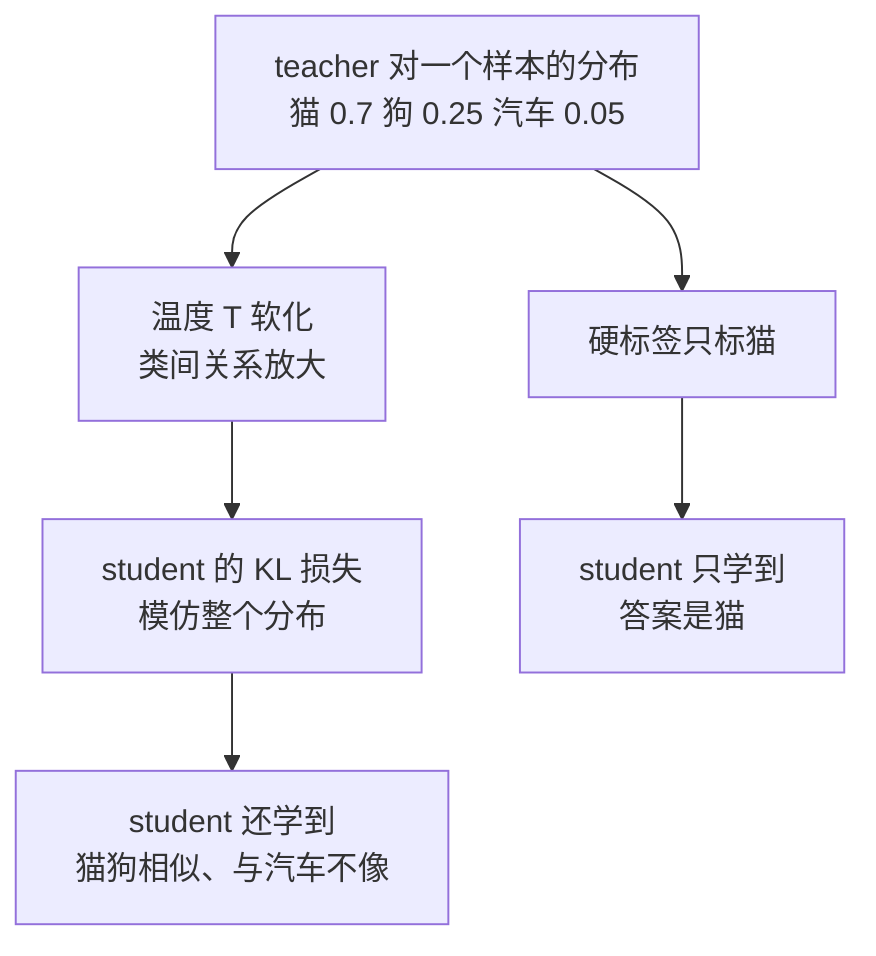

# 蒸馏与模型合并：用小模型承接已验证的能力

7B 学生模型蒸馏自 70B 教师后在目标任务上追平教师，推理成本降一个量级——这类结果成立的前提常被忽略：任务分布固定、教师在该分布上确实强、学生有足够容量承接。要解决的问题：把已验证的教师能力压缩到可部署成本预算内，并诚实评估压缩后的能力边界，而不是把 benchmark 提升直接外推为生产收益。

本质是能力转移的两种机制。蒸馏用教师输出（logits、思维链或偏好）作为训练信号，学生学的是教师在任务分布上的决策函数；模型合并是把多个已训练权重的参数空间插值，赌的是"不同训练的解处于同一损失盆地里"。

## 机制：两条路线

| 路线 | 输入 | 机制 | 产物 |
| --- | --- | --- | --- |
| 知识蒸馏 KD | 教师软标签 + 任务数据 | 学生模仿教师输出分布，温度平滑放大类间信息 | 单个更小模型 |
| 上下文蒸馏 | 教师的提示或示例 | 把长提示的效果烧进权重 | 免长提示的小模型 |
| 权重合并 | 多个微调权重（同基座） | 线性/TIES/DARE 插值 | 单个混合权重 |
| MoE 合并 | 多个同构专家 | 把独立模型组装为专家路由 | 稀疏激活大模型 |

蒸馏的训练信号从软标签（分类分布的温度平滑）到生成式蒸馏（教师思维链作为训练语料）不等；选择依据是学生要承接的任务形态：判别任务用软标签最直接，生成与推理任务用输出对齐。

教师到学生的两条信号在同一幅图上分岔：


来源：Wikimedia Commons「Knowledge distillation」条目图。图上学生的两个入边就是「软标签 + 任务数据」的机制来源：右下角的 hard labels true label 是传统训练用的真值，右侧从上引下的 distilled knowledge 是教师分布——「硬标签只说答案是什么，软标签还说不是什么、差多远」正对应这两条入边的差别，而教师上方标注 pre-trained 说明它不参与梯度回传。

## 失效形态

| 失效 | 机制 | 信号 |
| --- | --- | --- |
| 学生容量不足 | 任务超出小模型承载，蒸馏只学会表面模式 | 目标任务分距教师差距大且不再收敛 |
| 分布漂移 | 蒸馏数据分布 ≠ 上线分布，学生学到的是旧分布决策 | 线上长尾样本表现骤降 |
| 教师缺陷遗传 | 教师幻觉、偏见被学生放大或固化 | 学生错误与教师系统性错误同源 |
| 合并盆地外 | 两个微调解不在同一损失盆地，插值得到坏解 | 合并后各源任务质量同时下降 |
| benchmark 虚高 | 评测集与蒸馏数据同分布，测出记忆而非能力 | 换独立评测集大幅掉分 |

## 边界

- 蒸馏不能创造教师没有的能力：它压缩与固化，不发明；教师在该任务上不可靠时，蒸馏只会更便宜地不可靠。
- benchmark 提升不等于生产收益：延迟收益是确定的（模型变小），质量收益依赖分布稳定，两个收益要分开陈述、分开验证。
- 权重合并的适用前提窄：同基座、相近任务、训练差异小；跨基座合并在当前技术下不成立，别把 merge 当免费午餐。
- 蒸馏后的模型边界要重新标定：学生的"不知道"区域与教师不同，拒答与置信度阈值不能沿用教师时代的配置。

## 可运行示例：一段 logits 蒸馏的核心循环

知识蒸馏与直接标 answer 训练的差别在一个超参 T（温度）：

```python
import torch, torch.nn.functional as F

T = 2.0   # 蒸馏温度：把 teacher 的分布软化
# teacher_logits: 大模型对同一输入的输出（不回传梯度）
# student_logits: 小模型的输出
loss = F.kl_div(
    F.log_softmax(student_logits / T, dim=-1),
    F.softmax(teacher_logits / T, dim=-1),
    reduction="batchmean",
) * (T * T)   # 梯度尺度补偿，保证 T 变化时学习率等价

# 对比硬标签：loss_ce = F.cross_entropy(student_logits, answer_ids)
# 差别：硬标签只说"答案是什么"，软标签还说"不是什么、差多远"
#   teacher 对 [猫0.7 狗0.25 汽车0.05] 的软分布，
#   把"猫和狗相似、和汽车不像"这个暗知识教给了学生
```

跑一遍的收获：蒸馏的价值在负知识的传递——样本空间里"哪些答案不成立、彼此多接近"，硬标签完全丢掉，软标签完整保留。这就是小任务上蒸馏学生泛化更好的机制来源。



图回答软硬标签的差别落在哪：右链只传答案本身，左链把教师对整个样本空间的结构判断一并传下去，负知识（哪些不成立）是泛化的来源。

## 量化锚点与案例回流

收益的量级账：公开基准上蒸馏小模型（学生参数量为教师 1/10）在同类任务上通常保留教师 90-97% 的任务精度，推理成本降到 1/10 以下——每 token 成本差一个量级，这是蒸馏在经济上成立的原因。失效形态也有数字：教师在自己不擅长的域，学生学到的是教师的错误（蒸馏不创造能力，只搬运能力）；合并两条权重的模型在共享任务上小幅提升（1-3 个点）、在冲突任务上互相拉扯。与 [[工程知识/AI 系统工程：从模型能力到生产能力/模型基础与训练/LoRA与参数高效微调：改行为不改基座]] 的关系：LoRA 在同一模型里加窄能力，蒸馏把已验证能力换到小模型上降本，两者常串联（先 LoRA 调教师、再蒸馏到学生）。评测衔接：蒸馏学生必须过 [[工程知识/AI 系统工程：从模型能力到生产能力/质量与运营/离线评测与在线评测回答不同问题]] 的门禁——"在训练分布内保留 95%"之外，还要测分布外的退化幅度。

## 验证

验证的锚点：蒸馏收益要与三集对比对账——预写学生达到教师的质量线、独立长尾集不塌、延迟收益符合成本模型，任一项与预期对不上就退回重训。

最小验证：三集对比——教师、学生、学生上线版本在同一任务集与独立长尾集上的质量与延迟；断言学生达到预设质量线（如教师的 95%）、独立集不塌、延迟收益符合成本模型。合并路线另测：合并权重在所有源任务上都不低于各源权重减阈值，任一源任务塌方即判合并失败。

关系：[[工程知识/AI 系统工程：从模型能力到生产能力/模型基础与训练/后训练对齐与微调改变行为边界]] · [[工程知识/AI 系统工程：从模型能力到生产能力/推理服务与平台/模型路由与级联：小模型过滤大模型兜底的省钱结构]] · [[工程知识/AI 系统工程：从模型能力到生产能力/质量与运营/离线评测与在线评测回答不同问题]]
