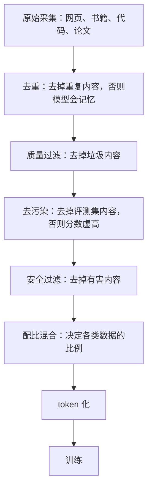
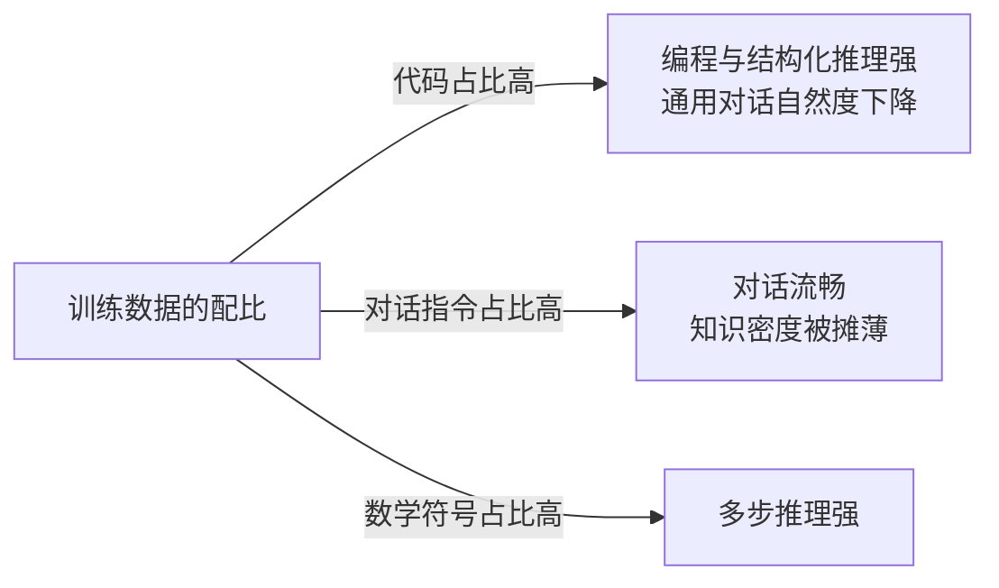

# 预训练数据决定模型能力上限

模型的能力从数据里来。参数量、架构、算力都是**放大器**——它们决定能吸收多少，**数据决定能吸收什么**。

理解这一点对使用模型（而不只是训练模型）很关键：它解释了为什么模型在某些领域很强、某些领域很弱；为什么"更大"不一定更好；以及为什么微调注入知识常常适得其反。

## 背景：为什么它对中文古籍一无所知

一个团队拿开源模型做古籍数字化，问"《XX 卷》第三段讲了什么"。模型**自信地编了一段**，看起来像那么回事，但完全是虚构的。

换成闭源的大模型，回答变成"我没有这本书的信息"——**这个回答反而是对的**。

差别不在参数量，在**训练数据**：

| | 那个开源模型 | 闭源大模型 |
| --- | --- | --- |
| 训练数据里的中文古籍 | 几乎没有 | 少量（扫描本 OCR） |
| 遇到不知道的 | 编（因为没学过"不知道"这种模式） | 拒答 |

**这就是"数据决定上限"的具体含义**：

1. 数据里没有的领域，模型只能编——它不知道自己不知道
2. 数据质量差，模型学到的是噪声
3. 即使参数翻十倍，缺的数据还是缺的

## 从 0 开始：预训练在做什么

### 训练目标极其简单

```
给模型一段文本的前半部分，让它预测下一个 token
```

```
输入："今天天气很"
目标："好"          ← 模型要猜出这个
```

**就这么一个任务，在几万亿 token 上反复做。** 模型为了"猜对下一个词"，被迫学会：

- 语法（什么样的词序合法）
- 事实（"中国的首都是___" → 北京）
- 推理（"如果 A>B 且 B>C，那么 A___C" → >）
- 代码模式（函数怎么组织）

**这些都是"为了预测准"而涌现的副产品**，不是显式教会的。

### 数据管道



**每一步都在决定模型最终会什么。**

## 关键认知：规模不是唯一的轴

### Chinchilla 定律

早期大家认为"参数越大越好"。2022 年 Chinchilla 论文改变了这个认知：

**给定算力预算，模型大小和数据量要一起放大。**

| | 参数 | 训练 token | 结果 |
| --- | --- | --- | --- |
| GPT-3（2020） | 1750 亿 | 3000 亿 | 数据相对不足 |
| Chinchilla（2022） | 700 亿 | 1.4 万亿 | 参数只有 GPT-3 的 1/2.5，各项基准反超（论文实测） |

**含义：很多"大模型"其实是数据不足的。** 用小得多的模型 + 更多数据，能达到更好效果。

**对使用者的启示**：看到"某某模型有万亿参数"，先查它训练了多少 token，参数量单独不构成强弱结论。

### 数据配比的取舍

**不同数据的比例直接决定能力倾向**：

| 加大某类数据 | 增强 | 可能削弱 |
| --- | --- | --- |
| 代码 | 编程、结构化推理 | 通用对话自然度 |
| 数学/符号 | 多步推理 | — |
| 多语言 | 该语言能力 | 英文能力（算力竞争） |
| 对话/指令 | 对话流畅度 | 知识密度 |
| 合成数据 | 特定格式/任务 | 可能放大错误模式 |

**这就是为什么不同模型"性格"不同**——哪怕是同样的架构，配比不同能力就不同。



图回答配比怎么变成能力倾向：同一个模型架构在不同配比下走向不同的强弱面，选型时按自己任务的类型找对应配比训练的模型。

**选型含义**：benchmark 总分之外，要看**在你的任务类型上的表现**。一个代码配比较高的模型，写文案可能不如通用模型。

## 对使用者的三个实际含义

### 1. 模型不知道它不知道什么

**训练数据里没有的领域，模型会编——而且编得很自信。**

| 场景 | 表现 |
| --- | --- |
| 问训练数据里有的 | 准确 |
| 问训练数据里没有的 | **编造，且语气自信** |
| 问需要实时数据的 | 用旧知识回答，或编 |

**应对**：

- **专有/实时信息必须用检索或工具**，不能靠参数知识
- 关键结论**要求引用来源**
- 对模型的回答**保持验证习惯**

### 2. 微调不能有效注入知识

常见误区："要让模型知道本公司的产品，那就微调一下。"

**微调对"注入事实"效果很差**：

| 目标 | 微调有效吗 |
| --- | --- |
| 改变**风格/格式**（总是输出 JSON、用某种语气） | 很有效 |
| 改变**行为**（什么时候拒答、怎么调用工具） | 有效 |
| 注入**大量新知识**（产品手册、内部文档） | 效果差，且容易灾难性遗忘 |

**原因**：微调是在已有表示上做小幅调整，**不是往数据库里写记录**。少量样本记不住，大量样本会破坏原有能力。

**正确做法**：知识用 **RAG**（检索），行为才用微调。

### 3. 训练数据的时间截止

模型只知道**训练数据截止日期之前**的事。

```
问："2026 年最新的前端框架是什么？"
模型：可能用 2024 年的知识回答（如果训练数据截止在那里）
```

**应对**：

- 明确知道模型的知识截止日期
- 时效性问题必须接搜索或检索
- 不要问模型"最近发生了什么"

## 数据质量的边界（如果你要训练/微调）

| 问题 | 后果 | 检测 |
| --- | --- | --- |
| **重复数据** | 模型记忆、泛化差 | 去重率、n-gram 重复检测 |
| **评测污染** | benchmark 分数虚高 | 与评测集做 n-gram 匹配 |
| **低质量数据** | 学到噪声 | 用模型打分过滤，但要抽样人工检查 |
| **偏见** | 输出有系统性偏差 | 分群评测 |
| **隐私泄露** | 模型能背出训练数据里的个人信息 | 用 canary（植入的假信息）检测 |
| **合成数据** | 可能放大生成模型的错误 | 保留生成配置，对比真实数据分布 |

**一个实用建议**：过滤"低质量"时**别把"容易分类"当成"没价值"**。很多高质量内容（代码、少数语言、专业文档）在通用质量分类器下得分不高，被误删会明显损害能力。

## 常见错误

**错误 1：认为参数大 = 能力强**

Chinchilla 已经证明：**数据不足的大模型，不如数据充足的小模型。**

**错误 2：用微调注入知识**

效果差且容易破坏原有能力。**知识用 RAG。**

**错误 3：认为模型知道自己的知识边界**

**它不知道。** 数据里没有的，它会编。

**错误 4：忽略知识截止日期**

问时效性问题会得到过时的答案。**必须接检索。**

**错误 5：以为更多数据总是更好**

**脏数据会损害模型。** 去重和质量过滤比堆量重要。

**错误 6：过度依赖合成数据**

合成数据来自另一个模型，**会继承并放大它的错误模式**。要混合真实数据，并保留生成配置以便归因。

**错误 7：评测集没做去污染**

训练数据里混进了评测题 → 分数虚高 → 上线后发现真实能力差得多。**训练前必须做 n-gram 匹配去污染。**

关系：[[工程知识/AI 系统工程：从模型能力到生产能力/模型基础与训练/后训练对齐与微调改变行为边界]] · [[工程知识/AI 系统工程：从模型能力到生产能力/数据与MLOps/数据集、特征与模型版本必须可追溯]] · [[工程知识/AI 系统工程：从模型能力到生产能力/模型基础与训练/Token、Embedding与表示学习连接数据和模型]]
- [[工程知识/性能工程：从用户等待到资源瓶颈/观测与诊断/市面Benchmark的设计读法：宏微与中间层基准.md]] —— 评测集分布决定结论适用面，AI 榜单同原理

验证的锚点：能力上限结论要与污染核对对账——预写评测题在训练数据中的匹配命中为零，命中存在时与预期对不上，该分数不能作为能力上限的证据。

## 验证

1. 去污染核对：训练前对评测题做 n-gram 匹配，确认训练数据中没有命中，命中部分剔除后重跑评测。
2. 分布对照：在自有任务的评测集与公开榜单上分别测同一模型，确认两者排序不一致时以自有分布为准。
3. 数据溯源：对合成数据保留生成配置与配比记录，确认模型表现异常时能追到具体的数据来源。

## 效果与代价

按数据的分布与质量评估模型能力，得到两样东西：能力边界与知识时效的判断依据，选型时把评测集与自有任务分布比对的习惯。代价是数据治理与去污染的前置工作，以及模型发布时无法从参数量推出实际表现。把知识维护在检索与工具侧需要持续投入，收益是模型换代时知识资产不被一并替换。

## 机制与本质

预训练数据的机制层：训练目标是预测下一个 token，模型为降低这一损失而吸收数据中的统计规律，数据里不存在的内容无法从参数中得到。参数与算力决定可吸收的容量，数据的分布、质量与配比决定实际吸收到什么，因此同一份架构与预算在不同语料上得到的能力不同。

## 要解决的问题

同样规模的模型与算力投入，在不同数据上的能力表现差距明显，而数据质量问题在训练完成之前难以从指标上察觉。本篇回答：数据的哪些属性决定模型能学到什么、参数量与架构在其中起什么作用、数据治理在训练链路里的位置在哪里，以及污染与许可问题会以什么形式在后期显现。

