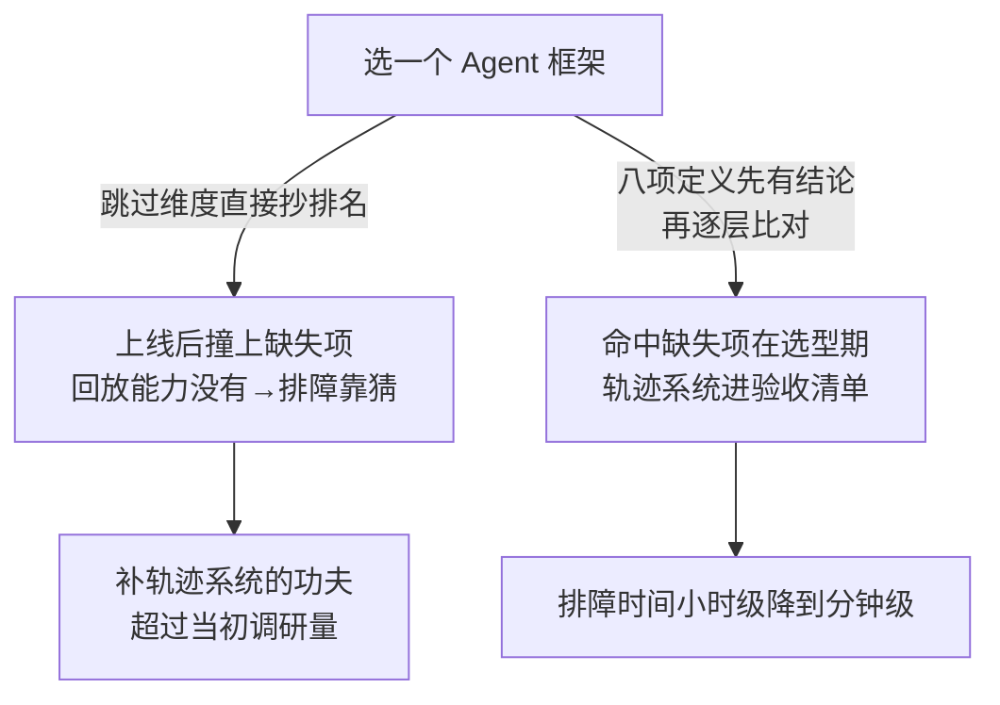

# Agent 系统选型不是框架排名

“哪个 Agent 框架最好”没有脱离任务的答案。不同工具覆盖 Provider 接口、Agent 循环、图式编排、知识接入、持久执行和观测中的不同部分。选型应从自己必须拥有的运行语义开始，再判断哪些实现值得外包。

## 先画系统，再看框架

在比较产品前写出：任务状态、控制流、工具接口约定、持久化边界、人工审批、失败模型、评测和部署约束。框架只能降低这些能力的实现成本，不能替你定义正确语义。

| 层 | 常见实现 | 采用时重点比较 |
| --- | --- | --- |
| 模型接入 | Provider SDK、统一适配层 | 错误、流式、工具、结构输出、状态接口 |
| Agent loop | Agents SDK、轻量自建循环 | 最大轮次、工具执行、handoff、guardrail |
| 编排 | 图/事件工作流 | checkpoint、暂停、并发、恢复和版本迁移 |
| 数据与检索 | RAG 框架、搜索与数据库 | 解析、索引、ACL、重排和引用 |
| 持久任务 | workflow engine、队列 | exactly-once 假设、幂等、补偿、长等待 |
| 观测评测 | trace/eval 平台 | 数据所有权、开放格式、回放和 grader |

一套框架覆盖的层越多，初期集成越快，迁移和隐式语义风险也越大。

## 三种常见起点

### 薄 SDK + 自有应用层

适合流程较短、团队已有成熟后端基础设施、希望保持 Provider 或框架可替换。模型、工具和 trace 用 SDK，状态、权限和业务流留在自己的代码。代价是需要自己实现循环和适配。

### Agent SDK

适合需要现成工具循环、handoff、guardrail、session 和 tracing，但任务仍主要在单次服务或较短运行内。必须确认 SDK 的 session 不被误用为业务状态，tool guardrail 是否覆盖所有调用路径，以及 provider 绑定程度。

### 图式或持久编排运行时

适合长任务、显式分支、暂停恢复、人工介入和并发。重点验证 checkpoint 的重放语义、节点副作用、状态 schema 迁移和生产运维，而不是只看节点 API 是否易写。

## 比较框架的十个问题

1. 状态由谁定义，能否使用业务类型而不是框架消息对象？
2. 中断后从节点前、节点内还是节点后恢复？副作用会不会重放？
3. 工具执行、审批和错误是否能替换成自己的实现？
4. 能否锁定模型、提示词、工具 schema 和工作流版本？
5. trace 是否覆盖模型、检索、工具、状态和人工步骤？
6. 测试时能否使用确定性模型和内存执行器？
7. provider、存储和观测能否替换，迁移出口是什么？
8. 序列化格式升级后，旧 checkpoint 如何恢复？
9. 依赖失败、取消、限流和部分成功如何表达？
10. 许可证、维护状态、安全公告和 release cadence 是否符合团队能力？

## 当前实现层

截至 2026-09-03，OpenAI Agents SDK、LangGraph、Google ADK 和 Microsoft Agent Framework 都在活跃演进，但定位不同。当前版本与迁移状态见 [[工程知识/AI 系统工程：从模型能力到生产能力/生态与选型/AI技术动态]]，不在本页做永久排名。

已经停服、被替代或进入维护状态的产品不能继续作为新架构默认项：Assistants API 已下线，OpenAI Swarm 已被 Agents SDK 取代，Microsoft AutoGen 进入维护模式。历史代码需要迁移，但它们仍可作为设计演进证据。

## 最小采用实验

选两个真实任务实现纵向切片：一个普通成功路径，一个包含工具超时、人工暂停和恢复的失败路径。测量代码复杂度、状态可见性、故障定位、恢复正确性、测试难度和迁移出口。框架减少的样板代码如果换来了无法解释的状态语义，不是净收益。

相关：[[工程知识/AI 系统工程：从模型能力到生产能力/Agent与工作流/模型负责判断，运行时负责执行语义]] · [[工程知识/AI 系统工程：从模型能力到生产能力/生态与选型/MCP连接能力，A2A委托任务]]

## 可运行示例与案例回流：选型维度的账

```text
同一需求（客服工单 Agent），按维度而非框架名的选型表：

  维度 1 任务形态：路径固定（分类→查询→回复）还是开放探索？
    → 固定：工作流引擎足够（成本低、可测强），框架排名前几都用不上
  维度 2 上下文规模：会话要跨天保持吗？记忆体量多大？
    → 跨天：需要状态外置与记忆治理，查这两项的成熟度而非框架热度
维度 3 工具生态：要接的 12 个既有服务有现成协议适配吗？
    → MCP 覆盖 9 个，剩 3 个自己写适配层（工作量进排期）
  维度 4 可观测与回放：出错后能回放完整轨迹吗？
    → 轨迹日志与每步证据留存是硬需求，缺失此项的方案直接出局
  维度 5 团队能维护吗：升级节奏、breaking change 频率、社区响应
    → 框架排名前十里挑团队读得懂源码的两个

  排名表回答不了以上任何一问——它只回答"大家都在用哪个"
```

案例回流：按排名选型的实录——某团队按热度榜选了排第一的框架，上线后发现回放能力缺失（排障全靠猜），补轨迹系统花的功夫超过当初选型的调研量；换成排名第五但回放完善的框架，排障时间从小时级降到分钟级。反向实录——团队按 build vs buy 框架选择自写编排层（两百分之一复杂度的需求用两百分之一的代码自己写），维护成本完全可控，框架升级风暴与己无关。

选型走不走维度核对，走到的是两个结局：



选型的底层判据与 [[工程知识/软件构建：让变化可以理解、验证与交付/架构与代码/购买与自建的决策框架：每条约束都摆上桌面.md]] 同构（约束上桌面、退出成本入账），与 [[工程知识/AI 系统工程：从模型能力到生产能力/Agent与工作流/先用工作流，只有路径无法预先枚举时才使用Agent.md]] 的形态判据衔接。

验证的锚点：选型结论要与八项定义对账——预写任务状态、控制流、工具调用约定、持久化边界、审批、失败模型、评测与部署约束各有结论，缺项与预期对不上就先别比较产品。

## 验证

1. 先行定义：在比较产品之前写出任务状态、控制流、工具接口约定、持久化边界、人工审批、失败模型、评测与部署约束八项，确认每项都有明确结论。
2. 逐层比对：按 Provider 接口、Agent 循环、图式编排、知识接入、持久执行与观测六层列出自己的实现与可外包部分，确认采用决策逐层有依据。
3. 语义自持：确认框架替换后自己定义的正确语义仍然成立，关键状态与失败处理没有依赖框架私有机制。

## 机制与本质

Agent 系统选型的机制层：任务状态、控制流、工具约定与持久化边界在系统里必须由某一层明确承担，框架只是把其中若干层的实现成本降低。一套实现覆盖的范围越大，它对这些语义的隐含假设就越多，替换时需要改动的代码范围也随之扩大；自有必须拥有的运行语义与可外包的实现之间，划分位置决定了后续的替换成本。

## 要解决的问题

面对多个覆盖范围不同的框架与工具，按流行度或功能数量选择之后，实施阶段发现在运行语义上缺少任务必需的部分，替换成本已经产生。本篇回答：一套 Agent 系统里哪些部分必须自己掌握、哪些可以交给现成实现、各项能力对应运行语义的哪一段，以及选型应当从什么条件出发。

