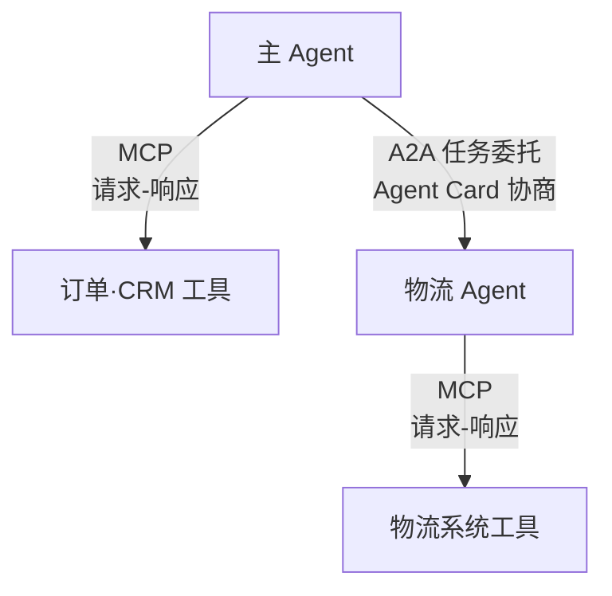

# MCP与A2A的分工：工具协议与Agent协议不互相替代

团队把"查库存"做成了 MCP server，又把"审批退款"也做成了 MCP server，结果发现退款需要多轮确认、有状态推进、有超时取消——硬塞进请求-响应形态的 MCP 后，状态散落在会话参数里，一次超时就要从零开始。要解决的问题：理解 MCP 与 A2A 分别解决什么问题、为什么不互相替代，按"能力对象是工具还是远程 Agent"选协议，避免把长时任务塞进短时工具协议。

本质是连接对象与交互形态的匹配。MCP 连接的是工具与资源：能力边界清晰、调用短时、无（或少）状态推进，形态是"客户端请求-服务端响应"；A2A 连接的是远程 Agent：任务是多轮推进、有状态、可挂起可取消、有产物（artifact）与状态通知，形态是"任务生命周期管理"。把工具做成 A2A 是过度设计（引入任务状态机的复杂度换不到东西），把 Agent 做成 MCP 是形态错配（多轮状态塞进单次请求，状态与恢复全要自己造）。

## 机制：两层协议栈

| 维度 | MCP | A2A |
| --- | --- | --- |
| 连接对象 | 工具、资源（能力单元） | 远程 Agent（任务执行者） |
| 交互形态 | 请求-响应（短时） | 任务生命周期（长时、多轮） |
| 状态语义 | 会话级，协议本身无任务状态 | 任务有显式状态机（submitted/working/completed/failed） |
| 产物 | 工具结果（同步返回） | artifact（异步产出，可多个） |
| 中断与恢复 | 客户端自己处理超时重试 | 协议内置 cancel、状态查询、推送通知 |
| 适合的例子 | 查库存、读文档、发一条消息 | 审批流、跨 Agent 研究任务、长时编排 |

判据一句话：能力对象是"名词"（可枚举的动作）用 MCP；能力对象是"动词过程"（有始有终的任务）用 A2A。一个系统两者并存是常态：Agent 用 MCP 拿工具，用 A2A 委托任务。

## 失效形态

| 失效 | 机制 | 信号 |
| --- | --- | --- |
| 任务塞进 MCP | 多轮有状态任务做成请求-响应 | 超时后无法续跑，状态散落会话参数 |
| 工具塞进 A2A | 简单能力包了任务状态机 | 延迟与实现复杂度上升，收益为零 |
| 双协议身份混乱 | 同一能力在两层都注册 | 维护两份 schema，漂移出现 |
| A2A 任务泄漏 | 远程 Agent 的任务 ID 无清理机制 | 任务表无限增长，状态通知孤儿化 |
| MCP 会话过期 | 长会话挂着不关，服务端会话资源泄漏 | 会话数线性涨，内存涨 |

## 可运行示例与案例回流：两层协议的实录

```text
同一场景，两层协议各解决什么（通用形态）：

场景：智能体帮用户"查订单状态并同步给协作伙伴"

MCP 层（Agent ↔ 工具）：
  Agent 通过 MCP 调订单系统的查单工具、CRM 的写入工具
  解决：Agent 与每个工具之间"怎么发现、怎么调用、怎么鉴权"
  形态：一个 Agent 连 N 个工具服务器，点对点集成

A2A 层（Agent ↔ Agent）：
  主 Agent 把"跟进物流异常"委托给物流 Agent（另一个团队维护）
  解决：Agent 之间"怎么声明能力（Agent Card）、怎么交接任务、
        怎么同步进度"（任务级协作，非函数调用）
  形态：对等协商，双方都是自治主体

两层同时在场的形态：
  主 Agent --MCP--> 订单工具（函数级）
  主 Agent --A2A--> 物流 Agent --MCP--> 物流系统的工具
```

案例回流：层错位的实录——用工具协议做 Agent 间协作的形态：把对方 Agent 的一条能力注册成自己的"工具"，对方内部的多步流程被压成一次函数调用（丢失进度可见性与中途协商能力），对方升级流程后调用方静默失败；换 A2A 的任务委托形态后，进度事件流与能力卡片版本协商把这些失效点接住。反向实录：把 A2A 用在稳定的内部函数调用上（调用本进程内同构逻辑），协商协议的开销全是白付。判据：对面是"被调用的能力"用工具协议，对面是"有自己状态与流程的自治主体"用 Agent 协议。与 [[工程知识/AI 系统工程：从模型能力到生产能力/Agent与工作流/工具是受约束的能力，不是提示词里的函数名.md]] 的工具观衔接、与 [[工程知识/AI 系统工程：从模型能力到生产能力/Agent与工作流/多智能体只在能并行或需要独立上下文时才值得.md]] 的多智能体边界衔接。

## 边界

- 协议不解决权限模型：MCP 的工具调用与 A2A 的任务委托都需要运行时鉴权（主体、scope、审批），协议层只定义消息形状，权限仍要应用层做，这与工具约定的原则一致（见 [[工程知识/AI 系统工程：从模型能力到生产能力/Agent与工作流/工具是受约束的能力，不是提示词里的函数名]]）。
- A2A 的任务状态机与 Agent 内部状态机是两个层次：A2A 管理任务在两个 Agent 间的可见状态（对任务委托方透明），Agent 内部怎么切分状态是自己的事（见 [[工程知识/AI 系统工程：从模型能力到生产能力/Agent与工作流/Agent状态机与任务恢复：进度是状态不是聊天记录]]）；不要把内部状态映射成 A2A 状态。
- 两个协议都在快速演进：版本绑定要显式，升级要重测兼容性；公开规范链接见 sources。
- 选型判断与范式选择独立：ReAct/计划-执行决定"Agent 自己怎么行动"（见 [[工程知识/AI 系统工程：从模型能力到生产能力/Agent与工作流/ReAct计划执行搜索：三种行动范式的适用边界]]），MCP/A2A 决定"能力怎么连接与委托"；一个系统两个决策都要做，互不替代。

两层协议在同一个场景里怎么并存：



主 Agent 对工具是调用者（点对点请求-响应）、对物流 Agent 是委托方（任务级状态推送与 artifact）——两种身份走两种协议，能力发现与鉴权语义各自成立。

## 验证

验证的锚点：协议分工要与两种形态对照对账——预写任务生命周期形态在中途终止后可续跑、请求响应形态只能重跑，实测与预期对不上就说明任务状态没有被真正持久化。

最小验证：构造一个需要多轮推进的任务（如"搜索-整理-生成报告"），分别用 MCP 形态（请求-响应）与 A2A 形态（任务生命周期）实现各一份：断言 A2A 版本在中途 kill 进程后可通过任务状态查询恢复续跑，而 MCP 版本无法恢复只能重跑；再对比两者的空载开销（简单任务在 A2A 下的延迟增量），确认对简单工具不引入任务状态机负担。最后做一次协议身份审计：列出全部注册能力，断言无同一能力双层注册。

关系：[[工程知识/AI 系统工程：从模型能力到生产能力/生态与选型/模型、框架、运行时与协议解决不同问题]] · [[工程知识/AI 系统工程：从模型能力到生产能力/Agent与工作流/工具是受约束的能力，不是提示词里的函数名]] · [[工程知识/AI 系统工程：从模型能力到生产能力/Agent与工作流/Agent状态机与任务恢复：进度是状态不是聊天记录]]

同族：[[工程知识/AI 系统工程：从模型能力到生产能力/生态与选型/编辑器与编码代理的通信通道：能力协商与连接归属]] —— 工具能力与界面交互分属两条协议线
