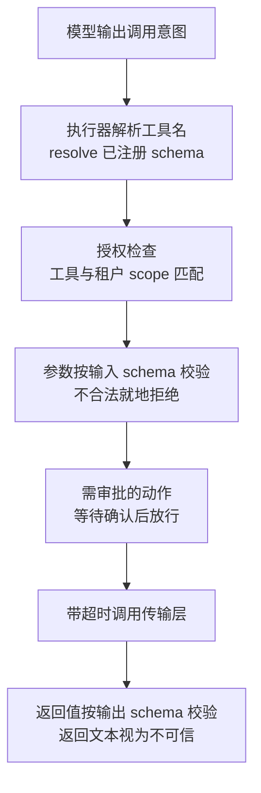

# MCP 接入必须验证协议、身份与工具约定

可以把 MCP 作为大 Agent 的一个子模块：业务代码仍由普通函数、HTTP 或数据库接口组成，只有需要跨应用发现、共享或隔离部署的能力才通过 MCP 暴露。只知道 JSON 配置并不等于可以安全上线；你还必须验证服务身份、能力协商、输入输出 schema、权限、副作用、超时和版本兼容。

## 从基础到演进

| 层次 | 关键问题 | 实践焦点 |
| --- | --- | --- |
| 基础 | MCP 连接谁、暴露什么？ | Host/Client/Server、resources/prompts/tools、JSON-RPC 和 schema |
| 演进 | 如何在生产规模运行？ | 2026-07-28 无状态核心、`server/discover`、header routing、可缓存 list |
| 原理 | 如何完成跨请求交互？ | 显式句柄、MRTR、Tasks extension、客户端驱动重试 |
| 边界 | MCP 能保证什么？ | 只标准化传输和能力描述；授权、幂等、审批和回滚仍由应用强制 |
| 实践 | 如何安全接入？ | 新旧版本并行、contract test、风险分级、审计、超时、熔断和降级 |

## MCP 的边界

| 问题 | MCP 负责 | 应用仍需负责 |
| --- | --- | --- |
| 能力发现 | server capabilities、tools/resources/prompts 描述 | 允许清单、schema 裁剪和产品语义 |
| 协议通信 | JSON-RPC、传输和结果封装 | 超时、取消、重试、熔断和连接池 |
| 身份认证 | 按传输采用规范的认证握手 | 用户/租户授权、scope、审计和数据驻留 |
| 工具执行 | 将调用请求交给 server | 参数校验、幂等、审批、回滚和副作用控制 |
| 版本选择/探针 | `server/discover`（可选预取）、能力和协议版本 | 锁定 SDK、contract test、迁移与回退 |

2026-07-28 规范把协议层会话和 `initialize`/`initialized` 握手移除；Streamable HTTP POST 使用 headers 与 `_meta` 自描述，stdio 等传输按各自规范字段传递版本，并以 `server/discover` 提供可选的能力预取。Tasks 成为 `io.modelcontextprotocol/tasks` 扩展。旧版 server 仍可能使用有状态会话。生产网关应按客户端覆盖范围做版本探针并保留兼容路径，不能根据一份旧配置猜测传输和授权语义。[MCP 2026-07-28 发布说明](https://blog.modelcontextprotocol.io/posts/2026-07-28/)

### 原理：无状态不等于无状态应用

协议不再替应用保存 session。若工具需要跨调用状态，应返回显式句柄（如 `basket_id`、`browser_id`），后续调用把句柄作为普通参数传回。这样状态有明确所有权、可入库、可审计，也能在普通负载均衡下路由；代价是模型/客户端必须正确传递句柄，应用要处理过期、租户绑定和重放保护。

### 原理：MRTR 如何替代服务器主动请求

当工具在执行中需要用户确认或补充参数，2026-07-28 服务器返回 `resultType: "input_required"`，客户端带 `inputResponses` 重试原始调用。重试必须具备幂等键和原请求摘要校验，防止用户确认后重复写入；对于长任务，按 SEP-2663 的 Tasks extension（需协商/显式启用）使用 `tasks/get`、`tasks/update`、`tasks/cancel`，不要把任务状态藏在传输 session 中。

验证的锚点：接入结论要与能力协商对账——预写客户端不会调用服务端未声明的能力、违反输入约束的参数被拒绝，任一项与预期对不上就是工具约定没有被核验。

## 边界：协议版本与路线图要分开

2026-07-28 是稳定规范；MCP roadmap 中的 agentic messaging、webhooks/channels、DPoP/WIF/token exchange、渐进式工具发现和 SDK conformance 属于未来方向，不能当作当前协议保证。实现时只依赖已发布 schema 和 SDK migration guide，路线图用于预留接口而不是提前绑定。

## 80% 普通代码 + 20% MCP

推荐边界：

~~~text
业务流程/状态机/数据库事务/校验
          |
          v
统一 ToolExecutor（策略、schema、超时、审计）
       /                         +本地函数或内部 API              MCP Client -> MCP Server
~~~

统一执行器的最小接口：

~~~python
async def invoke(tool_name, args, context):
    spec = registry.resolve(tool_name)
    policy.authorize(spec, context)
    validated = spec.input_model.model_validate(args)
    if spec.requires_approval:
        await approval.wait(spec, validated)
    result = await transports[spec.transport].call(
        spec, validated, timeout=spec.timeout_ms
    )
    return spec.output_model.model_validate(result)
~~~

模型只生成调用意图，不能直接决定权限或执行 Shell/SQL。执行器必须在模型之外做授权、参数和输出校验；MCP server 返回的文本也要视为不可信数据。

从模型输出一句话到工具真正被执行，中间每一段都由执行器把关：

上图说明：模型只提供意图，工具名解析、授权、参数校验、审批、超时与返回值校验全部在执行器里逐次发生，任何一段跳过都等于把权限交给模型。

## 配置约定最小字段

~~~json
{
  "name": "support.create_ticket",
  "transport": "http",
  "server": "support-mcp",
  "protocol_version": "2026-07-28",
  "allowed_scopes": ["ticket:write"],
  "risk": "write",
  "requires_approval": true,
  "timeout_ms": 8000,
  "retry": {"max_attempts": 1},
  "idempotency": "required",
  "input_schema": "registered-schema-id",
  "output_schema": "registered-schema-id"
}
~~~

配置不是事实来源。启动时重新发现工具并比较 schema，变更触发人工审查或 contract test；不要支持未审计的“热更新后立即给模型使用”。

## 上线检查

- [ ] server 身份、来源、版本、许可证和网络出口已审核。
- [ ] 只暴露当前租户和任务需要的工具；scope 在执行时再次验证。
- [ ] 读、写、删除、发送和扣费动作有风险等级、审批和回滚。
- [ ] 输入/输出 schema、错误码、超时、取消、重试和幂等行为有测试。
- [ ] 记录 tool name、版本、参数摘要、调用者、审批、结果状态、耗时和成本；敏感内容脱敏。
- [ ] MCP 不可用时有普通代码或人工回退；升级前验证旧版/新版协议互操作。
- [ ] 新版 Streamable HTTP POST 请求的 `MCP-Protocol-Version`、`Mcp-Method`、`Mcp-Name` headers 和 `_meta` 均有约定测试；stdio 等其他传输按规范使用对应 `_meta` 字段，旧版握手路径有明确下线日期。
- [ ] `tools/list`、`resources/list/read` 的 `ttlMs`/`cacheScope` 缓存键包含租户、身份和 schema 版本；权限变更可主动失效缓存。
- [ ] MRTR/Tasks 重试使用幂等键、任务句柄租户绑定和状态机；断线、重复提交和取消均有负向测试。

## 何时不该用 MCP

同一进程内、数据结构稳定、延迟敏感且不需要跨团队复用的函数，用普通代码更简单。MCP 的收益来自边界和生态，不是“所有功能都必须做成工具”。Agent 的整体编排和风险控制见 [[工程知识/AI 系统工程：从模型能力到生产能力/Agent与工作流/构建可靠Agent应用]]。

## 验证

1. 能力协商：连接后核对初始化交换里的协议版本与服务端声明的能力集合，确认客户端没有调用服务端未声明的能力。
2. 约定核验：对每个工具用符合与违反输入 schema 的两种参数各调一次，确认违反 schema 的参数被拒绝，返回值与声明的输出类型一致。
3. 超时与版本：人为让服务端延迟超过约定时限，确认调用按超时终止；客户端与服务端版本不兼容时连接明确失败。

## 机制与本质

MCP 接入的机制层：协议只标准化能力描述与调用传输，服务身份、授权范围、输入输出结构与副作用语义都由应用侧承担。配置文件描述的是某一次发现的结果，工具当前是否可用、参数是否合法、调用是否越权，只有在执行器里逐次核对才能成立，热更新之后立即交给模型使用会让这层核对失效。

## 要解决的问题

按配置文件接上一个 MCP 服务之后，服务身份没有核对、能力范围没有确认、输入输出结构与实际实现不一致、副作用与超时行为没有验证，问题会在接通之后才暴露。本篇回答：哪些能力只适合用普通接口直接实现、暴露为 MCP 服务需要满足什么条件、接入前要逐项确认哪些内容，以及版本不兼容以什么形式出现。