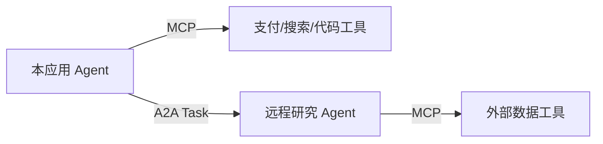

# MCP 连接能力，A2A 委托任务

MCP 和 A2A 都用于 Agent 生态互操作，但抽象对象不同。MCP 让 Host 发现并使用外部工具、资源和提示；A2A 让一个独立 Agent 把任务委托给另一个独立 Agent，并观察任务、消息与产物状态。两者都不替代应用内部工作流、权限系统和业务 API。

## 先看边界

| 选择 | 对端是什么 | 交互核心 | 何时使用 |
| --- | --- | --- | --- |
| 本地函数/内部 API | 同一应用控制的能力 | 请求—结果 | 内部边界清晰，不需要动态发现 |
| MCP | 工具或知识服务 | tools、resources、prompts | 跨应用复用能力与标准化接入 |
| A2A | 独立部署的 Agent | Agent Card、Message、Task、Artifact | 跨团队或跨产品委托长任务 |
| 工作流引擎 | 本应用的节点与状态 | 状态转移、事件、恢复 | 自己拥有端到端流程和一致性 |

同一进程里把两个提示词角色称为 Agent，不需要 A2A；业务服务已经有稳定 API，也不必为了接入模型再包一层 MCP。

## MCP 当前语义

截至 2026-09-03，发布规范为 `2026-07-28`。该版本核心转向无状态请求/响应，用每请求元数据表达版本和能力；协议级 session 与旧初始化握手被移除，需要跨调用状态时由工具显式返回句柄。Tasks 是扩展，不是核心协议。

这次变化的工程含义是：远程 MCP 更容易横向扩展和经过网关，但应用不能再把隐式连接状态当作业务状态。工具返回的句柄需要和用户、租户、权限及过期时间绑定。

MCP 授权只规定传输与 OAuth 等互操作要求。服务端仍需对每个资源和动作完整授权；客户端不能把一个 server 获得的 token 转交给另一个 server，也不能因为模型发现某个工具就自动扩大 scope。

## A2A 当前语义

截至同一基准日，A2A 规范主版本为 1.0，固定规范页为 v1.0.0，官方仓库 patch 修订另行核验。它定义 Agent Card、Message、Task、Artifact、流式更新、推送、取消和协议绑定。

A2A Task 是远程协作对象，不等于应用内部 checkpoint。调用方仍需把远程 task id 绑定到自己的 run、主体和目标 revision；远程 Agent 的“completed”也必须经过本地验收，不能直接升级为业务成功。

## 两者可以组合

协议组合会放大信任链：远程 Agent 使用哪些工具、数据流向何处、结果属于哪个租户，都需要端到端审计。Agent Card、工具描述和远程产物都属于第三方输入。

## 采用前的验收问题

- 是否真的存在独立部署或跨语言复用需求？
- 对端身份、版本、能力列表和 schema 变化如何验证？
- 用户身份如何委托，token audience 和 scope 如何限制？
- 长任务如何取消、超时、恢复和避免重复副作用？
- 远程结果如何绑定来源，如何在本地独立验收？
- 协议升级是否有双栈、探针、兼容测试和回滚路径？

如果这些问题没有答案，协议只减少了连接代码，没有形成可靠的系统边界。

相关：[[工程知识/AI 系统工程：从模型能力到生产能力/Agent与工作流/工具是受约束的能力，不是提示词里的函数名]] · [[工程知识/AI 系统工程：从模型能力到生产能力/生态与选型/AI技术动态]]
