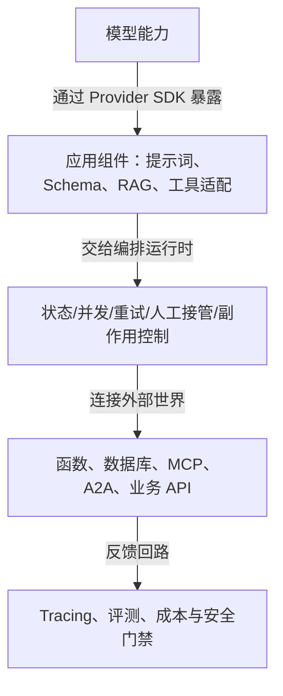
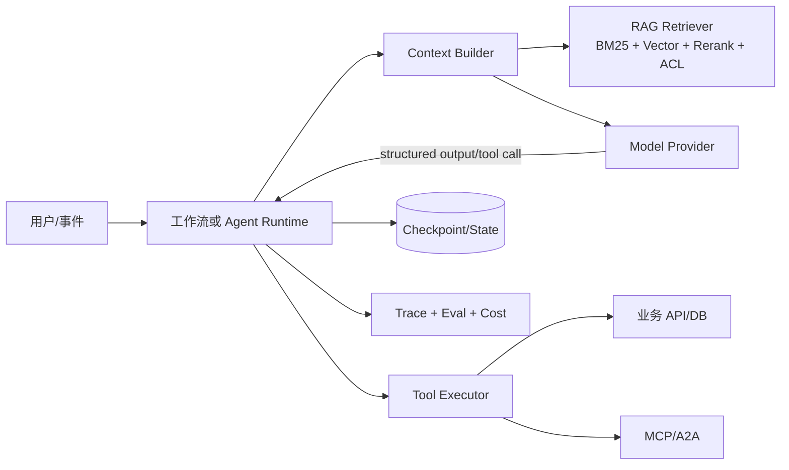
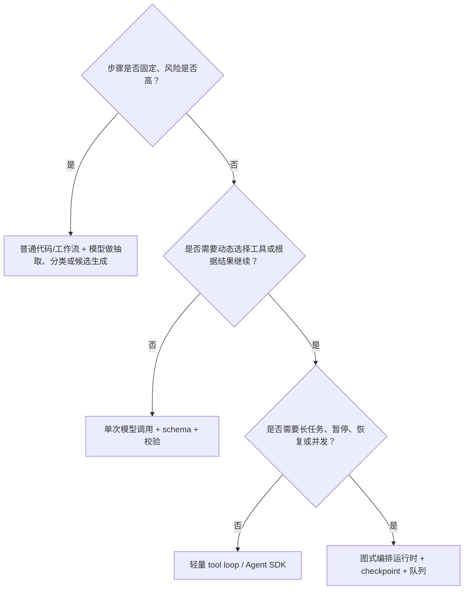

# 模型、框架、运行时与协议解决不同问题

## 一句话先分清

**模型负责提出概率性的判断，框架负责复用组件，运行时负责把判断变成可恢复的执行，协议负责连接外部能力，评测负责证明结果。**



最常见的误解是把“换模型”“换框架”“加一个向量库”当成同一种升级。它们改变的是不同的假设：

| 改动 | 主要改变 | 不会自动解决 |
| --- | --- | --- |
| 换生成模型 | 推理、表达、工具选择和成本曲线 | 权限、状态恢复、错误补偿、事实新鲜度 |
| 换 embedding/reranker | 候选覆盖和排序 | 解析错误、ACL、生成幻觉 |
| 换应用框架 | 连接器、抽象和开发效率 | 业务流程正确性和生产 SLO |
| 换编排运行时 | 状态、重试、暂停、恢复和并发 | 模型本身的知识与推理能力 |
| 接入 MCP/A2A | 能力发现和跨进程协作 | 服务端授权、幂等、数据脱敏 |
| 加长上下文 | 一次请求能放入更多内容 | 内容是否相关、可引用、可更新 |

## 从“调用模型”到“可运营 Agent”的演进

| 阶段 | 主要问题 | 新增抽象 | 仍然必须自己负责的部分 |
| --- | --- | --- | --- |
| 原始模型 API | 如何发送消息并拿到文本 | Provider SDK、流式、超时 | 解析、重试、业务校验和日志 |
| Prompt/Chain | 如何把多个调用串起来 | 模板、链、结构化输出 | 分支、状态、错误补偿、回放 |
| RAG 与工具调用 | 模型如何访问外部事实和动作 | Retriever、function calling、tool schema | 权限、幂等、证据绑定和副作用审批 |
| 工作流/图编排 | 如何表达分支、并发和长任务 | 状态图、事件、检查点、队列 | 状态模型、恢复语义、预算和 SLO |
| Agent runtime | 如何允许模型动态选择下一步 | tool loop、handoff、human-in-the-loop | 停止条件、沙箱、策略和审计 |
| 协议互操作 | 如何跨团队、跨语言复用能力 | MCP 的 tools/resources/prompts、A2A 的任务语义 | 身份、授权、兼容版本和远程故障 |
| 评测与运营 | 如何知道升级是否真的变好 | trace、离线集、在线反馈、质量门禁 | 指标定义、样本治理和回滚决定 |

演进的本质：每新增一层，都在把原本藏在 Prompt 或一次性脚本里的假设，逐步显式化为**接口、状态、策略和证据**，同时新增可观测性和回退路径。

## 模型层：能力、接口和生命周期

### 模型到底提供什么

对应用工程师而言，模型可以抽象为：

```text
generate(input, context, tools, output_schema, budget)
    -> text | structured_output | tool_calls | refusal | error
```

需要分别理解以下能力，而不是只记一个模型名称：

- **生成**：自然语言、代码、JSON 或多模态输出。
- **推理预算**：模型在质量、延迟和 token 成本之间的可调曲线；推理更久不保证业务正确。
- **工具调用**：模型提出工具名和参数，应用验证后执行，再把结果作为新上下文返回。
- **结构化输出**：语法/schema 合法是第一道门，业务约束、权限和事实正确是后续门。
- **上下文窗口**：一次调用的容量，不等于长期记忆，也不等于可检索性。
- **多模态**：文本、图片、音频、视频和文件的输入/输出；引用模型必须能定位到页码、时间段或坐标。
- **批处理、后台和流式**：是交互形态与调度能力，不应直接混入业务领域逻辑。

### 能力标签比品牌名更稳定

为内部模型注册表维护能力标签，而不是在业务代码里散落型号：

| 标签 | 例子 | 需要验证的指标 |
| --- | --- | --- |
| `reasoning` | 复杂规划、代码、冲突消解 | 任务成功率、步骤数、推理 token |
| `fast` | 分类、改写、路由、批量抽取 | P95、吞吐、单位成本 |
| `tool_use` | 函数/MCP 调用和多轮循环 | 参数正确率、无效调用率 |
| `long_context` | 长文档分析、跨文件总结 | 证据召回、位置敏感性、成本 |
| `vision`/`audio` | 图表、截图、语音和视频 | OCR/定位准确率、媒体引用完整性 |
| `embedding` | 语义索引和相似度 | Recall@K、语言/领域覆盖、维度 |
| `rerank` | 候选集精排 | nDCG、P95、候选规模上限 |

模型注册表至少保存 provider、稳定快照/别名、能力标签、上下文/输出限制、区域、价格、数据处理政策、弃用日期和回归集结果。供应商的 `latest` 别名适合试验，不适合没有回归门禁的关键路径。

### 模型变更的影响范围

```text
模型快照变更 -> 生成/工具/结构化输出回归
embedding 变更 -> 重建索引 + 召回回归
reranker 变更 -> 排序回归 + 延迟/吞吐回归
上下文模板变更 -> 端到端轨迹回归
供应商 API 变更 -> schema/错误/限流/计费 contract test
```

OpenAI 的 Responses API 把文本/图像输入、结构化输出、内置工具、MCP 工具和自定义函数统一在一次响应模型中；这说明“模型调用”和“工具编排”正在靠近，但工具执行、权限和业务副作用仍由应用掌握。[Responses API reference](https://developers.openai.com/api/reference/typescript/resources/responses/methods/create)

## 框架层：不要用一个词覆盖四种东西

“Agent 框架”通常混合了四种职责。先判断你需要哪一种：

| 类别 | 典型职责 | 何时值得引入 | 主要风险 |
| --- | --- | --- | --- |
| Provider SDK | 认证、请求、流式、类型和错误 | 任何模型调用 | 把供应商对象泄漏到业务层 |
| 应用/数据框架 | Prompt、Loader、RAG、Schema、工具适配 | 连接器多、需要快速试验 | 抽象过厚，难以定位失败层 |
| 编排运行时 | 图、状态、检查点、并发、恢复、人工暂停 | 长任务、分支、可恢复执行 | 隐式状态和序列化兼容 |
| Agent SDK | tool loop、handoff、guardrail、trace | 需要现成 Agent 运行循环 | 默认自主性过高，副作用边界模糊 |

### 主流框架的正确定位

以下是“能力边界”而不是永久排名；具体版本、API 和许可证以来源页为准：

- **LangGraph**：低层、图式的 Agent 编排运行时，重点是持久化执行、流式、人工介入和状态恢复；官方当前文档把它定位为可独立于 LangChain 使用的 runtime，并明确 `State`、`Nodes`、`Edges` 是核心抽象。[官方概览](https://docs.langchain.com/oss/python/langgraph/overview) · [Graph API](https://docs.langchain.com/oss/python/langgraph/graph-api)
- **LlamaIndex**：以数据接入、索引、检索和工作流为中心，适合把企业数据接入 Agent；当前官方文档将 Workflows 描述为事件驱动、按步骤执行，事件类型表达边，普通 Python 表达步骤逻辑；旧 `QueryPipeline` 已进入 feature-freeze/deprecation，编排应优先评估 Workflows。[官方 Workflows](https://developers.llamaindex.ai/python/llamaagents/workflows/) · [QueryPipeline 迁移提示](https://docs.llamaindex.ai/en/stable/module_guides/querying/pipeline/)
- **PydanticAI**：以类型、依赖注入、结构化输出和 provider-agnostic 为中心；适合 Python 团队把 schema 与业务类型放在一等位置。[Agent 概念](https://pydantic.dev/docs/ai/core-concepts/agent/)
- **OpenAI Agents SDK**：提供 Agent、工具、handoff、guardrail 和 tracing 的现成运行循环；适合在 OpenAI 生态内快速获得一致的轨迹和工具编排。[Tracing](https://openai.github.io/openai-agents-js/guides/tracing/)
- **MCP**：Host/Client/Server 之间发现和调用 tools、resources、prompts 的协议，编排框架的角色由其他层承担；2026-07-28 core 改为无 session 的每请求自描述，但接入后仍要做应用级授权、限流和审计。[历史基线 2025-06-18](https://modelcontextprotocol.io/specification/2025-06-18/index) · [2026-07-28 changelog](https://github.com/modelcontextprotocol/modelcontextprotocol/blob/main/docs/specification/2026-07-28/changelog.mdx)

选择框架时，先画出自己的状态机和工具约定，再看框架能否表达它；不要先按 GitHub 热度选框架，再被框架的默认抽象反向塑造业务。

## 运行时层：Agent 是一个可恢复的分布式流程

一个生产运行时至少要回答：

1. 当前执行处于哪个状态？输入、计划、工具结果和证据如何序列化？
2. 进程崩溃、网络超时或用户离开后，如何从检查点恢复？
3. 工具已经产生副作用时，重试是否会重复执行？幂等键在哪里？
4. 哪些节点可并发，哪些节点必须按租户、资源或事务顺序执行？
5. 什么时候停止、拒答、转人工或回退到确定性路径？

### 最小状态模型

```yaml
run_id: run_...
workflow_version: support_triage@3
status: waiting_for_tool # running | paused | waiting_human | succeeded | failed
goal: "处理用户工单"
messages: []
plan: []
tool_calls: []
evidence: []
budget:
  max_steps: 12
  max_tokens: 30000
  max_cost: 0.20
checkpoint: cp_...
```

状态中不要保存无法解释的“模型记忆字符串”作为唯一事实。关键事实应来自数据库、工具结果或带版本的证据；历史消息可以摘要，但摘要必须可追溯到原始事件。

### 检查点、重试和副作用

- **检查点**保存可恢复状态，不等于业务数据库事务；两者要有明确的一致性边界。
- **重试**只对分类为 transient 的错误开启；写操作必须使用幂等键或先查询状态。
- **暂停/人工接管**要保存完整上下文、审批人、参数摘要、过期时间和恢复入口。
- **并发**要定义合并规则；两个 Agent 同时修改同一资源时，不能靠最后写入获胜。
- **预算**同时限制步数、墙钟时间、token、工具次数和费用；任一耗尽都进入可解释的降级。

LangGraph 将 checkpointer 用于线程级短期状态，将 store 用于跨线程长期记忆，并支持中断后用同一 `thread_id` 恢复；这类语义正是运行时而非模型本身提供的。[Persistence](https://docs.langchain.com/oss/python/langgraph/persistence) · [Time travel](https://docs.langchain.com/oss/python/langgraph/use-time-travel)

## 模型、框架、RAG 和 Agent 如何组合



一个典型请求的职责顺序是：

1. 运行时加载会话状态和工作流版本。
2. Context Builder 根据权限、问题类型和 token 预算选择历史、RAG 证据和工具说明。
3. 模型给出结构化决定：直接回答、检索、调用工具、请求审批或拒答。
4. Tool Executor 再次做 schema、权限、资源归属、幂等和风险检查。
5. 运行时保存工具结果和 checkpoint，决定下一步或结束。
6. Evaluator 检查任务完成、证据支持、工具正确性、安全和成本，并把 trace 纳入回归集。

因此，RAG 不是 Agent 的同义词：RAG 解决“从外部知识取得证据”，Agent 解决“根据目标选择并执行步骤”。一个确定性工作流可以调用 RAG；一个 Agent 也可以不使用 RAG 而只调用实时 API。

## 选型决策树



再按约束选择：

- **类型和可测试性优先**：选择 schema-first 的组件或自己保留薄适配层。
- **数据接入复杂**：选择数据/检索框架，但把索引、ACL 和引用约定留在自己的 domain 层。
- **长任务和人工审批**：选择具备 checkpoint、interrupt、resume 的运行时。
- **跨团队工具复用**：用 MCP；跨部署 Agent 协作再考虑 A2A；同进程函数不必套协议。
- **供应商绑定敏感**：Provider SDK 后包一层 `ModelProvider`，模型和工具能力用注册表配置。

## 工程验收清单

### 接口

- [ ] 业务层依赖内部 `ModelProvider`、`Retriever`、`ToolExecutor`、`StateStore` 接口。
- [ ] 每个模型、工具、索引和工作流都有可追溯版本。
- [ ] 结构化输出有 schema、业务校验、有限重试和不可解析时的回退。

### 运行时

- [ ] 长任务可暂停、恢复、取消和查询状态。
- [ ] 工具调用有超时、幂等、权限、审计和副作用等级。
- [ ] 重试不会重复写操作；并发冲突有显式策略。
- [ ] 步数、token、费用和墙钟时间均有预算。

### RAG/知识

- [ ] 证据带来源 URI、chunk、版本、时间和权限主体。
- [ ] 召回、排序、引用支持和拒答分别评测。
- [ ] embedding 变更会触发索引重建与回归；权限和删除有可测 lag。

### 观测与治理

- [ ] Trace 能串起模型、检索、工具、状态和人工审批。
- [ ] 线上样本可脱敏回放，失败轨迹进入版本化回归集。
- [ ] Prompt injection、越权、敏感输出、危险工具和供应商故障都有测试。
- [ ] 每次框架/模型升级都有兼容性、成本、延迟和回滚记录。

## 关联页面

- [[工程知识/AI 系统工程：从模型能力到生产能力/Agent与工作流/构建可靠Agent应用]]
- [[工程知识/AI 系统工程：从模型能力到生产能力/Agent与工作流/先用工作流，只有路径无法预先枚举时才使用Agent]]
- [[工程知识/AI 系统工程：从模型能力到生产能力/知识与检索/RAG的核心是选择可引用证据]]
- [[工程知识/AI 系统工程：从模型能力到生产能力/生态与选型/MCP接入必须验证协议、身份与工具约定]]
- [[工程知识/AI 系统工程：从模型能力到生产能力/生态与选型/多 AI 客户端的统一接管：hooks、配置与常驻连接的三种适配]]
- [[工程知识/AI 系统工程：从模型能力到生产能力/质量与运营/可靠生成需要结构、证据、拒答与回归]]
- [[工程知识/后端系统：在并发、失败与变化中维持服务/分布式可靠性/部分失败决定分布式系统的设计]]
- [[工程知识/软件构建：让变化可以理解、验证与交付/测试与交付/测试策略从风险选择证据]]

## 更新规则

模型和 SDK 版本、协议草案、价格与弃用信息按 7–30 天复查；运行时可靠性和评测方法按 1–3 个月复查；分层模型与接口原则按 6 个月复查。新事实先进入 [[工程知识/AI 系统工程：从模型能力到生产能力/生态与选型/AI技术动态]]，通过来源、日期、影响范围和回归结果门禁后再改写本页。

验证的锚点：选型结论要与实测对账——每层的候选按同一负载基准测一轮（吞吐、延迟、故障恢复各一组数字），预写预期值，实测与预期对不上的候选回到上一层换路线，不靠榜单印象定案。

## 验证

最小验证：把一个已上线的功能逐层分开，检查模型、框架、运行时、协议与评测各自承担的部分是否能在替换其中一层时保持其余部分不变。替换模型版本后断言上层接口与内部状态无需改动；替换运行时后断言模型调用代码无需改动；替换协议后断言内部工作流无需改动。

职责归属验证：对一次失败逐个排查，断言能定位到具体层（模型输出、组件装配、执行状态、外部连接或结果证明），而不是笼统归因于整体。

## 要解决的问题

一次线上问题出现之后，团队无法判断出在模型的判断、组件的装配、执行的恢复、外部能力的连接还是结果的证明上，于是各处同时调整，改动的效果也无法归因。本篇回答：这五层各自承担什么、替换其中一层时哪些部分应当保持不变、分层的依据是什么，以及一项新需求该由哪一层承担。

