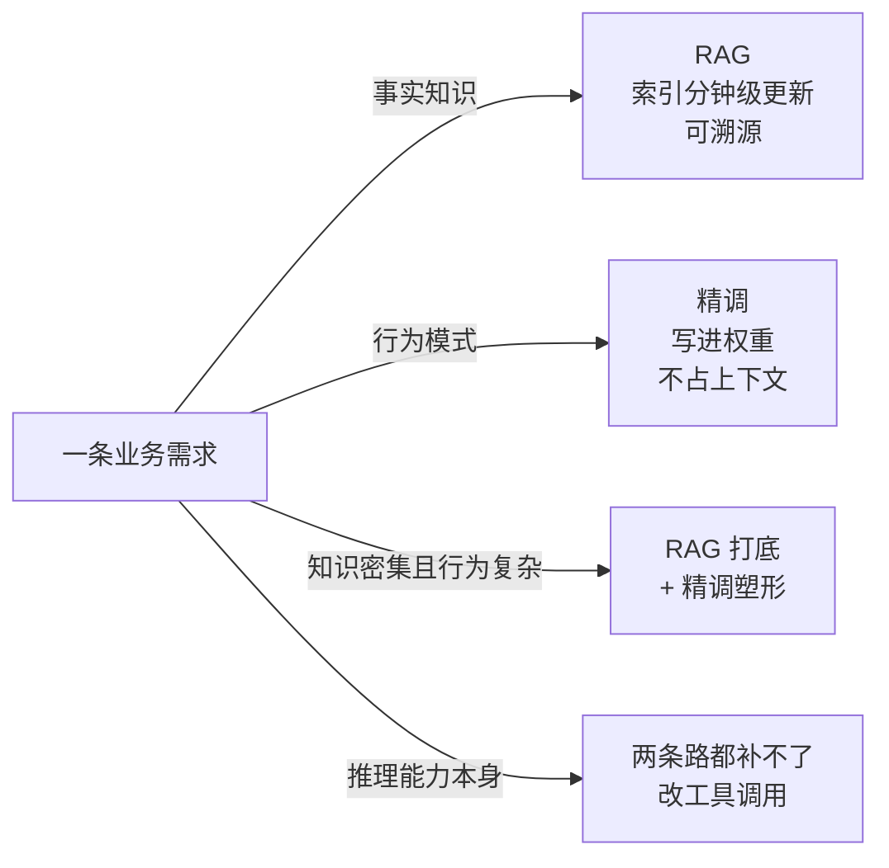
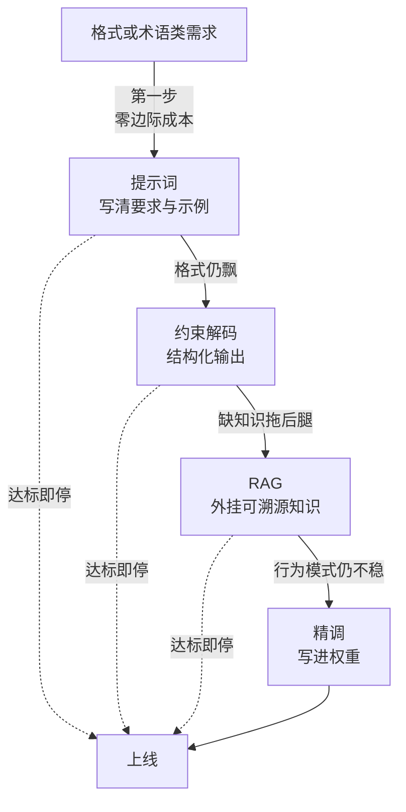

# 精调与RAG的边界：什么时候微调更划算

## 要解决的问题

让模型适应自家业务，两条路：RAG（检索增强，知识外挂到检索层，推理时拼进上下文）与精调（微调，知识写进权重，训练时改变模型）。两者都能提升效果，成本结构与适用边界完全不同。选错路线的代价：RAG 治不了的（风格、格式、复杂行为模式）白花检索工程的钱；精调治不了的（事实知识、时效更新）白花训练与维护的钱。本文写两条路线的机制差异、决策判据与组合形态，这是 AI 系统选型（构建还是购买一类的经典权衡，见 [[工程知识/软件构建：让变化可以理解、验证与交付/架构与代码/购买与自建的决策框架：每条约束都摆上桌面.md]]）里最高频的一个决策。

## 要解决的不是

“精调好还是 RAG 好”这个问题本身问错了。两者作用在不同层面：**RAG 管知识（你知道什么），精调管行为（你怎么表现）**。事实类需求（产品手册问答、政策查询）是 RAG 的地盘；行为类需求（特定语气、固定输出格式、领域推理模式）是精调的地盘。重叠区（领域知识密集 + 行为模式复杂）两者都要。先分层再选型，混着问注定吵不出结果。

## 机制

**RAG 的成本结构与边界**。工程成本集中在检索侧（文档切分、嵌入、索引、查询改写、重排）与运维（索引更新、检索质量评测）。知识更新 = 换文档重建索引（分钟级，这是 RAG 对精调的碾压优势）。边界：上下文长度与注意力（塞太多片段稀释注意力，见上下文工程分层（见 [[工程知识/AI 系统工程：从模型能力到生产能力/模型与上下文/上下文工程的分层设计：系统提示工具结果与记忆.md]]））；行为改变无能为力（检索层只能给知识，不能改变模型的输出习惯）；幻觉治理间接（RAG 给依据但不保证模型照着说）。

**精调的成本结构与边界**。工程成本集中在数据（标注数据集的构建与清洗，见数据飞轮（见 [[工程知识/AI 系统工程：从模型能力到生产能力/数据与MLOps/数据飞轮的工程闭环：日志回流清洗与标注.md]]））与训练运维（训练环境、超参、评测）。知识更新 = 重训（天级以上，精调对 RAG 的劣势）。边界：事实知识写权重不可靠（会幻觉出训练数据里没有的变体，且无法溯源——RAG 可溯源、精调不可溯源是关键差异）；灾难性遗忘（精调损通用能力，任务越窄损失越大）；模型换代全重来（基模升级后精调要重跑）。

**决策判据**。四个问题排序：
1. 需求是知识还是行为？知识 → RAG，行为 → 精调，都要 → 组合。
2. 知识更新频率？天级以上更新 → RAG（精调跟不上），月级以上稳定 → 两者皆可。
3. 延迟与成本预算？RAG 每次付检索成本（+100-300ms 与 token 成本），精调不付（权重内化了）。超低延迟场景精调有优势。
4. 可溯源要求？合规要求“答案出处”→ RAG（精调无出处）。

四个问题的第一个是分水岭，需求类型一变路线就变：



**组合形态是常态**。RAG 打底（知识层）+ 精调塑形（行为层：检索结果的引用格式、领域术语的正确使用、拒答风格）。两层独立演进（换知识不动行为，调行为不动知识），这是最稳健的生产结构。先 RAG 后精调的次序：RAG 上线跑出日志，日志回流成为精调数据（数据飞轮（上文链接）的输入），精调解决 RAG 解决不了的行为问题。

## 背景与代价

思想背景：RAG（2020，Lewis et al.）的出发点是参数化知识（权重）与非参数化知识（检索）互补，2023 年随企业应用潮成为知识问答标配。精调比 RAG 老（BERT 时代就有 domain adaptation 传统），LoRA（2021）把精调门槛降一个数量级（消费级卡可训），2023-2024 企业精调潮。两条路线的边界讨论是 2024 年后的热点（业界共识逐渐收敛：知识用 RAG、行为用精调、两者组合）。

最精巧的一笔是**“知识可溯源 vs 行为可内化”的分界判据**。这个判据把模糊的“哪个好”变成结构性判断：事实知识的价值在准确与可验证（出处），写进权重后两个都丢（幻觉变体 + 无出处）；行为模式的价值在一致与自动（不占上下文），放检索层两个都丢（每次拼提示词 + 模型未必遵循）。按价值形态分配路线，就得到知识 RAG、行为精调的稳定映射。代价要摆明：精调的隐性成本常被低估——数据工程（高质量标注集是精调效果的上限，垃圾进垃圾出）、评测基建（精调后的回归测试，见评测集（见 [[工程知识/AI 系统工程：从模型能力到生产能力/质量与运营/评测集的构建与维护：从场景采样到难度分层.md]]））、基模绑定（每次基模升级重跑全流程）。LoRA 降低了训练成本，但没降低数据与评测成本——精调便宜是错觉，便宜的是算力，贵的还是工程。RAG 的隐性成本是检索质量的持续运营（切分策略、索引更新、查询理解），检索质量差 RAG 就是负资产（错误的依据让模型更自信地答错）。

## 边界

- **先跑 RAG 基线再决定精调**。多数“需要精调”的场景，RAG + 好的提示词就能达标。精调决策要有 RAG 基线的对照数据（RAG 差多少、差在哪），没有基线的精调是盲目投资。
- **小数据精调是陷阱**。几百条样本的 LoRA 常被当作“便宜试错”，但小样本精调的方差大（同样数据两次训练效果差 10%+），结论不可复现。精调的最小可用数据量按任务实测（数千条起步是经验值），小样本先去改提示词。
- **领域术语与格式类需求，提示词与结构化输出（见 [[工程知识/AI 系统工程：从模型能力到生产能力/Agent与工作流/结构化输出的约束解码：让模型输出可解析.md]]）常常够用**。格式遵循是约束解码的地盘，不是精调的地盘。判断顺序：提示词 → 约束解码 → RAG → 精调，按成本升序试。

四档手段按成本升序排开，逐档试、达标即停，跳档是浪费：


- **基模升级的迁移成本要算进精调 TCO**。基模每 6-12 个月一代，精调资产（数据集可复用，但训练流程与调参要重跑）。三年 TCO 里精调的迁移成本常超首次训练成本，RAG 无此问题（检索层与模型解耦）。

## 验证

- **RAG 基线对照实验**：目标任务上 RAG（检索质量调优后）与精调（LoRA）对照，同一评测集。预期：知识类任务 RAG 接近或超过精调（可溯源加分），行为类任务精调显著更好。任务类型的分界证据。
- **知识时效实验**：知识库更新（文档改版），RAG 重建索引 vs 精调重训的更新周期与成本对比。预期：RAG 分钟级、精调小时到天级。时效需求的路线决策依据。
- **灾难性遗忘检测**：精调前后通用评测集（MMLU 类）分数对比。预期：窄任务精调后通用分数下降（可测量）。遗忘幅度是精调范围的约束证据。

## 可运行示例与案例回流：选型的账

```text
同一批需求走两条路的推演账（通用形态，量级为公开典型值）：

  需求 A：让模型记住 5000 条产品术语（知识）→ RAG：索引 1 天建好，
    更新即时生效，成本是检索调用；微调：标注+训练 2 周，更新要重训
  需求 B：让模型稳定输出某行业的紧凑格式（行为/风格）→ 微调几百条样本见效，
    RAG 塞再多范文也压不稳格式
  需求 C：让模型学会新流程的推理步骤 → 两者都弱：知识可检索、格式可调、
    推理能力本身两条路都补不了
  成本账：RAG 是检索 + 上下文 token 成本（随用量线性）；
    微调是一次性训练 + 托管费 + 每次升级的再训练（随时间固定）
    → 知识高频更新选 RAG，行为稳定后微调摊薄
  维护账：微调过的模型升级基座 → 全部重调；RAG 升级基座只重跑索引验证
```

案例回流：知识硬塞进参数的实录——产品目录每周更新却选了微调，三个月后模型还在推荐已下架商品，重训一轮两周根本追不上更新频率；改 RAG 后目录当日生效。格式问题狂堆检索的实录——RAG 检索质量很好但输出格式飘，上下文里塞 5 个范文 token 成本翻倍还是不稳；几百条样本微调后格式稳定且省了范文 token。推理步骤的幻觉实录——指望微调让小模型学会复杂退税计算，评测分数不动（推理能力不是参数量微调能补的）；改工具调用让模型调计算器后正确率上来了。评测分层的证据支撑见 [[工程知识/AI 系统工程：从模型能力到生产能力/质量与运营/RAG评测要分离检索质量与生成质量.md]]、混合检索的机制账见 [[工程知识/AI 系统工程：从模型能力到生产能力/知识与检索/混合检索、重排与查询改写各自解决什么问题.md]]、评测地基见 [[工程知识/AI 系统工程：从模型能力到生产能力/质量与运营/评测集的构建与维护：从场景采样到难度分层.md]]。

## 相关

- [[工程知识/软件构建：让变化可以理解、验证与交付/架构与代码/购买与自建的决策框架：每条约束都摆上桌面.md]] —— 选型决策的同族方法
- [[工程知识/AI 系统工程：从模型能力到生产能力/模型与上下文/上下文工程的分层设计：系统提示工具结果与记忆.md]] —— RAG 片段的上下文预算管理
- [[工程知识/AI 系统工程：从模型能力到生产能力/数据与MLOps/数据飞轮的工程闭环：日志回流清洗与标注.md]] —— 精调数据集的工程来源
