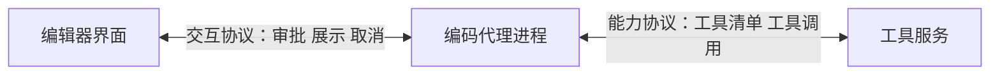

# 编辑器与编码代理的通信通道：能力协商与连接归属

编码代理从终端走进编辑器之后，多出一条通信线：编辑器要把工具调用画在界面上、要弹审批按钮、要把改动渲染成差异视图、要能取消一次正在跑的任务。业界为「代理进程怎么拿到工具」已经有一套协议（Model Context Protocol，MCP），但上面这些能力不归它管。

把两条线混成一条，会在协议选型时得出错误结论 —— 以为接了工具协议就顺手拿到了界面交互能力，或者以为界面里能弹审批就已经具备工具调用能力。

## 要解决的问题

两条通信线连接的对象不同，方向也不同：



**能力协议**解决代理进程如何发现与调用外部能力：工具清单、参数形状、调用与返回值、进度通知。代理进程是这条线上的客户端，工具服务是服务端。

**交互协议**解决编辑器如何与代理进程共同完成一次会话：发送用户输入、接收流式输出、把需要人决策的请求送到界面并取回答案、取消正在执行的回合。编辑器是发起方，代理进程对外提供这条通道。这条协议的代表是代理客户端协议（Agent Client Protocol，ACP）。

同一个代理进程同时站在两条线上：它是能力协议的客户端，又是交互协议的服务端。两条线可以各自替换 —— 换编辑器不影响接哪些工具，换工具服务不影响界面。这与语言服务器协议（Language Server Protocol，LSP）把编辑器与语言分析解耦是同一个思路，只是被解耦的另一端从语言分析换成了编码代理。

把三条协议放在一起，各自回答的问题互不重叠：

| 协议 | 连接的两端 | 回答的问题 |
| --- | --- | --- |
| 模型上下文协议 MCP | 代理进程 ↔ 工具服务 | 代理怎么拿到并调用外部能力 |
| 代理到代理协议 A2A | 代理进程 ↔ 另一个代理 | 一个代理怎么把任务委托出去 |
| 代理客户端协议 ACP | 编辑器 ↔ 代理进程 | 界面怎么和人一起完成一次会话 |

三者并列构成协议族的三个位置：能力、委托、交互。任何一方都替换不了另一方，详见 [[工程知识/AI 系统工程：从模型能力到生产能力/生态与选型/MCP与A2A的分工：工具协议与Agent协议不互相替代]]。

## 机制：交互协议的四个组成部分

**能力协商**。连接建立后双方先各自声明支持什么：是否支持在界面里提问、是否支持承载图像、是否支持每次改动的采纳与拒绝。这份声明决定功能挂载 —— 没有声明提问能力的连接，依赖提问的工具不会出现在会话里。协商结果是连接的属性，不是会话的属性，这一点在接入第三方客户端时最容易踩空。

**请求与应答的双向流动**。多数消息是代理进程到界面的流式事件，另有一类是界面必须回话的请求：这次工具执行是否放行、这个选项选哪一个。这类请求在代理进程内部是同步等待的，答不上就一直停在原地。

**连接的归属**。一次会话在同一时刻只能绑定一条交互通道，因为请求要送到明确的收件人手里。注册表通常只有一个槽位，后写入的连接覆盖先写入的。这条规则本身没错，错在实现里缺少「归还」与「认证」：谁最后完成握手谁就接管，原先真正在干活的通道被架空，见 [[工程知识/AI 系统工程：从模型能力到生产能力/质量与运营/投递指针的选举与失效：连接注册表的四个健壮性缺陷]]。

**取消与中断**。界面要能打断一次还在跑的回合，代理进程要能把中断传播到当前工具调用。

## 边界

- **交互协议不承载业务语义**。它只负责把请求送到界面并带回答案，请求该不该批准由策略层判断，见 [[工程知识/AI 系统工程：从模型能力到生产能力/安全与治理/沙箱限制能力，策略限制行为]]。
- **能力协商是连接级的，不是会话级的**。同一份配置换一个客户端就可能少挂载一类工具，排查时先核对协商声明。
- **通道断开后的行为没有统一规定**。规范通常只描述正常时序，断开导致的等待如何处理由实现决定，这正是「工具调用一直等待、日志里只有一条警告」的来源。
- **一条通道服务一个会话**。多会话并行需要多条通道，把多个会话挤在同一条通道上要求协议本身具备会话标识与路由能力。

## 验证

接入一个新客户端时，按三个层次核对，每层都有可查的证据：

1. **握手层**：抓一次连接建立过程，核对双方声明的能力字段是否与预期的功能挂载一致。日志里按能力名检索：

```bash
grep -n -i 'initialize\|capabilities' "$CLIENT_LOG" | head -20
```

2. **路由层**：核对请求实际发给了哪条连接。日志里检索投递失败与连接标识，两条连接标识交替出现说明归属被抢过：

```bash
grep -c 'sendToClient' "$CLIENT_LOG"
grep -o 'connectionId=[^ ]*' "$CLIENT_LOG" | sort | uniq -c
```

3. **时序层**：把日志里每一次请求与对应的应答配对，配不上对的就是等待的调用。同一时刻只能有一条连接在应答，出现两条即为异常。

**预期**是请求的连接标识在整个会话期间保持不变。**对不上**说明存在中途接管，需要回到归属策略上查「谁在什么时候写入了槽位」。

## 影响与代价

- 分成两条线换来的是可替换性：界面与工具各自演进，互不牵连。
- 代价是多一条通道要维护，多一处可能断开、可能被接管的位置。
- 接入方需要遵守一条纪律：观察与接管必须保持旁观者身份，任何写入槽位的动作都要可归还，见 [[工程知识/缺陷分析：从个案到体系/并发/只读旁观者不能改变被观察对象的状态]]。
- 无人值守场景下这条通道必须有替代应答者，见 [[工程知识/AI 系统工程：从模型能力到生产能力/质量与运营/AI 客户端会话需要守护：审批、委托与断线的接管层]]。

## 从什么地方做

1. **先分清两条线**：把工具连接配置与客户端接入配置分开管理，各自独立验证。
2. **再核对协商**：新客户端接入后先确认能力声明，再验证依赖这些能力的工具是否挂载。
3. **再守归属**：任何旁路接入都不得写入会话的应答槽位；只订阅事件流、按需应答。
4. **最后补失效处理**：给等待应答的调用加超时与就地报错，让通道断开表现为明确失败。

相关：[[工程知识/AI 系统工程：从模型能力到生产能力/生态与选型/MCP与A2A的分工：工具协议与Agent协议不互相替代]] · [[工程知识/AI 系统工程：从模型能力到生产能力/质量与运营/投递指针的选举与失效：连接注册表的四个健壮性缺陷]] · [[工程知识/AI 系统工程：从模型能力到生产能力/质量与运营/AI 客户端会话需要守护：审批、委托与断线的接管层]] · [[工程知识/后端系统：在并发、失败与变化中维持服务/服务设计/一路会话只能有一个回复归属：多客户端接入时的所有者绑定]]