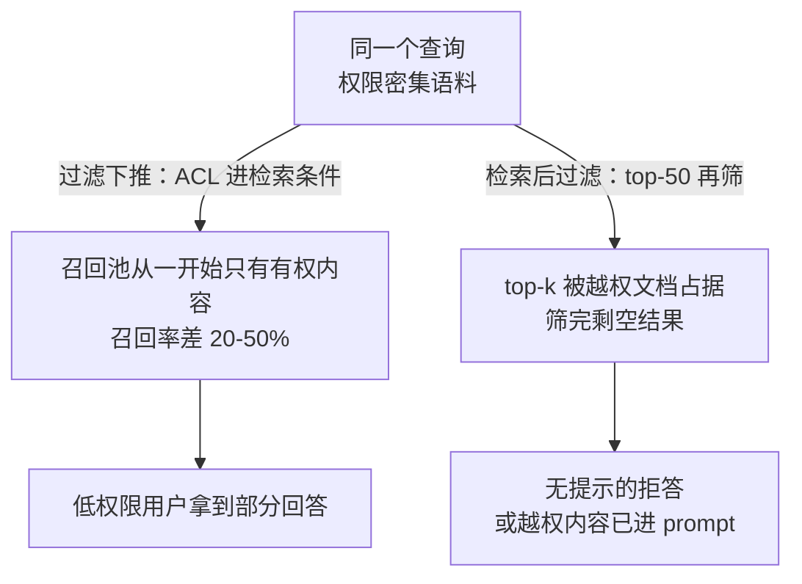

# RAG的新鲜度与权限传播：撤回的数据不能再被检索到

RAG 系统上线后最常见的失效是"检索到了不该检索的东西"：文档已更新但索引里还是旧版，作者已撤回但向量库里还能召回，用户没有权限但摘要层把内容漏了出去。要解决的问题：把新鲜度、权限和删除当作检索链路的一等公民，索引之外的事后过滤不可依赖。

本质是三个缓存一致性问题叠加。索引、摘要、向量、图结构都是源文档的派生物；源变了派生物必须跟着变，权限判断必须在召回前生效，删除必须传播到所有派生层。任何一层漏掉，用户看到的都是过期、越权或已删除的内容。

## 三类失效形态

| 失效 | 机制 | 信号 |
| --- | --- | --- |
| 新鲜度失效 | 源文档更新后索引未重建，召回旧版本 | 引用时间戳早于源 updated；同一问题新旧答案不一致 |
| 权限失效 | 召回时只看语义相似度，ACL 在生成后才检查或不检查 | 低权限用户引用中出现高权限内容 |
| 删除失效 | 源已删除但向量、摘要、缓存、图节点残留 | 已撤回文档仍被引用；删除后命中率未降 |

## 机制：版本、过滤位置与传播路径

权限过滤的正确位置在召回之前或之中：向量库支持带 filter 的检索时把 ACL 作为过滤条件传入，不支持时在候选集生成后、上下文组装前过滤。生成后再检查已经晚了，因为越权内容可能已进入提示词上下文或被模型转述。

过滤位置不同，召回池的形态在检索那一步就分岔：



新鲜度靠版本一致性保证：源文档带 revision 与 valid time，索引记录同 revision；召回时带出版本，生成引用时展示版本与时间。检测新旧分叉最简单的办法是定期对账源与索引的 hash。

删除传播是三者的老大难。一次"删除文档"实际要清理：向量库条目、摘要、父子文档树中的子块、图索引的节点与边、检索缓存、已生成的历史回答（后者通常不追溯，但要在证据链上标记失效）。漏掉任何一层，删除就只是"入口不可见"。

## 可运行示例：一次撤回的传播时延实测

撤回一篇文档后，逐层探测它何时真正"不可见"：

```bash
# T0：删除源文档（wiki 调用返回 404）
# T0+5min：全文检索引擎仍命中（索引刷新周期 5 分钟）
# T0+30min：向量库仍召回（重建管道周期 30 分钟）
# T0+31min：缓存层仍返回（TTL 30 分钟，未主动失效）

# 三层时延叠加 = 最坏 30+ 分钟内，撤回内容仍可能出现在答案里
```

复现方法的要点：撤回后按固定间隔用同一查询打检索层与生成层，记录"仍被引用"的最后一次时间——三个 TTL 的最大值就是撤回传播的真实上界。修正动作按层做：索引层挂删除事件流（CDC，秒级）、向量库支持按文档 ID 点删（不等重建）、缓存层在删除事件里主动失效。

## 量化锚点：权限过滤的位置差

权限过滤放在检索后（top-50 再过滤），用户可能拿到"全被过滤光"的空结果且无提示；放在检索中（元数据过滤下推），召回池从一开始就只有有权的内容——两种做法的召回率差距在权限密集场景可达 20-50%（大量文档因权限被扔掉后 top-k 被污染或排空）。成本侧：下推过滤要求向量库支持元数据索引，过滤字段基数高（万级用户组）时索引膨胀显著，按实际权限模型选字段。

## 边界

- 先过滤权限会缩小召回池，可能让低权限用户得到"拒答"而非"部分回答"，这是产品决策不是技术缺陷，需要明确选一个。
- 向量库的 filter 性能有限：ACL 维度多、规模大时，先粗召回后细过滤可能比全量带 filter 更快，两种顺序都要测。
- 版本一致性有窗口期：源更新到索引重建之间必然存在旧版可召回的间隙，重要的场景要在引用上标注时间戳让用户可判断。
- 图索引（GraphRAG 类）的删除传播成本远高于平面向量：节点被多份摘要引用时，删除需重建受影响的摘要层。

## 验证

验证的锚点：权限与新鲜度要与派生层对账——预写删除后所有派生层零命中、低权限回答不含高权限内容，任一项与预期对不上就说明传播链没有覆盖到那一层。

最小验证做三个测试：一是删除传播测试，删一篇文档后遍历所有派生层断言零命中，记录传播时间；二是越权零容忍测试，用不同权限身份跑同一问题集，断言低权限回答不含高权限内容的 hash；三是新鲜度对账，抽样比较源与索引的 revision，统计分叉率。

关系：[[工程知识/AI 系统工程：从模型能力到生产能力/知识与检索/RAG数据管道从文档到可引用证据]] · [[工程知识/AI 系统工程：从模型能力到生产能力/知识与检索/RAG的核心是选择可引用证据]] · [[工程知识/AI 系统工程：从模型能力到生产能力/模型与上下文/记忆是受治理的状态，不是更长的聊天记录]]
