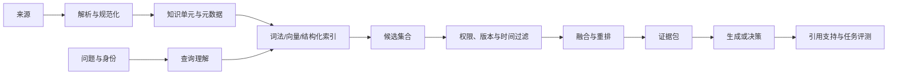

# RAG 的核心是选择可引用证据

RAG 要解决的是模型参数无法及时、可追溯地覆盖外部事实的问题。核心不是把更多文本塞进上下文，而是按问题、身份和时间选择能支持结论的证据；边界是召回命中不等于模型使用正确，必须能拒答、引用和处理冲突版本。最小实验是用单跳、数字、无答案和撤权样本分别测召回与引用支持。
RAG 不是“向量数据库 + 大模型”，而是一个证据系统：针对当前问题、身份和时间，从外部知识中选择能够支持结论的材料，并让答案与这些材料建立可检查的关系。向量检索只是候选生成方法之一；解析、权限、版本、排序、证据覆盖和拒答共同决定系统质量。

## 一条完整链路



只优化 embedding，相当于只优化这条链中的一个部件。

## 演进不是名词替换，而是暴露新的失败层

| 阶段 | 新增能力 | 主要失败 |
| --- | --- | --- |
| 直接塞上下文 | 小规模资料可直接使用 | 容量、噪声、权限和更新成本 |
| 稀疏检索 | 精确词、编号、代码和专名匹配 | 同义表达和语义改写 |
| 稠密检索 | 语义相似和跨表达召回 | 数字、否定、版本和相似干扰 |
| 混合检索 | 兼顾词法与语义信号 | 融合权重和候选重复 |
| 重排 | 改善前几名证据质量 | 延迟、候选规模和领域迁移 |
| 查询分解 | 处理多面和多跳问题 | 子问题遗漏、路径膨胀 |
| Agentic retrieval | 根据观察继续查找 | 无界搜索、来源污染和成本 |
| 时间与权限感知 | 支持企业当前事实 | ACL 滞后、删除延迟、版本冲突 |

实际系统通常需要混合这些能力，而不是选择一个“最先进 RAG”标签。

## 数据建模先于检索算法

一个知识单元不应只有文本和向量。至少保留：

```yaml
document_id: policy-42
unit_id: section-3.2
source_uri: ...
source_type: official_policy
version: 2026-08-10
valid_from: 2026-09-01
valid_to: null
owner: support-platform
acl: [role:support, tenant:acme]
content_hash: ...
parent: policy-42
```

切块需要尊重标题、表格、代码、列表和父子关系。固定字符切块虽然简单，却容易把条件与结论、函数签名与实现、表头与数据拆开。对代码应保留符号、文件和引用关系；对表格应保留表头与行列语义；对政策应保留生效时间和适用主体。

## 检索质量必须分层测量

| 层 | 指标或问题 |
| --- | --- |
| 解析 | 文本、表格、代码和元数据是否完整？ |
| 候选召回 | 必需证据是否出现在候选集合，Recall@K 如何？ |
| 排序 | 必需证据是否进入模型实际可见的位置，MRR/nDCG 如何？ |
| 覆盖 | 多面问题的核心子问题是否都有证据？ |
| 引用支持 | 每个关键句能否由引用片段直接支持？ |
| 新鲜度 | 答案是否使用查询时有效的版本？ |
| 权限 | 越权内容是否在检索前或最迟生成前被强制过滤？ |
| 任务结果 | 证据是否真正提高用户任务成功率？ |

最终答案正确但引用不支持，和引用正确但漏掉关键方面，是两种不同故障。必须分别标注。

## 什么时候不用向量检索

- 主键、订单号、版本号和精确字段优先结构化查询或词法检索；
- 需要聚合、过滤和计算的数据优先数据库或分析引擎；
- 实时状态优先业务 API，而不是等待索引同步；
- 小而稳定的规则可以直接进入程序或短上下文；
- 用户问题不需要外部事实时，不应为了架构统一强行检索。

RAG 与工具的区别在于：RAG 主要返回支持判断的证据，工具可以读取实时状态或产生动作。一个 Agent 可以先检索政策，再调用订单 API，最后提出退款动作；不要把三者都塞进“知识库查询”。

## 更新、删除和权限是生产核心

索引必须能回答源文档何时更新、哪些单元受影响、旧版本何时停止可见、删除多久传播、embedding 变更是否需要重建。缓存键需要包含租户、权限版本、文档版本和必要的时间切片；对撤权和实时事实敏感的查询，不应只依赖相似度缓存。

## 失败定位顺序

遇到错误答案时按链路向前追：

1. 来源中是否存在正确事实？
2. 解析是否保留了它？
3. 权限与版本过滤是否正确？
4. 候选召回是否包含它？
5. 重排是否把它放进可见位置？
6. Context Builder 是否真的选择了它？
7. 模型是否正确使用并引用？
8. 任务评测是否把错误识别出来？

这比笼统地“调 chunk size 或换 embedding”更能定位根因。

## 发布前如何证明它真的有用

先把一组真实问题固定下来，并为每个问题记录：应命中的证据、允许的版本与权限、答案必须覆盖的断言，以及无答案时应如何拒答。然后按下面顺序验证：

1. **数据层**：抽样检查解析结果是否保留标题、表格、代码、链接和生效时间，并用源文档哈希确认没有静默丢失。
2. **检索层**：分别测候选召回、过滤、重排和最终上下文，不把“进入候选集”误当成“模型实际看见”。
3. **生成层**：逐条核对关键断言是否被证据支持；证据不足时，系统应拒答或明确说明缺口，而不是用模型记忆补齐。
4. **系统层**：在撤权、删除、版本冲突、索引延迟和高并发下重跑，记录延迟、成本、错误和租户隔离结果。

只有当检索、引用、权限、时效和任务结果同时通过，RAG 才能进入线上流量。详细指标见 [[工程知识/AI 系统工程：从模型能力到生产能力/质量与运营/RAG评测要分离检索质量与生成质量]]。

相关：[[工程知识/AI 系统工程：从模型能力到生产能力/模型与上下文/记忆是受治理的状态，不是更长的聊天记录]] · [[工程知识/AI 系统工程：从模型能力到生产能力/质量与运营/Agent评测必须覆盖轨迹而不只看最终答案]]
