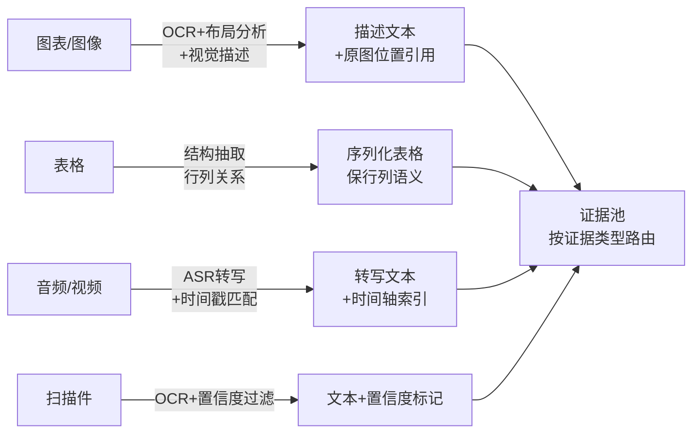

# 多模态RAG：图表、PDF与音频的证据不能只靠文本化

用户问"第三季度各区域销售额的趋势"，库里是带图表的 PDF 报告；系统把 PDF 转纯文本入库，图表里的数字全部丢失，检索命中了报告但答非所问——把多模态文档硬压成文本再检索，会系统性丢掉"只存在于图表里的证据"。要解决的问题：按模态选择解析与索引策略，让视觉、表格、音频里的证据可被检索、可被定位、可被引用，而不是退化为"检索到文档但答不出图里的问题"。

本质是模态保真与检索粒度的权衡。文本化（OCR/转写）把一切拉回文本管道，基建复用最大但丢视觉证据；多模态 embedding 把图与文映射进同一空间，跨模态检索顺但精度与成本有代价；混合方案（文本 + 图像描述 + 结构化表格抽取）是当前工程主流，三路证据并存、按问题路由。

## 机制：分模态解析与三路索引

| 模态 | 解析方式 | 索引形态 | 保真要点 |
| --- | --- | --- | --- |
| 图表/图像 | OCR + 布局分析 + 视觉模型描述 | 图像描述文本 + 原图位置引用 | 图中数值与标签须进描述，不只说"有张图" |
| 表格 | 表格结构抽取（行列关系） | 序列化表格 + Markdown/HTML 结构 | 行列语义保留，跨页表格合并 |
| 音频/视频 | ASR 转写 + 时间戳匹配 | 转写文本 + 时间轴索引 | 说话人与时间窗可定位 |
| 扫描件 | OCR + 置信度过滤 + 人工抽检 | 文本 + OCR 置信度标记 | 低置信区降权或送人工 |

四路模态各走各的解析与索引链，汇入同一个证据池：



关键设计：证据定位粒度到"页 + 区域"。多模态文档的引用要能回到原图/原时间点，生成端引用"报告第 7 页左上图表"而不是只引用文档名，否则用户无法核验。

## 失效形态

| 失效 | 机制 | 信号 |
| --- | --- | --- |
| 图表证据丢失 | PDF 文本化时图表被跳过 | 问图中数据时检索不到或答错 |
| OCR 幻觉 | OCR 把模糊字符猜成真实值 | 引用文字与原页不符 |
| 模态错配假支持 | 图像描述与图内容脱节，检索命中但答案无据 | 引用了"描述"而非图本身 |
| 表格语义断裂 | 序列化丢行列关系，"行3列2"变碎片 | 聚合类问题（趋势/对比）答错 |
| 时间轴丢失 | 音频转写不保时间戳 | "第10分钟说了什么"无法回答 |

## 边界

- 多模态 embedding 仍处于快速演进期：跨模态检索质量对不同模型的差异大，选型要拿自己的语料实测，公开 benchmark 外推不可靠。
- "描述生成"是一把双刃剑：视觉模型生成的描述可能幻觉（图中没有的数字被描述出来），描述必须带原图引用并抽样人审。
- 三路索引的维护成本明显高于文本管道：解析、索引、更新、权限都要按模态各做一遍，小规模场景先确认收益再上。
- 模态缺失降级要显式设计：查询带图但索引只有描述、或 ASR 失败的音频段，检索层要能报告"证据不完整"，静默忽略会让残缺证据当成完整证据使用。

## 可运行示例：同一页 PDF 的两种索引

一页含柱状图与表格的财报 PDF，纯文本化与分模态索引的证据差异：

```python
# 方案 A：纯文本化（常见默认路径）
text = pdf_page.extract_text()
#   柱状图 → 一个字都提不出来（图形内容整块丢失）
#   表格   → "Q1 320 Q2 410 Q3 295 ..." 列名与数值脱钩，单元格关系全断
#   后果：查询"哪个季度环比下滑最大"→ 检索命中该页 → 模型看着残缺文本瞎算

# 方案 B：分模态解析 + 三路索引
images = extract_figures(pdf_page)          # 图表按块提出，保留原图
table  = extract_table(pdf_page)            # 表格按结构化行提出
capt   = pdf_page.text                      # 正文文本
index.upsert([
    ("fig-3",  embed(caption_of(images[0])), {"type": "figure", "data": images[0]}),
    ("tab-1",  embed(serialize(table)),      {"type": "table",  "rows": table}),
    ("txt-1",  embed(capt),                  {"type": "text"}),
])
#   查询"哪个季度环比下滑最大" → 表格行被召回（含列名与数值的对应关系）
#   → 生成时把原始行数据放进上下文 → 答案：Q3（410 → 295，环比 -28%）
```

跑一遍的收获：文本化丢的重量分级——表格丢结构（还能部分恢复），图表丢整块证据（无法恢复），音频转写丢语气与说话人（归属错乱）。分模态索引让每种模态用自己无损的表示进库，检索时按证据类型路由。

## 量化锚点与案例回流

丢失率的账：图表密集型文档（财报、论文、运维报告）里图表承载的信息占比按语料实测，纯文本化等于整块证据进不了库——这类查询的失败在检索层就注定，与生成模型能力无关。成本的账：分模态解析的入库成本高于纯文本化（版面分析 + 多模态编码两道工序叠加），但只付一次（入库时），检索侧成本不变，倍数按自家语料的图表密度实测。案例回流：跨模态归属错乱的实录形态见 [[工程知识/缺陷分析：从个案到体系/正确性/案例三十九：身份在改写中丢失——RLS 子查询与视图 DEFAULT 的静默失真.md]]——中间表示（视图/转写文本）在改写中把归属信息磨掉，下游拿着失真证据继续算，静默错值；[[工程知识/AI 系统工程：从模型能力到生产能力/Agent与工作流/结构化输出与约束解码：schema约束形状，事实另需验证.md]] 的分工在多模态域同样成立——表格行进上下文是"形状可解析"，数值对不对要靠原始行数据而非模型记忆。

## 验证

验证的锚点：多模态管道要与问题类型对账——预写「答案只在图里」的问题三路索引召回显著更高、纯文本类两者持平，实测与预期对不上就说明该批图表不值得单建索引。

最小验证：构造一个含 10 张图表、5 张表、2 段音频的测试语料，准备两类问题——"图中数据类"（答案只在图里）与"文本类"，分别测文本化管道与三路索引管道；断言图中数据类问题的召回率三路方案显著更高、文本类问题两者持平。再做 OCR 抽检：随机抽 20 个 OCR 结果与原页对照，统计字符错误率与幻觉率，幻觉（编造数字）零容忍、字符错误率 >2% 时该批次降权。

关系：[[工程知识/AI 系统工程：从模型能力到生产能力/知识与检索/RAG的新鲜度与权限传播：撤回的数据不能再被检索到]] · [[工程知识/AI 系统工程：从模型能力到生产能力/知识与检索/RAG数据管道从文档到可引用证据]] · [[工程知识/AI 系统工程：从模型能力到生产能力/数据与MLOps/训练数据治理：来源、许可与污染决定语料的长期价值]]
