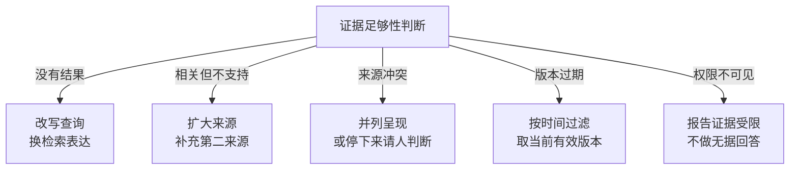
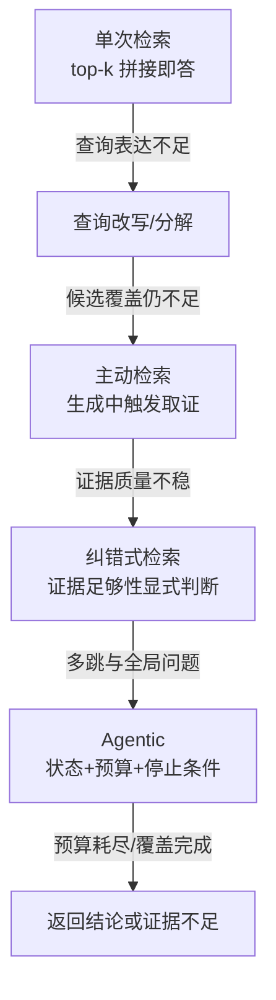

# 检索从一次查询演进为有状态的证据获取

RAG 的演进逐步回答五个未解决的问题：何时需要外部证据、应该查什么、结果是否足够、证据如何组织、什么时候停止。每增加一层决策能力，也增加一层可观测和评测责任。

可以把它想成查资料：简单问题查一次目录就够；问题含糊时先改写关键词；需要多份材料时分成子问题；证据互相矛盾时要换源或停下来请人判断。所谓“高级 RAG”只是把这些动作变成可记录、可限时、可评测的状态，而不是让模型无限搜索。

## 基础范式：把可更新知识放在模型参数之外

2020 年的 RAG 工作把参数化生成模型与外部非参数记忆结合，核心价值是让模型按输入取得外部信息，而不是要求所有事实都固化在参数中。这建立了长期不变的分工：模型擅长语义整合，外部知识系统负责可更新、可定位的事实。

最初的工程形态通常是：

```text
问题 -> 单次检索 top-k -> 拼接片段 -> 模型回答
```

它适合问题与单个片段高度对应的语料，但很快暴露出查询表达、证据覆盖和检索质量不可见的问题。

## 混合召回与重排：相似不等于有用

稠密向量擅长语义改写，词法检索擅长编号、专名、代码、数字和罕见词。两者没有简单替代关系。生产系统常先合并多个通道的候选，再用交叉编码器、late interaction 或任务规则重排。

这一阶段解决“候选是否覆盖”和“前几名是否可用”，但不能解决复杂问题需要多组证据、初始查询信息不足或检索结果本身质量差。

## 查询改写与分解：用户问题不一定是最佳检索表达

复杂问题可能包含多个方面，或者需要先找到一个实体再查第二跳。系统开始生成多个查询、分解子问题、使用假设性文档或沿实体关系扩展。

收益来自提高证据覆盖，代价是查询漂移、重复候选、调用成本和组合爆炸。规划器必须保留原始目标，列出需要覆盖的子问题，并能解释每个检索步骤服务于哪个缺口。

## 主动与自适应检索：不是每个位置都值得查询

FLARE 把检索触发推进到生成过程：当后续内容不确定时再主动获取资料。Self-RAG 进一步把是否检索、证据相关性和生成支持度纳入反思信号。Adaptive-RAG 按问题复杂度在不检索、单步和迭代检索之间选择。

这些方法共同改变了控制权：检索不再是固定前置步骤，而是运行时决策。收益是对简单问题少做工作、对困难问题继续取证；风险是把模型的自评当作真实充分性。生产实现仍需最大查询次数、允许来源、证据覆盖门禁和外部停止条件。

## 纠错式检索：低质量证据不能直接进入生成

CRAG 等工作引入检索质量评估和纠错路径：当本地候选不足时改写查询、扩大来源或使用其他数据源。其核心是把“当前证据是否足够”设成显式状态，具体算法各版本不同。

这个状态至少区分：没有结果、结果相关但不支持结论、来源冲突、版本过期和权限不可见。不同原因对应不同动作，不能统一成“再搜一次”。

五种不足各自走各自的处置路径：



## 层次与图检索：索引结构服务于问题结构

RAPTOR 通过递归聚类和摘要构造层次表示，适合跨长文档的多层问题。GraphRAG 使用实体关系与社区摘要处理语料级全局问题。它们解决的是普通片段检索难以覆盖的特定问题结构，不是所有 RAG 的默认高级版本。

如果任务主要是精确政策、代码符号或订单状态，图构建成本很可能没有收益。采用前先建立“局部事实、跨段综合、关系路径、全局主题”等查询切片，证明新索引只在哪些切片上改进。

## Agentic retrieval：把证据获取变成可恢复任务

当系统能够根据当前证据选择查询、数据源和下一步，并保存未解决问题、观察和预算时，检索成为有状态过程：

```yaml
question: ...
required_facets: [...]
resolved_facets: [...]
queries: [...]
evidence: [...]
conflicts: [...]
remaining_budget: ...
stop_reason: ...
```

“Agentic”新增的是决策与状态；循环调用一个 retriever 只是它的表层形态。它适合动态 Web、跨数据源调查和开放式研究；对固定知识问答，确定性混合检索通常更便宜、更稳定。

从单次查询到有状态检索，决策与停止条件怎么长出来：



## 自动优化：搜索配置，不替代评测

AutoRAG 一类工具把解析、切分、embedding、召回、重排和生成配置放进实验空间，在固定问题集上批量比较候选管线。它解决的是人工一次只试一个参数、实验难复现的问题；收益是更快发现可行组合，代价是搜索成本、过拟合和错误目标函数被放大。

一轮受控优化应当固定语料快照、问题与参考证据、权限、模型和硬件，再同时比较检索质量、引用支持、延迟与费用。调优集与保留集必须分开，合成问题要抽样人工核验；自动选择出的配置先进入影子流量或灰度，而不是直接覆盖线上索引。模型或框架给出的“最佳配置”只是候选结论，不能代替真实任务回归。

## 选择升级路径

| 已观察到的失败 | 优先动作 | 暂时不要做 |
| --- | --- | --- |
| 还没有稳定评测集 | 建立问题、证据、权限和无答案样本 | 比较模型或向量库排行榜 |
| 目标证据在候选里但排得靠后 | 引入或校准 reranker | 立刻重做整个索引 |
| 语义改写、多语言召回不足 | 对照更合适的 embedding，例如 BGE-M3 类多语言模型 | 只看公开 benchmark 就迁移 |
| chunk 脱离标题和邻近语义 | 加入文档上下文、父子扩展或 Contextual Retrieval | 单纯扩大 chunk 和 top-k |
| 初始查询无法覆盖多面问题 | 查询分解、主动或纠错式检索 | 无界 Agent 循环 |
| 问题依赖关系路径或全局主题 | 在对应问题切片上评估 GraphRAG | 把全部语料默认图化 |
| 现有存储无法表达过滤和更新 | 最后再评估索引或向量库迁移 | 用换数据库掩盖解析与评测缺失 |

这个顺序是因果顺序：先证明失败发生在哪一层，再改变能影响该层的最小组件。每次只改变一组变量，才能知道收益来自哪里。产品榜单的顺序与本表的先后没有关系。

## 演进带来的评测变化

| 能力 | 不能只看 | 必须新增 |
| --- | --- | --- |
| 混合与重排 | 最终答案 | 各通道 Recall、融合与 nDCG |
| 查询分解 | 单个 query 命中 | 子问题覆盖、漂移与总查询数 |
| 主动检索 | 是否调用检索 | 触发正确性与避免检索的收益 |
| 纠错 | 最终找到证据 | 质量判断、换源和冲突处理 |
| 层次/图检索 | 平均 Recall | 适用问题切片与构建成本 |
| Agentic retrieval | 回答质量 | 轨迹、停止、总成本和来源安全 |
| 自动配置搜索 | 调优集最高分 | 保留集、复现记录、成本约束和回滚 |

演进方向最终都回到同一个标准：**系统是否以可接受的成本，找到当前主体有权使用、在当前时间有效、足以支持目标结论的证据。**

相关：[[工程知识/AI 系统工程：从模型能力到生产能力/知识与检索/RAG的核心是选择可引用证据]] · [[工程知识/AI 系统工程：从模型能力到生产能力/知识与检索/混合检索、重排与查询改写各自解决什么问题]] · [[工程知识/AI 系统工程：从模型能力到生产能力/质量与运营/RAG评测要分离检索质量与生成质量]]

验证的锚点：会话态检索的效果要与查询意图对账——补全后的查询与用户原始意图偏离（补进了会话噪声、没有带来澄清），看每轮改写的 diff 与最终答案引用的证据，对不上的轮次回退为仅用原始查询。

## 验证

最小验证：取一组需要多跳才能回答的问题（答案分散在两份以上材料里），分别用单次检索与多轮检索跑，断言多轮方案在子问题覆盖率与最终答案正确率上更高，同时记录总查询数、总 token 与端到端耗时，确认提升与成本的比例可以接受。

停止条件验证：构造一个无法从语料中回答的问题，断言系统在预算耗尽时返回明确的证据不足，而非继续扩大检索范围。

## 边界

- 多轮检索的收益依赖问题本身可分解：答案集中在一份材料里的问题，多轮只会增加查询次数与延迟。
- 判断检索时机的正确率决定收益：把需要检索的问题判为不需要时，本轮不会取回证据；把不需要检索的问题判为需要时，多付出一次检索成本。
- 检索轮数与上下文占用互相推高：每轮返回的证据都进入上下文，轮数增加时先碰到上下文上限。
- 纠错依赖质量判断的正确性：判错方向时换源会换到更差的材料。
- 图检索与层次检索需要额外的构建与维护：语料更新快时，图结构本身的维护成本可能超过它带来的召回收益。

## 机制与本质

单次查询把检索看作一次函数调用，输入是查询文本，输出是候选集合；有状态检索把它看作一个循环，状态里保存已获得的证据、尚未覆盖的子问题与剩余预算，每一步的动作由当前状态决定。状态的存在使停止条件成为必要组件，也使评测从命中率转向轨迹与成本。

## 要解决的问题

单次查询在需要多跳推理或问题表述与语料用词不一致时召回不足，把全部检索压在一次调用里无法修正表述偏差。本篇回答：检索为什么会演进成有状态的过程、状态里需要保存什么、每一类能力新增了哪些评测维度，以及什么时候应当停止检索并给出证据不足的结论。

