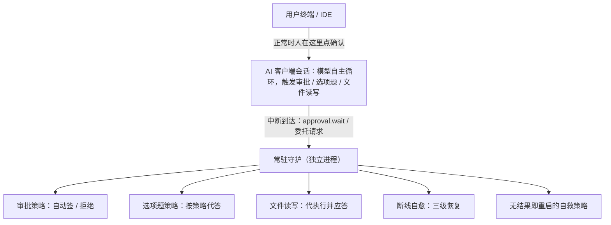

# AI 客户端会话需要守护：审批、委托与断线的接管层

AI 客户端（CodeBuddy、Claude Code、Codex 这类常驻命令行）把一次任务跑成长时间的自主循环，期间会反复弹出审批卡、选项题、文件读写请求。这些交互默认要人坐在窗口前点确认。一旦人离开、网络抖动、窗口断开，交互层就没人应答——工具调用无限等待，用户只看到一个「卡住」的会话，却不知道卡在哪。

解决它的办法是给 AI 客户端配一个**常驻守护的接管层**：一个独立进程，代替人在会话窗口里应答审批、代答选项题、代执行文件读写，并在会话断线或卡死时自愈。这个守护不是 Agent 本身，而是 Agent 与操作系统之间的运维层——相当于给 AI 客户端请了一个永不离岗的值班员。

## 要解决的问题

一个无人值守跑着的 AI 会话，有四类地方会无声卡死：

| 卡点 | 表现 | 根因 |
| --- | --- | --- |
| 权限审批 | 弹出一张「是否允许执行 Bash」的卡，没人点 → 永久等待 | 审批是同步阻塞的，答案只能来自交互窗口 |
| 选项题 | AskUserQuestion 弹出「猫还是狗」，没人选 → 永久等待 | 同上，且模型在等答案才能继续 |
| 文件读写 | 读文件、写文件的请求发出去，对端不应答 → 永久挂起 | 读写本身委托给另一个连接执行，投递失败却静默丢弃 |
| 会话断线 / 卡死 | 网络断了、模型那边没结果了，会话僵在那 | 没有超时兜底，也没有自动重连续跑 |

共同点是：**这些卡点都发生在「需要有人应答」的环节，而人不在**。传统做法是把整个会话绑在一个 tmux/screen 里指望它不断，但会话自己不会应答自己的审批——它需要一个外部的、独立的应答者。

## 机制：守护作为独立应答者

守护是一个与 AI 客户端进程分离的常驻进程，通过接管客户端的交互通道来工作：



关键设计是**守护与会话是两个进程**。会话挂了守护还在；守护重启不影响已经在跑的会话状态。守护通过客户端提供的「替身窗口」机制接入——它不 fork 会话，而是作为一个旁听者接管交互线，有求必应。

### 四类应答的分工

**审批自动批准**——守护拿到审批卡，按策略决定签或拒。策略是显式配置的（哪些操作自动放行、哪些必须拦），不是让模型判断。这与 [[工程知识/AI 系统工程：从模型能力到生产能力/安全与治理/沙箱限制能力，策略限制行为]] 一致：边界由策略定，不由推理定。

**选项题代答**——AskUserQuestion 到达时，守护按预设策略选一个选项（例如「第一选项」或「最保守选项」）。策略默认关闭，开启后仍需真实弹卡验证过一次才算闭环。

**文件读写委托代执行**——这是最隐蔽的一类。客户端的读文件、写文件不是本地直接做的，而是把请求**委托**给一个对端连接执行（fs/read_text_file、fs/write_text_file）。守护作为那个对端应答，读写才秒回。如果守护不在，请求发给一个已经失效的连接，就永久挂起。这条委托链路也是为什么永久挂起时「读写全挂、命令执行不挂」——命令是后台本地跑的，不走窗口；读写走窗口。

**断线与卡死自愈**——两层兜底：

- 断线自愈：连接断了按三级恢复提示词逐级尝试重连续跑，而不是直接放弃会话。
- 挂起自救：给每次工具调用一个「无结果时限」（例如 15 分钟无任何输出），超时就 kill 掉这次调用并 resume 续跑。这对应 [[工程知识/后端系统：在并发、失败与变化中维持服务/分布式可靠性/超时的层次设计：连接、读写与整链路的预算分配]]——每一层调用都要有自己的时限。

## 常驻化：让它成为系统服务

守护必须脱离人的登录会话独立存活，用 systemd 托管 + 开机自启：

```ini
[Service]
Type=simple
ExecStart=/path/to/guard
Restart=always
RestartSec=5
StandardOutput=journal
```

三件套缺一不可，理由见 [[工程知识/后端系统：在并发、失败与变化中维持服务/任务与并发/后台任务的守护链：进程托管与会话脱离是可靠性的底线配置]]：进程托管（systemd 拉起与重启）、会话脱离（不依附任何登录 shell）、日志归属（进 journald 而非某个终端）。再叠加单实例锁防止两个守护互抢指针。

非 systemd 环境用等价的 setup 脚本兜底，同样要做 pid 自注册和单实例防护。

## 效果与代价

**收益**

- 无人值守的长任务不再因为一张审批卡或一道选项题而永久卡死。
- 断线和卡死有兜底，会话能自愈续跑，不需要人半夜去点鼠标。
- 文件读写经守护代执行，秒回，不再永久挂起。

**代价与边界**

- **自动批准是有风险的让步**：把审批权交给守护，等于把安全边界从「人逐次确认」放宽为「策略一次性约定」。因此策略必须显式、可关、可审计，且敏感操作仍应留在人工环路——呼应 [[工程知识/AI 系统工程：从模型能力到生产能力/质量与运营/人在环路要设在不可逆的决策点]]。
- **选项题代答可能选错**：按策略选第一选项不等于选对，只在「哪个都行」的场景安全；有实质分叉的选项仍应人工。
- **守护本身要可观测**：守护卡不卡、答没答，都要进日志（journalctl 一查便知），否则值班员自己失联了没人知道。

## 从什么地方做

1. **先定位卡点**：跑几天，把所有「会话不动了」的时刻分类——是审批、选项题、读写还是断线。看真实分布，通常集中在一两类。
2. **先接审批自动批准**：最高频、最确定，策略也最简单（放行白名单 + 拦黑名单）。
3. **再接文件读写委托**：这一类不显眼但一旦永久挂起最难查，守护作为对端应答即可根治。
4. **然后上选项题代答与自愈**：这两类依赖真实触发验证，代码就绪后等自然出现一次弹卡/断线，确认闭环。
5. **最后做常驻化**：systemd 托管 + 开机自启 + 单实例锁，让它彻底脱离人的会话。

相关：[[工程知识/后端系统：在并发、失败与变化中维持服务/任务与并发/后台任务的守护链：进程托管与会话脱离是可靠性的底线配置]] · [[工程知识/后端系统：在并发、失败与变化中维持服务/分布式可靠性/超时的层次设计：连接、读写与整链路的预算分配]]

相关（约定层）：[[工程知识/AI 系统工程：从模型能力到生产能力/质量与运营/可观测性必须能重建一次决策]] —— 守护的每一次代答都应进日志可重建

相关（同一条通道的机制）：[[工程知识/AI 系统工程：从模型能力到生产能力/质量与运营/投递指针的选举与失效：连接注册表的四个健壮性缺陷]] —— 守护为什么必须保持旁观者身份，抢走应答权会怎样
[[工程知识/后端系统：在并发、失败与变化中维持服务/服务设计/一路会话只能有一个回复归属：多客户端接入时的所有者绑定]] —— 应答槽位只有一个位置，能力声明如何参与归属判定
[[工程知识/缺陷分析：从个案到体系/稳定性/订阅者断线之后路由指向谁：请求被静默丢弃的识别]] —— 守护断线的瞬时窗口里，请求被静默丢弃的识别方法
[[工程知识/AI 系统工程：从模型能力到生产能力/生态与选型/编辑器与编码代理的通信通道：能力协商与连接归属]] —— 守护要代答的正是交互协议这条通道，能力声明决定它能否接手

验证的锚点：守护效果要与无人值守演练对账——预写人离开窗口后审批卡与选项题被应答、断网后从断点续跑，实测停在原地等人工，与预期对不上。

## 验证

1. 无人值守演练：发起一个会长时间跑的会话，人离开窗口，确认审批卡、选项题与文件读写请求被守护进程应答，会话继续推进。
2. 断线自愈：中途切断网络或关闭窗口，确认守护进程探测到会话失联后重新接管，任务从中断处续跑而不是从头开始。
3. 放行边界：核对守护代答的每一条审批都在授权范围内，超出范围的操作被拒绝并留下记录。

