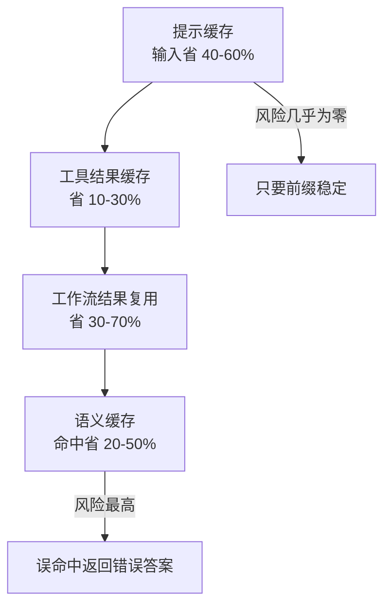
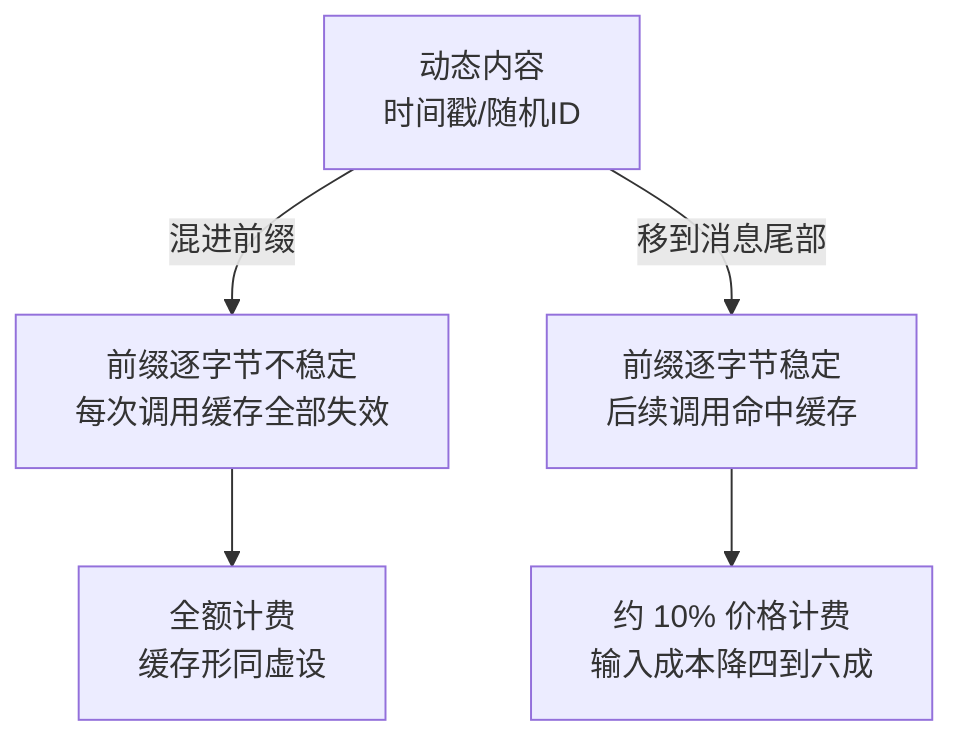

# Agent 的缓存与结果复用

## 背景：同样的文件读了 40 遍

一个代码 Agent 的轨迹统计：

```
总调用：52 次
其中 read_file("src/config.yaml")：11 次
     grep("TODO")：7 次
     相同的系统提示 + 工具定义：52 次（每次都重发）
```

**成本构成**：

| 部分 | 占比 |
| --- | --- |
| 重复读取的文件内容 | 31% |
| 系统提示 + 工具定义（每次重发） | 44% |
| 实际有效的新信息 | 25% |

**四分之三的 token 花在了重复内容上。** 复用机制缺失是根因，模型本身没有问题。

## 方案：三个层次的复用

### 层次 1：Prompt Caching（最省事，必做）

模型 API 提供的缓存：**把提示词前缀缓存起来，后续调用只付约 10% 的价格。**

```
第一次调用：系统提示(8000) + 工具定义(4000) + 对话(2000)  → 全价
第二次调用：系统提示 + 工具定义（命中缓存，10%）+ 对话(4000)
```

**要求：前缀必须稳定。**

| 做法 | 缓存效果 |
| --- | --- |
| 系统提示 + 工具定义 + 历史（稳定在前） | 命中 |
| 在系统提示开头放当前时间 | 每分钟失效 |
| 把用户输入放在最前面 | 每个用户都不同，无法复用 |

**实践要点**：

```python
# 正确顺序：稳定的放前面
messages = [
    {"role": "system", "content": SYSTEM_PROMPT},      # 固定
    {"role": "system", "content": TOOL_DEFINITIONS},   # 固定
    # cache 断点在这里
    *conversation_history,                              # 变化的部分
    {"role": "user", "content": new_input},
]
```

**注意**：对话历史增长时，只有前面的部分能命中缓存。所以**缓存命中率会随对话变长而下降**——这正好和上下文压缩的需求一致。

### 层次 2：工具结果缓存（省的是"重复读取"）

**哪些可以缓存**：

| 工具 | 可缓存吗 | 依据 |
| --- | --- | --- |
| `read_file` | 可以 | 路径 + 文件的 mtime/hash |
| `grep` | 可以（短期） | 查询 + 目录的变更时间 |
| `list_dir` | 可以（短期） | 路径 |
| `git_log` | 可以 | commit hash |
| `run_tests` | 不可 | 每次代码可能变了 |
| 写操作 | 不可 | 缓存写操作会导致不执行 |

**实现**：

```python
def read_file_cached(path):
    key = f"{path}:{file_hash(path)}"      # 内容变了 key 就变
    if cached := cache.get(key):
        return cached
    content = read_file(path)
    cache.set(key, content, ttl=300)
    return content
```

**关键：缓存键要包含内容的版本标识**（mtime、hash、commit）。**只按路径缓存会导致读到旧内容。**

**给模型的返回要标明是缓存的**：

```
[缓存] src/config.yaml（读取于 3 分钟前，文件未修改）
...内容...
```

**这样模型知道可以信任，也知道不是最新的。**

### 层次 3：语义缓存（省的是"重复的语义查询"）

**概念**：相似的问题直接返回历史答案。

```python
def semantic_lookup(query):
    similar = vector_db.search(query, threshold=0.95)   # 阈值要高
    if similar:
        return similar.answer
    return None       # 没命中就正常调用
```

**风险很高，要非常小心**：

| 风险 | 说明 |
| --- | --- |
| **误命中** | 语义相似但问题不同，返回错误答案 |
| **过期** | 代码改了，但缓存的答案还在 |
| **个性化丢失** | 不同用户的相似问题返回相同答案 |

**什么时候可以用**：

- 阈值设得很高（0.95+）
- 答案是确定性的（FAQ、文档问答）
- 有明确失效机制（代码 commit 变了就清）

**什么时候不该用**：

- 代码相关（改动频繁，误命中代价高）
- 需要个性化的
- 答案有时效性的

**保守建议**：默认不用语义缓存。**先做前两层，它们安全且效果明确。**

### 层次 4：工作流结果复用

如果你用了工作流（见 [[工程知识/AI 系统工程：从模型能力到生产能力/Agent与工作流/先用工作流，只有路径无法预先枚举时才使用Agent]]），**中间步骤的结果可以复用**：

| 步骤 | 动作 | 复用条件 |
| --- | --- | --- |
| 1 | 提取 diff | 同一个 PR 重复审查时可复用 |
| 2 | 分类变更类型 | 可复用 |
| 3 | 按类型深入审查 | 代码变了才需重跑 |

**按 git commit hash 缓存中间结果**，PR 更新后只重跑受影响的部分。

## 效果与代价

| 层次 | 典型节省 | 风险 |
| --- | --- | --- |
| Prompt Caching | **40-60%**（输入部分） | 无（只要前缀稳定） |
| 工具结果缓存 | 10-30% | 读到旧内容（用版本键避免） |
| 语义缓存 | 20-50%（命中时） | **误命中，返回错误答案** |
| 工作流复用 | 30-70% | 缓存失效逻辑复杂 |

**优先级：Prompt Caching > 工具结果缓存 > 工作流复用 > 语义缓存。**

四个层次按可靠程度排成一列，越往下省得越多、风险也越大：



上图说明：前两层靠版本标识就能保证正确，语义缓存的节省取决于相似问题是否真的等价，默认不启用。

## 从什么地方做

**第一步：先看成本构成**

统计：系统提示占比、重复工具调用次数、历史增长速度。**不要凭感觉优化。**

**第二步：上 Prompt Caching**

调整消息顺序，把稳定的放前面。**这一步通常能省 40%+，且零风险。**

**第三步：给只读工具加缓存**

从 `read_file` 开始——它通常是重复最多的。**用 hash/mtime 做缓存键。**

**第四步：缓存命中率监控**

```json
{"cached_tokens": 8200, "total_input_tokens": 12400, "hit_rate": 0.66}
```

**命中率低于 50% 说明前缀不稳定**，去查是不是有动态内容混在前面。

**第五步：谨慎对待语义缓存**

如果确实要用，**阈值 0.95+，且只用于确定性问题**。

## 常见错误

**错误 1：在系统提示里放动态内容**

"当前时间"、"随机 request_id" 放在前缀 → 缓存永远不命中。**动态内容放最后。**

动态内容的位置决定缓存的生死，两条路各走到不同终点：



**错误 2：按路径缓存文件内容**

代码改了但缓存没失效 → 模型基于旧代码推理。**必须把 hash/mtime 放进缓存键。**

**错误 3：缓存写操作**

`edit_file` 被缓存 → 第二次调用不执行 → 模型以为改了其实没改。**只缓存只读操作。**

**错误 4：语义缓存阈值太低**

0.8 的阈值会把"怎么删除用户"和"怎么删除订单"当成同一个问题。**必须 0.95+，且最好不用。**

**错误 5：不看命中率**

以为开了缓存就在省钱，实际命中率 10%。**必须监控。**

**错误 6：缓存没有上限**

缓存占满内存 → OOM。**用 LRU + TTL。**

相关：[[工程知识/AI 系统工程：从模型能力到生产能力/质量与运营/成本控制要从上下文和重试两头下手]] · [[工程知识/AI 系统工程：从模型能力到生产能力/模型与上下文/上下文工程是在有限预算内构造决策现场]]

验证的锚点：缓存命中要与事实对账——缓存条目带输入指纹与时效标记，命中后仍要过时效检查，事实变了（数据更新、权限变更）宁可穿透重算，对不上的条目直接失效。

## 验证

最小验证：选一个重复读取明显的任务轨迹，统计改前改后的 `cached_tokens` 与 `total_input_tokens`，断言命中率从接近零升到 50% 以上，且调整消息顺序后前缀保持稳定。再对文件缓存做一次失效验证：读取一次文件、修改文件内容、再次读取，断言第二次拿到的是新内容而非缓存内容。

误命中验证：构造两组语义相近但对象不同的查询（例如"怎么删除用户"与"怎么删除订单"），断言阈值设置能区分，无法区分时该项缓存停用。

关系：[[工程知识/AI 系统工程：从模型能力到生产能力/质量与运营/成本控制要从上下文和重试两头下手]] · [[工程知识/AI 系统工程：从模型能力到生产能力/模型与上下文/上下文工程是在有限预算内构造决策现场]]

## 边界

- 前缀缓存要求前缀逐字节稳定：系统提示里放当前时间、随机标识符、按用户拼接的偏好，都会让命中率归零，这类内容要移到消息尾部。
- 文件与检索结果缓存的有效性取决于版本标识：只按路径或查询串作为键，改动之后会读到旧内容并据此继续推理。
- 只读操作才能缓存：写入、执行测试、发请求这类操作被缓存后不再实际执行，调用方却以为已经生效。
- 语义缓存的误命中代价高于它省下的成本：阈值降低到 0.9 以下时，相似问题被当成同一个问题，返回的答案与当前问题无关。
- 缓存占用需要有上限与过期策略：没有容量限制的缓存会持续增长，最终拖垮进程。

## 要解决的问题

一个代码 Agent 的轨迹里，同一份文件被重复读取十几次，系统提示与工具定义每次调用都重发一遍，成本结构显示大部分开销来自没有新增信息的内容。本篇回答：哪些内容可以复用、复用的键里必须包含什么、哪些操作绝不能复用，以及怎样用命中率判断复用机制是否真的生效。

