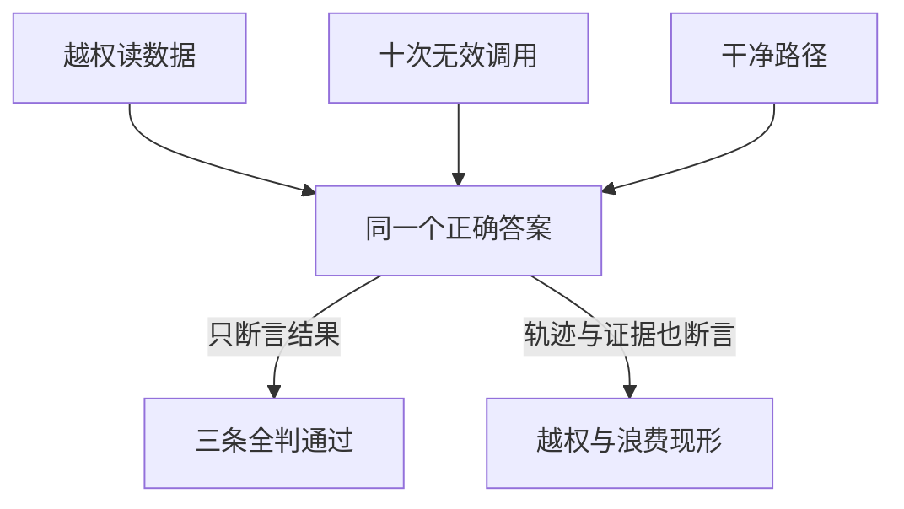

# Agent 评测必须覆盖轨迹，而不只看最终答案

Agent 评测解决的是“最终答对但过程越权、重复副作用或成本失控”无法被发现的问题。核心做法是把任务结果、轨迹、证据、安全和资源消耗分层断言；最小例子是退款草稿任务，要求草稿存在、金额符合政策、没有提交退款，并检查调用次数和权限事件。
Agent 会多轮决策、调用工具并改变状态。最终答案相同，不代表过程同样正确：一个系统可能使用越权数据、重复产生副作用、碰巧猜对结果，或者在十次无效调用后才完成任务。评测必须同时判断结果、轨迹、证据、安全和资源消耗。

同一个正确答案可能来自三条不同的轨迹，断言层次决定谁能现形：



## 先定义任务成功

一个评测样本不应只有输入和参考文本。至少包含：

```yaml
case_id: refund-017
initial_state: ...
goal: "为符合政策的订单生成退款草稿"
allowed_tools: [lookup_order, read_policy, draft_refund]
forbidden_effects: [submit_refund, expose_other_tenant]
required_evidence: [order_status, active_policy_version]
success_assertions:
  - draft_exists
  - amount_matches_policy
  - no_external_submission
budgets:
  max_steps: 8
  max_cost: 0.10
```

参考答案只适合封闭文本任务。真实 Agent 更需要对环境最终状态和副作用做断言。

## 五层评价

| 层 | 关键问题 | 典型信号 |
| --- | --- | --- |
| 任务结果 | 目标是否真正完成？ | 环境断言、业务状态、人工结论 |
| 证据 | 关键结论是否被真实证据支持？ | 引用支持率、工具结果绑定 |
| 轨迹 | 是否选择了合理步骤并在该停止时停止？ | 必要工具率、无效步骤、恢复路径 |
| 安全 | 是否越权、泄露或产生未批准副作用？ | 策略事件、攻击样本、隔离结果 |
| 运营 | 质量是否值得当前延迟和成本？ | P50/P95、token、工具费、人工分钟 |

任何单一总分都会掩盖关键退化。至少保留分层指标和失败类别。

## 离线集来自真实失败，不来自想象

初始集可以由专家设计，但上线后的价值主要来自真实轨迹：用户改正、人工接管、工具失败、低评分、异常成本和事故复盘。每个修复过的生产失败都应变成一个稳定回归样本，并保存触发条件而不是只保存最后文本。

样本按风险和能力切片，例如：正常路径、歧义输入、信息不足、权限不足、过期知识、工具超时、部分成功、重复请求、提示注入和长任务恢复。报告切片结果，避免总体平均掩盖少数高风险任务。

## 评价器也需要校准

确定性断言优先于模型评价：schema、数据库状态、文件 diff、测试结果、引用包含关系和策略事件都可直接检查。LLM-as-judge 适合开放式质量、语义覆盖和失败归类，但需要清晰 rubric、盲测、人工抽样和与人类判断的一致性测量。不能用同一模型无标准自评来证明自己正确。

## 从组件到端到端

```text
模型与结构输出 -> 工具 contract -> 检索与证据 -> 工作流状态转移
                 -> 完整轨迹 -> 真实环境小流量 -> 在线监控
```

组件测试定位快，端到端测试验证组合效果。模型升级至少回归结构化输出、工具选择和高风险切片；embedding 升级需要重建索引并回归召回；运行时升级需要故障注入和恢复测试。

## 处理非确定性

同一样本运行多次，报告成功率分布而不是单次结果。固定模型快照、工具环境和随机因素，分别测模型波动与基础设施噪声。对长任务记录失败发生在哪一步；“十次中九次成功”对一次不可逆动作可能仍不可接受。

## 发布门禁

新版本只有在关键切片不退化、风险上限满足、成本与延迟可接受，并且具备回滚路径时才能发布。总体质量提高不能抵消权限泄露或不可逆副作用增加。灰度阶段比较同一任务分布下的任务完成、人工接管和事故信号，不用点击率替代正确性。

相关：[[工程知识/AI 系统工程：从模型能力到生产能力/质量与运营/可观测性必须能重建一次决策]] · [[工程知识/AI 系统工程：从模型能力到生产能力/安全与治理/AI可以做语义决策，系统必须守住事实边界]]

- [[工程知识/AI 系统工程：从模型能力到生产能力/质量与运营/评测集的构建与维护决定所有评测的地基]] —— 轨迹评测的数据地基
- [[工程知识/AI 系统工程：从模型能力到生产能力/Agent与工作流/结构化输出的约束解码：让模型输出可解析.md]] —— 工具调用格式失败的轨迹代价
- [[工程知识/AI 系统工程：从模型能力到生产能力/数据与MLOps/数据飞轮的工程闭环：日志回流清洗与标注.md]] —— 轨迹数据的评测视角

## 验证

1. 分层断言：以退款草稿任务为例，确认草稿存在、金额符合政策、退款未提交，并核对调用次数与权限事件，四个层次都有断言。
2. 过程越权捕获：构造一个最终答案正确但中途读取了越权数据的样本，确认评测在轨迹层把它标记为失败。
3. 副作用计数：构造一个重复提交的样本，确认资源消耗与副作用数量在断言语料里被检出。

## 机制与本质

Agent 评测的机制层：同一段任务可以由多条路径完成，最终状态相同而过程可能包含越权数据、重复副作用或大量无效步骤。任务成功的判定因此需要同时锚定环境的最终状态、关键结论的证据支持与轨迹上的策略事件，只比较输出文本会漏掉这些差异。

## 要解决的问题

Agent 给出正确结果的同时执行了越权操作、重复产生了副作用、或者消耗的成本远超预期，仅比较最终答案的评测方式无法发现这些情况。本篇回答：结果、轨迹、证据、安全与资源消耗各自要断言什么、同一个任务里哪些条件必须同时成立才算通过，以及引用与副作用怎样进入判定。

