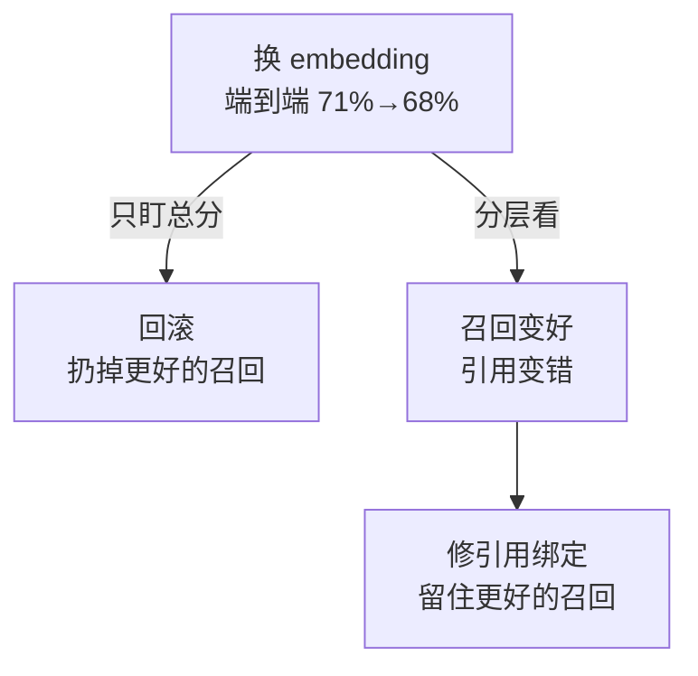

# RAG 评测要分离检索质量与生成质量

它解决的是把"没召回证据"和"召回后没用好证据"混成一个总分，导致优化方向错误。先用标注相关文档测 Recall/MRR/nDCG，再测引用支持、事实一致性、拒答、权限和端到端成本；最小对照是固定生成模型，只替换检索管线。

最终答案错了，不代表生成模型错了：可能是目标证据没召回、召回后没用好、上下文截断、模型没有使用证据，或问题本身缺少答案。把所有问题压成一个"回答准确率"会让优化方向失真。

## 为什么一个总分必然误导

一个具体的例子：换 embedding 后，端到端准确率从 71% 掉到 68%。看起来是变差了。但分开看可能是——

| 分层指标 | 旧 | 新 | 含义 |
| --- | --- | --- | --- |
| Recall@10 | 0.82 | 0.91 | 召回变好了 |
| 引用精确性 | 0.74 | 0.61 | 引用变错了 |
| 事实一致性 | 0.88 | 0.87 | 基本没变 |
| 端到端准确率 | 0.71 | 0.68 | 总分变差 |

检索明显变好，总分却在跌，因为新 embedding 召回的 chunk 边界和引用生成模块期望的不一致，引用位置错位了。**只盯总分会让你回滚一个更好的 embedding**。

这个表也说明为什么顺序不能颠倒：先测检索、再测生成、最后才看端到端。反过来做，你会拿到一个无法归因的数字。

同一个总分跌法，两种应对，结局相反：



## 四组指标

| 层 | 指标/判断 | 需要的标注或证据 |
| --- | --- | --- |
| 召回 | Recall@k、MRR、nDCG、命中率 | 查询到相关文档/chunk 的相关性标注 |
| 证据 | 覆盖率、引用精确性、版本/ACL 正确率 | 支持片段、来源位置、权限和时间 |
| 生成 | 事实一致性、完整性、拒答、格式 | 参考答案、可验证断言或人工判断 |
| 系统 | TTFT、端到端延迟、token、成本、错误 | trace、模型/索引版本和负载 |

评测集要包含简单事实、跨段落、多跳、术语/错误码、无答案、冲突版本、撤权、长文档、恶意指令和多语言样本。随机抽样只能代表流量，不能覆盖风险——线上 95% 的问题都是简单事实查询，随机抽样的评测集会告诉你系统很好，而真正出事的都在剩下 5% 里。

## 权限回归：最容易被跳过的一组

"证据"层里的 **ACL 正确率** 是四组指标里最常被省略的，而它出错的后果最严重。案例二十六给了两个真实形态：

- Redis 客户端缓存广播失效通知时没按权限过滤，低权限账号收到了无权读取的键名——元数据泄露。注意这里是**键名泄露**，值没泄露，但键名本身已经是信息。
- ACL SETUSER 收下裸 `%` 模式后，一条查询命令能让整个实例崩溃。

第一个病例对 RAG 的直接映射：检索层做了权限过滤，但**缓存/广播/通知这条旁路没做**。RAG 里同样的结构——向量检索查了 ACL，但重排后的候选缓存、trace 日志、以及给前端返回的"相关文档列表"没查。所以权限回归必须覆盖整条链路，而不只是检索那一次查询。

第二个病例说明权限代码的输入校验本身要进评测集：一条畸形输入能打挂整个服务。故障归类上这属于可用性问题，权限只是它的藏身模块，评测集按模块收用例时仍然要覆盖它。

建议的权限回归集：`{用户 A 有权, 用户 B 无权, 文档刚被撤权, 文档版本已过期}` × `{直接查询, 缓存命中, 广播通知, 日志输出}` 的组合，至少 8 条。少了这组，权限回归等于没做。

## 诊断矩阵

```text
目标证据未召回 -> 数据/切分/embedding/查询/过滤
证据召回但答案错 -> 上下文排序/截断/模型使用/解码
答案对但引用错 -> 证据绑定/引用生成/版本映射
离线好线上差 -> 数据漂移/缓存/权限/负载/模型版本
```

用的时候按这个顺序排除，每次只改一个变量。同时改 embedding 和提示词，就分不清是谁的功劳。

每次实验记录原问题、召回候选及分数、过滤原因、最终上下文、模型快照、解码参数、输出断言和人工判定。LLM-as-judge 只能作为辅助信号，必须校准并保留可复核样本——校准的做法是：拿同样一批样本让人也判一遍，算一致率。一致率低于 0.8 的 judge 结论不能进发布决策。

## 发布门禁

新 embedding、切分、重排、查询改写、模型或提示词变更要同时通过检索回归、生成回归、权限/删除回归和性能成本门槛；若只提升总分却伤害关键风险切片，不应发布。

门禁要写成可执行的判定，而不是"人工确认无异常"：

| 指标 | 通过条件 |
| --- | --- |
| Recall@10 | 不低于基线减 0.02 |
| 引用精确性 | 不低于基线减 0.02 |
| ACL 正确率 | 等于 1.00，这条不允许回退 |
| 无答案拒答率 | 不低于基线 |
| p95 端到端延迟 | 不高于基线的 1.10 倍 |
| 单查询成本 | 不高于基线的 1.15 倍 |

全部满足才放行。

ACL 那条固定为 1.00 是有意的：其他指标允许小幅回退换取整体收益，权限不允许。这是四类指标里唯一一个不能做权衡的。

关系：[[工程知识/AI 系统工程：从模型能力到生产能力/知识与检索/RAG的核心是选择可引用证据]] · [[工程知识/AI 系统工程：从模型能力到生产能力/质量与运营/Agent评测必须覆盖轨迹而不只看最终答案]]

案例：[[工程知识/缺陷分析：从个案到体系/安全/案例二十六：公告栏没查门禁——Redis 的 ACL 键名泄露与解析崩溃]]

相关：[[工程知识/AI 系统工程：从模型能力到生产能力/知识与检索/混合检索、重排与查询改写各自解决什么问题]] · [[工程知识/AI 系统工程：从模型能力到生产能力/安全与治理/执行证据必须独立于AI结论]]

相关（约定层）：[[工程知识/AI 系统工程：从模型能力到生产能力/质量与运营/Agent评估系统的设计约定]] —— 评测维度的保存与绑定方式由它规定

验证的锚点：总分变化要能与单侧改动对账——固定生成模型只替换检索管线，预写分数变化应归到检索一侧，归不上就说明生成侧的问题被记成了检索问题。

## 验证

1. 检索分测：用标注相关文档单独测 Recall、MRR 与 nDCG，结果与预期不符时先查证据是否进入可见位置，并确认检索质量与生成质量分开记录。
2. 单变量对照：固定生成模型只替换检索管线，确认总分变化可以归因到检索一侧。
3. 生成侧分测：在保留证据的前提下测引用支持、事实一致性、拒答与权限，确认目标证据未召回与召回后没用好两类失败被区分开。

## 机制与本质

RAG 评测的机制层：最终答案由检索与生成两段处理共同产生，答案错误可能来自目标证据未被召回、召回后未进入可见位置、上下文截断或模型未使用证据，这些原因在不同的处理段上，只有一个端到端数字时无法区分。检索侧的召回与排序指标、生成侧的引用支持与事实一致性指标分别对应各自的失败位置，权限过滤的检查覆盖的是整条链路。

## 要解决的问题

最终答案质量差时，无法区分是没有检索到相关材料，还是检索到了但没有正确使用，优化方向因此随意选取。本篇回答：检索侧与生成侧各自用哪些指标衡量、标注与判定在哪一步进行、固定生成模型时对比检索管线的口径是什么，以及端到端成本与拒答怎样计入评测。

